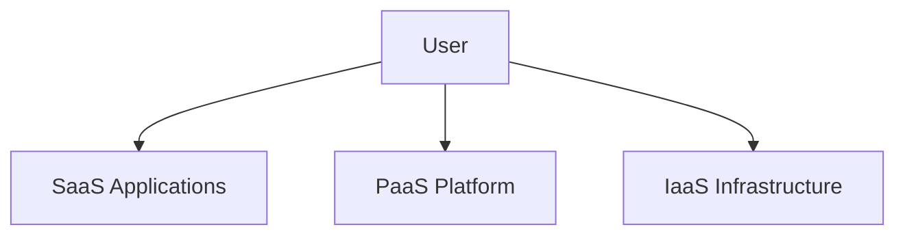

# Fundamental concepts and models

## 1. Definition
Cloud computing is a model for enabling ubiquitous, convenient, on-demand network access to a shared pool of configurable computing resources (e.g., networks, servers, storage, applications and services) that can be rapidly provisioned and released with minimal management effort or service provider interaction.  
*(NIST SP 800-145)*

## 2. Concept Explanation
- **Basic idea:** Instead of owning physical servers and data centres, users rent computing power, storage and applications from a cloud provider over the internet on a pay-as-you-go basis.
- **Intermediate layer:** The cloud abstracts the underlying hardware through **virtualization**. A single physical server runs multiple virtual machines, each isolated and running its own operating system and applications. This enables **multi-tenancy**, where many customers share the same physical infrastructure securely.
- **Advanced view:** Cloud services are delivered through clearly defined **service models** (IaaS, PaaS, SaaS) and deployed under different **deployment models** (public, private, hybrid, community). The entire system is orchestrated automatically so that resources scale up or down in near real-time without human intervention. Billing is metered, similar to a utility.

## 3. Key Characteristics / Features
- **On-demand self-service:** A consumer can provision computing capabilities (e.g., server time, network storage) as needed automatically, without requiring human interaction with the service provider. This is typically done through a web-based management console or API.
- **Broad network access:** Capabilities are available over the network and accessed through standard mechanisms (HTTP, REST APIs, web browsers) that promote use by heterogeneous thin or thick client platforms such as mobile phones, tablets, laptops and workstations.
- **Resource pooling:** The provider’s computing resources are pooled to serve multiple consumers using a multi-tenant model, with different physical and virtual resources dynamically assigned and reassigned according to consumer demand. The customer generally has no control or knowledge over the exact location of the resources but may be able to specify location at a higher level of abstraction (e.g., country, region, datacentre).
- **Rapid elasticity:** Capabilities can be elastically provisioned and released, in some cases automatically, to scale rapidly outward and inward commensurate with demand. To the consumer, the available resources often appear to be unlimited and can be appropriated in any quantity at any time.
- **Measured service:** Cloud systems automatically control and optimise resource use by leveraging a metering capability at some level of abstraction appropriate to the type of service (e.g., storage, processing, bandwidth, active user accounts). Resource usage can be monitored, controlled and reported, providing transparency for both the provider and consumer.

## 4. Types / Classification
Cloud computing is classified along two dimensions: **service models** and **deployment models**.

### Service Models
- **Infrastructure as a Service (IaaS):** Provides virtualized compute resources over the internet. The provider supplies fundamental building blocks such as virtual machines, storage, firewalls and load balancers. The user manages the operating system, middleware and applications.  
  *Examples: Amazon EC2, Google Compute Engine, Microsoft Azure VMs.*
- **Platform as a Service (PaaS):** Offers a managed platform with operating system, programming language execution environment, database and web server. Users only deploy and manage their applications; the underlying infrastructure and middleware are fully handled by the provider.  
  *Examples: Google App Engine, AWS Elastic Beanstalk, Heroku.*
- **Software as a Service (SaaS):** Delivers fully functional software applications over the internet on a subscription basis. The provider manages everything from infrastructure to application data. The user merely accesses the application through a web browser or thin client.  
  *Examples: Google Workspace (Docs, Gmail), Microsoft 365, Salesforce.*

### Deployment Models
- **Public Cloud:** Resources are owned and operated by a third-party provider and shared among multiple organisations. It offers high scalability, cost-efficiency (pay-per-use) and minimum capital expenditure.
- **Private Cloud:** Infrastructure is provisioned for exclusive use by a single organisation. It can be located on-premises or hosted externally. Provides greater control, security and compliance but at higher cost.
- **Hybrid Cloud:** Combines public and private clouds bound together by standardised or proprietary technology that enables data and application portability. Organisations keep sensitive workloads on private infrastructure while using public cloud for burstable workloads.
- **Community Cloud:** Infrastructure is shared by several organisations that have common concerns (mission, security requirements, policy, compliance). It can be managed internally or by a third party and may exist on or off premises.

## 5. Working / Mechanism
1. **User request:** A user logs into a cloud portal or API endpoint and requests a resource, e.g., a virtual machine with 4 vCPUs and 16 GB RAM.
2. **Authentication & authorisation:** The identity management system verifies the user and checks the allowed quotas/roles.
3. **Orchestration engine:** The request is forwarded to an orchestrator (e.g., OpenStack Heat, AWS CloudFormation) that determines where and how to provision the resource.
4. **Virtualisation layer:** The orchestrator instructs a hypervisor (e.g., KVM, VMware ESXi) or container runtime to create a virtual instance from a pre-built image.
5. **Resource allocation:** Physical compute, storage and network resources from the pooled infrastructure are assigned to the instance.
6. **Configuration:** Startup scripts and configuration management tools set up the environment, install software and apply security policies.
7. **Service delivery:** The instance is now ready; the user receives IP address, credentials or endpoint URL to start using the resource.
8. **Metering & billing:** Usage metrics (CPU time, storage consumed, data transfer) are continuously collected. The billing engine calculates the cost and generates an invoice or deducts from prepaid credits.

## 6. Diagram (MANDATORY)

## 7. Mathematical Formulation (if applicable)
A basic pay-per-use cost model for an IaaS virtual machine:

$$
\text{Total Cost} = (H \times C_h) + (S \times C_s) + (D \times C_d)
$$

Where:
- $H$ = number of instance-hours used
- $C_h$ = cost per hour for the chosen VM configuration
- $S$ = GB of storage provisioned
- $C_s$ = cost per GB per month
- $D$ = GB of outbound data transfer
- $C_d$ = cost per GB transferred

The formula can be extended to include reserved instances, sustained usage discounts, etc.

## 8. Example
A startup wants to launch a web application. Instead of buying and configuring a physical server, they use **AWS EC2 (IaaS)** to create a virtual server running Linux, install the Apache web server and MySQL database themselves. Alternatively, they could choose **AWS Elastic Beanstalk (PaaS)** – simply upload their application code and the platform automatically handles capacity provisioning, load balancing and scaling. The final product users interact with might be **Google Docs (SaaS)**, where documents are created and stored entirely in the cloud without any local software installation.

## 9. Analogy
**Electricity grid:** Households and industries do not build their own power plants; they simply plug into the grid and consume electricity as required. The utility company generates, distributes and maintains the entire power infrastructure. Cloud computing works the same way – you “plug into” the internet, use computing resources and pay only for what you consume, without worrying about hardware procurement, cooling or maintenance.

## 10. Comparison (Service Models)

| Feature                | IaaS                         | PaaS                             | SaaS                             |
|------------------------|------------------------------|----------------------------------|----------------------------------|
| What you get           | Raw computing infrastructure | Managed platform with runtime    | Ready-to-use software            |
| User controls          | OS, middleware, apps         | Applications only                | Nothing; only configuration      |
| Provider manages       | Physical hardware, hypervisor| OS, middleware, runtime          | Entire stack including application |
| Flexibility            | Highest                      | Moderate                         | Lowest                           |
| Typical user           | IT administrators, DevOps    | Application developers           | End users / business users       |
| Example                | Amazon EC2, Azure VMs        | Google App Engine, Heroku        | Microsoft 365, Gmail             |

## 11. Advantages
- **Cost efficiency:** Eliminates capital expenditure for hardware and reduces operational costs via pay-per-use pricing. No need for upfront investment in infrastructure.
- **Scalability and elasticity:** Resources can be automatically scaled up or down to handle demand spikes, ensuring performance without over-provisioning.
- **Accessibility and mobility:** Cloud services are accessible from any location with an internet connection, supporting remote work and collaboration.
- **Automatic updates and maintenance:** The provider handles hardware failures, security patches and software updates, lowering the maintenance burden on the user.
- **Disaster recovery and backup:** Built-in redundancy and geographically distributed data centres provide robust backup and quick recovery options that are difficult to achieve on-premises.
- **Resource pooling and optimum utilisation:** Multi-tenant architecture ensures physical resources are highly utilised, which reduces overall energy consumption and cost per user.

## 12. Disadvantages / Limitations
- **Security and privacy concerns:** Storing sensitive data off-site may be subject to breaches, unauthorised access or data leakage, especially if encryption and access controls are weak.
- **Downtime and internet dependency:** Cloud services require reliable internet connectivity. Provider outages or network issues render services inaccessible.
- **Vendor lock-in:** Proprietary APIs and data formats can make it difficult and costly to migrate from one cloud provider to another.
- **Limited control in PaaS/SaaS:** Users have little to no control over the underlying infrastructure, server configuration or application updates, which may conflict with specific compliance or customisation needs.
- **Hidden costs:** While entry costs are low, data transfer fees, premium support or unexpected scaling can lead to higher-than-expected bills if not monitored carefully.

## 13. Important Points / Exam Notes
- NIST definition is the global standard; learn the five essential characteristics, three service models and four deployment models (5‑3‑4 rule).
- Virtualisation is the foundational technology that enables resource pooling and multi-tenancy.
- Rapid elasticity distinguishes cloud from traditional hosting – it provides the illusion of infinite resources.
- Measured service (metering) enables the pay-per-use economic model.
- Public cloud = multi-tenant, off-site; private cloud = single-tenant, on or off site; hybrid = mix of public and private with orchestration.
- SaaS → end-user software, PaaS → developer platform, IaaS → raw infrastructure.
- Cloud computing shifts CAPEX to OPEX.

## 14. Applications / Use Cases
- **Web and mobile app hosting:** Deploying scalable, globally distributed applications using services like AWS Elastic Beanstalk or Azure App Service.
- **Big data analytics:** Using cloud-based clusters (e.g., Amazon EMR, Google BigQuery) to process terabytes of data without owning a Hadoop cluster.
- **Artificial intelligence and machine learning:** Training models on GPU/TPU instances (e.g., AWS SageMaker, Google Vertex AI) with elastic resources.
- **Disaster recovery and backup:** Replicating on-premises data to the cloud for failover (e.g., Azure Site Recovery, AWS Backup).
- **Development and test environments:** Rapidly spinning up and tearing down test labs, saving time and reducing cost.
- **Desktop virtualisation:** Delivering full virtual desktops (e.g., Amazon WorkSpaces, Windows Virtual Desktop) for remote workforce.

## 15. MCQs (MANDATORY)
**Q1. Which of the following is NOT an essential characteristic of cloud computing according to NIST?**  
A. On-demand self-service  
B. Broad network access  
C. Dedicated hardware per user  
D. Measured service  
**Answer:** C

**Q2. In which cloud service model does the user manage the operating system and middleware?**  
A. SaaS  
B. PaaS  
C. IaaS  
D. Both PaaS and SaaS  
**Answer:** C

**Q3. Gmail is a classic example of which cloud service model?**  
A. IaaS  
B. PaaS  
C. SaaS  
D. Private cloud  
**Answer:** C

**Q4. Which deployment model provides exclusive use of cloud infrastructure by a single organisation?**  
A. Public cloud  
B. Private cloud  
C. Hybrid cloud  
D. Community cloud  
**Answer:** B

**Q5. The ability of a cloud system to automatically increase or decrease resources as needed is termed:**  
A. Multi-tenancy  
B. Broad network access  
C. Rapid elasticity  
D. Resource pooling  
**Answer:** C

**Q6. What does the term “measured service” imply in cloud computing?**  
A. All services are free of charge  
B. Resource usage is monitored and billed accordingly  
C. Services are manually measured by the user  
D. Only storage is metered  
**Answer:** B

**Q7. An online development environment where you write code and the vendor handles the servers, runtime and database is:**  
A. IaaS  
B. SaaS  
C. PaaS  
D. Private cloud  
**Answer:** C

**Q8. Which of the following is a primary benefit of using a hybrid cloud?**  
A. It eliminates the need for internet connectivity  
B. It balances sensitive workloads on private cloud with scalable public cloud resources  
C. It provides free infrastructure  
D. It replaces all on-premises hardware  
**Answer:** B

**Q9. Hypervisor technology is most directly related to which cloud computing enabler?**  
A. Broad network access  
B. Virtualisation  
C. Software as a Service  
D. Metered billing  
**Answer:** B

**Q10. A community cloud is specifically designed for:**  
A. A single user  
B. The general public  
C. Organisations with shared concerns and compliance requirements  
D. Only government agencies  
**Answer:** C