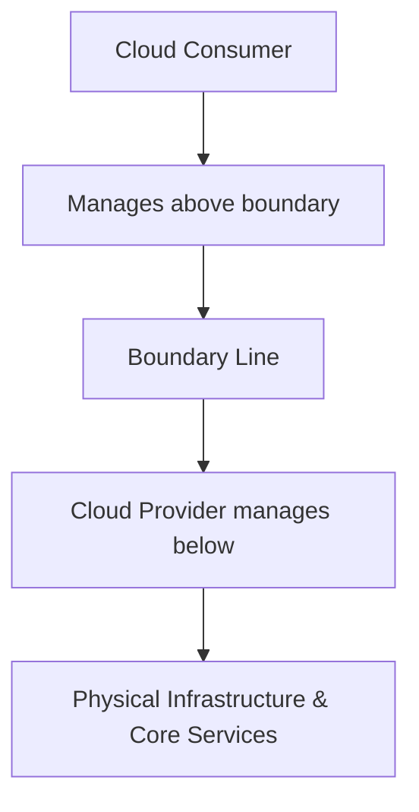

# Roles and boundaries

## 1. Definition
In cloud computing, **roles and boundaries** define the formal division of responsibilities, duties, and control between the cloud service provider (CSP) and the cloud consumer. The boundary establishes the demarcation line that separates what the provider manages (typically the physical infrastructure, virtualization layer, and certain platform services) from what the consumer manages (such as data, applications, identity, and client-side security). This concept is operationalised through the **shared responsibility model**, which specifies who is accountable for security, compliance, and operational tasks at each layer of the cloud stack.

---

## 2. Concept Explanation
The roles and boundaries concept ensures that both parties have a clear understanding of their obligations.  
- **Basic level**: Every cloud deployment involves at least two primary roles — **cloud consumer** (the entity using the services) and **cloud service provider** (the entity delivering the services). Auxiliary roles may include cloud auditor, cloud broker, and cloud carrier.  
- **Intermediate level**: The boundary is drawn according to the service model. In Infrastructure‑as‑a‑Service (IaaS), the boundary sits just above the virtualisation layer; in Platform‑as‑a‑Service (PaaS), it climbs to the runtime/middleware layer; in Software‑as‑a‑Service (SaaS), almost everything below the application data belongs to the provider.  
- **Advanced level**: Boundaries are not only technical but also legal and contractual. They cover security governance, incident response, data residency, encryption key management, and regulatory compliance. Understanding the exact boundaries helps in risk assessment, audit planning, and designing a defence‑in‑depth strategy.

The model is layered: as the consumer abstracts away more infrastructure, the provider’s responsibility grows, while the consumer’s scope shrinks but never disappears entirely — the consumer always remains responsible for its own data, access policies, and end‑user behaviour.

---

## 3. Key Characteristics / Features
- **Clear demarcation of duties**: Each layer of the technology stack is explicitly assigned to either the provider or the consumer, leaving no ambiguity about who must apply security controls.
- **Shared security responsibility**: Security is a joint effort. The provider secures “the cloud,” the consumer secures “in the cloud.” This prevents the assumption that security is entirely outsourced.
- **Dynamic based on service model**: The boundary shifts significantly between IaaS, PaaS, and SaaS. Understanding the chosen model is essential for configuring proper governance.
- **Compliance alignment**: Boundaries help map industry regulations (GDPR, HIPAA, PCI‑DSS) to specific responsibilities, simplifying audits and evidence collection.
- **Operational transparency**: Well‑defined roles reduce incidents caused by misconfiguration, because each team knows exactly which patches, updates, or monitoring tasks it must perform.
- **Contractual enforceability**: The roles and boundaries are typically documented in Service Level Agreements (SLAs) and terms of service, giving them legal weight.

---

## 4. Types / Classification (Based on Service Models)
1. **IaaS boundary**  
   - The provider manages the physical data centre, networking hardware, storage hardware, and the hypervisor.  
   - The consumer takes over from the guest operating system upwards: OS patches, middleware, runtime, applications, and data.  
   - Example: AWS EC2 — AWS is responsible for the host and virtualization; the customer manages the Amazon Machine Image (AMI) and everything installed on it.

2. **PaaS boundary**  
   - The provider manages everything up to and including the runtime environment, middleware, and development frameworks.  
   - The consumer’s scope is limited to the application code, data, and user identity/access configurations.  
   - Example: Google App Engine — Google ensures the operating system, networking, and runtime are patched; the developer only uploads application code and manages data.

3. **SaaS boundary**  
   - The provider manages the entire technology stack, including the application itself.  
   - The consumer is responsible only for data governance, user access management, and client‑device security.  
   - Example: Microsoft 365 — Microsoft handles server security, application patches, and infrastructure; the organisation must configure user permissions, data loss prevention policies, and endpoint protection.

---

## 5. Working / Mechanism
1. **Service model selection**  
   The consumer chooses a cloud service model (IaaS, PaaS, SaaS) based on required control and management overhead.
2. **Responsibility matrix definition**  
   The provider publishes a shared responsibility model document (often a matrix) that lists specific assets and tasks, assigning each to the provider or the consumer.
3. **Control implementation by provider**  
   For its side of the boundary, the provider implements physical security, network isolation, hypervisor hardening, and platform‑level patches.
4. **Control implementation by consumer**  
   The consumer applies security measures above the boundary: OS hardening (in IaaS), identity federation, encryption of data at rest and in transit, application‑level firewalls, and access policies.
5. **Continuous monitoring and auditing**  
   Both parties monitor their respective layers. Logs from the provider (e.g., AWS CloudTrail) are made available to the consumer for their own auditing needs.
6. **Incident response coordination**  
   When a security incident occurs, the boundary determines who investigates which part. For example, if a virtual machine is compromised, the provider analyzes the hypervisor while the consumer analyzes the guest OS and application logs.
7. **Redressal and updates**  
   If the boundary shifts due to a new service or feature, the provider updates the shared responsibility model, and the consumer adjusts its security controls accordingly.

---

## 6. Diagram

---

## 7. Mathematical Formulation
N/A — Not applicable to this topic.

---

## 8. Example
A startup launches a web application on **Amazon EC2 (IaaS)**.  
- **AWS responsibility**: physical security of data centres, server hardware, network cabling, and the Xen/KVM hypervisor.  
- **Startup responsibility**: guest OS (e.g., Ubuntu) security updates, web server (NGINX) configuration, application code vulnerabilities, SSL/TLS certificates, database encryption, and IAM user permissions.  
If the same startup migrates to **Heroku (PaaS)**, the boundary rises: Heroku now manages the OS, container runtime, and middleware. The startup only needs to secure its code, add‑ons, and data.

---

## 9. Analogy
**Renting an apartment in a secured building**  
- The **landlord (cloud provider)** is responsible for the building’s foundation, external walls, elevators, plumbing mains, and fire safety systems.  
- The **tenant (cloud consumer)** is responsible for the interior apartment: locking doors and windows, installing a personal safe for valuables, keeping appliances in good condition, and obeying building rules.  
Nobody expects the landlord to lock the tenant’s front door; similarly, a cloud provider does not manage the consumer’s user accounts or data encryption.

---

## 10. Comparison (IaaS vs PaaS vs SaaS Boundaries)

| Feature               | IaaS                                    | PaaS                                      | SaaS                                    |
|-----------------------|-----------------------------------------|-------------------------------------------|-----------------------------------------|
| Consumer manages      | Guest OS, middleware, runtime, apps, data | Applications, data, user access           | Data, user access, client devices       |
| Provider manages      | Physical infra, network, hypervisor     | Physical infra, network, OS, runtime, middleware | Entire stack including application |
| Boundary location     | Between hypervisor and guest OS         | Between runtime/middleware and application | Between application and consumer’s data |
| Typical consumer role | System administrator                    | Application developer                     | End‑user administrator                  |
| Security ownership    | Shared; consumer secures OS and above   | Shared; consumer secures app and data     | Shared; consumer secures data and identities |

---

## 11. Advantages
- **Clear accountability**: Organisations know exactly which security controls they must implement, eliminating the “blind spot” assumption that the provider does everything.
- **Optimised resource utilisation**: IT teams focus only on their part of the stack, reducing duplication of effort.
- **Facilitates compliance**: Auditors can map regulatory requirements directly to the responsibility matrix, speeding up certification (e.g., ISO 27001).
- **Scalable security posture**: As services evolve, boundaries are updated systematically, enabling consistent risk management.
- **Reduced misconfiguration risks**: Well‑published shared responsibility models lower the chances of publicly exposed storage buckets or unpatched VMs.

---

## 12. Disadvantages / Limitations
- **Misunderstanding can create gaps**: Consumers sometimes assume the provider handles certain security aspects (e.g., database encryption) when it remains a consumer duty, leading to data breaches.
- **Complex in hybrid/multi‑cloud**: Each provider defines boundaries differently, making uniform governance difficult and increasing operational complexity.
- **Limited negotiation power**: Small consumers must accept the standard shared responsibility model; they cannot alter the boundary to match unique needs.
- **Shared responsibility ≠ shared liability**: In many cases, financial liability for a breach still rests largely with the consumer, even if the provider’s side was partially at fault.
- **Evolving boundaries**: When providers release new managed services, boundaries shift, requiring constant re‑education of operations teams.

---

## 13. Important Points / Exam Notes
- The **shared responsibility model** is the practical implementation of roles and boundaries.
- **Consumer is ALWAYS responsible for its data, endpoints, and identity/access management**, regardless of the service model.
- The boundary shifts **upwards** as one moves from IaaS → PaaS → SaaS, increasing provider responsibility and decreasing consumer management scope.
- Cloud **auditors** and **brokers** are auxiliary roles defined in NIST SP 500‑292.
- **Compliance mapping** is a direct outcome of well‑defined boundaries; e.g., in IaaS, the consumer must ensure OS‑level encryption for HIPAA compliance.
- Misinterpreting the boundary is a top cause of cloud security incidents (e.g., exposed S3 buckets).
- Major providers publish detailed responsibility matrices (AWS Shared Responsibility Model, Azure Shared Responsibility Model, GCP Shared Fate model).

---

## 14. Applications / Use Cases
- **Cloud migration planning**: Organisations assess what security controls they currently manage on‑premises and map them to the provider’s boundary.
- **Security posture management**: Cloud Security Posture Management (CSPM) tools use the responsibility model to flag consumer‑side misconfigurations.
- **Vendor risk assessments**: Before adopting a SaaS tool, a company evaluates the provider’s responsibility for data encryption and backup to meet internal policy.
- **Audit and certification**: Internal audit teams use the boundary matrix to prepare evidence for SOC 2, ISO 27001, or regulatory inspections.
- **Incident response playbooks**: Playbooks are written around the boundary, specifying which team investigates the infrastructure and which investigates the application.

---

## 15. MCQs

**Q1. In cloud computing, who is always responsible for securing data at rest, regardless of the service model?**  
A. Cloud Service Provider  
B. Cloud Auditor  
C. Cloud Consumer  
D. Internet Service Provider  
**Answer:** C. Cloud Consumer

**Q2. The boundary in an IaaS model lies between which two layers?**  
A. Application and data  
B. Runtime and middleware  
C. Hypervisor and guest operating system  
D. Physical network and storage  
**Answer:** C. Hypervisor and guest operating system

**Q3. Which of the following is an example of a PaaS boundary?**  
A. Consumer manages hypervisor patches  
B. Consumer manages application code and data only  
C. Provider manages only physical security  
D. Consumer manages the physical data centre  
**Answer:** B. Consumer manages application code and data only

**Q4. The shared responsibility model is also known as the:**  
A. Shared security matrix  
B. Cloud split model  
C. Responsibility division framework  
D. Shared control model  
**Answer:** A. Shared security matrix (commonly referred to as the shared responsibility model)

**Q5. Which role is NOT a primary NIST‑defined cloud actor?**  
A. Cloud Consumer  
B. Cloud Provider  
C. Cloud Developer  
D. Cloud Auditor  
**Answer:** C. Cloud Developer (NIST defines Consumer, Provider, Auditor, Broker, and Carrier)

**Q6. In a SaaS model, the cloud consumer is responsible for:**  
A. Physical server maintenance  
B. Application patching  
C. User access management  
D. Middleware configuration  
**Answer:** C. User access management

**Q7. What is a major risk when the boundary is misunderstood by the consumer?**  
A. Lower latency  
B. Reduced storage costs  
C. Security gaps and data exposure  
D. Automatic compliance certification  
**Answer:** C. Security gaps and data exposure

**Q8. Which document typically formalises the roles and boundaries between a provider and a consumer?**  
A. Acceptable Use Policy  
B. Service Level Agreement (SLA) and shared responsibility model  
C. Privacy Policy  
D. Employee handbook  
**Answer:** B. Service Level Agreement (SLA) and shared responsibility model

**Q9. As a consumer moves from IaaS to PaaS, what happens to their operational responsibility?**  
A. It increases because they manage the hypervisor  
B. It remains unchanged  
C. It decreases because the provider manages the OS and runtime  
D. It is transferred entirely to the provider  
**Answer:** C. It decreases because the provider manages the OS and runtime

**Q10. Which of the following tasks always lies on the consumer’s side of the boundary, even in SaaS?**  
A. Data centre cooling  
B. Network firewall rules for the cloud infrastructure  
C. Managing client device antivirus  
D. Encryption key management for the storage layer beneath the application  
**Answer:** C. Managing client device antivirus