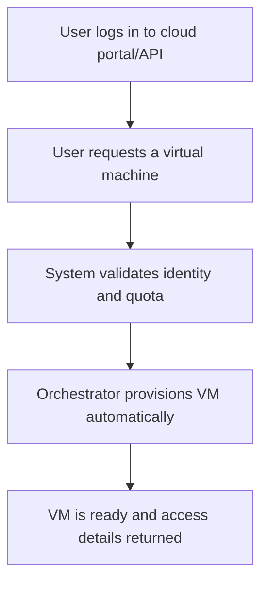

# On-demand self-service

## 1. Definition
On-demand self-service is a cloud computing essential characteristic that enables consumers to unilaterally provision computing capabilities, such as server time and network storage, as needed automatically without requiring human interaction with each service provider.

## 2. Concept Explanation
- **Basic idea:** A cloud user can log in to a provider’s web portal or use an API to request and obtain IT resources (virtual machines, storage, databases) instantaneously. No phone calls, emails, or service tickets are required to get the resources running.
- **Intermediate layer:** The self-service mechanism is backed by automated orchestration tools. When a user clicks a button or executes an API call, the cloud platform’s orchestration engine interprets the request, authenticates the user, checks quotas, and triggers the provisioning of resources from a pre-built pool. The entire process from request to usable resource is measured in minutes, not days.
- **Advanced view:** Self-service encompasses not just provisioning but also de-provisioning, reconfiguration, and scaling. Users can completely manage the lifecycle of a resource through a self-service interface, enabled by policy-driven automation. Providers expose detailed usage metering and billing dashboards, so consumers can monitor and control their own consumption transparently. This is a fundamental shift from traditional IT, where every change required manual intervention by system administrators.

## 3. Key Characteristics / Features
- **Instantaneous access:** Resources are made available within seconds to minutes of the request, assuming sufficient quota and availability. The provisioning time does not depend on human availability, enabling 24×7 operations.
- **Unilateral action:** Consumers initiate and control the provisioning activity entirely on their own. No approval from the cloud provider’s staff is needed; the consumer is empowered to act independently within defined limits.
- **Automated resource management:** Behind the scenes, complex workflows including capacity checks, image cloning, network assignment, and security policy application are fully automated. The user is shielded from this complexity.
- **Interface-driven:** Self-service is delivered through standardised interfaces such as web-based dashboards (management consoles), RESTful APIs, and command-line interfaces (CLIs), ensuring consistent and programmable access.
- **Policy and quota governance:** While users can provision resources on their own, the platform enforces administrative policies, spending limits, and resource quotas to prevent runaway usage and ensure governance. This allows organisations to safely delegate provisioning authority to multiple projects and developers.

## 4. Types / Classification
On-demand self-service can be classified based on the **access interface** used by the consumer:
- **Web-based management console:** A graphical user interface accessible via a browser (e.g., AWS Management Console, Azure Portal). It allows users to create and manage resources using point-and-click wizards. Best suited for ad-hoc tasks and users who prefer visual interaction.
- **API-driven self-service:** Programmatic access using REST APIs. Developers can integrate resource provisioning into application code, CI/CD pipelines, or custom scripts. It enables infrastructure-as-code and fully automated workflows.
- **Command-line interface (CLI):** A text-based tool that allows administrators to execute cloud management commands from a terminal (e.g., AWS CLI, gcloud CLI). Useful for quick operations, scripting, and environments without a graphical browser.
- **Infrastructure as Code (IaC) tools:** A higher abstraction where resources are defined declaratively in configuration files (e.g., Terraform, AWS CloudFormation). The self-service action becomes committing a template, and the cloud provisioning engine builds the declared infrastructure automatically.

## 5. Working / Mechanism
1. **User authentication:** The consumer logs in to the cloud platform using credentials (username/password, multi-factor authentication, API keys). The identity and access management system verifies the user’s identity and fetches their assigned policies.
2. **Resource request initiation:** Through the chosen interface (console, CLI, API), the user specifies the desired resource type, configuration (e.g., VM size, storage tier), and any required location or network settings.
3. **Policy and quota validation:** The platform’s orchestration layer checks that the user is authorised to create the requested resource type, that the request does not exceed allocated quotas (number of VMs, CPU cores, storage), and that the cost centre has available budget.
4. **Orchestration and scheduling:** Upon successful validation, the orchestrator selects an appropriate physical host from the resource pool (taking into account current load, high availability zones, and affinity rules) and sends a provisioning command to the virtualisation layer or container runtime.
5. **Resource instantiation:** The hypervisor or container engine creates the virtual resource from a template image, attaches storage volumes, assigns a private IP from the virtual network, and applies security groups or firewall rules.
6. **Post-provisioning configuration:** Start-up scripts (cloud-init) may run to install software packages, apply patches, and set the resource to the desired initial state. The resource is then registered in the service catalogue.
7. **Access details delivery:** The system returns the resource’s access information (IP address, DNS name, credentials, connection strings) to the user’s dashboard or API response. The resource is now ready for use.
8. **Lifecycle management:** Subsequently, the user can stop, restart, resize, or delete the resource through the same self-service interface without any manual support tickets.

## 6. Diagram (MANDATORY)

## 7. Mathematical Formulation (ONLY if applicable)
Provisioning time for an on-demand self-service resource can be expressed conceptually as:

$$
T_{provision} = T_{auth} + T_{orchestrate} + T_{instantiate}
$$

Where:
- $T_{provision}$ = total time between user request and resource availability
- $T_{auth}$ = time taken for authentication and policy/quota verification
- $T_{orchestrate}$ = time spent by the orchestrator to select a host and prepare the environment
- $T_{instantiate}$ = time for the virtual machine or container to boot and configuration scripts to execute

A mature self-service platform aims to keep $T_{provision}$ under a few minutes.

## 8. Example
A DevOps engineer needs a 4‑CPU, 16 GB RAM virtual machine to test a new feature. They open the AWS Management Console, navigate to EC2, click “Launch Instance”, select the required Amazon Machine Image (AMI) and instance type, configure security settings, and click “Launch”. Within two minutes, the VM is running and accessible via SSH, without ever contacting AWS support or sending an email to an infrastructure team.

## 9. Analogy
**ATM (Automated Teller Machine):** To withdraw cash, you do not need to visit a bank teller during working hours or fill out a withdrawal slip. You walk up to an ATM, insert your card, enter your PIN, select the amount, and receive cash instantly. The ATM is a self-service terminal; the bank’s back-end systems automatically authenticate you, check your balance, update the ledger, and dispense currency. Similarly, on-demand self-service in cloud computing lets you “withdraw” computing resources instantly without interacting with a human operator.

## 10. Comparison (ONLY if needed)

| Feature | On-demand self-service (Cloud) | Traditional IT procurement |
| ------- | ------------------------------ | --------------------------- |
| Provisioning time | Minutes | Days to weeks |
| Human interaction | None required | Multiple approvals, tickets, manual setup |
| Interface | Automated web/API/CLI | Email, ticketing systems, phone calls |
| Payment model | Pay-per-use (metered) | Upfront capital purchase |
| Scaling | Instant, user-driven | Manual, capacity pre-planned |
| Accessibility | 24×7 without dependency on staff | Limited to IT staff working hours |

## 11. Advantages
- **Speed and agility:** Dramatically reduces time-to-market for applications because development and test environments can be created in minutes, not weeks.
- **Reduced operational burden:** IT staff are freed from handling repetitive provisioning tasks, allowing them to focus on higher-value activities like architecture optimisation and security.
- **Empowerment of end-users:** Project teams, developers, and data analysts can directly obtain the resources they need without being a bottlenecked single IT operations channel.
- **Cost transparency:** The user can see real-time consumption and estimated billing, encouraging responsible usage and cost awareness.
- **Consistency and error reduction:** Automated provisioning ensures resources are built to a consistent, auditable standard every time, eliminating human configuration errors typical in manual setups.

## 12. Disadvantages / Limitations
- **Governance risk:** Unrestricted self-service can lead to sprawl (unauthorised or forgotten resources), resulting in security gaps and unexpected costs. Strong policy enforcement is essential.
- **Complexity for non-technical users:** A self-service cloud portal with hundreds of options may overwhelm users unfamiliar with infrastructure concepts, leading to misconfigured or insecure deployments.
- **Dependency on accurate quotas:** If quotas are misconfigured, legitimate requests may be blocked, or conversely, a user may exhaust the organisation’s entire resource limit, affecting others.
- **Vendor lock-in through workflow:** Heavy investment in a specific provider’s self-service APIs, CLI scripts, and templates can make migration to another cloud cumbersome.

## 13. Important Points / Exam Notes
- On-demand self-service is the **first of the five essential characteristics** of cloud computing as defined by NIST SP 800-145.
- The key phrase is “unilaterally provision computing capabilities … without requiring human interaction with each service provider.”
- It fundamentally changes IT from a **request-fulfilment model** to a **self-service, utility-like model**.
- Automation (orchestration, virtualisation) is the backbone that enables self-service; without it, the promise of on-demand resources is impossible.
- Self-service interfaces include management consoles, APIs, CLIs, and Infrastructure as Code templates.
- The consumer does **not** manage or know the exact physical location of resources, but may specify a high-level region/zone – maintaining the resource pooling principle alongside self-service.
- Charging is typically per-use, and the metering data is visible to the consumer, promoting transparency.

## 14. Applications / Use Cases
- **Development and testing:** Developers instantly spin up and tear down isolated sandbox environments without waiting for IT.
- **Data analytics jobs:** A data scientist provisions a large transient Spark cluster for a one-hour computation and terminates it immediately afterwards, paying only for the hour.
- **Autoscaling web farms:** In response to load, a web application automatically triggers self-service APIs to add virtual servers, then removes them when traffic drops – without any human clicking a button.
- **Disaster recovery drills:** A DR environment can be provisioned on-demand in a different geographic region, tested, and then de-provisioned, avoiding the cost of a permanently running standby site.
- **Classroom training labs:** A trainer provides each student a temporary, identical cloud environment created through a self-service template, ensuring uniformity without manual setup for each participant.

## 15. MCQs (MANDATORY)
**Q1. According to NIST, on-demand self-service means resources can be provisioned:**  
A. Only after a written request to the provider  
B. Unilaterally by the consumer without human interaction with the provider  
C. Through a telephone help desk  
D. Only during business hours  
**Answer:** B

**Q2. Which of the following is NOT a typical interface for on-demand self-service?**  
A. Web-based management console  
B. REST API  
C. Hand-filled paper form submitted to IT  
D. Command-line interface (CLI)  
**Answer:** C

**Q3. The primary goal of on-demand self-service is to:**  
A. Eliminate the need for internet connectivity  
B. Reduce the time and human effort needed to obtain IT resources  
C. Provide free cloud services forever  
D. Replace all IT administrators with robots  
**Answer:** B

**Q4. A critical enabler behind on-demand self-service is:**  
A. Manual billing reconciliation  
B. Fully automated resource orchestration  
C. Fax-based ordering  
D. Physical delivery of servers  
**Answer:** B

**Q5. Which term describes the risk of users creating too many unmanaged resources via self-service?**  
A. Cloud bursting  
B. Virtualisation overhead  
C. Cloud sprawl  
D. Elasticity  
**Answer:** C

**Q6. In a self-service model, what prevents a user from consuming unlimited resources?**  
A. The provider’s phone support team warns the user  
B. Quotas and policy limits enforced by the platform  
C. There is no limit; resources are infinite  
D. A daily email from the billing department  
**Answer:** B

**Q7. Which of these is a real-world example of on-demand self-service in cloud?**  
A. Submitting a ticket to IT to create a virtual machine  
B. Using the AWS Management Console to launch an EC2 instance instantly  
C. Waiting for a monthly budget approval meeting  
D. Mailing a purchase order for a new server  
**Answer:** B

**Q8. Infrastructure as Code (IaC) tools like Terraform enable self-service by:**  
A. Requiring manual review of every resource definition  
B. Allowing declarative templates that provision infrastructure automatically  
C. Replacing the cloud provider’s API with human operators  
D. Disabling all automation  
**Answer:** B

**Q9. On-demand self-service is most closely associated with which cloud essential characteristic that ensures resource usage is monitored?**  
A. Broad network access  
B. Resource pooling  
C. Measured service  
D. Rapid elasticity  
**Answer:** C  
*(Explanation: Self-service provisioning is tracked and billed through metering, making measured service a complementary characteristic.)*

**Q10. Which of the following statements is true about on-demand self-service?**  
A. The consumer must know the exact physical server where resources are placed.  
B. It eliminates the need for any authentication or authorization.  
C. The consumer can provision resources immediately but provider staff handle de-provisioning.  
D. The consumer can independently manage the complete lifecycle of a resource.  
**Answer:** D