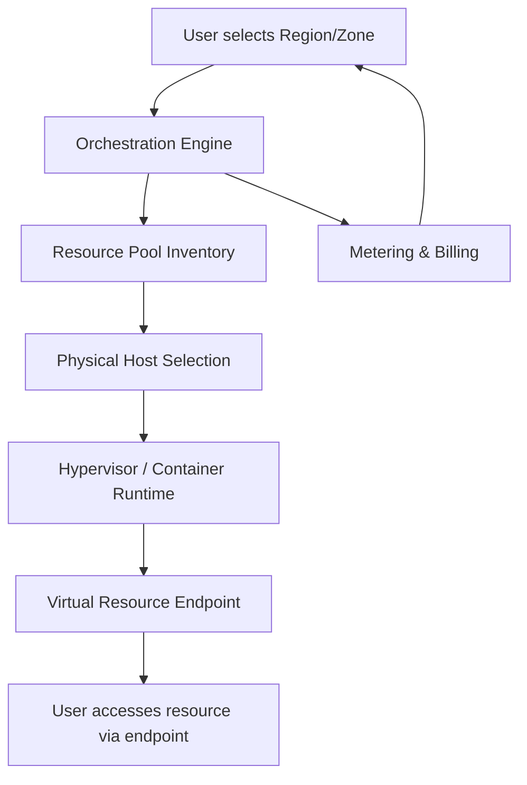

# Location Independent Resource Pooling

## 1. Definition
Location independent resource pooling is the cloud computing characteristic whereby a provider’s physical and virtual resources are aggregated into a shared pool to serve multiple consumers, with the consumer having no control or precise knowledge of the physical location of the resources. The consumer may, at most, specify location at a higher level of abstraction, such as a region, country, or data centre, while the provider dynamically assigns and reassigns resources from any physical location within that abstract boundary based on demand.

## 2. Concept Explanation
Location independent resource pooling separates resource consumption from physical locality, forming the foundation of the cloud’s multi-tenant, on-demand nature.

- **Basic:** In traditional IT, a server sits in a known rack in a known room. Cloud flips this model. The provider aggregates hundreds of servers, storage arrays, and network devices across multiple physical sites. When a user requests a virtual machine or storage bucket, the cloud platform allocates it from this vast shared pool. The consumer sees an IP address or an endpoint, never a rack number or physical host identifier.
- **Intermediate:** This abstraction is enabled by virtualisation. A hypervisor decouples the operating system and application from the physical hardware. Consequently, a virtual machine can run on any physical host within a cluster, zone, or even across different data centres, provided policy permits. The resource pool spans locations, and the orchestration layer tracks free capacity everywhere. The consumer may choose a high-level location like “Asia Pacific” or a specific availability zone for latency or compliance reasons, but the exact physical placement remains hidden and can change over time (e.g., live migration).
- **Advanced:** In advanced architectures, location independence is extended globally through multi-region resource pools. Traffic managers and global load balancers steer user requests to the nearest or most suitable pool of compute and storage resources, without the user or even the application developer managing cross-region placement. Data replication across regions remains transparent. This concept collides with data sovereignty laws that demand data stay within a specific jurisdiction; cloud providers address this by offering region-bound resource pools where location independence operates only inside a legal boundary. Edge computing, by contrast, reduces location independence for ultra-low latency, but even there, edge nodes are pooled resources managed with minimal tenant awareness of precise hardware.

Thus, location independent resource pooling combines aggregation, abstraction, and automation to deliver the illusion of infinite, locally available compute and storage, while the provider optimises physical infrastructure utilisation behind the scenes.

## 3. Key Characteristics / Features

- **Physical location abstraction:** The consumer never knows the exact rack, server, or floor housing their workload. Only high-level zones or regions are visible, preserving location independence within those bounds.
- **Dynamic assignment and reassignment:** Resources are allocated on demand from any eligible physical host. A VM may be launched on host A today, shut down, and relaunched on host B in a different building tomorrow without any consumer-side change.
- **Multi-tenancy across geographies:** A single physical server in one location can host workloads belonging to customers from entirely different countries, provided region or legal constraints do not forbid it. The pooling is truly global.
- **Elastic and large-scale pooling:** With location independence, the pool’s effective capacity is the sum of many physical locations, enabling providers to handle massive aggregate demand spikes that no single data centre could withstand alone.
- **Consumer specifies only abstract location:** If needed, the customer chooses a region or availability zone for latency or regulatory reasons. However, they still cannot pinpoint or permanently bind to a specific physical machine, preserving true location independence.
- **Transparent migration and failover:** Live or cold migration can move workloads between physical hosts, racks, or even data centres without changing the externally visible endpoint, enhancing resilience without involving the customer.
- **Utilisation optimisation:** The provider can pack workloads optimally across all physical sites, balancing power, cooling, and capacity, because workloads are not pinned to a customer-chosen physical location.

## 4. Types / Classification
Resource pooling can be classified by the geographic abstraction level at which location independence operates.

- **Region-level pooling:** The provider aggregates resources across multiple availability zones within a geographic region. The consumer selects a region (e.g., `us-east-1`), and resources are allocated from any zone in that region without the consumer knowing the exact data centre building. This is the most common public cloud model.
- **Zonal (Availability Zone) pooling:** The consumer selects a specific availability zone, narrowing the physical boundary to a set of one or more data centres. Location independence still holds inside that zone – the customer does not know the exact rack or host. Many IaaS services operate at this level for low-latency placement groupings.
- **Global pooling:** Resources from multiple regions worldwide are pooled and served via a global endpoint. Services like content delivery networks (CDNs) and global load balancers operate this way; the consumer does not even choose a region. The system picks the optimal location from a global pool based on proximity, health, and capacity.
- **Edge pooling:** A specialised form where a huge number of small-scale edge locations (e.g., 5G base stations, metro colocations) are pooled. The consumer may request “low latency in city X” but does not know the specific edge node. Location independence is preserved at the node level.

## 5. Working / Mechanism
The following steps describe how a cloud provider delivers location independent resource pooling when a user requests a virtual machine (IaaS) or a function (PaaS/SaaS).

1. **Consumer Request with Abstract Location:** The user issues an API call or uses a portal to create a resource, optionally specifying a region (e.g., “Europe West”) and/or an availability zone. No physical coordinates are provided.
2. **Orchestration Parses the Request:** The cloud orchestration engine receives the request, validates credentials via IAM, and extracts the target abstraction level (region/zone).
3. **Resource Pool Inventory Query:** The orchestration queries the resource management database to identify all physical hosts with available capacity within the specified abstraction boundary. The inventory aggregates free vCPUs, memory, and storage across potentially hundreds of discrete physical machines spread over multiple buildings.
4. **Optimal Host Selection:** Placement algorithms select a specific physical host from the pool. Selection criteria include current utilisation, power consumption, fault domain distribution, and any soft affinity/anti-affinity rules, but not a deterministic physical location requested by the user. The host may be in any rack, any floor, any data centre building within the zone.
5. **Resource Provisioning:** The hypervisor or container runtime on the chosen host instantiates the virtual resource. Storage and networking components are attached from shared SAN, object storage, or virtual network fabrics, whose physical backing is similarly location-independent.
6. **Endpoint Delivery:** An IP address, DNS name, or service endpoint is returned to the consumer. The endpoint hides the underlying physical host identity. If the workload later migrates, the endpoint may stay constant or be transparently updated via load balancers.
7. **Continuous Pool Rebalancing:** Monitoring feeds utilisation metrics back into the pool orchestrator. If a host becomes overloaded, VMs may be live-migrated to other hosts in the same abstraction zone without customer notification, maintaining location independence.
8. **Billing and Metering:** The metering component records resource usage time and volume independent of the physical location shifts, ensuring the consumer is billed correctly regardless of underlying host changes.

## 6. Diagram

## 7. Mathematical Formulation
Resource pooling across multiple physical locations can be modelled by considering total pooled capacity and its statistical multiplexing benefit. Let there be \(L\) physical locations (data centres), each with a resource capacity \(C_i\) in generic units (e.g., vCPUs). The total pooled capacity is:

$$
C_{pool} = \sum_{i=1}^{L} C_i
$$

If \(N\) consumers each demand a peak resource \(d_j\) but with uncorrelated usage patterns over time, the probability that the total demand exceeds \(C_{pool}\) is far lower than if each consumer were statically assigned to a fixed location. The gain can be approximated by the multiplexing factor:

$$
M = \frac{\sum_{j=1}^{N} \text{peak}(d_j)}{\max_t \left( \sum_{j=1}^{N} d_j(t) \right)}
$$

When \(M > 1\), pooling across locations yields higher utilisation compared to isolated, location-bound allocations. Location independence ensures that any spare capacity at location \(i\) can serve a demand from a consumer logically homed to the same region, maximising \(M\).

## 8. Example
**Amazon Web Services EC2:** A developer selects the region `ap-south-1` (Mumbai) and launches a t3.medium instance. The developer receives a private IP and a public DNS name but never knows which physical server in which specific building within the Mumbai zone actually runs the instance. AWS may move the instance to a different physical host during scheduled maintenance without changing the endpoint. The instance could be running on a server in a building on one side of the city today and on another after a reboot, illustrating full location independence within the chosen availability zone.

## 9. Analogy
**Electrical Grid:** When you plug a toaster into a wall socket, you draw electricity from the national grid. You do not know—and do not need to know—whether the power is currently being generated by a coal plant 200 km away, a wind farm offshore, or a nuclear station across the country. The grid continuously pools generation resources from many locations and dynamically routes electricity based on demand and availability. You only care that the socket delivers 230V AC. Similarly, cloud resource pooling delivers compute, storage, and network from a hidden mix of physical locations, with the consumer only caring about the service endpoint and performance.

## 10. Comparison
Comparing location independent resource pooling with traditional dedicated hosting:

| Feature | Location Independent Resource Pooling | Traditional Dedicated Hosting |
| ------- | ------------------------------------- | ----------------------------- |
| **Consumer knowledge of location** | Only high-level region/zone at most | Exact rack, server, and data centre room |
| **Resource assignment** | Dynamic, can change across physical hosts transparently | Fixed and static, tied to specific hardware |
| **Scalability** | Elastic, can draw from large multi-location pool instantly | Limited by available capacity in one physical location |
| **Utilisation efficiency** | High, because demand aggregated across many users and locations | Low, siloed capacity in one location leads to idle resources |
| **Fault tolerance** | Workload can be shifted to another physical location in the pool automatically | Single location failure leads to outage unless manually replicated |
| **Multi-tenancy** | Core design principle, tenants share same physical hosts across locations | Usually single-tenant, dedicated hardware |
| **Cost model** | Pay-per-use, benefits from statistical multiplexing | Upfront capital and fixed recurring cost for physical space and hardware |

## 11. Advantages
- **Higher resource utilisation:** Aggregating spare capacity from multiple physical sites means workloads can be packed where resources exist, dramatically reducing idle hardware across the fleet.
- **Improved fault tolerance and disaster recovery:** Because workloads are not pinned to a specific physical machine or building, failures at one location can be mitigated by immediately reallocating resources from remaining locations in the pool.
- **Seamless scalability:** The pool can absorb demand spikes that would overwhelm any single data centre, as capacity from multiple locations is fungible from the consumer’s perspective.
- **Simplified consumer experience:** Customers do not need to manage physical inventory, cabling, or rack space; they simply request resources in a region and consume them via an endpoint.
- **Cost efficiency:** Statistical multiplexing across uncorrelated demands from many tenants reduces the total hardware needed, lowering costs for both provider and consumer.
- **Rapid provisioning:** Location independence allows cloud orchestrators to select any available host instantly, reducing time-to-deploy from weeks (shipping hardware) to seconds.

## 12. Disadvantages / Limitations
- **Unpredictable latency variance:** Because the exact physical host can change, network latency between a workload and its dependent services may fluctuate slightly, which can be a concern for tightly coupled high-performance applications.
- **Compliance and data residency risks:** True location independence can conflict with laws requiring data to remain in a specific jurisdiction. Providers must fence resources into region-bound pools, limiting the pooling flexibility.
- **Lack of full control for specialised workloads:** Some applications require dedicated hardware (e.g., GPU, FPGA) in a known, fixed location with predictable cross-rack networking; location independent pooling obscures these details.
- **Noisy neighbour issues:** Workloads from different tenants running on the same physical host within the pool can cause performance interference, and the tenant cannot determine or control the co-tenants sharing the same physical box.
- **Debugging complexity:** When performance problems arise, the inability to know the exact physical server or network path that served a request makes troubleshooting more indirect and dependent on provider logs.

## 13. Important Points / Exam Notes
- Location independent resource pooling is one of the **five essential characteristics** of cloud computing defined by NIST.
- The consumer typically can specify location only at a **higher abstraction level**: region, country, or data centre (availability zone), never a specific rack or server.
- **Virtualisation** is the core enabler; it decouples the virtual resource from the physical hardware identity.
- Resource pooling enables **multi-tenancy**, meaning multiple customers share the same physical resources securely.
- The opposite concept is **dedicated hosting** where a server is reserved for one customer with known physical location.
- Location independence provides **elasticity** – resources can be drawn from anywhere in the pool to meet demand.
- In practice, **data sovereignty laws** limit the extent of location independence by requiring data storage and processing to occur within legal boundaries; cloud providers implement region-restricted pools.
- **Global load balancers** and **CDNs** are practical implementations of location independent resource pooling at a worldwide scale.
- Resource pools can be classified by abstraction level: **region, zone, global, edge**.
- Location independence contributes to **rapid resource provisioning** and **auto-scaling** because the orchestrator can pick any available host without location constraints.

## 14. Applications / Use Cases
- **Public IaaS virtual machines:** Launching an EC2 instance or Azure VM in a region without knowing the specific physical server.
- **Serverless computing (Function-as-a-Service):** Cloud providers run function invocations on whichever available execution environment in the region is optimal, completely location independent.
- **Object storage services:** Amazon S3 stores data in a region; the exact storage nodes and disks are hidden from the user.
- **Global web application delivery:** A website served via a CDN and global load balancer automatically directs user traffic to the nearest pool of backend instances, pooling compute resources across continents.
- **Disaster recovery and business continuity:** Cloud orchestration transparently relocates workloads to another data centre within the region pool during a hardware failure, with no consumer intervention.

## 15. MCQs

**Q1. Location independent resource pooling means that the cloud consumer:**
A. Knows the exact physical data centre and rack  
B. Can choose any specific physical server  
C. Has no control or knowledge of the exact physical location of resources  
D. Must physically visit the data centre to allocate resources  
**Answer:** C

**Q2. Which of the following is a key enabler of location independent resource pooling?**
A. Dedicated hardware lease  
B. Virtualisation technology  
C. Fixed IP addressing only  
D. Manual provisioning  
**Answer:** B

**Q3. According to NIST, a consumer may be able to specify location at what level of abstraction?**
A. Exact rack number  
B. Region, country, or data centre  
C. Specific CPU core  
D. Power distribution unit  
**Answer:** B

**Q4. An Availability Zone in a public cloud represents:**
A. A single physical server  
B. A distinct physical location within a region, pooled for location independence  
C. The consumer’s personal office room  
D. A globally unrestricted resource pool without any boundary  
**Answer:** B

**Q5. Which cloud service most clearly demonstrates global location independence?**
A. An EC2 instance launched in a specific zone  
B. A Content Delivery Network (CDN) serving static content  
C. A bare metal server reserved by a single customer  
D. A virtual machine with a dedicated host  
**Answer:** B

**Q6. A major benefit of location independent resource pooling for the provider is:**
A. Increased hardware idle time  
B. Decreased security  
C. Higher overall resource utilisation  
D. Fixed cost per customer  
**Answer:** C

**Q7. Which limitation arises directly from location independence?**
A. Easy compliance with all data residency laws  
B. Guaranteed consistent latency across all runs  
C. Potential conflict with legal data boundary requirements  
D. Ability to physically inspect the server  
**Answer:** C

**Q8. Live migration of a virtual machine from one physical host to another is possible due to:**
A. The consumer’s knowledge of both hosts  
B. Location independence and abstraction of the compute resource  
C. A dedicated hardware connection between the hosts  
D. Manual shutdown and restart by the user  
**Answer:** B

**Q9. In the electrical grid analogy for location independent resource pooling, the wall socket corresponds to:**
A. The physical power plant generator  
B. The high-voltage transmission tower  
C. The service endpoint (API/IP) visible to the consumer  
D. The coal supply chain  
**Answer:** C

**Q10. If a company requires that its data must never leave a specific country, the cloud provider will:**
A. Remove all location independence and provide the exact server address  
B. Restrict the resource pool to data centres within that country  
C. Reject the customer because location independence is mandatory  
D. Store data globally but encrypt it  
**Answer:** B