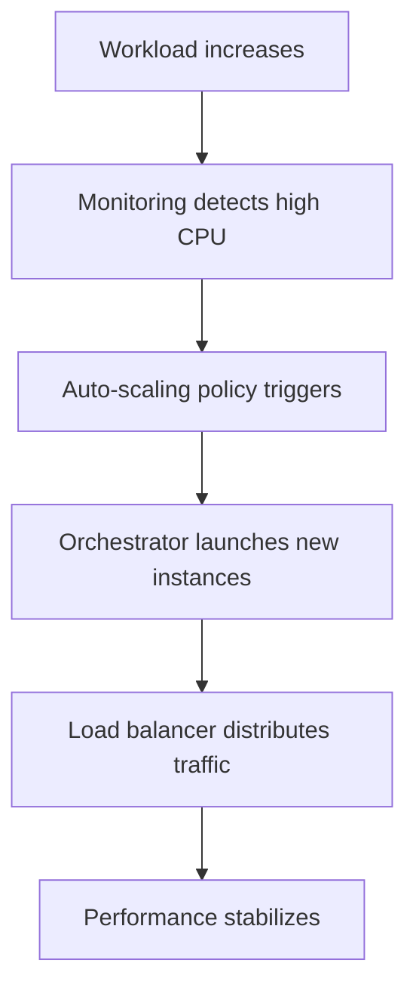

# Rapid elasticity

## 1. Definition
Rapid elasticity is a cloud essential characteristic where capabilities can be elastically provisioned and released, in some cases automatically, to scale rapidly outward and inward commensurate with demand. To the consumer, the capabilities available for provisioning often appear to be unlimited and can be appropriated in any quantity at any time.  
*(NIST SP 800-145)*

## 2. Concept Explanation
- **Basic idea:** Cloud resources can be quickly increased or decreased based on real-time need. If an application experiences a traffic surge, more servers are added automatically; when the surge subsides, excess servers are removed. This avoids paying for idle resources while still handling peak loads.
- **Intermediate layer:** Elasticity is powered by automated monitoring and policy-driven scaling. Metrics like CPU utilisation, request counts, or queue length trigger scaling actions. Virtualisation and orchestration allow new instances to be cloned within minutes. The system can scale horizontally (adding/removing instances) or vertically (changing instance size), though horizontal scaling is more common.
- **Advanced view:** Modern platforms use predictive elasticity, where machine learning models forecast demand and pre-provision capacity ahead of spikes, eliminating even the short lag of reactive scaling. Serverless architectures push elasticity to the extreme by scaling individual function invocations from zero to thousands in seconds. True elasticity is tightly coupled with load balancing, health checks, and graceful connection draining to ensure seamless user experience during scale-in events.

## 3. Key Characteristics / Features
- **Rapid and automatic provisioning:** Resources are created or terminated in minutes or seconds, often without any human intervention. This speed differentiates elasticity from manual scaling, which could take hours or days. Automated scaling policies replace human monitoring with rule-based or predictive triggers.
- **Bidirectional scaling:** Elasticity implies both expansion (scale-out/scale-up) when demand rises and contraction (scale-in/scale-down) when demand falls. This bidirectional nature is critical for cost optimisation, ensuring that resources are not left running idle after a spike subsides.
- **Illusion of infinite capacity:** From the consumer’s perspective, the cloud provider’s resource pool appears unlimited. The consumer does not need to pre-plan a maximum capacity ceiling; they can request resources in any quantity at any time, assuming their account has quota and budget.
- **Fine-grained and granular:** Elasticity can operate at multiple levels — entire virtual machines, container pods, or individual serverless functions. The scaling granularity aligns with the service model: IaaS scales instances, PaaS scales application containers, and FaaS scales function invocations.
- **Tight integration with measured service:** As resources are added or removed, the metering system adjusts billing in real time. This ensures the consumer pays only for what they use at each moment, making elastic scaling a financial as well as a technical benefit.

## 4. Types / Classification
- **Based on direction:**
    - **Scale-out (horizontal scaling):** Adding more identical instances (e.g., VMs, containers) to share the load. This is the most common cloud elasticity pattern because it avoids a single point of failure and can be done without downtime.
    - **Scale-in:** Removing excess instances when demand decreases. Instances are drained of existing connections before termination to avoid user impact.
    - **Scale-up (vertical scaling):** Increasing the capacity of an existing instance (e.g., upgrading from 4 vCPU to 16 vCPU). Often requires a reboot or stop/start, making it less seamless.
    - **Scale-down:** Reducing the size of an instance, similarly involving a brief interruption.
- **Based on triggering mechanism:**
    - **Reactive elasticity:** Scaling actions are triggered after a metric crosses a predefined threshold (e.g., CPU > 70% for 5 minutes). Simple to configure but has a short delay while the condition is detected and instances boot.
    - **Predictive (proactive) elasticity:** Machine learning models analyse historical demand patterns to forecast future spikes and pre-provision resources before the spike arrives, effectively eliminating the boot delay. Suited for predictable, recurring patterns.
    - **Scheduled elasticity:** Scaling actions are tied to a known timetable (e.g., scale out at 8 AM on weekdays). Useful for batch jobs or business-hours workloads.
- **Based on automation level:**
    - **Fully automated (auto-scaling):** No human involvement after initial policy configuration. The platform continuously monitors and adjusts.
    - **Manual on-demand:** The consumer triggers scaling via API or console, still benefiting from rapid provisioning but without automated rules.

## 5. Working / Mechanism
1. **Continuous metric collection:** A monitoring agent inside each resource (or at the hypervisor level) collects performance data — CPU utilisation, memory pressure, request latency, custom metrics — and sends it to a central monitoring service.
2. **Policy evaluation engine:** The auto-scaling service evaluates metric streams against user-defined policies. A typical policy states: “If average CPU utilisation of all instances in the group exceeds 65% for 5 consecutive minutes, add 2 instances.”
3. **Alarm state transition:** When the condition holds true for the specified duration, the policy enters an "alarm" state. A cooldown period is applied to prevent flapping (rapid, repeated scaling).
4. **Capacity calculation:** The auto-scaler computes the new desired capacity (e.g., current 4 instances + 2 = 6) and sends a provisioning request to the cloud orchestration engine.
5. **Resource instantiation:** The orchestrator selects physical hosts, clones the master machine image, attaches storage, assigns network interfaces and security groups, and boots the new instances. Startup scripts (cloud-init) apply final configurations.
6. **Health check and registration:** The new instances undergo health checks (e.g., HTTP 200 on a specific endpoint). Once healthy, the load balancer automatically adds them to the backend pool, and traffic begins to flow.
7. **Scale-in process:** When demand drops and the alarm on low utilisation fires, the auto-scaler selects instances for termination based on a termination policy (newest first, oldest first, closest to next billing hour). The load balancer stops new connections and allows existing ones to drain (connection draining) before the instance is shut down and deleted.
8. **Loop:** The cycle continues indefinitely, maintaining a dynamic equilibrium between capacity and demand without manual intervention.

## 6. Diagram (MANDATORY)

## 7. Mathematical Formulation (if applicable)
A basic target-tracking scaling formula for desired instance count:

$$
C_{desired} = \left\lceil \frac{C_{current} \times M_{current}}{M_{target}} \right\rceil
$$

Where:
- $C_{desired}$ = new desired number of instances
- $C_{current}$ = current number of instances
- $M_{current}$ = current average metric value (e.g., CPU utilisation as a fraction, 0.85)
- $M_{target}$ = target metric value (e.g., 0.70)

*Example:* If $C_{current}=4$, $M_{current}=0.90$, $M_{target}=0.60$, then $C_{desired} = \lceil 4 \times 0.90 / 0.60 \rceil = \lceil 6 \rceil = 6$ instances.  
The system adds 2 instances.

Real auto-scalers use more sophisticated algorithms (step scaling, predictive trending) but this captures the core proportional control idea.

## 8. Example
A video streaming platform experiences a daily evening peak. The application is deployed in an auto-scaling group configured to maintain an average CPU utilisation of 50%. At 6 PM, as viewership increases, CPU climbs to 72%. The auto-scaling policy adds 3 new streaming servers; within 3 minutes they are online and serving users. By midnight, traffic drops, CPU falls to 20%, and the group gracefully removes 3 servers to cut costs. No system administrator was involved — the entire scaling cycle was automatic.

## 9. Analogy
**Elastic rubber band:** A rubber band stretches when pulled, becoming longer to accommodate the force, and instantly returns to its original shape when released. Cloud elasticity behaves similarly — computing resources stretch outward to absorb increased load and snap back to a smaller footprint when the load disappears. You only pay for the “stretched” length, not the relaxed state.

## 10. Comparison (ONLY if needed)

| Feature | Rapid Elasticity (Cloud) | Traditional Static Scaling |
| ------- | ------------------------- | ---------------------------- |
| Response time | Minutes / seconds, automated | Days / weeks, manual procurement |
| Scaling direction | Bidirectional (out/in, up/down) | Primarily unidirectional (add capacity, rarely remove) |
| Cost model | Pay-per-use, cost reduces with demand | Fixed cost, idle resources during low demand |
| Capacity planning | No upfront forecasting needed; illusion of infinite | Requires long-term peak forecasting and capital budget |
| Human involvement | Minimal after initial policy setup | High — purchase approvals, shipping, racking, configuring |
| Workload suitability | Variable, spiky, unpredictable | Steady, predictable, constant |

## 11. Advantages
- **Cost-efficiency:** Resources precisely track demand, eliminating waste from over-provisioning. During off-peak hours, costs shrink proportionally, directly mapping OPEX to actual usage.
- **High availability and resilience:** Automatic scale-out absorbs traffic spikes that would otherwise crash a statically provisioned system. Scale-in storms are harmless because the system shrinks only when utilisation is low.
- **Seamless user experience:** Load balancing combined with elasticity ensures consistent response times even under massive load variation. Users never experience a “system overloaded” message if scaling policies are tuned.
- **Business agility:** Organisations can launch global services without fear of capacity ceilings. Marketing campaigns, product launches, and seasonal events are supported without pre-purchasing months of idle capacity.
- **Sustainability:** Elastic resource utilisation means physical servers in data centres are used more efficiently overall. Releasing unused instances reduces energy consumption and carbon footprint.

## 12. Disadvantages / Limitations
- **Scaling latency:** Even “rapid” provisioning may take 1–5 minutes. A viral event (e.g., celebrity tweet) can overload the app before new instances are ready. Warm pools and predictive scaling mitigate this but add complexity.
- **Policy complexity and flapping risk:** Poorly tuned thresholds and cooldown periods can cause the system to oscillate — continually adding and removing instances, degrading performance and increasing costs. Designing stable policies requires deep understanding of workload behaviour.
- **Application state constraints:** Not all applications scale out easily. If an application stores session state locally or uses in-memory caching without synchronisation, adding or removing instances can corrupt user sessions. Legacy applications often need refactoring to become elastic.
- **Cost explosion from misconfiguration:** A software bug (e.g., memory leak) that simulates high load, or an incorrectly set maximum instance limit that is too high, can cause auto-scaling to launch hundreds of instances, generating massive unexpected bills.
- **Provider limits:** Cloud accounts have soft and hard limits on the number of instances, vCPUs, and API calls per second. Extreme elasticity scenarios may hit these account-level limits, requiring manual intervention to raise them.

## 13. Important Points / Exam Notes
- Rapid elasticity is **one of the five NIST essential characteristics** of cloud computing.
- Key phrase: “capabilities can be elastically provisioned and released … scale rapidly outward and inward … appear to be unlimited … any quantity at any time.”
- It fundamentally changes IT from **fixed CAPEX capacity models** to **flexible OPEX utility models**.
- **Horizontal scaling** (adding/removing instances) is the primary pattern in cloud elasticity; vertical scaling is possible but less agile.
- **Cooldown period** is critical — it prevents flapping by enforcing a waiting time between consecutive scaling actions.
- Elasticity is **not the same as scalability**. Scalability is the ability to grow; elasticity is the ability to grow *and shrink* quickly and automatically on-demand.
- Tightly coupled with **measured service** (billing per use) and **resource pooling** (the pool provides the “infinite” illusion).
- **Serverless (FaaS)** takes elasticity to the extreme: the scaling unit is a single function invocation, scaling from zero to potentially millions in seconds.

## 14. Applications / Use Cases
- **E-commerce flash sales:** A Black Friday sale may increase traffic 50× in one minute. Auto-scaling adds web and application servers rapidly, then scales down after the sale to save costs.
- **Live media streaming:** A global sports final is streamed to millions. Encoding and origin servers scale out just for the event duration, then collapse, avoiding permanent infrastructure costs.
- **Big data batch processing:** A nightly analytics job runs on a massive transient Hadoop/Spark cluster. Auto-scaling scales the cluster up to hundreds of nodes at 2 AM and back to zero when the job completes.
- **Online gaming backends:** Player counts spike during evenings and weekends. Elastic game servers adjust fleet size automatically, ensuring low-latency gameplay without idle servers at night.
- **IoT data bursts:** After a power outage, thousands of smart meters reconnect and report data simultaneously. Elastic message brokers and stream processors scale temporarily to swallow the burst.

## 15. MCQs (MANDATORY)
**Q1. Rapid elasticity in cloud computing means resources can be:**  
A. Permanently increased only  
B. Elastically provisioned and released to scale outward and inward as needed  
C. Provisioned only after a 24-hour notice  
D. Never reduced once allocated  
**Answer:** B

**Q2. Which of the following best describes horizontal scaling?**  
A. Upgrading the CPU of a single server  
B. Adding more virtual machine instances behind a load balancer  
C. Increasing the RAM of the existing virtual machine  
D. Migrating to a larger storage volume  
**Answer:** B

**Q3. The primary purpose of a cooldown period in auto-scaling is to:**  
A. Speed up instance launch  
B. Prevent rapid, repeated scaling actions (flapping)  
C. Stop all scaling operations permanently  
D. Increase monitoring frequency  
**Answer:** B

**Q4. The illusion of “unlimited resources” to the consumer is a defining aspect of:**  
A. On-demand self-service  
B. Broad network access  
C. Rapid elasticity  
D. Resource pooling  
**Answer:** C  
*(Explanation: While resource pooling provides the large pool, rapid elasticity is what makes it appear unlimited by enabling appropriation in any quantity at any time.)*

**Q5. How does rapid elasticity differ from traditional scalability?**  
A. Traditional scalability is faster.  
B. Rapid elasticity is bidirectional, automatic, and near-instantaneous, while traditional scalability is often static, unidirectional, and manual.  
C. They are exactly the same.  
D. Rapid elasticity only works for storage.  
**Answer:** B

**Q6. A news website uses auto-scaling to add servers when CPU exceeds 70%. This is an example of:**  
A. Predictive elasticity  
B. Scheduled elasticity  
C. Reactive elasticity  
D. Manual scaling  
**Answer:** C

**Q7. Predictive elasticity relies on:**  
A. Manual observation of dashboards  
B. Machine learning to forecast demand and proactively provision resources  
C. A fixed schedule that never changes  
D. Only vertical scaling  
**Answer:** B

**Q8. What is a major risk if an auto-scaling maximum instance limit is set too high and a bug causes constant high load?**  
A. Instant termination of the account  
B. Massive unexpected costs due to runaway scaling  
C. The application becomes faster than ever  
D. Data is permanently lost  
**Answer:** B

**Q9. Connection draining during scale-in refers to:**  
A. Removing all instances instantly without warning  
B. Preventing new connections while allowing existing ones to complete before termination  
C. Draining all network cables  
D. Increasing the instance size  
**Answer:** B

**Q10. In serverless computing, rapid elasticity is best characterised by:**  
A. Manually adding VMs one by one  
B. Scaling individual function invocations from zero to thousands instantly  
C. A fixed pool of containers that never changes  
D. Running only one function at a time  
**Answer:** B