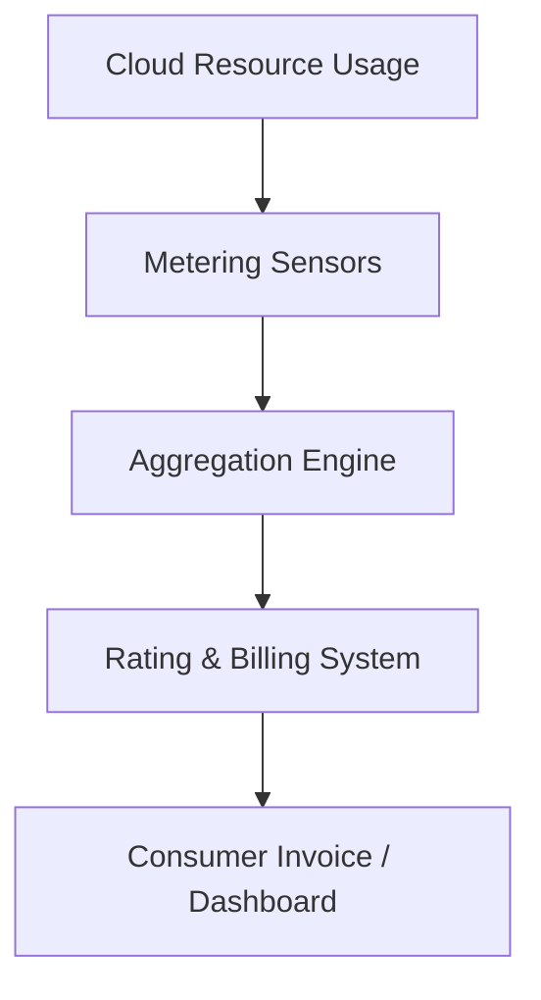

# Measured service

## 1. Definition
**Measured service** is an essential characteristic of cloud computing, formally defined by NIST as the capability where cloud systems automatically control and optimise resource usage by leveraging a metering mechanism at some level of abstraction appropriate to the type of service (e.g., storage, processing, bandwidth, active user accounts). Resource usage is monitored, controlled, recorded, and reported, providing transparency for both the provider and the consumer. This metered delivery ultimately underpins the pay‑per‑use utility billing model, where the consumer is charged only for what they actually consume.

---

## 2. Concept Explanation
Measured service transforms cloud computing into a transparent, accountable, and economic utility.  
- **Basic level**: Imagine you are using a cloud virtual machine (VM). When it runs for an hour, a meter inside the cloud platform records that one hour of compute usage. At the end of the billing cycle, you pay exactly for those hours — similar to an electricity bill based on a meter reading. You do not pay when the VM is stopped.  
- **Intermediate level**: The meter does not just measure time; it can track many dimensions: number of API calls, volume of storage consumed in gigabytes per month, volume of data transferred out, number of active users, or number of function executions. These metrics are captured in granular increments (per second, per request, per millisecond of execution). The provider aggregates these readings into a billing record and exposes them to the consumer via dashboards, APIs, or invoices. This granularity enables the cloud to implement **pay‑as‑you‑go**, **reserved**, and **spot** pricing models.  
- **Advanced level**: The metering infrastructure is designed to be multi‑tenant aware, highly scalable, and tamper‑proof. It logs usage in near‑real‑time and publishes events to distributed stream processing systems that calculate consumption‑based billing. This data stream simultaneously feeds operational auto‑scaling algorithms, cost anomaly detection, budget alerts, and chargeback/showback mechanisms in enterprises. Measured service, therefore, is not just a billing feature — it is the data foundation for cloud financial operations (FinOps), resource optimisation, and capacity planning. The abstraction level of measurement (e.g., per function invocation, per IOP, per table row read) is continuously refined to match newer service types, ensuring that consumers pay only for the exact value they extract.

---

## 3. Key Characteristics / Features
- **Automated metric collection**: Usage is captured by the platform in real time without any manual intervention. Sensors are embedded in every resource (compute, storage, network) to report consumption continuously.
- **Granular measurement**: Cloud providers measure usage in fine‑grained units — seconds or milliseconds for compute, bytes for storage, individual HTTP requests for APIs, and transaction counts for databases. This granularity ensures minimal wastage.
- **Transparency for both parties**: Consumers can view their current and historical usage via portals and APIs; providers use the same data for capacity planning, revenue assurance, and SLA compliance tracking.
- **Multi‑dimensional metering**: A single service can be metered across several axes. For example, an object storage service tracks stored volume (GB‑months), write operations (PUT requests), read operations (GET requests), and network egress (GB transferred).
- **Direct link to billing (utility pricing)**: Measured service translates raw usage numbers into monetary charges using pre‑published rates. No fixed, upfront fee is necessary for variable‑consumption resources.
- **Enables resource optimisation**: Because consumers receive detailed consumption reports, they can identify idle resources, right‑size over‑provisioned VMs, and adopt cost‑efficient architectures (e.g., auto‑scaling, spot instances).
- **Provider‑side control**: The measured service mechanism allows providers to enforce quotas, rate limits, and hardware‑level usage caps so that a single tenant cannot degrade multi‑tenant performance.

---

## 4. Types / Classification (Based on Metering Dimension)
1. **Time‑based measurement**  
   Compiles usage based on wall‑clock time. Most common for compute resources (virtual machines, container instances, dedicated hosts). Typical units: per second, per minute, or per hour.  
   *Example*: An Azure VM billed per second of running time.

2. **Volume‑based measurement**  
   Tracks the amount of storage or data processed. Units involve GB‑months for storage, TB for data ingress/egress, or GB for data scanned by a query.  
   *Example*: Amazon S3 charges based on average GB stored per month and GB transferred out.

3. **Request‑based measurement**  
   Counts discrete API calls, HTTP requests, or operations. Used for function‑as‑a‑service, data object operations, and message queue API actions.  
   *Example*: AWS Lambda bills per million invocations along with duration; API Gateway bills per million API calls received.

4. **Event‑based measurement**  
   Meters platform occurrences such as notification pushes, stream records ingested, or change log entries.  
   *Example*: Google Cloud Pub/Sub charges per million messages published and delivered.

5. **User‑based or seat‑based measurement**  
   Relates to the number of active user accounts, licenses, or registered devices. Common for SaaS applications.  
   *Example*: A CRM SaaS product charges per active user per month; additional users increase the measured metric.

---

## 5. Working / Mechanism
1. **Resource provisioning**  
   The consumer requests a cloud resource (e.g., starts a VM, creates an S3 bucket, deploys a function).
2. **Metric definition and sensor activation**  
   At the service endpoint, the provider’s metering layer activates relevant sensors for every billable dimension (CPU time, storage bytes, requests).
3. **Real‑time usage recording**  
   As the resource operates, the sensors generate atomic usage records — small, time‑stamped events — that are pushed into a distributed message queue or event stream (e.g., Kafka, Kinesis).
4. **Aggregation and normalisation**  
   Stream‑processing jobs aggregate these raw records over predefined windows (e.g., per hour, per day). Duplicate events are deduplicated, and data is normalised into standard units (e.g., GB‑hours, million requests).
5. **Usage storage in metering database**  
   Aggregated usage data is persisted in a scalable time‑series database with tenant identifiers, region labels, and resource tags.
6. **Rating and pricing application**  
   A rating engine intersects the aggregated usage data with the applicable pricing plan (on‑demand, reserved, spot) to compute a pre‑tax cost. Any free tier allowances or credits are subtracted at this stage.
7. **Bill generation and presentation**  
   At the end of the billing cycle, the rated costs are compiled into a detailed invoice. The consumer can view a breakdown (per service, per region, per tag) via the billing console or download a CSV/PDF.
8. **Continuous consumer monitoring**  
   Throughout the cycle, consumers can query near‑real‑time usage via dashboards or APIs, set budget alerts, and trigger automated shutdowns if a spending threshold is crossed.

---

## 6. Diagram

---

## 7. Mathematical Formulation
A general simple formulation for measured service cost:

$$
C = \sum_{i=1}^{n} (U_i \times R_i)
$$

Where:  
- $C$ = Total cost for the billing period.  
- $n$ = Number of billable dimensions (e.g., compute hours, storage GB, API calls).  
- $U_i$ = Measured usage quantity for dimension $i$ (e.g., 720 hours, 50 GB).  
- $R_i$ = Published unit rate for dimension $i$ (e.g., $0.10 per hour, $0.023 per GB).

This formula highlights that metered service billing is a linear combination of usage amounts and their respective rates.

---

## 8. Example
**Amazon EC2 per‑second billing**  
A cloud consumer runs an `t3.medium` Linux virtual machine in the Mumbai region. The on‑demand rate is $0.0416 per hour. The VM is started and stopped multiple times throughout the day, totaling exactly 15,000 seconds of runtime in a month.  
- Metered usage: 15,000 seconds = 4.1667 hours.  
- Cost calculation: $4.1667 \times 0.0416 \approx \$0.173$.  
The AWS metering system automatically records every second of instance uptime and produces a bill for $0.17 for that VM, rather than charging a full month’s rent. The consumer can verify the usage breakdown in the AWS Billing Dashboard down to the second‑level granularity.

---

## 9. Analogy
Measured service works exactly like a **household electricity meter**.  
- The utility company (cloud provider) installs a meter that continuously records the kilowatt‑hours consumed.  
- You (cloud consumer) switch on lights, run the air conditioner, or charge your laptop — each activity spins the meter.  
- At the end of the month, the company sends you a bill based on the reading: $\text{units consumed} \times \text{rate per unit}$.  
- You can look at the meter anytime to check your usage and decide to turn off some appliances if the reading is too high.  
Just as you never pay a flat fee for “unlimited electricity,” cloud consumers never pay a flat fee for “unlimited compute” under a pure utility model.

---

## 10. Comparison (Measured Service vs Traditional Fixed‑Cost Model)

| Feature                        | Measured Service (Cloud)                                  | Traditional Fixed‑Cost (On‑Premises)               |
|--------------------------------|-----------------------------------------------------------|----------------------------------------------------|
| Billing basis                  | Actual usage (per second, per request, per GB)            | Upfront capital expenditure (CAPEX) for hardware   |
| Scalability of cost            | Cost scales elastically with demand                       | Cost is largely fixed regardless of utilisation    |
| Granularity of reporting       | Detailed per‑resource metrics and audit trails            | Aggregate power/cooling; no software usage meter   |
| Financial risk                 | Lower; no payment for idle capacity                       | Higher; over‑provisioning leads to wasted spend    |
| Budget predictability          | Can fluctuate; requires monitoring and alerts             | Highly predictable monthly depreciation            |
| Optimisation feedback          | Immediate — reports show waste and suggest right‑sizing   | Delayed — manual capacity audits required          |

---

## 11. Advantages
- **Fair and economical pricing**: Consumers pay strictly for what they use, avoiding the sunk cost of idle hardware.
- **Encourages efficient design**: Detailed usage reports push developers to write efficient code, compress data, and delete unused resources.
- **Fine‑grained budgeting**: Teams can set per‑project, per‑environment, or per‑region budgets and receive alerts before overspend.
- **Enables multi‑tenant transparency**: Each department or customer in an organisation can see its own usage, enabling showback or chargeback models.
- **Automatic resource optimisation**: Combined with auto‑scaling, the measured data triggers scale‑in when demand drops, directly reducing the bill.
- **Continuous compliance**: Metering logs serve as an immutable audit trail for regulatory requirements like IT financial controls.

---

## 12. Disadvantages / Limitations
- **Cost unpredictability**: In variable‑workload environments without proper monitoring, a sudden spike in usage (e.g., DDoS, runaway script) can lead to an unexpectedly high bill.
- **Complex pricing structures**: Providers often have dozens of metered dimensions, tiered rates, and reserved‑instance mechanics that make it difficult for consumers to estimate costs accurately in advance.
- **Granularity gaps**: Some services do not meter on second‑by‑second basis (e.g., certain legacy storage services bill for a minimum of 30 days), which can lead to wasted spend.
- **Monitoring overhead**: To truly exploit measured service, consumers must implement cost intelligence dashboards and anomaly detection, which adds management complexity.
- **Vendor lock‑in through billing**: Leaving a provider becomes difficult when re‑architecting for the specific metering‑optimised patterns of another cloud (e.g., function‑as‑a‑service invocation patterns).

---

## 13. Important Points / Exam Notes
- Measured service is one of the **five essential characteristics** of cloud computing per **NIST SP 800‑145**.
- It implies **automatic control and optimisation** through a metering capability.
- Metering is performed at a level of abstraction suited to the service (per hour for compute, per GB for storage, per request for functions).
- It provides **transparency for both provider and consumer**.
- The **pay‑per‑use** or **utility billing** model directly arises from measured service.
- Common metering dimensions: **time, volume, request count, event count, user seats**.
- Cloud billing models — **on‑demand, reserved, spot** — all rely on accurate measurement to function.
- Measured service data also feeds **auto‑scaling**, **budget alerts**, and **FinOps practices**.
- Metering is continuous, automated, and granular; it is not a manual periodic reading.
- The characteristic does **not** mean the consumer pays nothing when idle — only that idle resources can be deactivated to stop the meter.

---

## 14. Applications / Use Cases
- **Pay‑as‑you‑go website hosting**: A static website hosted on cloud storage and a CDN incurs cost only per visitor request and data transferred, making it affordable for low‑traffic blogs.
- **Elastic batch processing**: A research lab spins up 1,000 VMs for a genomic analysis job that runs for 4 hours. The metering system bills exactly 4,000 instance‑hours, after which the cost stops completely.
- **SaaS subscription management**: A cloud‑based email service measures the number of active mailboxes each month and adjusts the bill automatically when employees are added or removed.
- **API monetisation platforms**: A startup exposes its geocoding API via a cloud API gateway. It charges its own customers based on the measured API call count, which it retrieves from the cloud’s meter.
- **Enterprise FinOps**: A multinational corporation uses cloud metering data to allocate cloud spend to individual business units via a chargeback model, driving cost accountability.

---

## 15. MCQs

**Q1. According to NIST, measured service in cloud computing ensures that:**  
A. Resources are always available without limits  
B. Users never pay for cloud services  
C. Resource usage is monitored, controlled, and reported  
D. All data is encrypted by default  
**Answer:** C. Resource usage is monitored, controlled, and reported

**Q2. Which of the following is a typical unit of measurement for a cloud compute service?**  
A. Number of login attempts  
B. GB‑months  
C. Instance‑hours or seconds of runtime  
D. Number of source code files  
**Answer:** C. Instance‑hours or seconds of runtime

**Q3. The pay‑per‑use billing model is a direct outcome of which cloud characteristic?**  
A. Broad network access  
B. Resource pooling  
C. Rapid elasticity  
D. Measured service  
**Answer:** D. Measured service

**Q4. Which of the following cloud pricing models fundamentally depends on an accurate measured service mechanism?**  
A. Fixed monthly subscription only  
B. On‑demand (pay‑as‑you‑go)  
C. One‑time perpetual license  
D. Hardware lease with buy‑out option  
**Answer:** B. On‑demand (pay‑as‑you‑go)

**Q5. An AWS Lambda function is charged based on the number of requests and the duration of each request. This is an example of:**  
A. Volume‑based measurement  
B. Time‑based and request‑based measurement  
C. Seat‑based measurement  
D. Event‑based measurement only  
**Answer:** B. Time‑based and request‑based measurement

**Q6. What is the primary risk of relying heavily on measured service for cloud cost management?**  
A. The meter stops working during low usage  
B. Usage spikes can lead to unexpectedly high bills  
C. Users cannot access their usage reports  
D. Metering data is never exposed to consumers  
**Answer:** B. Usage spikes can lead to unexpectedly high bills

**Q7. Which of the following statements about measured service is FALSE?**  
A. Usage can be monitored in near real‑time  
B. It applies only to virtual machine services  
C. It provides transparency to consumers  
D. It helps enforce resource quotas  
**Answer:** B. It applies only to virtual machine services

**Q8. The household electricity meter is often used as an analogy for measured service because:**  
A. Both use the same physical meter  
B. Both charge based on actual consumption rather than a flat fee  
C. Both are mandatory for all consumers  
D. Both have identical units of measurement  
**Answer:** B. Both charge based on actual consumption rather than a flat fee

**Q9. In the measured service mechanism, what role does the aggregation engine play?**  
A. It generates the cryptographic keys for each consumer  
B. It groups and normalises raw usage events into billable units  
C. It provisions new cloud resources automatically  
D. It only sends email notifications to the consumer  
**Answer:** B. It groups and normalises raw usage events into billable units

**Q10. Which cloud characteristic, when combined with measured service, allows costs to scale down automatically during periods of low usage?**  
A. Broad network access  
B. Resource pooling  
C. Rapid elasticity  
D. On‑demand self‑service  
**Answer:** C. Rapid elasticity