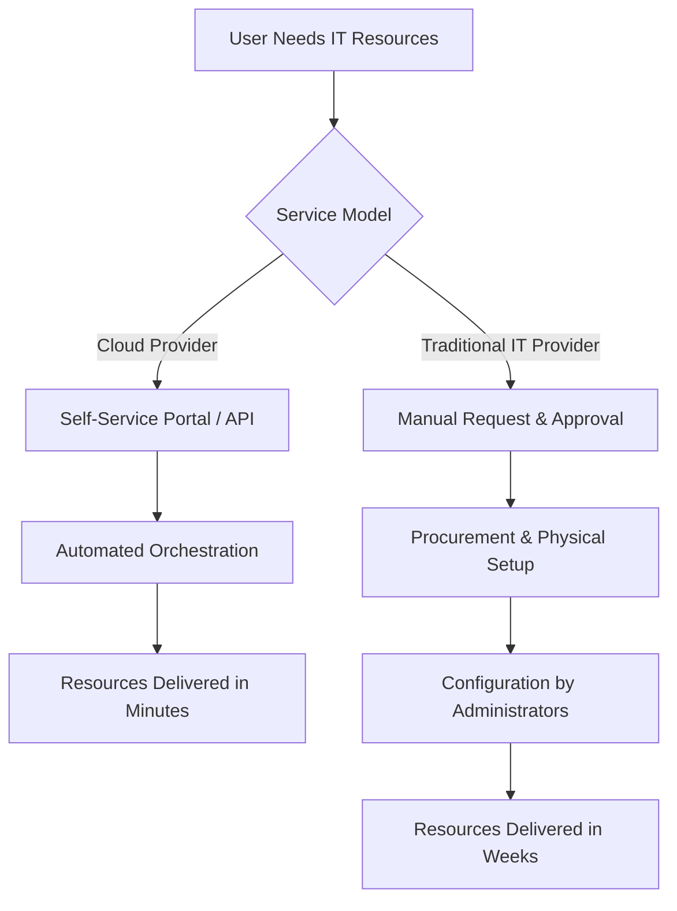

# 10 Comparing cloud providers with traditional IT service providers

## 1. Definition
Comparing cloud providers with traditional IT service providers involves evaluating the differences between on-demand, self-service, utility-based cloud computing models and the conventional approaches where IT resources — hardware, software, networking, and support — are procured, built, and managed either in-house or through managed hosting and outsourcing vendors on a dedicated, long-term basis. The comparison spans cost structures, provisioning speed, scalability, control, maintenance responsibility, and service delivery mechanisms.

## 2. Concept Explanation
The shift from traditional IT service delivery to cloud-based delivery represents a fundamental change in how technology resources are consumed, financed, and operated.

- **Basic:** Traditional IT providers supply dedicated physical servers, storage arrays, and networking equipment either installed on-premises or hosted in a specific data centre. The customer owns or leases the exact hardware, knows its physical location, and pays upfront capital or fixed monthly contracts. Cloud providers offer virtualised resources via the internet from massive shared pools, and customers pay only for what they consume on a variable, metered basis.
- **Intermediate:** With a traditional IT provider, scaling up requires ordering new hardware, waiting for delivery, racking, cabling, and configuring — a process taking weeks. Maintenance, patching, and capacity planning are the customer’s responsibility or are covered by a managed service agreement. In contrast, cloud providers abstract physical hardware entirely. Self-service portals and APIs provision compute, storage, and network in minutes. The provider handles all physical infrastructure, hypervisors, and many higher-level services (database, queue, ML), offering a catalogue of ready-to-use components.
- **Advanced:** The comparison extends to business agility and financial engineering. Traditional models bind IT capacity to capital expenditure (CapEx), lengthy procurement cycles, and depreciation schedules. Cloud models convert IT spending to operational expenditure (OpEx), align cost directly to usage, and enable experimentation without risky upfront investments. Additionally, cloud providers offer global reach — deploying applications in multiple regions instantly — while traditional providers are bound to specific, limited physical locations. The cloud’s automation and DevOps integration further widen the gap, enabling continuous delivery and infrastructure-as-code, which are harder to achieve in a traditional setup where hardware changes require manual intervention.

Understanding this comparison helps organisations choose the right sourcing strategy: pure cloud, hybrid models, or keep certain workloads with traditional providers where specific demands dictate.

## 3. Key Characteristics / Features
The comparison reveals distinct characteristics that separate the two models:

- **Provisioning model:** Cloud providers use self-service, on-demand provisioning through web portals and APIs, delivering resources automatically in minutes. Traditional IT providers follow a ticket-based, manual procurement, and setup process that typically spans weeks to months.
- **Cost structure:** Cloud providers operate on a pure pay-per-use or subscription-based OpEx model, with zero upfront capital for hardware. Traditional IT involves high initial CapEx for hardware and software licences, plus recurring operational costs for power, cooling, and staff.
- **Scalability:** Cloud platforms provide rapid elasticity — resources scale out and in automatically based on demand, often within seconds. Traditional IT scales in fixed, large steps requiring physical hardware acquisition, limiting swift response to workload variations.
- **Resource pool and multi-tenancy:** Cloud providers pool massive amounts of resources across thousands of customers, using virtualisation and multi-tenancy to achieve high utilisation and cost efficiency. Traditional IT providers usually assign dedicated, single-tenant resources whose utilisation depends entirely on one client’s workload.
- **Maintenance and management responsibility:** In the cloud model, the provider handles physical security, hardware refresh, hypervisor patching, and often platform software maintenance. With traditional IT, the customer or the managed service provider performs these tasks under a separate agreement, often at additional cost and with slower response.
- **Geographic reach:** Cloud providers operate tens of regions and hundreds of edge locations globally, allowing deployment close to end-users with minimal setup. Traditional providers are limited to a few data centres specified in the contract, and global expansion requires establishing new physical presence or contracts.
- **Service breadth:** Cloud providers offer a vast ecosystem of higher-level managed services (AI/ML, IoT, serverless computing, analytics) that integrate seamlessly with their core infrastructure. Traditional IT providers primarily deliver raw compute, storage, and basic managed services, lacking the same depth of integrated platform services.
- **Contract and commitment:** Cloud providers allow granular, per-hour or per-second billing with no long-term commitment, though reserved instances offer discounts. Traditional IT service contracts often mandate fixed terms (1–3 years) with minimum commitments and early termination penalties.

## 4. Types / Classification
Both categories can be classified by the nature of service delivery, which clarifies the comparison.

### Cloud Providers
- **Infrastructure as a Service (IaaS) providers:** Offer virtualised compute, storage, and networking resources on demand. (e.g., AWS EC2, Azure Virtual Machines)
- **Platform as a Service (PaaS) providers:** Provide managed runtime environments, databases, and development tools, abstracting the underlying OS and middleware. (e.g., Google App Engine, AWS Elastic Beanstalk)
- **Software as a Service (SaaS) providers:** Deliver complete, ready-to-use applications over the internet, eliminating all infrastructure management for the user. (e.g., Microsoft 365, Salesforce)
- **Function as a Service (FaaS) / Serverless providers:** Execute code in response to events with zero server management. (e.g., AWS Lambda, Azure Functions)

### Traditional IT Service Providers
- **In-house IT (Self-managed):** The organisation owns all hardware and software, manages its own data centre or server room, and employs IT staff for all operations.
- **Colocation providers:** Offer physical space, power, cooling, and network connectivity; the customer owns and manages the servers and storage placed in the facility.
- **Managed hosting providers:** Lease dedicated physical servers to clients and may provide basic management (monitoring, backups, OS patching) but do not offer cloud-like elasticity or self-service.
- **IT outsourcing / System integrators:** Deliver comprehensive IT services, including infrastructure management, helpdesk, and application support, often via long-term contracts with service-level agreements (SLAs) tied to fixed, dedicated environments.
- **Traditional telecom / network service providers:** Provide dedicated WAN links, MPLS circuits, and voice services on fixed contracts, contrasting with cloud-native networking (VPC peering, VPN gateways, SD-WAN on demand).

## 5. Working / Mechanism
The delivery mechanism differs fundamentally. Below is a step-by-step comparison of a typical resource provisioning process.

### Cloud Provider Provisioning (e.g., launch a VM)
1. **Authentication:** User logs into the cloud provider’s console or uses CLI/API with valid credentials.
2. **Request specification:** User selects instance type, operating system, storage, and a resource location at region/zone level.
3. **Automated orchestration:** The cloud platform’s orchestration layer validates quotas, checks available capacity in the abstract resource pool.
4. **Instant provisioning:** A virtual machine is created on a suitable physical host; virtual storage, network interfaces, and IP address are allocated automatically.
5. **Delivery and billing start:** The VM is running in seconds to minutes. Billing commences immediately on a per-second/hour basis.
6. **Ongoing management:** Scaling, monitoring, and termination remain self-service. The cloud provider manages hardware and hypervisor.

### Traditional IT Provider Provisioning (e.g., new server for same need)
1. **Request and approval:** User submits a ticket to the IT department or service provider; management approvals and budgetary checks occur.
2. **Procurement:** Purchase order raised for a physical server, possibly following vendor quotation and negotiation.
3. **Hardware delivery and setup:** Server is shipped, physically received, racked, cabled, and powered on in a data centre or server room (can take weeks).
4. **Configuration:** IT staff install OS, hypervisor if needed, network configuration, storage allocation, agents, and security patches.
5. **Testing and handover:** Server tested, added to monitoring, user informed. The whole cycle often takes 4–8 weeks.
6. **Ongoing management:** Customer or contracted provider responsible for hardware break-fix, firmware, OS updates, and capacity upgrades, requiring further procurement.

## 6. Diagram

## 7. Mathematical Formulation
A simplified three-year Total Cost of Ownership (TCO) comparison can be modelled.

**Cloud TCO (OpEx dominated):**
$$
TCO_{cloud} = \sum_{m=1}^{36} \left( C_{compute}(m) + C_{storage}(m) + C_{network}(m) + C_{support} \right)
$$

**Traditional IT TCO (CapEx + OpEx):**
$$
TCO_{trad} = CapEx_{hardware} + CapEx_{software} + \sum_{m=1}^{36} \left( OpEx_{power} + OpEx_{cooling} + OpEx_{staff} + OpEx_{maintenance} \right)
$$

- \(C_{compute}(m)\): Cloud compute cost in month \(m\), varies with usage (e.g., VM instance hours).
- \(C_{storage}(m)\): Storage cost (GB-months, I/O requests).
- \(C_{network}(m)\): Data transfer and networking charges.
- \(C_{support}\): Provider support plan monthly fee.
- \(CapEx_{hardware}\): Upfront server, storage, network hardware purchase.
- \(CapEx_{software}\): Perpetual licence costs.
- \(OpEx_{power/cooling/staff/maintenance}\): Monthly facility and operating costs.

Cloud TCO is linearly proportional to actual consumption, whereas traditional TCO includes large sunk costs that remain even when resources are idle.

## 8. Example
A startup needs a production web application environment with application servers and a database. Using a traditional IT provider, they would lease two dedicated servers from a managed hosting company on a 12-month contract, paying $800 per month fixed, regardless of whether the servers are fully utilised. Scaling up would require ordering a third server, incurring additional setup time and cost. Using a cloud provider like AWS, the startup launches two EC2 instances and a managed RDS database through a self-service console. They pay only for the hours the instances run, can automatically scale out during a marketing campaign, and shut down non-production environments at night, paying a fraction of the fixed hosting cost. This flexibility avoids idle capacity charges and allows the startup to iterate rapidly.

## 9. Analogy
**Buying a car vs. using a ride-hailing service:**
- Traditional IT is like owning a car: you pay a large upfront price (CapEx), must maintain it, insure it, and deal with depreciation. It sits idle in the garage most of the day, but when you need a second car for a family trip, you must buy or rent one with extra cost and delay.
- Cloud computing is like using a ride-hailing app: you pay per trip, choose the car type based on immediate need (small car or SUV), and never worry about maintenance, insurance, or parking. During a surge in demand, you simply request more cars instantly; when demand drops, you stop paying. The service aggregates a huge fleet (resource pool) to serve many riders efficiently.

## 10. Comparison

| Feature | Cloud Providers | Traditional IT Service Providers |
| ------- | --------------- | -------------------------------- |
| **Provisioning time** | Minutes, automated | Weeks to months, manual |
| **Cost model** | Pay-per-use (OpEx), variable | Upfront CapEx + fixed OpEx |
| **Scalability** | Rapid, elastic, automatic | Fixed capacity, slow hardware-based scaling |
| **Resource utilisation** | High, via multi-tenancy and pooling | Low to moderate, dedicated silos |
| **Geographic availability** | Global regions and zones, instant deployment | Limited to contracted data centres |
| **Management burden** | Provider manages physical infra and many platforms | Customer/outsourcer manages most layers |
| **Contract flexibility** | Per-hour/month, cancel anytime | Fixed-term contracts, penalties |
| **Service ecosystem** | Vast managed services (AI, analytics, serverless) | Basic hosting, plus separate third-party add-ons |
| **Security responsibility** | Shared model; provider secures cloud, customer secures in-cloud | Customer fully responsible for physical and logical security unless outsourced |
| **Capital vs. operational expense** | Converts IT spend to OpEx | Requires significant CapEx and asset management |
| **Innovation velocity** | Continuously updated platform with new features | Hardware refresh cycles of 3–5 years |

## 11. Advantages (of Cloud Providers over Traditional)
- **Agility and speed:** Resources are available instantly, allowing businesses to experiment, deploy, and iterate far faster than traditional procurement permits.
- **Cost efficiency:** Eliminates idle hardware costs by matching spend exactly to consumption, with no upfront capital burden.
- **Boundless scalability:** Can handle unpredictable workloads and viral growth without capacity planning and hardware lead times.
- **Global reach in minutes:** Enter new markets by deploying in a nearby cloud region with zero physical logistics.
- **Continuous innovation:** Access to the latest processors, GPUs, and cutting-edge services (machine learning, IoT, analytics) without hardware refresh projects.
- **Simplified DR and business continuity:** Built-in multi-zone and multi-region replication and failover are far cheaper and simpler than building duplicate physical sites.
- **Focus on core business:** Offloads undifferentiated heavy lifting — racking, cabling, patching, hardware failure — to the provider, freeing internal teams for value-added work.

## 12. Disadvantages / Limitations (of Cloud Providers vs Traditional)
- **Vendor lock-in:** Deep use of provider-specific services makes migrating workloads to another provider or back on-premises complex and costly.
- **Less transparency and physical control:** Organisations with extreme compliance or forensic requirements may need to know exact physical server location, which cloud abstracts away.
- **Potential for uncontrolled costs:** The ease of provisioning can lead to sprawl and unexpected bills without rigorous governance and FinOps practices.
- **Performance variability:** Multi-tenant environments can introduce “noisy neighbour” effects, and network latency can vary; dedicated hardware ensures consistent, isolated performance.
- **Data residency and sovereignty challenges:** Ensuring data stays within a specific legal jurisdiction can be trickier, requiring careful region selection and may not match the flexibility of a fully private, known-location data centre.
- **Long-term cost at steady state:** For very stable, predictable workloads running 24/7 over many years, owning hardware through traditional procurement can be cheaper than perpetual cloud rental without reserved instance commitments.

## 13. Important Points / Exam Notes
- Cloud providers deliver **on-demand self-service, broad network access, resource pooling, rapid elasticity, and measured service**; traditional providers mostly lack built-in automation for all five.
- The critical financial distinction: cloud is **OpEx-driven** with no upfront hardware cost, traditional is **CapEx-heavy**.
- **Provisioning latency:** cloud is sub-minute to minutes; traditional can be weeks, which impacts business agility.
- Traditional IT encompasses **in-house, colocation, managed hosting, and outsourcing**; all assign dedicated, location-known resources.
- Cloud providers achieve **high utilisation** through massive multi-tenancy; traditional models often suffer from over-provisioning and idle capacity.
- **Security responsibility** in cloud is a shared model; in traditional, the customer retains full end-to-end security responsibility (or delegates via contract).
- Hybrid cloud strategies blend both to leverage the advantages of each — keeps sensitive legacy workloads on traditional dedicated kit while using cloud for scalable front-ends.
- The “**ride-hailing vs. owning a car**” analogy succinctly summarises the key differences in cost, flexibility, and maintenance.
- Cloud providers offer **higher-order services (serverless, AI, big data)** that are not economically viable for traditional providers to replicate at the same price.
- The comparison is not always win-lose; for **steady-state, high-compliance, low-latency** workloads, traditional dedicated infrastructure may be more suitable and cost-effective.

## 14. Applications / Use Cases
- **Startup and new digital products:** Cloud providers are ideal because they require zero upfront investment and can scale with user growth; traditional IT would be impractical due to capital constraints.
- **Enterprise legacy migration:** Large organisations move from traditional managed hosting to cloud (e.g., migrating SAP to AWS) to gain elasticity and modernise applications.
- **Disaster recovery site:** Using cloud as a secondary site instead of building a second physical data centre with a traditional provider reduces cost dramatically.
- **Compliance-heavy workloads:** A bank may use a traditional, dedicated data centre for core banking systems with full physical control, while adopting cloud for customer-facing mobile apps, demonstrating hybrid use.
- **Big data analytics:** Cloud providers offer on-demand massive parallel processing (e.g., Amazon EMR) that would require huge CapEx and lengthy procurement with traditional server vendors.

## 15. MCQs

**Q1. Which cost model is most characteristic of cloud providers compared to traditional IT providers?**
A. High upfront capital expenditure and fixed recurring costs  
B. Pay-per-use operational expenditure with minimal upfront cost  
C. One-time perpetual licence fee  
D. Fixed monthly lease irrespective of usage  
**Answer:** B

**Q2. A typical traditional IT provisioning cycle from request to delivery commonly takes:**
A. A few seconds  
B. A few minutes  
C. Several hours  
D. Several weeks to months  
**Answer:** D

**Q3. The immediate, automated scaling of cloud resources is termed:**
A. Manual capacity planning  
B. Rapid elasticity  
C. Colocation  
D. Dedicated hosting  
**Answer:** B

**Q4. Which type of traditional IT provider owns the physical data centre space, power, and cooling while the customer owns the servers?**
A. Managed hosting provider  
B. Colocation provider  
C. IaaS cloud provider  
D. SaaS provider  
**Answer:** B

**Q5. A key advantage of cloud providers over traditional IT for a seasonal e-commerce website is:**
A. Knowing the exact physical server location  
B. Long-term fixed pricing  
C. Ability to scale down after peak season, paying only for what is consumed  
D. Manual server configuration control  
**Answer:** C

**Q6. In the cloud shared responsibility model, the cloud provider is responsible for:**
A. Customer data security and application access control  
B. Physical security of the data centre and hypervisor patching  
C. Configuring application firewalls in the guest OS  
D. All aspects of security end-to-end  
**Answer:** B

**Q7. Which traditional IT approach offers the customer the highest degree of physical control and hardware customisation?**
A. Public cloud IaaS  
B. SaaS solution  
C. In-house self-managed data centre  
D. Cloud function (serverless)  
**Answer:** C

**Q8. One significant limitation when moving from traditional dedicated hosting to a public cloud is:**
A. Decreased geographic reach  
B. Potential lack of exact control over physical server location  
C. Slower provisioning times  
D. Mandatory five-year contracts  
**Answer:** B

**Q9. The ride-hailing analogy most closely represents which cloud characteristic versus traditional IT?**
A. Long-term hardware ownership  
B. High upfront capital expenditure  
C. On-demand, pay-per-use resource consumption with no ownership burden  
D. Manual setup and teardown of resources  
**Answer:** C

**Q10. For a workload that runs 24/7 with very stable demand over five years, which model might be more cost-effective?**
A. Pure on-demand cloud without any reservation  
B. Traditional owned hardware or long-term colocation lease  
C. Per-second billed serverless functions only  
D. Short-term cloud spot instances  
**Answer:** B