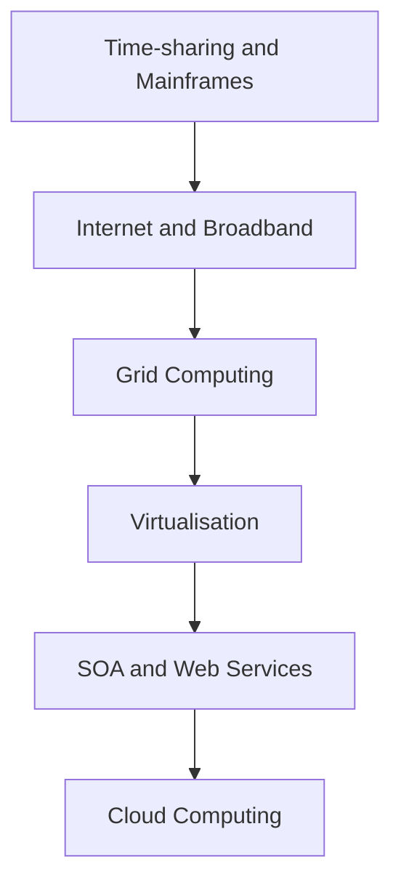

# Roots of cloud computing

## 1. Definition
The roots of cloud computing are the early technologies, computing paradigms, and conceptual models that evolved over decades and collectively laid the groundwork for the development of modern cloud computing. They include time-sharing, utility computing, grid computing, virtualisation, service-oriented architecture, and the global expansion of the Internet.

## 2. Concept Explanation
- **Basic layer:** The idea of treating computing power as a utility – similar to electricity or water – was conceived long before cloud computing became reality. In the 1950s and 1960s, giant mainframe computers were extremely expensive and scarce. Sharing these costly resources efficiently was the driving force behind most early innovations.
- **Intermediate layer:** Several generations of technology progressively solved problems of resource sharing, remote access, and automated provisioning. Mainframe time-sharing allowed multiple users to work on a single machine. The Internet provided global connectivity. Grid computing demonstrated pooling distributed resources for massive tasks. Virtualisation made it possible to run many isolated systems on one physical server. Service-oriented architecture (SOA) established the design principles of loosely coupled, reusable services over a network.
- **Advanced view:** Cloud computing represents the convergence and commercialisation of all these earlier threads. It took virtualisation’s efficient resource utilisation, grid computing’s massive-scale pooling, time-sharing’s multi-tenancy, utility computing’s pay-per-use billing model, and web services’ standardised programmatic interfaces, then packed them into enormous, automated data centres offering services through a simple self-service portal. The cloud is not a single invention but a mature integration of several long-developing roots.

## 3. Key Characteristics / Features (of the roots)
- **Time-sharing concept (1960s–1970s):** Large mainframes were partitioned to allow many users to interact simultaneously via teletype terminals. This established the principle of multi-tenancy and the abstraction of computing resources from location.
- **Utility computing vision:** The idea that computing power could be supplied on demand and charged based on usage, much like electricity. John McCarthy at MIT famously stated in 1961 that "computation may someday be organized as a public utility". This vision established the metered, pay-per-use economic model.
- **Virtualisation technology:** Began with IBM’s CP/CMS in the 1960s and later matured with hypervisors such as VMware (1999). Virtualisation allows a single physical machine to host multiple virtual machines, each running its own operating system, thereby enabling resource pooling, isolation, and efficient hardware utilisation – the core technical engine of cloud computing.
- **Grid computing (1990s–2000s):** Connected geographically distributed computers to work on a single problem, such as scientific simulations. It proved that a loosely federated pool of heterogeneous resources could be coordinated, managed, and secured, influencing the resource-pooling and orchestration mechanisms in cloud platforms.
- **Service-oriented architecture (SOA) and web services:** SOA promoted the design of software as a collection of interoperable, reusable services communicating over a network. Web services standards (SOAP, REST, WSDL) created standardised protocols for remote procedure calls, which directly shaped cloud APIs and the programmatic access that makes on-demand self-service possible.
- **Internet and World Wide Web:** The global TCP/IP network and the HTTP-based web provided the pervasive, affordable connectivity backbone. Broadband penetration in the late 1990s and 2000s made it feasible to offload heavy computation and storage to remote data centres.
- **Maturation of large-scale data centres:** Companies such as Google and Amazon refined the art of building massive, commodity-hardware-based data centres with highly automated management, fault-tolerant software stacks, and extreme energy efficiency. These innovations turned the theoretical utility dream into a commercially viable, high-availability service.

## 4. Types / Classification (of root elements)
The roots can be classified into three categories based on their primary contribution:
- **Conceptual roots:** Ideas that shaped the *philosophy* of cloud computing.
    - *Utility computing:* The pay-per-use, on-demand delivery model.
    - *Time-sharing:* Multi-tenancy and remote resource access.
- **Technological roots:** Hardware and low‑level software innovations that provided the *enabling mechanisms*.
    - *Virtualisation:* Server consolidation and resource isolation.
    - *High-speed networking and the Internet:* Global connectivity and bandwidth availability.
    - *Massive-scale commodity data centres:* Cheap, scalable physical infrastructure.
- **Architectural roots:** Design patterns and standards that shaped the *structure* of cloud services.
    - *Grid computing:* Distributed resource federation and job scheduling.
    - *Service-oriented architecture (SOA) and web services:* Loose coupling, standardised APIs, and interoperable interfaces.
    - *Autonomic computing (self-management):* Systems that configure, heal, and optimise themselves with minimal human intervention, influencing cloud orchestration.

## 5. Working / Mechanism (Evolutionary Flow)
1. **1960s – Mainframes and Time-sharing:** IBM mainframes run operating systems that slice CPU time among dozens of concurrent users. Users access via dumb terminals. The concept of sharing expensive hardware is born.
2. **1990s – Internet becomes mainstream:** The World Wide Web and broadband connectivity make it possible to access data and applications from remote servers. TCP/IP and HTTP provide universal communication protocols.
3. **1995–2000 – Grid computing initiatives:** Projects like SETI@home connect thousands of volunteer PCs. Middleware (e.g., Globus Toolkit) is developed to manage distributed, heterogeneous computing resources securely over the Internet.
4. **1999 – x86 virtualisation becomes affordable:** VMware launches VMware Workstation. Virtual machines can now be created, cloned, and migrated on commodity Intel servers, drastically reducing hardware cost and enabling dynamic resource reassignment.
5. **2000–2005 – Web services and SOA adoption:** Companies adopt SOA principles, exposing business functions as XML/SOAP web services. Amazon rewrites its internal architecture into service-oriented components, realising the company has become extremely good at running scalable infrastructure.
6. **2002–2006 – Amazon pioneers commercial cloud (AWS):** Amazon uses its mature virtualised data centre to launch Amazon Web Services; EC2 (compute) and S3 (storage) are offered to the public in 2006 on a pay-per-use basis, directly inspired by utility computing.
7. **2008–2010 – Open-source and competition:** Google App Engine, Microsoft Azure, and OpenStack emerge, cementing the cloud model. The convergence of all roots is complete, and cloud computing becomes a mainstream service delivery model.

## 6. Diagram (MANDATORY)

## 7. Mathematical Formulation (ONLY if applicable)
Not applicable for this topic.

## 8. Example
Amazon’s metamorphosis from an online bookstore to the world’s largest public cloud provider exemplifies all the roots in action. By the early 2000s, Amazon had built huge virtualised data centres to support its e-commerce platform. To handle peak holiday loads, they had massive spare capacity most of the year. Jeff Bezos saw an opportunity to sell this spare capacity as utility computing, using web services interfaces. In 2006, Amazon launched EC2 (compute) and S3 (storage) as pay-as-you-go services. This move transformed a necessary backend investment into a global cloud business, directly built on virtualisation, utility computing, Internet connectivity, and SOA.

## 9. Analogy
Consider the evolution of drinking water supply. Initially, each household drew water from its own well (on‑premises mainframe). Then, a municipal water supply was developed: pipes (the Internet) reached every house, water towers and pump houses (data centres) stored and pressurised water, meters (billing) tracked usage, and a tap (self‑service console) provided instant access. The technology to deliver reliable municipal water—pumps, piping networks, standardised fittings, water treatment—took decades to mature, just as cloud computing required time-sharing, networking, virtualisation, and SOA to reach the point of seamless utility computing.

## 10. Comparison (ONLY if needed)

| Feature | Grid Computing (Root) | Cloud Computing (Modern) |
| ------- | ----------------------- | ------------------------- |
| Objective | Connect distributed resources to solve huge scientific problems | Deliver on-demand, elastic IT services to any consumer |
| Resource type | Heterogeneous, often donated clusters and PCs | Homogeneous, virtualised commodity hardware in vast pools |
| Access model | Batch jobs, project‑based collaboration | Self‑service, instantaneous, API‑driven, metered per‑second |
| Business model | Primarily academic/government funded, grant‑based | Commercial, pay‑per‑use OPEX |
| Scalability | Limited by partner institutions’ commitments | Near‑unlimited, rapid elasticity illusion |
| Standardisation | GridFTP, Globus, specific scientific middleware | REST APIs, OCCI, ubiquitous web standards |

## 11. Advantages (of understanding the roots)
- **Historical context for core characteristics:** Studying roots explains *why* multi-tenancy, measured service, and self-service provisioning are first-class features, not afterthoughts.
- **Predicting future trends:** Evolution from time-sharing to serverless computing becomes a logical continuum. Knowing the past helps anticipate where the technology is heading (e.g., further abstraction with FaaS).
- **Technology selection and hybrid deployment:** Understanding grid computing and virtualisation roots helps in architecting hybrid cloud solutions that must integrate legacy HPC grids or on-premises virtualised farms.
- **Security and governance insights:** The transition from isolated mainframes to multi-tenant public clouds highlights the security challenges and the evolution of isolation mechanisms (chroot → VM → container sandboxes).
- **Pedagogical value for system design:** Students and engineers grasp that cloud is not magic but a well‑engineered convergence. It reinforces sound design principles such as loose coupling, API-first design, and automation.

## 12. Disadvantages / Limitations (of the roots, which shaped cloud’s constraints)
- **Time‑sharing had poor isolation:** Users could impact each other’s performance and security, a problem only partially solved by later virtualisation; multi-tenant side-channel attacks in clouds echo this root limitation.
- **Grid computing complexity:** Early grid middleware was notoriously complex to install and configure. This inhibited universal adoption and informed the cloud’s philosophy of radical simplicity and self-service.
- **Immature networking:** The lack of widespread broadband in the 1960s–1980s delayed utility computing for decades. Cloud still relies heavily on network quality, and poor connectivity remains a barrier.
- **Virtualisation overhead:** Virtual machines introduced performance overhead compared to bare metal, a root compromise that persisted until near-native performance hypervisors and container‑based lightweight alternatives emerged.
- **Vendor lock-in in SOA/Web Services:** Tight coupling to specific SOAP/WSDL stacks sometimes occurred, early foreshadowing of the cloud vendor lock-in concerns with proprietary APIs.
- **Limited automation in early roots:** Time-sharing and initial grid systems required manual scheduling and static partitioning. Full automation was a prerequisite for cloud that only matured much later, and manual‑intensive operational practices can still creep into poorly managed clouds.

## 13. Important Points / Exam Notes
- John McCarthy (1961): “computation may someday be organized as a public utility” – foundational vision of utility computing.
- Time-sharing (CTSS, Multics) introduced multi-tenancy and remote access.
- IBM’s mainframe virtualisation (CP‑67) pioneered the hypervisor concept in the 1960s.
- VMware popularised x86 virtualisation in 1999, making server consolidation possible on cheap hardware.
- Grid computing (SETI@home, EGEE projects) demonstrated large-scale distributed resource federation.
- SOA and web services (SOAP, REST) standardised remote API access, directly influencing cloud programmability.
- Amazon’s internal SOA transformation (2002) forced teams to expose data and functionality through service interfaces, which later led to AWS.
- AWS launched S3 in March 2006, EC2 in August 2006; this marks the commercial birth of public IaaS cloud.
- Broadband penetration in developed countries was a necessary precondition; cloud services are not viable on dial-up connections.
- Cloud is an evolution, not a revolution; it synthesises decades of incremental progress in multiple fields.

## 14. Applications / Use Cases (of root technologies that led to cloud)
- **Time‑sharing:** University computer centres served hundreds of students on a single mainframe, teaching the value of resource sharing.
- **Utility computing:** Early application service providers (ASPs) offered hosted payroll and accounting software on a subscription model, proving the business viability.
- **Grid computing:** CERN’s Worldwide LHC Computing Grid processes petabytes of particle collision data using globally distributed, federated resources, influencing the design of cloud orchestration and data locality.
- **Virtualisation:** Data centre server consolidation cut electricity and hardware costs by 70% while improving disaster recovery flexibility; this directly enabled the economics of mega-scale cloud providers.
- **SOA/Web Services:** Netflix’s early adoption of AWS was possible because their internal architecture was already service-oriented, allowing piecemeal migration of microservices to the cloud.
- **Commodity data centres:** Google’s early software stack (Google File System, MapReduce) ran on thousands of cheap, failure‑prone PCs, proving that resilience could be achieved in software, obviating expensive monolithic servers.

## 15. MCQs (MANDATORY)
**Q1. Who famously predicted in 1961 that computing would one day be organised as a public utility?**  
A. Steve Jobs  
B. John McCarthy  
C. Tim Berners-Lee  
D. Vint Cerf  
**Answer:** B

**Q2. Which technology from the 1960s first introduced the concept of multiple users sharing a single computer simultaneously?**  
A. Grid computing  
B. Time-sharing  
C. Virtualisation  
D. Distributed computing  
**Answer:** B

**Q3. The concept of pay-per-use that underlies cloud billing models was originally known as:**  
A. Time-sharing  
B. Web services  
C. Utility computing  
D. Mainframe partitioning  
**Answer:** C

**Q4. Which company commercialised x86 virtualisation in 1999, dramatically lowering the barrier to server consolidation?**  
A. IBM  
B. Microsoft  
C. VMware  
D. Google  
**Answer:** C

**Q5. Grid computing primarily influenced cloud computing by demonstrating:**  
A. How to build web browsers  
B. Large-scale distributed resource federation and job scheduling  
C. Object-oriented programming  
D. Personal computer manufacturing  
**Answer:** B

**Q6. Service-oriented architecture (SOA) contributed to cloud computing by:**  
A. Inventing the hypervisor  
B. Establishing standardised, loosely coupled service interfaces accessible over a network  
C. Creating the first graphical user interface  
D. Manufacturing Ethernet cables  
**Answer:** B

**Q7. In which year did Amazon launch its core IaaS services, EC2 and S3, to the public?**  
A. 1999  
B. 2002  
C. 2006  
D. 2010  
**Answer:** C

**Q8. Which statement is true about the relationship between grid computing and cloud computing?**  
A. Grid computing is identical to cloud computing.  
B. Grid computing is a direct predecessor that proved large-scale distributed resource management, while cloud computing added commercial utility billing and elastic self-service.  
C. Cloud computing replaced grid computing by eliminating networking.  
D. Grid computing only worked on single computers.  
**Answer:** B

**Q9. The massive multi‑tenant data centres used by today’s cloud providers were pioneered at scale by companies like:**  
A. Apple and Dell  
B. Google and Amazon  
C. Nokia and Ericsson  
D. Oracle and SAP  
**Answer:** B

**Q10. Which of the following correctly sequences the major evolutionary roots leading to cloud computing?**  
A. Virtualisation → Grid computing → Time-sharing → SOA  
B. Time-sharing → Internet → Virtualisation → SOA → Cloud  
C. SOA → Virtualisation → Grid computing → Time-sharing  
D. Cloud → Grid computing → Virtualisation → Internet  
**Answer:** B