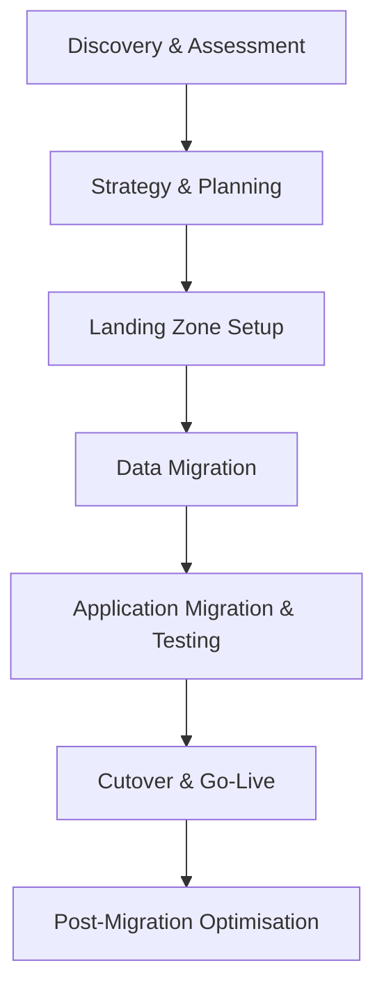

# Migrating to clouds

## 1. Definition
**Cloud migration** is the process of moving an organisation’s digital assets, applications, data, and workloads from on‑premises data centres or legacy hosting environments into a cloud computing infrastructure, or from one cloud provider to another. It involves the systematic transfer of IT resources while ensuring minimal disruption to business operations, preserving data integrity, and optimising the target environment for performance, cost, and security. Cloud migration is not a single event but a structured lifecycle comprising assessment, planning, execution, validation, and ongoing optimisation.

---

## 2. Concept Explanation
Cloud migration transforms how organisations consume and manage IT resources.  
- **Basic level**: Think of a company that currently runs its website, customer database, and internal email on physical servers located in its office basement. The migration project moves those services from the basement servers to virtual machines in a public cloud (e.g., AWS, Azure, GCP). Users continue to access the same services, but the hardware is no longer the company’s responsibility.  
- **Intermediate level**: Migration is rarely a simple “lift and shift.” Organisations must map existing dependencies, assess the suitability of each application for the cloud, choose an appropriate migration strategy (rehost, replatform, refactor, etc.), and address networking, security, and compliance requirements. Data must be securely transferred—often via dedicated connections or sneakernet bulk‑transfer appliances—and synchronised with live systems before a final cutover.  
- **Advanced level**: At an enterprise scale, cloud migration is a multi‑wave, multi‑team programme. It involves a Cloud Migration Factory model with automated discovery tools (AWS Application Discovery Service, Azure Migrate), portfolio rationalisation, total cost of ownership (TCO) analysis, and a detailed runbook of migration waves. The target architecture is designed for native cloud services, making use of managed databases, containers, and serverless technologies. Post‑migration, continuous optimisation (FinOps) ensures the organisation achieves the intended benefits and does not simply recreate a static on‑premises environment in the cloud. Hybrid and multi‑cloud strategies may be employed, where some legacy systems remain on‑premises while others move fully. The migration process follows structured frameworks like the AWS Migration Acceleration Program (MAP) or the Cloud Adoption Framework (CAF).

---

## 3. Key Characteristics / Features
- **Structured and phased approach**: Successful migration follows a well‑defined methodology — from discovery and assessment, through planning and mobility, to validation and cutover — rather than an ad‑hoc “rip‑and‑replace”.
- **Portfolio rationalisation**: Before migrating, every application is evaluated against business value, technical complexity, and compliance needs. Applications may be retired, retained on‑premises, replaced with SaaS, or selected for cloud migration.
- **Data gravity awareness**: Large datasets have “gravity,” meaning that moving terabytes or petabytes of data is non‑trivial. Migration strategies incorporate bulk data transfer mechanisms (AWS Snowball, Azure Data Box) and incremental syncs.
- **Dependency mapping**: Application dependencies—databases, message queues, shared file systems, DNS, internal APIs—must be discovered and maintained. Failing to account for a hidden dependency can cause outages post‑cutover.
- **Downtime minimisation**: Techniques such as live replication, blue‑green deployments, and DNS weight‑based traffic shifting enable near‑zero downtime migrations, which is critical for business‑critical systems.
- **Security and compliance continuity**: Security controls, encryption, identity management, and compliance certifications must be reconstituted or enhanced in the target environment. The migration must not introduce security gaps.
- **Cost‑benefit transparency**: Migration includes a business case with detailed TCO comparison, factoring in both short‑term migration expenses and long‑term operational savings. Cloud providers offer cost calculators and incentives to aid decision‑making.
- **Scalable execution model**: For large portfolios, enterprises use a factory approach—standardised templates, automated migration tools, and parallel workstreams—to migrate hundreds of applications rapidly and consistently.

---

## 4. Types / Classification (The 7 Rs of Migration Strategy)
1. **Retire**  
   Applications that are obsolete, unused, or no longer deliver business value are decommissioned without being moved to the cloud. This reduces the migration scope and saves licensing costs.

2. **Retain (Revisit)**  
   Certain applications cannot be migrated immediately due to regulatory, technical, or dependency reasons. They remain on‑premises or in the current hosting environment and are revisited at a later stage.

3. **Rehost (Lift and Shift)**  
   The application and its data are moved as‑is to cloud infrastructure (e.g., from a physical server to a cloud VM) with no or minimal code changes. This is the fastest migration path and often the first step before modernisation.

4. **Replatform (Lift, Tinker, and Shift)**  
   A few cloud‑optimised adjustments are made without altering the core architecture—for example, migrating a self‑managed database to a managed cloud database service (e.g., moving from MySQL on a VM to Amazon RDS for MySQL). This brings operational efficiency without major development effort.

5. **Refactor / Re‑architect**  
   The application is significantly redesigned to be cloud‑native, leveraging services like microservices, containers, serverless functions, and auto‑scaling. This is the most expensive and time‑consuming option but yields the greatest agility and cost optimization.

6. **Repurchase (Replace)**  
   The existing application is replaced entirely with a cloud‑based SaaS solution (e.g., shifting from an on‑premises CRM to Salesforce). The migration here is the data and user adoption, not the application code.

7. **Relocate**  
   Moving entire virtualised server clusters from on‑premises VMware environments to a cloud‑hosted VMware service (e.g., VMware Cloud on AWS) without needing to reconfigure or re‑platform the operating system or applications.

---

## 5. Working / Mechanism (Typical Migration Process)
1. **Phase 1 – Discovery and Assessment**  
   Use automated tools to inventory all servers, applications, and dependencies. Analyse performance metrics, cost data, and compliance requirements. Prioritise applications based on business impact and migration complexity.

2. **Phase 2 – Strategy and Planning**  
   For each application, select the appropriate migration “R” (Rehost, Replatform, Refactor, etc.). Design the target cloud architecture (accounts, networking, identity, security). Create a detailed migration runbook, a schedule of waves, and a rollback plan.

3. **Phase 3 – Foundation (Landing Zone) Setup**  
   Provision the cloud foundation: create accounts/subscriptions, configure VPCs/VNETs, set up connectivity (VPN or Direct Connect/ExpressRoute), deploy shared security services (firewalls, logging, IAM), and enable compliance guardrails.

4. **Phase 4 – Data Migration**  
   Transfer initial data volumes using bulk appliances or high‑speed dedicated links. Set up continuous replication (e.g., database log shipping, storage sync) so the cloud environment stays up‑to‑date until cutover.

5. **Phase 5 – Application Migration and Testing**  
   Build the target infrastructure (servers, databases, load balancers) according to the selected strategy. Deploy the application (lift‑and‑shift VMs, container images, or refactored code). Conduct functional testing, performance testing, and security validation in an isolated environment.

6. **Phase 6 – Cutover (Go‑Live)**  
   Perform final data sync, switch traffic from the on‑premises environment to the cloud using DNS changes or load balancer routing, and decommission the old resources after a monitoring period. A rollback plan remains active until the migration is declared stable.

7. **Phase 7 – Post‑Migration Optimisation**  
   Monitor application performance, right‑size over‑provisioned resources, delete orphaned snapshots and volumes, implement auto‑scaling, and continuously refine the architecture. This phase also includes training operational teams for cloud‑native management.

---

## 6. Diagram

---

## 7. Mathematical Formulation
A simplified Total Cost of Ownership (TCO) comparison over time:

$$
\text{Net Savings} = \sum_{t=1}^{N} \left( C_{\text{on-prem},t} - C_{\text{cloud},t} \right) - C_{\text{migration}}
$$

Where:  
- $N$ = Number of years for the analysis.  
- $C_{\text{on-prem},t}$ = Total cost of running workloads on‑premises in year $t$ (hardware, power, cooling, licensing, staff).  
- $C_{\text{cloud},t}$ = Total cloud cost in year $t$ (compute, storage, network, management).  
- $C_{\text{migration}}$ = One‑time migration effort cost (tools, labour, data transfer, training).  

A positive net savings justifies the migration; a negative value indicates that cloud adoption may not be financially beneficial in the analysed timeframe.

---

## 8. Example
**A mid‑sized e‑commerce company** running its online store on 15 physical servers in a co‑location facility decides to migrate to AWS.  
- **Discovery**: They identify 15 servers hosting the website (Apache), product database (MySQL), payment processing (a Java application), and internal analytics.  
- **Strategy**: The website and payment app are suitable for **Rehost** (lift to EC2), but the MySQL database is **Replatformed** to Amazon RDS for MySQL to offload backups and patching. The analytics workload is rewritten as a **Refactor** project using AWS Lambda and S3.  
- **Execution**: They set up a Landing Zone with VPC, VPN, and IAM roles. Data is synced using AWS Database Migration Service (DMS) for MySQL, while static assets are copied to S3. After testing, a final DNS switch redirects traffic to the cloud.  
- **Result**: The company decommissions its co‑lo racks after 3 months. Its running costs drop by 30% because it can scale down during off‑peak hours. The managed database service reduces DBA effort by 10 hours per week.

---

## 9. Analogy
**Moving from a self‑built house to a managed apartment complex.**  
- Your self‑built house represents the on‑premises data centre: you manage every pipe, the roof, and the landscaping. Moving to an apartment (cloud) means you pack your belongings (data and applications) into boxes and transport them.  
- You may move your furniture exactly as is (Rehost), buy new furniture that fits better in the apartment layout (Replatform), or completely redesign your living style to match the apartment’s amenities (Refactor).  
- The apartment complex provides security, maintenance, and shared infrastructure (like a swimming pool representing cloud services), but you remain responsible for your own apartment’s interior and valuables.

---

## 10. Comparison (Before Migration vs After Migration)

| Feature                     | Before Migration (On‑Premises)                            | After Migration (Cloud)                                      |
|-----------------------------|-----------------------------------------------------------|--------------------------------------------------------------|
| Infrastructure ownership    | Capital‑intensive hardware purchase and maintenance       | No hardware ownership; pay‑as‑you‑go virtual resources        |
| Scalability                 | Limited by physical server capacity; long procurement    | Rapid elasticity; scale up/down in minutes                   |
| Disaster recovery           | Requires secondary physical site; expensive              | Multi‑AZ, multi‑region DR built into platform                |
| Operations model            | In‑house data centre team; manual patching               | Shared responsibility; many tasks are provider‑managed        |
| Cost model                  | Fixed CAPEX; depreciation over years                     | Variable OPEX; charge per consumed resource                  |
| Global reach                | Single geographical point of presence                    | Global edge network; low‑latency access worldwide             |
| Innovation speed            | Slow, due to hardware lead times and risk‑averse change  | Fast experimentation; failure can be cost‑free if resource is terminated |

---

## 11. Advantages
- **Reduced total cost of ownership**: Eliminates physical hardware refreshes, reduces data centre footprint, and converts fixed costs to variable costs.
- **Improved agility and speed to market**: Development teams can provision infrastructure in minutes and release features faster, gaining a competitive edge.
- **Built‑in disaster recovery and high availability**: Cloud regions offer multiple availability zones and backup services that are far cheaper than a self‑managed secondary site.
- **Access to advanced cloud‑native services**: Migrating opens the door to AI/ML, serverless, managed container orchestration, and big data services that would be difficult to deploy on‑premises.
- **Enhanced security posture**: Cloud providers invest heavily in physical security, encryption, and compliance certifications, which many SMEs cannot afford independently.
- **Globalisation made easy**: Deploying an application in a new region is a configuration exercise, not a new data centre construction project.
- **Energy and sustainability efficiency**: Large cloud data centres achieve better PUE ratings than typical enterprise server rooms, reducing carbon footprint.

---

## 12. Disadvantages / Limitations
- **Migration complexity and effort**: Migrating large, tightly‑coupled monolithic applications with undocumented dependencies is extremely challenging and may take years.
- **Downtime risk during cutover**: Without meticulous planning, the final switch can result in service outages, data loss, or transaction inconsistencies.
- **Temporary cost spike**: The migration period incurs dual‑run costs (maintaining both old and new environments) plus tooling and consultancy fees.
- **Compatibility issues**: Legacy operating systems, proprietary hardware, and software with strict licensing constraints may not be supported in the cloud.
- **Skills gap**: The organisation’s IT staff may lack cloud expertise, requiring intensive training or hiring, which adds to the migration overhead.
- **Vendor lock‑in**: Heavy adoption of proprietary cloud services makes future migration to another provider difficult, though multi‑cloud strategies can mitigate this.
- **Data residency and compliance hurdles**: Regulations may restrict where data can be stored; the chosen cloud region must satisfy legal requirements, potentially limiting provider options.

---

## 13. Important Points / Exam Notes
- Cloud migration is the process of moving workloads from **on‑premises to cloud** or between clouds.
- The **7 Rs** migration strategies: Retire, Retain, Rehost, Replatform, Refactor, Repurchase, Relocate.
- **Lift and Shift (Rehost)** is the fastest but provides the least benefit; **Refactor** gives maximal benefit but is the most resource‑intensive.
- Migration follows a structured **lifecycle**: Assess → Plan → Migrate → Validate → Optimise.
- A **Landing Zone** is a pre‑configured, secure cloud foundation ready to receive workloads.
- Tools like AWS **Application Discovery Service**, **Azure Migrate**, and **Google Cloud Migrate for Compute Engine** automate discovery and migration.
- Data transfer options: online (VPN, Direct Connect) and offline (Snowball, Data Box appliances).
- Common cutover strategies: **Blue‑Green** (run both environments, test new one, switch traffic) and **Canary** (gradual traffic shifting).
- **TCO analysis** is essential to justify migration; consider both one‑time migration costs and recurring operational savings.
- Post‑migration **FinOps** ensures continuous cost control, lest the organisation “lift and shift” its bad habits.

---

## 14. Applications / Use Cases
- **Datacentre exit**: An enterprise decides to close its data centre and moves all workloads to the cloud, avoiding a major upcoming hardware refresh.
- **Merger and acquisition integration**: A company acquires another and rapidly migrates the acquired firm’s IT estate onto a common cloud platform to unify operations.
- **Legacy modernisation**: A government agency refactors a 20‑year‑old mainframe application into cloud‑native microservices, improving citizen portal responsiveness.
- **Seasonal workload scaling**: An online retailer migrates its e‑commerce platform to the cloud to handle Black Friday traffic spikes, then scales down costs during the rest of the year.
- **Disaster recovery re‑launch**: A business affected by a natural disaster at its primary site uses pre‑migrated cloud workloads to restore operations within hours.
- **SaaS adoption drive**: An organisation replaces its on‑premises HR and email systems with cloud SaaS (like Workday and Microsoft 365), migrating user data and retiring the old servers.

---

## 15. MCQs

**Q1. Which migration strategy moves an application without any code changes, directly to a cloud virtual machine?**  
A. Refactor  
B. Replatform  
C. Rehost  
D. Repurchase  
**Answer:** C. Rehost

**Q2. The 7 Rs model for cloud migration includes all EXCEPT:**  
A. Retire  
B. Rebuild  
C. Relocate  
D. Repurchase  
**Answer:** B. Rebuild (the 7 Rs are Retire, Retain, Rehost, Replatform, Refactor, Repurchase, Relocate)

**Q3. What is the primary purpose of a “Landing Zone” in a cloud migration?**  
A. To physically ship servers to the cloud provider  
B. To create a secure, scalable, pre‑configured cloud environment for workloads  
C. To store all application code in a single bucket  
D. To replace the need for any migration strategy  
**Answer:** B. To create a secure, scalable, pre‑configured cloud environment for workloads

**Q4. Which data transfer method is most suitable for migrating petabytes of data when the existing internet link is 50 Mbps?**  
A. Continuous online replication  
B. Direct Connect with live sync  
C. Offline bulk transfer using a physical appliance (e.g., AWS Snowball)  
D. FTP over VPN  
**Answer:** C. Offline bulk transfer using a physical appliance (e.g., AWS Snowball)

**Q5. During a cutover, the rollback plan should:**  
A. Be discarded once the cloud environment is live  
B. Remain active until the cloud environment is declared stable  
C. Only be prepared if the application is refactored  
D. Never be needed for cloud migrations  
**Answer:** B. Remain active until the cloud environment is declared stable

**Q6. Which migration strategy offers the greatest long‑term benefits in terms of agility and optimization but requires the most initial effort?**  
A. Rehost  
B. Retain  
C. Refactor / Re‑architect  
D. Retire  
**Answer:** C. Refactor / Re‑architect

**Q7. A company replaces its on‑premises CRM with Salesforce. This is an example of which migration strategy?**  
A. Replatform  
B. Repurchase  
C. Relocate  
D. Rehost  
**Answer:** B. Repurchase

**Q8. What is the main operational risk of continuing to run both the on‑premises and cloud environments during a phased migration?**  
A. No risk, as they are identical  
B. Dual‑run costs and potential data synchronisation inconsistencies  
C. The cloud provider will shut down one environment  
D. Security is improved  
**Answer:** B. Dual‑run costs and potential data synchronisation inconsistencies

**Q9. Which phase of the migration lifecycle typically includes right‑sizing resources and setting up auto‑scaling after go‑live?**  
A. Discovery and Assessment  
B. Cutover  
C. Post‑Migration Optimisation  
D. Data Migration  
**Answer:** C. Post‑Migration Optimisation

**Q10. The formula for net savings in a TCO analysis for cloud migration is:**  
A. Total on‑premises cost + migration cost  
B. (Cloud cost - on‑premises cost) over time  
C. Sum of (on‑premises cost - cloud cost) over years, minus migration cost  
D. Migration cost minus cloud cost  
**Answer:** C. Sum of (on‑premises cost - cloud cost) over years, minus migration cost