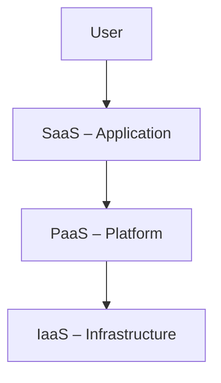

# Cloud_Service_Models

## Video Explanation

* [https://www.youtube.com/watch?v=ae_DKNwK_ms](https://www.youtube.com/watch?v=ae_DKNwK_ms)

## Visual Aids

## 1. Definition
Cloud service models are the different ways cloud providers deliver computing resources to users over the internet. The three main service models are Infrastructure as a Service (IaaS), Platform as a Service (PaaS), and Software as a Service (SaaS). Each model gives a different level of control, flexibility, and management responsibility to the user.

---

## 2. Concept Explanation
Imagine you need a computer to run your business software. You have three options:  
- **Rent the raw parts** (CPU, storage, network) and build everything yourself.  
- **Rent a ready workshop** that already has tools and an operating system, so you only bring your code.  
- **Use a fully finished online software** that you just open in a browser.

These three options represent IaaS, PaaS, and SaaS. Cloud service models are layered: IaaS is the bottom foundation (hardware level), PaaS sits in the middle (adds development tools), and SaaS is the top layer (complete application).  

The model you choose determines how much you build and manage versus what the cloud provider handles. It matters because it affects cost, speed of development, and how much technical skill is needed by your team.

---

## 3. Key Characteristics / Features
- **Different levels of control** – IaaS gives the most control (you manage OS, apps), SaaS gives the least (just settings and data).  
- **Pay‑as‑you‑go pricing** – All models are billed based on usage: per hour, per user, per storage, etc.  
- **On‑demand availability** – Resources can be started immediately without buying hardware.  
- **Scalability** – All models can grow or shrink automatically as demand changes.  
- **Shared responsibility** – Security is divided between the provider (physical infra) and the user (what they manage, like data or patching).  
- **Standardisation** – Services are accessed through common protocols (web browsers, APIs), so no special hardware is needed.

---

## 4. Types / Classification
1. **Infrastructure as a Service (IaaS)**  
   Provides virtual machines, storage, and network components. You rent the computing infrastructure and install your own OS, middleware, and apps.  
   *Example: Amazon EC2, Google Compute Engine.*

2. **Platform as a Service (PaaS)**  
   Provides a ready‑to‑use environment for developing and deploying applications without managing the underlying OS or hardware. You focus on code and data.  
   *Example: Google App Engine, Microsoft Azure App Service.*

3. **Software as a Service (SaaS)**  
   Delivers fully functional software applications over the internet. Users simply log in and use the software; the provider manages everything else.  
   *Example: Gmail, Microsoft 365, Salesforce.*

*(Sometimes a fourth model, Function as a Service (FaaS) or serverless, is mentioned, but the core models are these three.)*

---

## 5. Working / Mechanism
1. **User selects a service model** based on needs (IaaS for full control, PaaS for fast development, SaaS for ready‑made tools).  
2. **Cloud provider exposes an interface** – a web console, API, or command line – through which the user requests resources.  
3. **Provider provisions the required layer:**  
   - For IaaS, it allocates virtual machines, storage, and networking.  
   - For PaaS, it sets up the runtime (like Node.js, Python) and middleware.  
   - For SaaS, it activates the user account in the already running application.  
4. **User accesses and uses the service** via the internet (browser, API, SSH).  
5. **Usage is metered** – compute time, storage consumed, number of users – and the user is billed accordingly.  
6. **The provider handles the rest of the stack** below the boundary of the chosen model (e.g., physical security, hypervisor, OS patches in PaaS).  

---

## 6. Diagram

---

## 7. Mathematical Formulation
N/A

---

## 8. Example
- **IaaS**: A startup rents virtual servers on AWS EC2 to host their custom website. They install Linux, a web server, and their code.  
- **PaaS**: The same startup later switches to Heroku (PaaS); they just push their code, and Heroku runs it. No server setup needed.  
- **SaaS**: The startup uses Google Workspace (Gmail, Drive, Docs) for email and collaboration – just log in via browser.

---

## 9. Analogy
**Pizza as a Service**  
- **IaaS (Take & Bake)**: You buy a raw pizza base and ingredients. You assemble and bake it at home yourself. You control all toppings but need an oven.  
- **PaaS (Pizza Delivery)**: The pizza is cooked and delivered. You just eat at your own table using your own plates and drinks.  
- **SaaS (Dine‑in Restaurant)**: You sit in the restaurant; the pizza is served, you eat, and the staff clean up. You only enjoy the meal.

---

## 10. Comparison (IaaS vs PaaS vs SaaS)

| Feature           | IaaS                                   | PaaS                                     | SaaS                                   |
|-------------------|----------------------------------------|------------------------------------------|----------------------------------------|
| What you get      | Raw virtual hardware                   | Ready development platform               | Complete software                      |
| You manage        | OS, middleware, apps, data             | Application code and data                | Only settings and user data            |
| Provider manages  | Physical infra, network, hypervisor    | OS, runtime, middleware                  | Everything (infra, platform, app)      |
| Technical skill   | High (system admin)                    | Medium (developer)                       | Low (end‑user)                         |
| Flexibility       | Very high                              | Medium                                   | Low (limited by software)              |
| Example           | Amazon EC2                             | Heroku                                   | Gmail                                  |

---

## 11. Advantages
- **Lower capital cost** – No need to buy servers; pay only for what you use.  
- **Faster deployment** – SaaS works instantly; IaaS/PaaS reduce setup days to minutes.  
- **Easy scaling** – Resources can be added or removed automatically as traffic changes.  
- **Focus on core business** – Instead of managing data centers, companies can focus on their apps and customers.  
- **Global reach** – Services are accessible anywhere with an internet connection.  
- **Automatic updates** – In PaaS and SaaS, the provider handles security patches and upgrades.

---

## 12. Disadvantages / Limitations
- **Less control in higher models** – In SaaS, you cannot customize the software deeply; you must adapt to what the provider offers.  
- **Dependency on internet** – All models require a stable internet connection; offline work may be limited.  
- **Vendor lock‑in** – Switching from one provider to another can be difficult due to proprietary formats or APIs.  
- **Security concerns** – Sensitive data is stored on third‑party infrastructure; trusting the provider is essential.  
- **Hidden costs** – Data transfer, extra storage, or premium support can make the bill unpredictable.

---

## 13. Important Points / Exam Notes
- The three basic cloud service models are **IaaS, PaaS, SaaS**.  
- **IaaS** = virtual hardware (VMs, storage, networking).  
- **PaaS** = platform for developers (OS + runtime + tools).  
- **SaaS** = ready‑to‑use software over the web.  
- The “as a Service” suffix means you rent instead of own, and you pay per use.  
- NIST defines these as part of the essential cloud service models.  
- The **shared responsibility model** shifts: more responsibility shifts from user to provider as you go from IaaS → PaaS → SaaS.  
- Common cloud examples: IaaS (AWS EC2), PaaS (Heroku, Google App Engine), SaaS (Gmail, Office 365).  
- FaaS (Function as a Service) like AWS Lambda is sometimes considered an evolution of PaaS.

---

## 14. Applications / Use Cases
- **Startups** use IaaS to avoid buying hardware and scale when their user base grows.  
- **Software development teams** use PaaS for rapid prototyping and to reduce operational overhead.  
- **Small businesses** use SaaS for email, accounting, and CRM without an IT department.  
- **Data analytics platforms** often run on PaaS (e.g., Google BigQuery) because the infrastructure is optimized and managed.  
- **E‑commerce sites** rely on IaaS to handle seasonal traffic spikes with auto‑scaling.

---

## 15. MCQs

**Q1. Which cloud service model provides virtual machines, storage, and networking to users?**  
A. SaaS  
B. PaaS  
C. IaaS  
D. FaaS  
**Answer:** C. IaaS  
**Explanation:** IaaS delivers raw compute, storage, and network resources over the internet.

---

**Q2. Google App Engine is an example of which cloud service model?**  
A. IaaS  
B. PaaS  
C. SaaS  
D. On‑premises software  
**Answer:** B. PaaS  
**Explanation:** It provides a platform to deploy code without managing servers or OS.

---

**Q3. In which service model does the user NOT need to worry about OS updates?**  
A. IaaS  
B. PaaS  
C. IaaS and PaaS  
D. Both PaaS and SaaS  
**Answer:** D. Both PaaS and SaaS  
**Explanation:** In PaaS the provider manages the OS; in SaaS the entire application stack is managed.

---

**Q4. Which of the following is an example of SaaS?**  
A. Amazon EC2  
B. Microsoft Azure Virtual Machines  
C. Salesforce CRM  
D. Kubernetes  
**Answer:** C. Salesforce CRM  
**Explanation:** Salesforce is a cloud‑based CRM software accessed through a web browser.

---

**Q5. In the “Pizza as a Service” analogy, which model represents “Take & Bake”?**  
A. SaaS  
B. PaaS  
C. IaaS  
D. All of the above  
**Answer:** C. IaaS  
**Explanation:** You get the base (infrastructure) but add toppings (OS, apps) yourself.

---

**Q6. What is the main advantage of SaaS for small businesses?**  
A. Full control over the software code  
B. No need to install or maintain software  
C. Ability to configure the underlying hardware  
D. Lower per‑hour compute cost  
**Answer:** B. No need to install or maintain software  
**Explanation:** SaaS applications run in the cloud and are ready to use instantly.

---

**Q7. Which service model offers the highest level of flexibility and control to the consumer?**  
A. SaaS  
B. PaaS  
C. IaaS  
D. All offer equal control  
**Answer:** C. IaaS  
**Explanation:** IaaS gives users full control over the guest OS, middleware, and applications.

---

**Q8. The shared responsibility model in cloud computing means:**  
A. All security is solely the user’s responsibility  
B. The provider and the user share security tasks based on the service model  
C. The cloud provider takes all responsibility  
D. Security is not needed in cloud computing  
**Answer:** B. The provider and the user share security tasks based on the service model  
**Explanation:** In IaaS, the user is responsible for the OS; in SaaS, the provider manages most security.

---

**Q9. Which of the following is NOT a characteristic of cloud service models?**  
A. Pay‑per‑use billing  
B. Long‑term commitment to hardware  
C. Rapid elasticity  
D. Internet‑based access  
**Answer:** B. Long‑term commitment to hardware  
**Explanation:** Cloud models allow you to avoid hardware commitments; you rent virtual resources.

---

**Q10. A developer uploads code to a cloud platform and it automatically runs without worrying about servers. Which model is this?**  
A. IaaS  
B. PaaS  
C. SaaS  
D. Local development  
**Answer:** B. PaaS  
**Explanation:** PaaS abstracts infrastructure, letting developers focus only on application code.