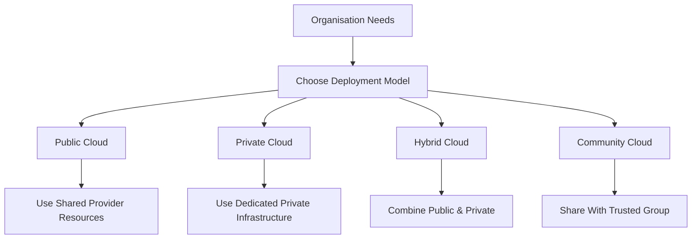

# Cloud_Deployment_Models

## Video Explanation

* [https://www.youtube.com/watch?v=2LaAJq1lB1Q](https://www.youtube.com/watch?v=2LaAJq1lB1Q)

## Visual Aids

## 1. Definition
Cloud deployment models define where the cloud infrastructure is located, who owns and manages it, and who can access the cloud services. It answers the question: “In what type of environment will my cloud resources run?”

## 2. Concept Explanation
The cloud is not one size fits all. Different organisations have different needs — a bank needs strict security, a startup wants lowest cost, a government may want to share with other agencies. Deployment models are simply **ways to set up the cloud** so that it fits the user’s privacy, budget, legal, and performance requirements.

- **Basic idea:** Think of a cloud like a kitchen. You can have your own kitchen at home (private), use a shared kitchen in a hotel (public), or sometimes cook at home and sometimes order food (hybrid). If your whole apartment building shares a kitchen, that is like a community cloud.
- **How it works:** A company picks a model based on data sensitivity, cost, and control needed. The cloud provider then builds the infrastructure according to that model — fully public, dedicated to one company, or a mix.
- **Why it matters:** Choosing the right deployment model ensures that a business meets data laws, gets the right level of security, and doesn’t spend too much.

## 3. Key Characteristics / Features
- **Location, ownership, and management vary:** Public clouds are owned by providers; private clouds are owned by a single organisation or a third party managing it exclusively for them.
- **Access type differs:** Public clouds are open to the general internet; private clouds are behind a company firewall; hybrid models connect both.
- **Cost models vary:** Public cloud uses pay-as-you-go; private cloud needs upfront investment; hybrid blends both.
- **Scalability options:** Public models offer almost infinite scale; private models have limited hardware but greater control.
- **Compliance support:** Different deployment models help meet specific legal and industry rules — for example, a private cloud for sensitive patient data.

## 4. Types / Classification
Cloud deployment models are generally classified into four main types, with a fifth emerging one.

### a) Public Cloud
- The infrastructure is owned by a cloud service provider and shared among many customers.
- Resources are delivered over the internet.
- Examples: AWS, Microsoft Azure, Google Cloud.

### b) Private Cloud
- The cloud infrastructure is used exclusively by a single organisation.
- It may be located on-premises or hosted by a third party, but never shared.
- Offers maximum control and privacy.
- Example: A bank running its own OpenStack-based cloud in its data centre.

### c) Hybrid Cloud
- A combination of public and private clouds, connected by technology that allows data and applications to move between them.
- Provides the best of both: sensitive workloads in private, less critical and scalable jobs in public.
- Example: Online retailer uses private cloud for financial data and public cloud for its website during festive sales.

### d) Community Cloud
- The infrastructure is shared among several organisations that have common concerns (security, compliance, mission).
- It can be managed internally or by a third party.
- Example: A group of government education departments use a shared cloud to host student portals.

### e) Multi-Cloud (additional model)
- Using services from **two or more different public cloud providers** simultaneously.
- It is not about mixing public and private, but about using multiple public clouds to avoid vendor lock-in or leverage best services.
- Example: An app uses AWS for computing and Google Cloud for machine learning.

## 5. Working / Mechanism
Here is how a company selects and uses a deployment model step by step:

1. **Assess Needs:** The IT team lists requirements — data security level, budget, expected user count, compliance rules.
2. **Evaluate Models:** They compare public, private, hybrid, and community models against these needs.
3. **Select the Model:** Decision is made. A startup might pick public cloud; a hospital private; a retail chain hybrid.
4. **Procure and Set Up:**  
   - For public: Sign up with a provider, start using services via the internet.  
   - For private: Buy hardware and install cloud software (like VMware or OpenStack), or rent a dedicated private cloud from a provider.  
   - For hybrid: Use a VPN or dedicated link to connect the private and public environments securely.
5. **Deploy Applications:** Resources are launched in the chosen environment (public, private, or both).
6. **Manage & Monitor:** Ongoing monitoring, scaling, and security management.
7. **Adjust as Needed:** Over time, the company may shift more to public or add a second public provider (multi-cloud).

## 6. Diagram

## 7. Mathematical Formulation
A simple cost comparison formula helps decide between public and private:

$$
TCO = \text{Upfront Cost} + (\text{Monthly OpEx} \times \text{Months})
$$

Where:  
- **TCO** = Total Cost of Ownership over a period  
- **Upfront Cost** = Hardware + software licences (very high for private, zero for public)  
- **Monthly OpEx** = Monthly maintenance, electricity, internet, or cloud bills (lower for private hardware over time, but public cloud bills scale with usage)

**General rule:**  
- Public cloud is cheaper for short-term or variable workloads (low upfront).  
- Private cloud may become cheaper for very long-term, stable workloads.

## 8. Example
- **Public Cloud:** A food delivery app uses AWS to run its customer app. During lunch offers, it automatically scales to handle double traffic and pays only for the extra hours.
- **Private Cloud:** A defence agency uses a private cloud built inside its secure facility to run classified simulations. No internet link is allowed.
- **Hybrid Cloud:** An insurance company keeps policyholder data in a private cloud for regulation, but uses a public cloud to develop and test new mobile applications.
- **Community Cloud:** Several universities jointly build a cloud platform to host shared research databases and library management systems.

## 9. Analogy
**Housing choices:**
- **Public Cloud** = Renting an apartment in a large building. You share the gym and pool, pay monthly, move out anytime, but can't break walls.
- **Private Cloud** = Owning your own house. You have full privacy, can modify everything, but maintenance and upfront cost are high.
- **Hybrid Cloud** = Living in your house but using a rented garage across the street when you need extra parking. Both are connected by a path (network).
- **Community Cloud** = A housing cooperative where a few families together own a building and share common areas and expenses.

## 10. Comparison

| Feature | Public Cloud | Private Cloud | Hybrid Cloud | Community Cloud |
|--------|-------------|---------------|--------------|-----------------|
| Owner | Cloud provider | Single organisation | Mix of public & private | Shared group |
| Cost | Pay-per-use, no upfront | High upfront, lower ongoing | Both models combined | Shared investment |
| Security & control | Moderate, provider handles | Very high, organisation controls | Segregated by workload | High, shared between members |
| Scalability | Highest, almost unlimited | Limited by hardware | Scalable for public part | Moderate |
| Example | Google Drive for personal files | Hospital patient records system | Retail website + secure payment | Government education portal |

## 11. Advantages
- **Right fit for every need:** Deployment models allow businesses to match their exact budget, security, and legal requirements.
- **Data sovereignty compliance:** Private and community models help keep sensitive data within specific geographic or legal boundaries.
- **Cost flexibility:** Public cloud lowers entry barrier; hybrid allows costly private only for critical parts.
- **Gradual adoption:** Hybrid model lets a company move to cloud step by step, not all at once.
- **Innovation access with safety:** Multi-cloud ensures using the best services from different providers without being locked into one.
- **Resource sharing in community model:** Organisations with common goals share costs and expertise, benefiting all.

## 12. Disadvantages / Limitations
- **Public cloud:** Less control, data location may be abroad, internet dependency.
- **Private cloud:** Expensive to build and maintain, underutilised capacity at low demand, needs skilled staff.
- **Hybrid cloud:** Complex to integrate, manage, and secure consistently across environments.
- **Community cloud:** Decision-making among multiple parties can be slow; limited availability of such offerings.
- **Vendor lock-in risk in multi-cloud:** While using many clouds reduces lock-in, the complexity of managing different tools can become a new burden.
- **Hidden costs in hybrid/multi:** Data transfer between private and public, or between two public clouds, can be expensive.

## 13. Important Points / Exam Notes
- Four main deployment models: **Public, Private, Hybrid, Community**. (Multi-cloud is an extension of public cloud usage.)
- **Public cloud** is the most widely used — anyone can access.
- **Private cloud** gives highest control, used in banking, defence.
- **Hybrid cloud** is the most common enterprise strategy — 80% of large companies use it.
- **Community cloud** is least common, for specific joint ventures or government consortiums.
- The choice depends on **security, cost, legal compliance, and performance**.
- NIST defines these models; they are as important as the service models (IaaS, PaaS, SaaS).
- **Cloud bursting** is a hybrid technique where private cloud overflows peak loads to public cloud.

## 14. Applications / Use Cases
- **Startup with no capital:** Public cloud to launch MVP.
- **National tax department:** Private cloud to process taxpayer data securely.
- **E-commerce company during Diwali sale:** Hybrid – private for permanent transaction records, public cloud for temporary web server spikes.
- **Regional healthcare network:** Community cloud to share patient records among trusted hospitals while meeting health data protection laws.
- **Large enterprise avoiding single provider:** Multi-cloud using AWS for hosting, Google Cloud for AI analytics, and Microsoft Azure for Office 365 integration.

## 15. MCQs

**Q1. Which cloud deployment model is owned and operated by a third-party provider and shared among multiple tenants?**  
A. Private cloud  
B. Community cloud  
C. Public cloud  
D. Hybrid cloud  
**Answer:** C  
**Explanation:** Public cloud is open for public use and resources are shared among many customers.

**Q2. A bank wanting full control over its data and infrastructure for compliance reasons should choose:**  
A. Public cloud  
B. Private cloud  
C. Community cloud  
D. Multi-cloud  
**Answer:** B  
**Explanation:** Private cloud offers exclusive use and maximum control, ideal for strict regulatory environments.

**Q3. Hybrid cloud is best described as:**  
A. Using two public clouds together  
B. A cloud exclusively for a community  
C. Mixing public and private cloud with connectivity between them  
D. An open-source private cloud  
**Answer:** C  
**Explanation:** Hybrid cloud combines public and private infrastructure, allowing data and apps to move between them.

**Q4. In a community cloud, the infrastructure is shared by:**  
A. The general public  
B. A single company  
C. Organisations with similar interests and requirements  
D. Any user who pays  
**Answer:** C  
**Explanation:** Community cloud serves a specific group that has shared concerns like security or mission.

**Q5. Which model provides the highest scalability instantly?**  
A. Private cloud  
B. Community cloud  
C. Public cloud  
D. Any on-premises setup  
**Answer:** C  
**Explanation:** Public clouds have massive resource pools and auto-scaling, offering near-infinite scalability on demand.

**Q6. “Cloud bursting” is a technique associated with which deployment model?**  
A. Public cloud  
B. Community cloud  
C. Multi-cloud  
D. Hybrid cloud  
**Answer:** D  
**Explanation:** Cloud bursting runs applications in private cloud and bursts into public cloud during peak demand, which is a hybrid cloud feature.

**Q7. Which is a disadvantage of the private cloud model?**  
A. Low security  
B. High upfront cost and maintenance  
C. Shared resources with strangers  
D. No internet access possible  
**Answer:** B  
**Explanation:** Private cloud requires purchasing hardware and skilled staff, making it expensive to set up and run.

**Q8. Using AWS for computing and Google Cloud for AI/ML is an example of:**  
A. Hybrid cloud  
B. Community cloud  
C. Multi-cloud  
D. Private cloud  
**Answer:** C  
**Explanation:** Multi-cloud means using services from multiple public cloud providers simultaneously.

**Q9. Which deployment model is often used by government departments of different states to share a common e-governance platform?**  
A. Public cloud  
B. Private cloud  
C. Community cloud  
D. Personal cloud  
**Answer:** C  
**Explanation:** Community cloud is perfect for governments with similar needs to share costs and resources securely.

**Q10. The main benefit of a hybrid cloud over a pure public cloud is:**  
A. Easier to use  
B. Better ability to keep sensitive data in a private part while using public for general tasks  
C. Completely free of cost  
D. No internet needed  
**Answer:** B  
**Explanation:** Hybrid lets you separate sensitive workloads onto a private segment while leveraging public cloud for less critical scaling.