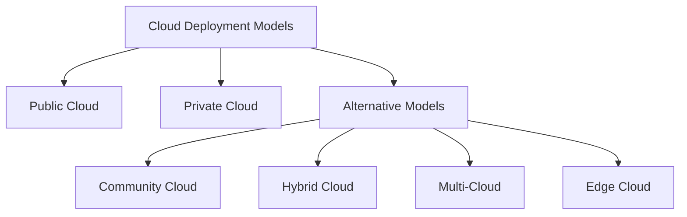

# Alternative_Deployment_models

## Video Explanation

* [https://www.youtube.com/watch?v=mxT233EdY5c](https://www.youtube.com/watch?v=mxT233EdY5c)

## Visual Aids

## 1. Definition
Alternative deployment models are different ways of setting up and using cloud infrastructure beyond the basic public and private clouds. They include community cloud, hybrid cloud, multi‑cloud, distributed cloud, and edge cloud. Each model changes who owns, shares, and accesses the cloud resources.

## 2. Concept Explanation
- **Basic idea:** While public cloud is shared by many customers and private cloud is used by only one organisation, alternative models combine, split, or extend cloud infrastructure in new ways. They let organisations keep sensitive data on‑premises while using public cloud for other tasks, or share a cloud with partners who have the same security needs.
- **How it works:** Alternative deployment models connect different cloud environments using standard technology. For example, a hybrid cloud joins a private data centre with a public cloud so applications can move between them. Multi‑cloud uses services from two or more separate public cloud providers. Community cloud shares infrastructure among a group of similar organisations. Edge cloud places small cloud data centres near users to reduce delay.
- **Why it matters:** No single cloud model fits all needs. Alternative models give more choices for security, cost, performance, and compliance. They solve real‑world problems like strict data laws or the need for ultra‑fast response.

## 3. Key Characteristics / Features
- **Shared or combined ownership:** Some models are shared by a specific group (community), others connect privately‑owned and public‑owned cloud (hybrid).
- **Workload mobility:** Hybrid and multi‑cloud allow applications and data to move between different cloud environments easily.
- **Geographical distribution:** Edge and distributed clouds place computing power closer to the user, reducing network lag.
- **Compliance and security tailoring:** Community clouds meet the exact rules of a particular industry, like banking or healthcare.
- **Vendor independence:** Multi‑cloud avoids locking into a single provider by using services from many different vendors.
- **Flexible resource placement:** Organisations can decide exactly where data will be stored and processed, which is important for legal reasons.

## 4. Types / Classification
- **Community cloud:** Infrastructure is shared by several organisations that have common concerns (same mission, security rules, or compliance needs). A group of hospitals sharing a health‑records cloud is one example.
- **Hybrid cloud:** A mix of private and public cloud working together. For example, a company keeps sensitive customer data on its private servers but uses the public cloud for web hosting and big data analysis.
- **Multi‑cloud:** Using cloud services from multiple public providers at the same time, like using AWS for storage and Google Cloud for machine learning. This avoids depending on a single provider.
- **Distributed cloud:** A public cloud service that runs in different physical locations but the management stays with one provider. It brings cloud servers to customer‑chosen sites while keeping control centralised.
- **Edge cloud:** Small cloud data centres placed very close to the users or devices, like in a factory or at a cell tower. It processes data instantly without sending it to a far‑away central cloud.

## 5. Working / Mechanism
1. **Choose the right model:** The organisation selects the deployment model based on its security, latency, and cost needs.
2. **Set up connectivity:** Virtual private networks (VPNs), dedicated links, or the internet connect the different cloud environments safely.
3. **Deploy management tools:** A single dashboard or automation tool controls resources across all clouds (in hybrid and multi‑cloud).
4. **Distribute workloads:** Applications are split: sensitive parts stay in private/community clouds, less‑sensitive parts run in public clouds.
5. **Data and traffic routing:** Smart routing sends user requests to the nearest edge cloud or the best‑performing provider automatically.
6. **Monitoring and scaling:** The system watches performance and security. If one cloud gets busy, it shifts the load to another cloud (cloud bursting in hybrid model).

## 6. Diagram (MANDATORY)

## 7. Mathematical Formulation (if applicable)
Not applicable.

## 8. Example
A bank uses a **hybrid cloud**. Its private data centre handles daily transaction processing to meet strict financial rules. During peak season, when the mobile app gets heavy traffic, the public cloud automatically adds temporary servers to handle the load. All data synchronises securely. A global video game company uses **edge cloud**: it places small cloud servers in cities around the world so players get response in milliseconds, instead of waiting for data to travel to a central cloud far away.

## 9. Analogy
Think of a student who learns from many sources. The school library (private cloud) is only for that school's students. The public library (public cloud) is open to everyone. A study group of science students from different schools sharing one special laboratory is like a **community cloud**. Using both the school library and the public library together to finish a project is a **hybrid cloud**. Taking courses from two different coaching centres at once is **multi‑cloud**. And putting a small bookshelf in every classroom so students can grab books instantly is like **edge cloud**.

## 10. Comparison (if needed)

| Feature | Public Cloud | Community Cloud | Hybrid Cloud |
|--------|-------------|-----------------|--------------|
| Who uses it | Everyone (general public) | A specific group of organisations with shared needs | One organisation using both private and public clouds |
| Ownership | Third‑party provider | Shared by the community or a third party | Mix of private and provider |
| Cost | Lowest per user | Shared cost among members | Combines fixed private cost with pay‑per‑use public cost |
| Security control | Provider sets basic security | Group sets special security rules together | Organisation keeps tight control on sensitive part |

## 11. Advantages
- **Better security and compliance:** Community and hybrid clouds let you follow strict rules while still using affordable public cloud resources.
- **No vendor lock‑in:** Multi‑cloud keeps you from depending on a single provider, so you can always switch or spread risks.
- **Reduced delays:** Edge and distributed clouds put processing near the user, making apps super‑fast.
- **Cost‑optimised scaling:** Hybrid cloud lets you pay for extra power only when you need it, keeping base costs low with private resources.
- **Flexible data location:** You can store data in a specific country to obey local laws by choosing exactly where the cloud hardware sits.

## 12. Disadvantages / Limitations
- **Complex to manage:** Hybrid and multi‑cloud need advanced tools and skills to keep everything working together smoothly.
- **Higher cost if not planned well:** Running multiple clouds can become expensive if workloads are not carefully placed and monitored.
- **Security gaps:** Connecting different clouds increases the number of points an attacker could target if not secured properly.
- **Limited availability:** Community clouds may have fewer service regions and features compared to large public clouds.
- **Data transfer delays:** Moving large amounts of data between clouds (in hybrid and multi‑cloud) can be slow and costly.

## 13. Important Points / Exam Notes
- Alternative deployment models include **community, hybrid, multi‑cloud, distributed cloud, and edge cloud**.
- Community cloud is shared by organisations with **common interests**, like all universities in a state.
- Hybrid cloud always contains at least **one private cloud and one public cloud** connected together.
- Multi‑cloud uses **multiple public cloud providers**, not necessarily a private cloud.
- Edge cloud brings computing **closer to the user** to reduce latency.
- Hybrid cloud is often used for **cloud bursting**: when private resources are full, extra load goes to the public cloud automatically.
- Distributed cloud is an **extension of public cloud** to customer‑chosen locations, managed by one provider.

## 14. Applications / Use Cases
- **Healthcare community cloud:** Several hospitals share a cloud to store and analyse patient data while meeting health data protection laws.
- **E‑commerce hybrid cloud:** An online store keeps its product catalogue and payment system on a secure private cloud, but uses the public cloud for product recommendations and sales analytics.
- **Global gaming with edge cloud:** Game servers run on edge nodes near players on each continent to give a lag‑free experience.
- **Disaster recovery with multi‑cloud:** A company backs up its data to two different public providers. If one provider has an outage, the company can recover from the other.

## 15. MCQs (MANDATORY)
**Q1. What is a community cloud?**  
A. A cloud used by only one person  
B. A cloud shared by organisations with similar needs  
C. A cloud that is completely free  
D. A cloud without internet  
**Answer:** B  
**Explanation:** Community cloud is shared by a group of organisations that have common security or compliance needs.

**Q2. Which deployment model combines a private cloud and a public cloud?**  
A. Multi‑cloud  
B. Edge cloud  
C. Hybrid cloud  
D. Community cloud  
**Answer:** C  
**Explanation:** Hybrid cloud connects at least one private cloud and one public cloud, allowing data to move between them.

**Q3. Multi‑cloud means using services from:**  
A. One cloud provider only  
B. Multiple public cloud providers  
C. A private cloud and a community cloud only  
D. Only edge data centres  
**Answer:** B  
**Explanation:** Multi‑cloud is the use of two or more public cloud providers, like AWS and Azure, simultaneously.

**Q4. The main advantage of edge cloud is:**  
A. Lower cost  
B. Reduced delay (low latency)  
C. Unlimited storage  
D. No need for electricity  
**Answer:** B  
**Explanation:** Edge cloud places computing resources near users, so data travels a short distance and response is fast.

**Q5. Cloud bursting is a feature most associated with which model?**  
A. Community cloud  
B. Edge cloud  
C. Hybrid cloud  
D. Private cloud only  
**Answer:** C  
**Explanation:** In hybrid cloud, when private cloud resources are full, the extra workload “bursts” to the public cloud.

**Q6. Which model is best when a group of banks wants a shared cloud that meets strict financial regulations?**  
A. Public cloud  
B. Multi‑cloud  
C. Community cloud  
D. Edge cloud  
**Answer:** C  
**Explanation:** Community cloud allows the banks to share infrastructure customised to their common compliance rules.

**Q7. One major risk of using a multi‑cloud strategy is:**  
A. Always low cost  
B. Increased management complexity  
C. No internet needed  
D. Data is stored in one location only  
**Answer:** B  
**Explanation:** Managing multiple cloud providers requires more skills and monitoring, making the system harder to handle.

**Q8. Distributed cloud differs from multi‑cloud because distributed cloud is:**  
A. Managed by many unrelated providers  
B. A public cloud extended to multiple locations but managed by one provider  
C. Only for gaming  
D. Only for government use  
**Answer:** B  
**Explanation:** Distributed cloud is essentially a public cloud whose resources are placed in different physical spots while remaining under a single provider’s control.

**Q9. In a hybrid cloud, connecting the private and public clouds requires:**  
A. A dedicated physical mail service  
B. Secure network links like VPNs or direct connections  
C. No connection at all  
D. Only Wi‑Fi  
**Answer:** B  
**Explanation:** Secure connectivity such as VPNs or direct links is needed to connect private and public cloud environments safely.

**Q10. Which statement is true about alternative deployment models?**  
A. They replace public and private clouds completely.  
B. They offer more options for performance, security, and legal compliance.  
C. They never require internet access.  
D. They work only on mobile phones.  
**Answer:** B  
**Explanation:** Alternative models give organisations flexibility to match their specific technical and legal needs.