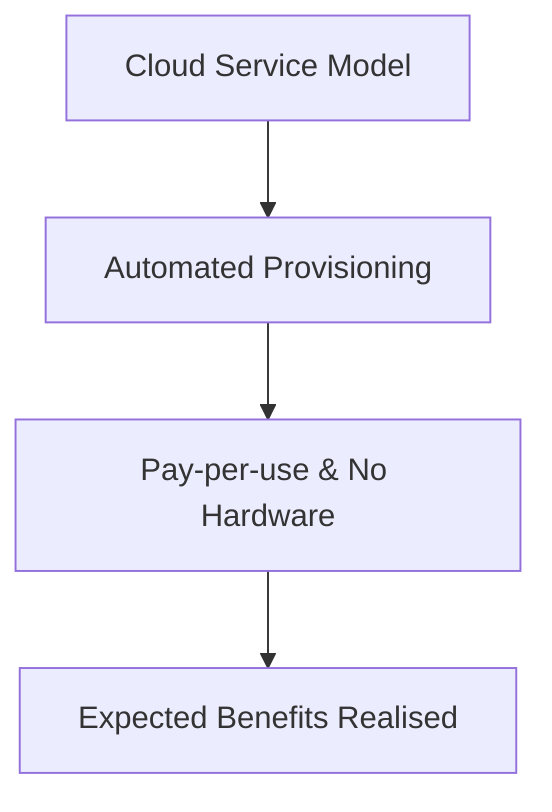

# Expected_benefits_of_the_models

## Video Explanation

* [https://www.youtube.com/watch?v=Z3SYDTMP3ME](https://www.youtube.com/watch?v=Z3SYDTMP3ME)

## Visual Aids

## 1. Definition
Expected benefits of cloud service models refer to the gains an organization hopes to achieve by adopting Infrastructure as a Service (IaaS), Platform as a Service (PaaS), or Software as a Service (SaaS). These include lower costs, greater flexibility, faster delivery of services, reduced IT maintenance, and the ability to focus on core business rather than hardware management.

---

## 2. Concept Explanation
Every cloud model comes with built‑in promises. The basic idea is simple: instead of buying and running your own servers, you rent exactly what you need and let someone else handle the hard parts.  
- **IaaS** promises control without capital expense — you get virtual machines you can customize freely.  
- **PaaS** promises developer speed — you just write the code, the platform runs it.  
- **SaaS** promises instant productivity — the software is already running, you just log in.  

These benefits matter because they help businesses decide which model fits their goals. A startup wanting to avoid hardware might pick IaaS; a development team wanting speed might pick PaaS; a small office needing email and documents might pick SaaS.

---

## 3. Key Characteristics / Features
- **Cost flexibility** – You pay only for what you use, replacing large upfront purchases with monthly operating expenses.  
- **Instant scalability** – Resources can grow or shrink within minutes as demand changes.  
- **Faster go‑live** – Services are ready in minutes, not weeks of ordering and setting up hardware.  
- **Reduced maintenance burden** – The provider maintains physical infrastructure; in PaaS/SaaS also updates and patches are handled.  
- **Global access** – All models are reached over the internet, so teams can work from anywhere.  
- **Focus on innovation** – IT staff can spend time on business‑improving projects instead of keeping servers running.

---

## 4. Types / Classification (Benefits by Cloud Service Model)
1. **Expected benefits of IaaS**  
   - Full control over the operating system and applications.  
   - Ability to run any custom software without restrictions.  
   - No need to buy, store, or replace physical hardware.  
   - Pay‑per‑use for compute, storage, and network.

2. **Expected benefits of PaaS**  
   - Faster application development because the platform provides ready‑to‑use runtime environments.  
   - Automatic management of the OS, middleware, and security patches.  
   - Built‑in development tools, databases, and scaling mechanisms.  
   - Developers can deploy with a single command or push.

3. **Expected benefits of SaaS**  
   - No software installation or maintenance — it’s ready to use.  
   - Accessible from any device with a browser and internet.  
   - Subscription‑based pricing gives predictable monthly costs.  
   - Always up‑to‑date; the provider rolls out new features and security fixes automatically.

---

## 5. Working / Mechanism
1. An organisation identifies the type of workload and chooses the suitable service model (IaaS, PaaS, or SaaS).  
2. The cloud provider exposes a portal or API through which resources can be requested.  
3. Using the portal, the organisation provisions the service — virtual machines (IaaS), application environments (PaaS), or user accounts (SaaS).  
4. The underlying automation instantly allocates the resources so there is no waiting for hardware delivery.  
5. Usage is continuously metered, so the organisation pays only for what is consumed.  
6. The provider manages everything below the model’s responsibility line (hardware for IaaS; hardware + OS for PaaS; entire stack for SaaS).  
7. When more capacity is needed, the organisation can scale out with a few clicks or automatically, realising the expected elasticity.

---

## 6. Diagram

---

## 7. Mathematical Formulation
N/A

---

## 8. Example
A medium‑sized company moves its internal communication system to Microsoft 365 (SaaS).  
- They expect to stop maintaining an on‑premises Exchange server.  
- Employees can access email and files from phones, laptops, and home.  
- The cost becomes a predictable ₹250 per user per month rather than a large upfront server purchase with ongoing electricity and IT staffing costs.  
After migration, the company sees these benefits in practice: less IT workload, always‑on availability, and automatic updates.

---

## 9. Analogy
**Using a fully‑serviced shared kitchen vs. building your own**  
- **IaaS** is like renting an empty commercial kitchen: you bring your own pots, pans, and recipes, and you cook exactly your way. You expect full creative control without spending on building the kitchen.  
- **PaaS** is a kitchen already equipped with ovens, stoves, and utensils; you bring only your recipe and cook. You expect speed and no worry about equipment maintenance.  
- **SaaS** is a restaurant: you just walk in, order your meal, and eat. You expect a ready experience with zero cooking work.

---

## 10. Comparison (Expected Benefits by Model)
| Model | Primary Expected Benefit                |
|-------|-----------------------------------------|
| IaaS  | Full control over software stack without hardware worries. |
| PaaS  | Faster development and deployment with managed platform.   |
| SaaS  | Zero maintenance, ready‑to‑use software, subscription pricing. |

---

## 11. Advantages
- **Lower upfront cost** – No need to buy expensive servers; you rent capacity.  
- **Agility** – Test new ideas quickly without waiting for hardware procurement.  
- **Automatic updates** – In PaaS and SaaS, the latest patches and features are applied without your effort.  
- **Global collaboration** – Cloud services are accessible world‑wide, supporting remote teams.  
- **Better reliability** – Cloud providers offer guaranteed uptime and disaster recovery that’s often better than what a single company can afford.  
- **Energy efficiency** – Large cloud data centres use power more efficiently than small server rooms, helping sustainability goals.

---

## 12. Disadvantages / Limitations
- **Benefit expectations may not match reality** – Without proper configuration, cost can increase instead of decrease.  
- **Internet dependency** – All benefits are lost during an internet outage.  
- **Limited customisation in SaaS** – You must work within the software’s capabilities.  
- **Vendor lock‑in** – Once deeply integrated into a model, switching providers can be hard and expensive.  
- **Security and compliance responsibility** – The organisation is still accountable for its data even if the provider manages the platform.

---

## 13. Important Points / Exam Notes
- The three service models each promise **cost savings, scalability, and agility**, but in different ways.  
- **IaaS** = economic replacement of physical hardware; best when custom control is needed.  
- **PaaS** = developer productivity boost; best for building and deploying apps fast.  
- **SaaS** = finished software delivered as a service; best for off‑the‑shelf business needs.  
- The “expected” benefits must be planned for; simply moving to the cloud does not guarantee automatic gains.  
- The **shared responsibility model** affects which benefits you actually realise — you must still manage your part.  
- Common expected benefits: **CAPEX to OPEX shift**, **elasticity**, **speed**, **global reach**.

---

## 14. Applications / Use Cases
- **Startups** use IaaS to avoid huge hardware investments while keeping the ability to customise their entire system.  
- **Development agencies** adopt PaaS so they can push code and go live in hours, not days.  
- **Small offices** shift to SaaS for email, documents, and accounting to eliminate local server maintenance.  
- **E‑commerce sites** expect the elasticity of IaaS/PaaS to handle festival sale traffic without crashing.  
- **Remote education platforms** use SaaS so students and teachers can connect instantly from any location.

---

## 15. MCQs

**Q1. What is a key expected benefit of using IaaS over on‑premises servers?**  
A. No need to write any application code  
B. Full control over the operating system without buying physical hardware  
C. Free software licenses  
D. Zero security responsibility  
**Answer:** B. Full control over the operating system without buying physical hardware  
**Explanation:** IaaS gives you virtualised infrastructure, so you retain OS‑level control while avoiding hardware purchases.

**Q2. Which cloud service model is primarily expected to accelerate application development by removing server management?**  
A. SaaS  
B. IaaS  
C. PaaS  
D. On‑premises virtualisation  
**Answer:** C. PaaS  
**Explanation:** PaaS provides a ready‑made platform, so developers only bring code and the platform handles everything else.

**Q3. The “pay‑as‑you‑go” cost model helps organisations expect:**  
A. Fixed monthly fees regardless of usage  
B. Lower capital expenditure and cost aligned with actual use  
C. No cost ever  
D. Higher electricity bills  
**Answer:** B. Lower capital expenditure and cost aligned with actual use  
**Explanation:** Pay‑as‑you‑go turns large upfront purchases into variable operational costs.

**Q4. For a company wanting to stop managing email servers completely, which model delivers the expected benefit of zero maintenance?**  
A. IaaS  
B. PaaS  
C. SaaS  
D. All of the above  
**Answer:** C. SaaS  
**Explanation:** SaaS provides fully managed applications like email, where the provider handles everything.

**Q5. Which of the following is an expected benefit common to all three cloud service models?**  
A. Full hardware ownership  
B. Scalability and elasticity  
C. Complete control over the physical data centre  
D. Mandatory 5‑year contract  
**Answer:** B. Scalability and elasticity  
**Explanation:** All cloud models allow resources to scale up and down as needed, which is a core promise.

**Q6. In the kitchen analogy, SaaS is compared to a restaurant because:**  
A. You must bring your own ingredients  
B. You only eat the meal and pay the bill, with no cooking work  
C. You wash the dishes yourself  
D. You manage the ovens  
**Answer:** B. You only eat the meal and pay the bill, with no cooking work  
**Explanation:** SaaS like a restaurant gives a finished product with zero effort from the user.

**Q7. Which of the following is NOT a realistic expected benefit of moving to the cloud?**  
A. Reduced hardware maintenance  
B. Faster deployment  
C. Automatic immunity from all security breaches  
D. Global accessibility  
**Answer:** C. Automatic immunity from all security breaches  
**Explanation:** Security is a shared responsibility; moving to the cloud does not make you automatically immune.

**Q8. Why might a startup choose PaaS over IaaS for a new web application?**  
A. To get full control over the hypervisor  
B. To reduce development time by avoiding OS and server setup  
C. To avoid the internet  
D. To own physical servers  
**Answer:** B. To reduce development time by avoiding OS and server setup  
**Explanation:** PaaS eliminates server management so developers can focus on coding and releasing features quickly.

**Q9. Which of the following best describes the expected financial benefit of cloud models?**  
A. Fixed low price for unlimited resources  
B. Conversion of capital expenses to operational expenses  
C. One‑time payment for lifetime use  
D. No payment ever required  
**Answer:** B. Conversion of capital expenses to operational expenses  
**Explanation:** Cloud models let you pay monthly based on usage instead of large upfront hardware purchases.

**Q10. When an organisation expects “automatic scaling” from a cloud model, it means:**  
A. The provider scales the service without any configuration  
B. The organisation can set rules to add or remove resources based on demand  
C. Everyone must use the same instance size forever  
D. The cloud can never scale beyond the initial size  
**Answer:** B. The organisation can set rules to add or remove resources based on demand  
**Explanation:** Cloud platforms allow you to define auto‑scaling policies so resources match workload automatically.