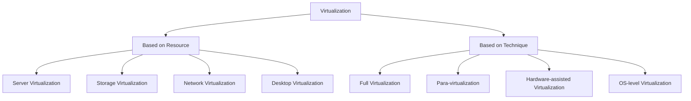

# Characteristics__Taxonomy_of_virtualization

## Video Explanation

* [https://www.youtube.com/watch?v=FZR0rG3HKIk](https://www.youtube.com/watch?v=FZR0rG3HKIk)

## Visual Aids

## 1. Definition

Virtualization is the process of creating a software-based (virtual) version of a computing resource, such as a server, storage device, network, or operating system. The taxonomy of virtualization refers to the systematic classification of virtualization types based on their characteristics, implementation methods, and resource types.

## 2. Concept Explanation

Virtualization allows multiple virtual instances to run on a single physical machine. It works by inserting a thin software layer, called a hypervisor, between the hardware and the operating system. The hypervisor abstracts underlying physical resources and presents them as virtual resources to each virtual machine.

Understanding the taxonomy of virtualization helps students and professionals identify which type best suits a given problem. For example, server virtualization consolidates many servers onto one machine, while desktop virtualization delivers a complete desktop from a central location. By classifying virtualization methods based on what is virtualized, how it is achieved, and the level of abstraction, learners can grasp the subject in an organized way.

## 3. Key Characteristics / Features

- **Abstraction:** Physical hardware details are hidden from the user or application, presenting only a simplified virtual interface.
- **Isolation:** Each virtual machine runs independently. A crash or failure in one VM does not affect others sharing the same physical hardware.
- **Encapsulation:** The entire virtual machine, including its operating system, applications, and data, is stored in a set of files. This makes it easy to move, copy, and back up.
- **Hardware independence:** Virtual machines can run on any compatible physical server without being tied to a specific brand or model.
- **Resource partitioning:** Physical resources like CPU, memory, and storage are divided and allocated logically among multiple VMs.
- **Scalability:** New virtual machines can be created quickly without purchasing additional physical hardware.
- **Efficiency:** Better utilization of physical resources, reducing underused servers and energy consumption.

## 4. Types / Classification

Virtualization can be classified in several ways. The two most common taxonomies are based on **what is virtualized** and on the **technique used**.

### A. Based on the Resource Being Virtualized

- **Server virtualization:** A single physical server is divided into multiple isolated virtual servers, each running its own operating system.
- **Storage virtualization:** Multiple physical storage devices are pooled together to appear as a single logical storage unit.
- **Network virtualization:** Network resources such as switches, routers, and firewalls are combined and presented as software-based virtual networks.
- **Desktop virtualization:** A user's desktop environment is hosted on a central server and delivered remotely to a thin client or personal device.
- **Application virtualization:** Applications are separated from the underlying operating system and run in an isolated environment, avoiding conflicts.

### B. Based on the Implementation Technique

- **Full virtualization:** The hypervisor simulates complete hardware. Guest operating systems run unmodified, thinking they are on real hardware. (Example: VMware ESXi)
- **Para-virtualization:** The guest OS is modified to be aware that it is running in a virtual environment. This improves performance by reducing overhead. (Example: Xen)
- **Hardware-assisted virtualization:** Physical CPU and chipset provide built-in support for virtualization. It simplifies hypervisor design and boosts speed. (Example: Intel VT-x, AMD-V)
- **Operating system–level virtualization (Containerization):** The host OS kernel allows multiple isolated user-space instances (containers) without full OS per instance. (Example: Docker)

## 5. Working / Mechanism

The general working of virtualization involves the following steps:

1. A hypervisor (virtual machine monitor) is installed directly on the physical hardware or on a host operating system.
2. The hypervisor intercepts and manages requests for physical resources such as CPU, memory, and I/O devices.
3. When a virtual machine starts, the hypervisor allocates a dedicated portion of CPU time, memory, and storage to it from the physical pool.
4. The guest operating system inside the VM sends instructions to virtual hardware, which the hypervisor translates into instructions for the real physical hardware.
5. The hypervisor maintains strict isolation so that each VM believes it has complete control of the hardware.
6. In case of multiple VMs, the hypervisor schedules their access to physical resources in a time-shared way, ensuring fair usage.
7. Management tools allow administrators to create, delete, migrate, and monitor virtual machines without disrupting running services.

## 6. Diagram

## 7. Mathematical Formulation

Virtualization can be represented by a simple resource mapping function:

$$
V = f(P)
$$

Where:
- `V` = Virtual resource made available to a virtual machine (e.g., virtual CPU cores, virtual memory)
- `P` = Actual physical resource present in the hardware
- `f` = Hypervisor mapping function that partitions, abstracts, and schedules the physical resource among multiple VMs

For example, a physical server with 8 CPU cores and 32 GB RAM (`P`) might be mapped by the hypervisor (`f`) to create two VMs (`V1`, `V2`), each seeing 4 virtual cores and 12 GB of virtual RAM.

## 8. Example

A university IT department has ten old servers, each running only one application with low CPU usage (around 10%). By using server virtualization, they consolidate all ten applications onto two powerful new servers. Each application runs inside its own virtual machine with dedicated virtual resources, and the two physical servers are utilized at 70% capacity, saving energy, space, and maintenance cost.

## 9. Analogy

Think of a large apartment building. The whole building is the physical server. Each apartment is a virtual machine. The building’s water supply, electricity, and security are the physical resources. The building manager (hypervisor) ensures every apartment gets its share of water and power without interfering with others. If one apartment has a plumbing issue, it does not affect the other apartments.

## 10. Comparison

| Feature | Full Virtualization | Para-virtualization |
|--------|---------------------|----------------------|
| Guest OS modification | No modification needed | Guest OS must be modified |
| Performance | Slightly lower due to hardware emulation overhead | Higher because guest OS communicates directly with hypervisor |
| Hardware support | Can run on any x86 hardware without special CPU extensions | Requires hypervisor-aware kernel but no special CPU features |
| Example | VMware Workstation, VirtualBox (with hardware virtualized) | Xen in para-virtualization mode |

## 11. Advantages

- Better utilization of physical hardware reduces the number of machines and power consumption.
- Faster deployment of new servers and applications, as VMs can be created in minutes.
- Improved disaster recovery because VMs can be easily backed up and moved to other hardware.
- Strong isolation between workloads prevents one faulty application from crashing others.
- Flexibility to run different operating systems on the same physical machine.
- Easier testing and development environments that can be cloned and discarded quickly.

## 12. Disadvantages / Limitations

- Performance overhead exists because the hypervisor layer consumes some CPU and memory for itself.
- A failure of the physical host machine can cause all VMs running on it to go down simultaneously.
- Not all hardware is suitable for virtualization; special devices or legacy components may not work inside a VM.
- Licensing costs for virtualization software and enterprise support can be high.
- Complex management and monitoring require skilled administrators and proper tools.

## 13. Important Points / Exam Notes

- Virtualization is the foundation of cloud computing; it enables resource pooling and multi-tenancy.
- The hypervisor is the core software that creates and manages virtual machines.
- Taxonomy of virtualization helps organize the field into clear categories for study and selection.
- Full virtualization does not require changes in the guest OS, while para-virtualization does.
- Hardware-assisted virtualization uses CPU extensions (Intel VT-x, AMD-V) to improve performance.
- Containers (OS-level virtualization) share the host kernel, making them lighter than full VMs.
- Characteristics like isolation, abstraction, and encapsulation are the pillars of virtualized environments.

## 14. Applications / Use Cases

- **Data center consolidation:** Companies reduce the number of physical servers by running many virtual servers on fewer machines.
- **Cloud computing:** Public cloud providers like AWS, Azure, and Google Cloud use virtualization to offer IaaS services.
- **Software testing:** Developers create isolated VMs to test software in different operating systems and configurations.
- **Legacy application support:** Old applications that require outdated operating systems can be hosted inside a VM on modern hardware.
- **Disaster recovery:** Virtual machines are replicated to a remote site, enabling quick failover during system failures.

## 15. MCQs

**Q1. What is the main software component that enables virtualization?**

A. Guest OS  
B. Hypervisor  
C. Containers  
D. Firmware  
**Answer:** B

**Q2. Which characteristic ensures that a problem in one virtual machine does not affect another?**

A. Abstraction  
B. Encapsulation  
C. Isolation  
D. Partitioning  
**Answer:** C

**Q3. In which type of virtualization does the guest operating system remain unmodified but relies on CPU hardware extensions?**

A. Para-virtualization  
B. OS-level virtualization  
C. Full virtualization  
D. Hardware-assisted virtualization  
**Answer:** D

**Q4. Which virtualization type pools multiple physical storage devices into one logical storage unit?**

A. Server virtualization  
B. Network virtualization  
C. Storage virtualization  
D. Desktop virtualization  
**Answer:** C

**Q5. What is a major advantage of para-virtualization over full virtualization?**

A. No need for a hypervisor  
B. Guest OS does not need any change  
C. Higher performance due to direct communication with hypervisor  
D. Works without any CPU support  
**Answer:** C

**Q6. In the context of containers, which resource is shared among all containers?**

A. User applications  
B. The host kernel  
C. Separate guest kernel  
D. Hypervisor  
**Answer:** B

**Q7. Which of the following is an example of OS-level virtualization?**

A. VMware ESXi  
B. Docker  
C. Xen full virtualization  
D. VirtualBox  
**Answer:** B

**Q8. The ability to package an entire VM into a few files and move it across hosts is due to:**

A. Isolation  
B. Abstraction  
C. Encapsulation  
D. Hardware independence  
**Answer:** C

**Q9. Virtualization helps reduce costs mainly by:**

A. Increasing the number of physical servers  
B. Improving physical resource utilization  
C. Eliminating the need for operating systems  
D. Removing the network layer  
**Answer:** B

**Q10. In a virtualized environment, what is the function of the mapping f in V = f(P)?**

A. To encrypt virtual machine data  
B. To convert physical resources into virtual resources  
C. To remove the hypervisor  
D. To directly assign all physical hardware to one VM  
**Answer:** B