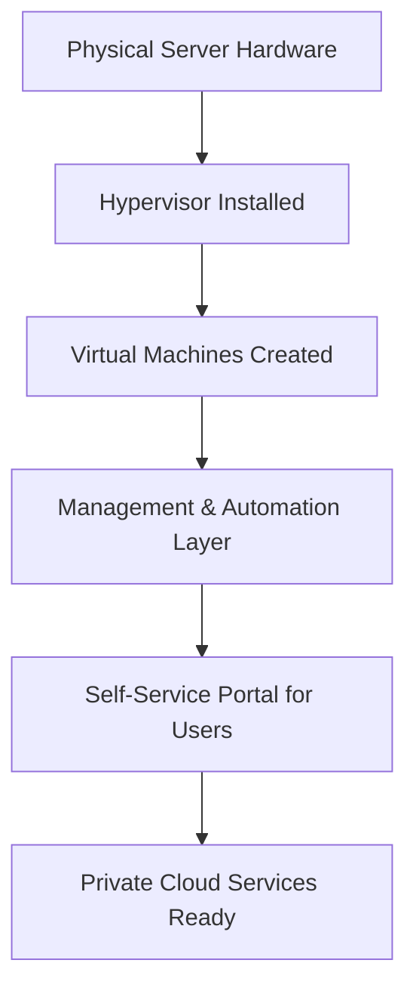

# Virtualization vs Private Cloud

## 1. Definition
**Virtualization** is a technology that creates virtual versions of physical hardware resources like servers, storage, and networks. It allows multiple operating systems and applications to run on a single physical machine.

**Private Cloud** is a cloud computing environment dedicated to a single organization. It uses virtualization and management tools to provide on-demand self-service, resource pooling, and scalability while keeping resources isolated within the organization’s own infrastructure.

## 2. Concept Explanation
Virtualization separates the software from the hardware. It uses a hypervisor to divide one physical server into multiple independent virtual machines (VMs). Each VM has its own operating system and applications, sharing the underlying physical resources efficiently.

A private cloud builds on virtualization by adding automation, self-service portals, and orchestration. It turns a virtualized data center into a cloud-like environment. Users can request and deploy resources without manual intervention from IT staff. The private cloud ensures that all resources remain under the organization's complete control.

Comparing both: Virtualization is the foundation technology; private cloud is a higher-level service model that uses virtualization along with management layers to deliver IT as a service internally.

## 3. Key Characteristics / Features
- **Virtualization:**
  - Creates multiple isolated virtual machines on a single physical server.
  - Reduces hardware costs by improving resource utilization.
  - Enables easy migration and backup of virtual machines.
  - Supports different operating systems on the same hardware.
- **Private Cloud:**
  - Gives users a self-service portal to provision resources quickly.
  - Automates resource allocation and scaling based on demand.
  - Maintains dedicated hardware for a single organization for security and compliance.
  - Provides measured service with monitoring and reporting of resource usage.

## 4. Types / Classification
- **Types of Virtualization:**
  - *Server Virtualization:* Partitioning a physical server into many virtual servers.
  - *Desktop Virtualization:* Running multiple desktop operating systems on a central server.
  - *Network Virtualization:* Combining physical network resources into a software-based virtual network.
  - *Storage Virtualization:* Pooling multiple physical storage devices into a single logical storage unit.
- **Types of Private Cloud:**
  - *On-premise Private Cloud:* The cloud infrastructure is built, managed, and maintained inside the organization’s own data center.
  - *Hosted Private Cloud:* The infrastructure is provided by a third-party provider but dedicated solely to one organization, often with managed services.

## 5. Working / Mechanism
- **How Virtualization Works:**
  1. A hypervisor (like VMware ESXi or KVM) is installed directly on the physical server hardware.
  2. The hypervisor allocates CPU, memory, and storage to create isolated virtual environments.
  3. Each virtual machine operates independently with its own guest operating system and applications.
  4. The hypervisor manages scheduling of hardware resources among all VMs to prevent conflicts.
- **How Private Cloud Uses Virtualization:**
  1. Virtualization pools all physical resources into a flexible virtualized layer.
  2. A cloud management platform (like OpenStack or VMware vRealize) sits on top of this layer.
  3. The platform provides a user interface or API for self-service resource requests.
  4. Automation engines provision and configure VMs, storage, and networking instantly.
  5. Monitoring tools track usage and ensure performance and security policies are met.

## 6. Diagram

## 7. Mathematical Formulation
*(Not applicable for this topic)*

## 8. Example
A bank needs high security for its customer data. It first uses server virtualization to run multiple applications (accounting, loan processing, email) on fewer physical servers. Then, it implements a private cloud using VMware vCloud Suite. Now, the bank’s developers can request new server instances through a portal and get them in minutes, all within the bank’s own secure data center. This speeds up innovation while meeting strict regulatory requirements.

## 9. Analogy
Virtualization is like constructing individual apartments inside a large building. Each apartment is separate and can be used by different tenants, but they all share the same land and main structure.

A private cloud is like turning that apartment building into a fully managed residential complex. Residents (users) can request extra rooms or facilities anytime through a service desk, and the management automatically allocates space and bills them for usage — all inside their own private property.

## 10. Comparison

| Feature | Virtualization | Private Cloud |
|--------|----------|----------|
| Meaning | Technology that creates virtual instances of hardware | Cloud model delivering IT services exclusively to one organization over virtualized infrastructure |
| Scope | Focuses on hardware abstraction | Focuses on service delivery and automation |
| Self-service | Usually manual setup by IT administrators | Users can provision resources on their own through a portal |
| Elasticity | Limited; scaling requires manual VM creation | High; can automatically scale resources up or down as needed |
| Management | Hypervisor and basic VM management tools | Advanced orchestration, billing, and policy-based management |
| Dependency | Standalone technology | Requires virtualization plus cloud management software |

## 11. Advantages
- **Virtualization:**
  - Saves hardware costs by maximizing physical server usage.
  - Improves disaster recovery through VM snapshots and quick migration.
  - Simplifies testing because multiple isolated environments can run on one machine.
  - Increases uptime with features like live migration of running VMs.
- **Private Cloud:**
  - Offers faster service delivery with automated provisioning.
  - Enhances security by keeping all data inside the organization's firewall.
  - Provides better resource tracking and cost control with metered services.
  - Supports compliance requirements in regulated industries.

## 12. Disadvantages / Limitations
- **Virtualization:**
  - Adding too many VMs on one server can degrade performance (over-provisioning risk).
  - Requires a learning curve and specialized skills for effective management.
  - Licensing costs for hypervisors and operating systems can add up.
- **Private Cloud:**
  - High initial investment in cloud management software and skilled personnel.
  - Complexity in integrating automation across all IT environments.
  - May offer less scalability compared to the near-infinite capacity of public clouds.

## 13. Important Points / Exam Notes
- Virtualization is a technology; private cloud is an operational model built on top of virtualization.
- You can have virtualization without a private cloud, but you cannot have a private cloud without virtualization.
- Private cloud adds self-service, automation, and metering to a virtualized environment.
- Virtualization improves hardware utilization; private cloud improves IT service agility and governance.
- Common hypervisors: VMware ESXi, Microsoft Hyper-V, KVM.
- Common private cloud platforms: OpenStack, VMware vCloud, Microsoft Azure Stack.

## 14. Applications / Use Cases
- **Virtualization** is used in server consolidation, software development and testing, legacy application isolation, and creating virtual desktop infrastructure (VDI).
- **Private Cloud** is used by large enterprises to offer internal IaaS/PaaS to departments, by government agencies for secure citizen services, and by financial institutions to meet data sovereignty rules while adopting cloud benefits.

## 15. MCQs

**Q1. What is the main purpose of virtualization?**
A. To connect to the internet  
B. To create multiple virtual machines on a single physical hardware  
C. To replace all hardware with software  
D. To store data in public servers  
**Answer:** B

**Q2. A private cloud can exist without virtualization.**
A. True  
B. False  
**Answer:** B

**Q3. Which component is essential for server virtualization?**
A. Web browser  
B. Hypervisor  
C. Load balancer  
D. Firewall  
**Answer:** B

**Q4. What does a private cloud add to a virtualized environment?**
A. More physical servers  
B. Self-service portal and automation  
C. Only network switches  
D. Public internet access  
**Answer:** B

**Q5. Which type of private cloud is built at the organization’s own location?**
A. Public cloud  
B. Hybrid cloud  
C. On-premise private cloud  
D. Community cloud  
**Answer:** C

**Q6. Which of the following is an advantage of virtualization?**
A. Better hardware utilization  
B. Unlimited free software  
C. No need for electricity  
D. Physical damage protection  
**Answer:** A

**Q7. Which of these is a popular private cloud platform?**
A. Oracle  
B. OpenStack  
C. WhatsApp  
D. Chrome  
**Answer:** B

**Q8. What is a limitation of virtualization?**
A. No support for multiple operating systems  
B. Over-provisioning can degrade performance  
C. It cannot run on new hardware  
D. It requires no license  
**Answer:** B

**Q9. In the apartment analogy, the private cloud represents:**
A. A single room  
B. The land only  
C. A managed residential complex with on-demand services  
D. The construction tools  
**Answer:** C

**Q10. Which of the following correctly distinguishes virtualization from a private cloud?**
A. Virtualization is for large data only; private cloud is for small data  
B. Virtualization focuses on hardware abstraction; private cloud focuses on service delivery and automation  
C. Private cloud does not use any software  
D. Virtualization always requires a public internet connection  
**Answer:** B