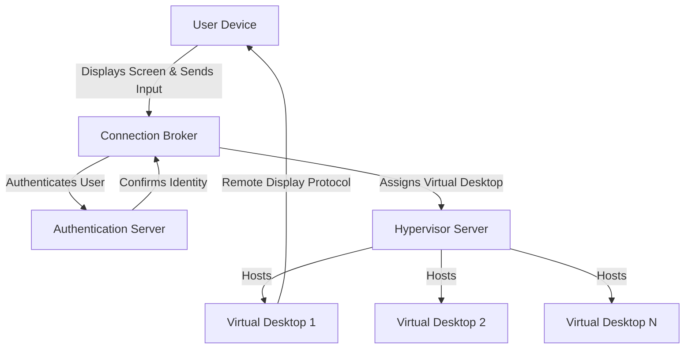

# Desktop_Virtualization

## Video Explanation

* [https://www.youtube.com/watch?v=6Z0mFqz7s6A](https://www.youtube.com/watch?v=6Z0mFqz7s6A)

## Visual Aids

## 1. Definition
Desktop virtualization is a technology that separates a computer's desktop environment from the physical machine. It allows users to access their desktop, operating system, and applications from any device over a network. The actual computing happens on a remote server, while the user sees only the screen output.

## 2. Concept Explanation
Desktop virtualization changes the way we use computers. Instead of installing the operating system and software directly on a local hard disk, everything runs on a central server in a data centre. The user interacts with the desktop through a thin client, a web browser, or a lightweight application.

The basic idea is to host many virtual desktops on a single powerful server using a hypervisor. Each virtual desktop behaves like a separate computer with its own operating system and applications. When a user logs in from any device, the server sends the graphical screen to that device, and the user’s mouse clicks and keyboard strokes go back to the server. This creates the feeling of using a normal desktop, even though the actual processing is remote.

This approach is important because it centralises management. IT teams can update, patch, and secure hundreds of desktops from one place without touching each physical machine. It also improves security because no data is stored on the end device; if a laptop is lost, the company information remains safe on the server.

## 3. Key Characteristics / Features
- **Centralised management:** Administrators can deploy, update, and troubleshoot all virtual desktops from a single control console. This reduces the time and effort needed for maintenance.
- **Device independence:** Users can access their personal desktop from any device, including tablets, thin clients, or home laptops. The experience remains consistent across different hardware.
- **Enhanced security:** All data stays inside the data centre. The end device only displays images, so sensitive files cannot be copied or stolen easily if the device is lost.
- **Resource pooling:** A single physical server can host many virtual desktops, sharing CPU, memory, and storage efficiently. This leads to better hardware utilisation.
- **Isolation:** Each virtual desktop runs independently. If one desktop crashes or gets infected with malware, it does not affect other virtual desktops on the same server.
- **On-demand provisioning:** New desktops can be created and assigned to employees within minutes. This is much faster than buying and setting up physical computers.

## 4. Types / Classification
There are two main types of desktop virtualisation based on how the desktop is delivered and where the operating system runs.

- **Virtual Desktop Infrastructure (VDI):** In VDI, each user gets a dedicated virtual machine running a full operating system like Windows or Linux. The virtual machine is hosted on a hypervisor in a data centre. Users connect to their own VM remotely. This gives complete isolation and a personalised experience, but it needs more storage and processing power per user.
- **Session-based desktop virtualisation (Remote Desktop Services):** Multiple users share a single operating system instance running on a server. Each user has a separate session and can access applications, but they all use the same underlying OS kernel. This is more resource-efficient than VDI but offers less personalisation and isolation. It works well when users need the same set of applications with minimal customisation.

## 5. Working / Mechanism
The process of desktop virtualisation can be explained step by step.

1. A hypervisor is installed on a powerful physical server in the data centre.
2. The hypervisor creates multiple virtual machines, each containing a full operating system (for VDI) or a terminal server OS (for session-based), along with necessary applications.
3. A connection broker is configured to manage user requests. It maintains a list of available desktops and authenticates users.
4. A user opens a client application on his device (thin client, laptop, phone) and enters his credentials.
5. The connection broker verifies the user's identity with an authentication server such as Active Directory.
6. Once authenticated, the broker assigns an available virtual desktop or session to the user and returns the connection details.
7. The client device establishes a remote display protocol connection (like Microsoft RDP, VMware Blast, or Citrix HDX) with the virtual desktop.
8. The virtual desktop processes all instructions and sends only the screen updates as compressed images to the client.
9. The client captures keyboard and mouse inputs and sends them back to the virtual desktop over the network.
10. The session continues until the user logs off. The virtual desktop may be refreshed, reset, or kept persistent depending on the pool configuration.

## 6. Diagram

## 7. Mathematical Formulation
Not applicable for this topic.

## 8. Example
A college computer lab uses desktop virtualisation to provide students with a Windows 10 desktop that includes all the required software for programming courses. Instead of maintaining 100 physical PCs, the college installs a powerful server with a hypervisor and creates a pool of 100 identical virtual desktops. Students can access the lab environment from any computer on campus or even from home using a web browser. All their work is saved on the central storage, and the IT staff updates the software image only once, reflecting the changes for everyone instantly.

## 9. Analogy
Think of desktop virtualisation like watching a movie on a streaming service. The actual movie file and the processing happen on the streaming company’s powerful servers. Your TV or phone only receives the video and sound, and it sends back commands like play, pause, or rewind. You do not need a DVD player or a powerful computer at home. In the same way, with desktop virtualisation, the operating system and applications run on a distant server, and your device simply shows the picture and passes your keyboard and mouse actions. You enjoy a full desktop experience without needing a high-end local machine.

## 10. Comparison
A comparison between desktop virtualisation and a traditional physical desktop is useful to understand the difference.

| Feature | Desktop Virtualisation | Traditional Desktop |
|--------|----------|----------|
| Location of OS & apps | Runs on a central server | Installed on local hard disk |
| Hardware dependency | Works on almost any device with a network connection | Requires specific hardware to match OS needs |
| Management | Centralised; updates done on one master image | Decentralised; each PC needs individual maintenance |
| Data security | Data resides on the server; local device has none | Data stored locally; risk if machine is lost or stolen |
| Offline access | Typically requires network; limited offline support | Full functionality without internet |
| Cost model | Lower hardware cost for endpoints but server investment needed | Higher endpoint cost but no server needed for desktops |

## 11. Advantages
- Simplified IT management: entire desktop fleet can be patched and updated from a single console.
- Improved security: data never leaves the data centre; endpoint theft does not compromise sensitive information.
- Flexibility and mobility: users can work from anywhere on any supported device.
- Faster provisioning: new desktops can be deployed in minutes without physical setup.
- Reduced downtime: if a virtual desktop crashes, the user can reconnect to another instance quickly.
- Energy savings: thin clients and low-power devices consume less electricity than traditional desktop PCs.
- Extended hardware life: older PCs can be repurposed as thin clients because the local processing requirement is minimal.

## 12. Disadvantages / Limitations
- Network dependency: a stable and fast network connection is mandatory. Poor connectivity leads to a slow or unusable experience.
- High initial server cost: the server hardware and hypervisor licences can be expensive to set up.
- Complex implementation: planning storage, networking, and user profiles requires skilled IT staff.
- Latency issues: in graphically intensive tasks like video editing or 3D modelling, the delay between user input and screen update can be noticeable.
- Licensing complexity: software licences for virtual environments can be more complicated and costly than for physical desktops.
- Single point of failure: if the central server fails without proper redundancy, many users lose access simultaneously.

## 13. Important Points / Exam Notes
- Desktop virtualisation separates the desktop environment from physical hardware.
- VDI provides a dedicated virtual machine per user; session-based virtualisation shares one OS among many users.
- A hypervisor creates and manages virtual machines on the host server.
- Connection broker authenticates users and assigns them to the correct virtual desktop.
- Remote display protocols like RDP, Blast, and HDX transmit screen updates and input.
- The technology improves security and simplifies desktop management.
- Full offline work is generally not possible without special configurations.
- It is widely used in education, healthcare, call centres, and remote work environments.

## 14. Applications / Use Cases
- **Remote work environments:** Companies allow employees to securely log into their office desktop from home using any personal device.
- **Call centres:** Hundreds of agents use identical virtual desktops that can be reset to a clean state after each shift.
- **Healthcare:** Doctors and nurses access patient records and applications from any workstation in a hospital while keeping data secure on central servers.
- **Education:** Student labs provide consistent software environments on any campus device or even from personal laptops.
- **Software development and testing:** Developers spin up isolated virtual desktops to test applications on different operating systems without affecting their main machine.
- **Temporary or contract workers:** Access can be granted for a limited period and revoked instantly when the contract ends.

## 15. MCQs
**Q1. What is the primary purpose of desktop virtualization?**
A. To increase the storage of a physical computer  
B. To separate the desktop environment from the physical hardware  
C. To install multiple web browsers on a single machine  
D. To replace network routers  
**Answer:** B

**Q2. In desktop virtualization, where does the actual processing of the operating system and applications occur?**
A. On the user's local laptop  
B. On a remote server in the data centre  
C. Inside the keyboard and mouse  
D. On a USB flash drive  
**Answer:** B

**Q3. Which component is responsible for authenticating users and assigning them a virtual desktop?**
A. Hypervisor  
B. Thin client  
C. Connection broker  
D. Web camera  
**Answer:** C

**Q4. Which type of desktop virtualization provides a dedicated virtual machine to each user?**
A. Session-based virtualization  
B. Remote Desktop Services  
C. Virtual Desktop Infrastructure (VDI)  
D. Peer-to-peer networking  
**Answer:** C

**Q5. What is one major advantage of desktop virtualization for IT management?**
A. Each physical machine needs manual updates  
B. Updates can be applied centrally to a master image  
C. No network connectivity is required  
D. It completely eliminates the need for servers  
**Answer:** B

**Q6. Which remote display protocol is commonly used in Microsoft-based desktop virtualization?**
A. FTP  
B. SMTP  
C. RDP  
D. HTTP  
**Answer:** C

**Q7. What is a key disadvantage of desktop virtualization?**
A. Enhanced security  
B. Hardware independence  
C. Strong dependency on network connectivity  
D. Centralised management  
**Answer:** C

**Q8. In session-based desktop virtualization, what do multiple users share?**
A. Separate physical hard disks  
B. Different hypervisors  
C. A single operating system instance  
D. Individual graphic cards  
**Answer:** C

**Q9. Which of the following is a real-world application of desktop virtualization?**
A. Printing documents faster  
B. Providing secure remote access to office desktops for employees working from home  
C. Increasing the screen size of a monitor  
D. Charging a laptop battery  
**Answer:** B

**Q10. What does a hypervisor do in a desktop virtualization environment?**
A. It encrypts emails  
B. It creates and manages virtual machines on a physical server  
C. It designs web pages  
D. It cools down the server room  
**Answer:** B