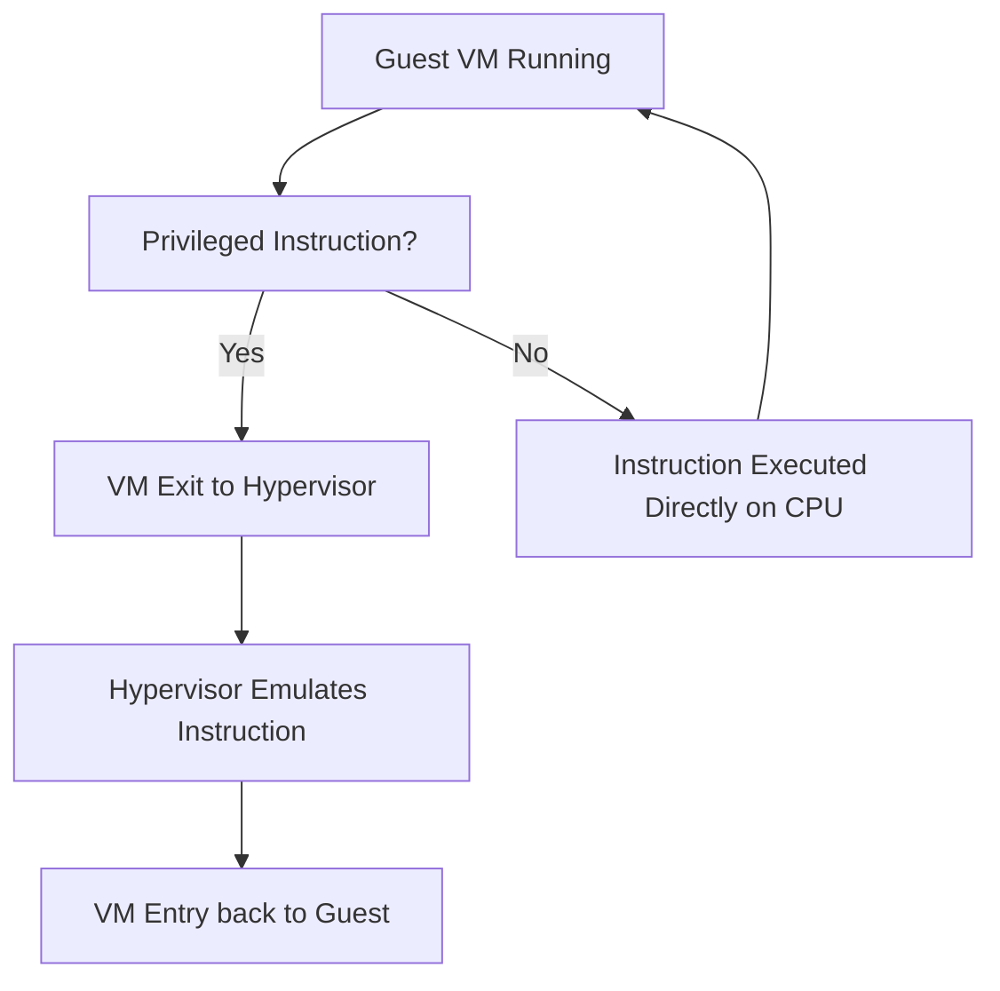

# Hardware Virtual Machine (HVM)

## 1. Definition

A Hardware Virtual Machine (HVM) is a type of virtual machine that relies on built-in virtualization extensions in the physical CPU (such as Intel VT-x or AMD-V) to run an unmodified guest operating system at near-native speed. HVM is a form of full virtualization that uses hardware assistance to reduce overhead and simplify the hypervisor.

## 2. Concept Explanation

The basic idea behind HVM is to let the guest operating system execute most instructions directly on the physical processor, just like a native OS. Without hardware support, a hypervisor must use complex software techniques such as binary translation to handle privileged instructions. HVM uses special CPU modes (VMX root and non-root mode) so that when the guest executes a sensitive instruction, the processor automatically traps it and hands control to the hypervisor. The hypervisor then emulates the required operation safely and returns control to the guest.

This approach is important because it eliminates the need to modify the guest OS. It also delivers much better performance than early software-based full virtualization methods. HVM has become the standard way to run unmodified operating systems like Windows, Linux, and others in data centers and cloud environments.

## 3. Key Characteristics / Features

- **Hardware-assisted execution:** The CPU provides dedicated instructions and modes (Intel VT-x, AMD-V) that simplify virtualization.
- **Unmodified guest OS support:** No changes are required in the guest kernel; any standard operating system can run.
- **Near-native performance:** Most guest code runs directly on the CPU, reducing emulation overhead.
- **Simpler hypervisor design:** The hypervisor does not need complex binary translation; it relies on the processor to handle privilege-sensitive events.
- **Improved isolation:** The hardware enforces strict boundaries between virtual machines, enhancing security.
- **Memory management support:** Technologies like Extended Page Tables (EPT) or Nested Page Tables (NPT) accelerate virtual-to-physical address translation.
- **Broad compatibility:** HVM supports a wide range of 32-bit and 64-bit guest operating systems.

## 4. Types / Classification

HVM is not split into many subtypes; rather it is itself a category of full virtualization. However, it can be compared with other virtualization methods based on the hypervisor's approach:

- **HVM mode (full virtualization with hardware assistance):** The hypervisor uses CPU extensions and emulates certain hardware devices. It often employs paravirtualized drivers (PV drivers) for better I/O performance. (e.g., Xen HVM, KVM)
- **Pure software full virtualization:** Old method using binary translation without hardware support. HVM has largely replaced this.
- **Paravirtualization (PV):** The guest OS is modified to make hypercalls; no special CPU hardware is required.
- **Hybrid mode (PVHVM):** A combination where HVM mode runs the guest, but paravirtualized drivers are used for disk and network to achieve near-native I/O speed.

## 5. Working / Mechanism

1. When a HVM-capable hypervisor (like XEN, KVM, or VMware) starts, it detects the presence of Intel VT-x or AMD-V.
2. The hypervisor enters VMX root mode (on Intel) or host mode (on AMD), which gives it full control over the hardware.
3. A guest virtual machine is launched in VMX non-root mode, where it can run its own ring 0 code directly, believing it owns the CPU.
4. Whenever the guest OS executes a privileged instruction (e.g., disable interrupts, device I/O), the CPU automatically triggers a **VM exit**. This transition hands control back to the hypervisor in root mode.
5. The hypervisor examines the reason for the exit, performs the required hardware emulation or resource mapping, and then issues a **VM entry** instruction to resume the guest.
6. Memory translation uses two stages: the guest OS maps virtual addresses to “guest physical” addresses, then the hypervisor’s Extended Page Tables map these to the actual machine addresses. The hardware handles both stages efficiently.
7. For I/O, the hypervisor can present fully emulated devices (e.g., IDE disk, e1000 NIC) or use split drivers (frontend in guest, backend in hypervisor) through paravirtualized interfaces to reduce overhead.

## 6. Diagram

## 7. Mathematical Formulation

The execution time of a workload in a HVM can be approximated as:

$$
T_{hvm} \approx T_{native} + n_{exits} \times t_{exit}
$$

Where:  
- `T_hvm` = total execution time inside the hardware virtual machine  
- `T_native` = time the same workload would take on bare metal  
- `n_exits` = number of VM exits caused by privileged operations during the workload  
- `t_exit` = average time taken by one VM exit (hypervisor handling + context switch)

For HVM with hardware assistance, `t_exit` is much smaller than in software-based full virtualization, so total performance remains close to native.

## 8. Example

A company runs a legacy Windows Server 2008 application that cannot be migrated to a newer OS. The IT team deploys Windows Server 2008 as an HVM guest on a modern Linux hypervisor (KVM). The Windows OS installs without any modification, uses only the standard drivers, and the application runs with nearly the same speed as on its original physical server.

## 9. Analogy

Imagine a trainee chef cooking in a professional kitchen. Most of the time, the chef can use the stove, knives, and pans directly without asking for help. But for a few tasks they are not yet allowed to do, like handling a special meat slicer, a supervisor steps in, operates the machine, and hands back the sliced meat. The trainee (guest OS) works at full speed, and the supervisor (hypervisor) intervenes only for restricted actions. This is like a HVM: the CPU hardware automatically notifies the hypervisor only when necessary.

## 10. Comparison

| Feature | HVM (Hardware Virtual Machine) | Para-virtualization (PV) |
|--------|--------------------------------|---------------------------|
| Guest OS modification | Not required; runs unmodified OS | Requires modified kernel with hypercalls |
| Hardware support | Requires Intel VT-x or AMD-V | Can work on older CPUs without virtualization extensions |
| Performance | Near-native, small exit overhead | Slightly better for I/O because of direct hypercalls, but overall similar |
| Device drivers | Typically emulated, optional PV drivers improve I/O | Uses paravirtualized drivers mandatory |
| Example | Xen HVM, KVM, VMware ESXi with VT-x | Xen PV mode, early paravirtualized Linux |

## 11. Advantages

- Guest operating systems do not require any modifications; any standard Windows, Linux, or other OS can run.
- Performance is very close to bare metal because most instructions run directly on the physical CPU.
- The hypervisor is simpler to develop and maintain compared to full software binary translation engines.
- Hardware support provides strong isolation boundaries enforced by the processor itself.
- Technologies like EPT and VT-d further improve memory and device performance.
- HVM is widely supported across all major hypervisors, ensuring compatibility and vendor confidence.

## 12. Disadvantages / Limitations

- The physical CPU must have hardware virtualization extensions; older hardware may not support HVM.
- VM exits still add some overhead, especially for workloads with many sensitive operations (e.g., frequent device I/O).
- Emulated devices, if used without paravirtualized drivers, can slow down disk and network performance.
- Managing HVM guests and their required device drivers can be slightly more complex compared to fully paravirtualised systems.
- Hardware-specific tuning may be needed to achieve optimal performance in large-scale deployments.

## 13. Important Points / Exam Notes

- HVM stands for Hardware Virtual Machine, which uses Intel VT-x or AMD-V.
- It is a type of full virtualization that does not require changes in the guest OS.
- The CPU handles the transition between guest and hypervisor via VM exits and VM entries.
- Modern HVM systems often use paravirtualized drivers (PV drivers) to improve I/O performance.
- XEN’s HVM mode requires QEMU for device emulation; later HVM with PV drivers is called PVHVM.
- Without hardware support, a hypervisor must fall back to slower software-based virtualization.
- HVM is the foundation for most cloud instances today (e.g., AWS Nitro, KVM in Google Cloud).

## 14. Applications / Use Cases

- Running unmodified Windows operating systems on Linux-hosted hypervisors in corporate data centers.
- Cloud service providers offering infrastructure-as-a-service (IaaS) with standard OS images (Linux, Windows) to customers.
- Hosting legacy applications that require older operating systems without modifying the OS.
- Secure multi-tenant environments where hardware-enforced isolation is critical.
- Development and testing labs that need to quickly spin up different OS versions on the same hardware.

## 15. MCQs

**Q1. HVM relies on which CPU feature to run unmodified guest operating systems?**

A. Hyper-threading  
B. SpeedStep  
C. Intel VT-x / AMD-V  
D. Turbo Boost  
**Answer:** C

**Q2. In HVM, what event occurs automatically when the guest executes a privileged instruction?**

A. The guest crashes  
B. VM entry  
C. VM exit  
D. Hypercall  
**Answer:** C

**Q3. Which of the following best describes the guest OS in an HVM environment?**

A. It must be specially compiled with hypervisor support  
B. It runs only in user mode  
C. It remains unmodified and runs as on real hardware  
D. It cannot access disk or network  
**Answer:** C

**Q4. What is the main performance advantage of using PV (paravirtualized) drivers inside an HVM?**

A. They eliminate the need for CPU hardware extensions  
B. They replace the hypervisor  
C. They reduce the number of VM exits for disk and network operations  
D. They allow the guest to boot without a kernel  
**Answer:** C

**Q5. Which memory technology helps HVM speed up address translation?**

A. RAM  
B. EPT / NPT (Extended / Nested Page Tables)  
C. BIOS  
D. SWAP  
**Answer:** B

**Q6. Which hypervisor mode uses QEMU for device emulation in a full hardware- assisted VM?**

A. Xen PV  
B. Xen HVM  
C. Linux Containers  
D. Docker  
**Answer:** B

**Q7. HVM cannot run if the physical CPU lacks virtualization extensions. This is a:**

A. Advantage  
B. Characteristic  
C. Limitation  
D. Myth  
**Answer:** C

**Q8. When a guest instruction does not require hypervisor intervention, what happens in HVM?**

A. The hypervisor stops the guest  
B. The instruction is executed directly on the physical CPU  
C. The guest reboots  
D. The instruction is ignored  
**Answer:** B

**Q9. Which statement correctly compares HVM and Paravirtualization (PV)?**

A. HVM requires a modified guest OS, PV does not  
B. Both can work without any CPU support  
C. HVM uses hardware assists, PV modifies the guest OS  
D. HVM is always slower than PV  
**Answer:** C

**Q10. What is the typical role of QEMU in a Xen HVM setup?**

A. It replaces the hypervisor  
B. It provides CPU scheduling  
C. It emulates hardware devices like disk and network  
D. It boots the physical server  
**Answer:** C