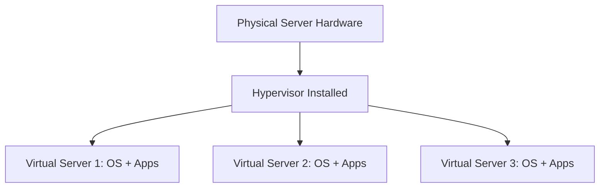

# Virtual Servers

## 1. Definition
A virtual server is a software-based representation of a physical server. It runs its own operating system and applications while sharing the underlying physical hardware with other virtual servers through virtualization technology.

## 2. Concept Explanation
Instead of buying a separate physical server for every single application, organizations use a hypervisor to create multiple independent virtual servers on one physical machine. Each virtual server acts exactly like a dedicated computer with its own CPU, memory, and disk allocation. The hypervisor divides and manages the real hardware resources among them. This approach is important because it reduces hardware costs, saves data center space, and allows IT teams to deploy new servers in minutes rather than weeks.

## 3. Key Characteristics / Features
- **Isolation:** Each virtual server runs independently. A crash or failure in one does not affect the others sharing the same physical host.
- **Encapsulation:** An entire virtual server, including its operating system and applications, is stored as a set of files. This makes copying, backing up, and moving the server very easy.
- **Hardware Independence:** A virtual server can run on any compatible physical host, regardless of the server brand or model.
- **Resource Sharing:** Multiple virtual servers efficiently share CPU, RAM, storage, and network resources, which improves overall hardware utilization.

## 4. Types / Classification
Virtual servers are often classified based on the type of hypervisor used to create them.

- **Type 1 Virtual Server (Bare-Metal):** The hypervisor runs directly on the physical hardware without any underlying operating system. These servers offer high performance and strong security. Examples: VMware ESXi, Microsoft Hyper-V Server.
- **Type 2 Virtual Server (Hosted):** The hypervisor runs as an application on top of a normal operating system such as Windows or Linux. These are common for testing and development. Examples: Oracle VirtualBox, VMware Workstation.

## 5. Working / Mechanism
1. A hypervisor is installed on a physical server, either directly on the hardware (Type 1) or on a host operating system (Type 2).
2. The administrator creates a new virtual server by specifying virtual hardware resources such as CPU cores, memory size, disk space, and network interfaces.
3. The hypervisor creates an isolated execution environment and the required virtual hardware.
4. A guest operating system is installed inside this virtual server, just like on a physical machine.
5. When the virtual server runs, the hypervisor schedules access to the actual physical hardware. It allocates time slices of the CPU and dedicated portions of memory to ensure all running virtual servers get their fair share.
6. Applications inside the virtual server execute normally, completely unaware that they are running on virtualized hardware.

## 6. Diagram

## 7. Mathematical Formulation
*(Not applicable for this topic)*

## 8. Example
A college IT department has one powerful physical server with VMware ESXi. Instead of using three separate physical machines, they create three virtual servers on it. One runs the library catalog system, another hosts the student attendance portal, and the third handles internal email. Each virtual server works independently, and the college saves money on hardware, power, and cooling.

## 9. Analogy
A virtual server is like an individual office cubicle inside a large office room. Each cubicle has its own desk, chair, and equipment, but all cubicles share the same building power supply, air conditioning, and floor space. Workers in one cubicle can do their job without disturbing others, and a cubicle can be quickly set up or rearranged when needed.

## 10. Comparison
A comparison between a traditional physical server and a virtual server is given below.

| Feature | Physical Server | Virtual Server |
|--------|----------|----------|
| Hardware | One dedicated set of physical components per server | Multiple virtual servers share one set of physical hardware |
| Scalability | Requires physical installation of new parts | Resources can be changed instantly via the hypervisor |
| Cost | Higher hardware, power, and space expenses | Lower costs due to consolidation of workloads |
| Portability | Requires physical relocation to move | Can be copied as a file and live-migrated between hosts |

## 11. Advantages
- Cost is reduced by running many workloads on fewer physical machines.
- New servers can be deployed in minutes using templates and cloning.
- Backup and disaster recovery become simple with snapshots and replication features.
- Hardware resources are used much more efficiently, lowering energy consumption.
- Live migration allows a running virtual server to be moved to another physical host without any downtime.

## 12. Disadvantages / Limitations
- If too many virtual servers compete for resources on one host, performance can degrade.
- A single physical server failure can bring down all the virtual servers running on it, unless high-availability measures are in place.
- Managing a virtualized environment requires specialized skills and training.
- Licensing costs for hypervisors and multiple guest operating systems can add extra expense.

## 13. Important Points / Exam Notes
- Virtual servers are created and managed by a hypervisor that partitions physical hardware.
- Type 1 hypervisors are the preferred choice for production data centers due to their performance.
- Virtual machines are encapsulated as files, making them very portable and easy to protect.
- Live migration moves a running VM between physical hosts without stopping its services.
- Server virtualization is the fundamental building block that makes cloud computing possible.

## 14. Applications / Use Cases
- Consolidating many underused physical servers into fewer machines in enterprise data centers.
- Creating safe, isolated test and development environments that mirror production.
- Hosting multiple customer websites securely on a single server.
- Delivering virtual desktops to users through Virtual Desktop Infrastructure (VDI).
- Setting up remote disaster recovery sites where virtual servers can be quickly restarted from replicas.

## 15. MCQs

**Q1. What is a virtual server?**
A. A physical server without an operating system  
B. A software-based emulation of a physical server  
C. A hardware component used only for networking  
D. A type of backup storage device  
**Answer:** B

**Q2. Which software creates and runs virtual servers?**
A. Web browser  
B. Hypervisor  
C. Database management system  
D. Antivirus  
**Answer:** B

**Q3. A Type 1 hypervisor runs directly on which of the following?**
A. A host operating system  
B. Another hypervisor  
C. Physical hardware  
D. A cloud portal  
**Answer:** C

**Q4. Which of the following is an example of a Type 2 hypervisor?**
A. VMware ESXi  
B. Microsoft Hyper-V Server  
C. Oracle VirtualBox  
D. Citrix XenServer  
**Answer:** C

**Q5. One major advantage of virtual servers over physical servers is:**
A. They require more physical space  
B. They provide slower application performance  
C. They can be deployed rapidly from templates  
D. They consume more electricity  
**Answer:** C

**Q6. What is the likely result of packing too many virtual servers onto a single physical host?**
A. The physical hardware automatically expands  
B. Performance may degrade due to resource contention  
C. All virtual servers run much faster  
D. Network cables need to be replaced  
**Answer:** B

**Q7. Live migration of a virtual server refers to:**
A. Transferring the virtual server files via a USB drive  
B. Moving a running virtual server to another physical host without downtime  
C. Permanently deleting the virtual server  
D. Changing the guest operating system type  
**Answer:** B

**Q8. Which statement correctly describes isolation among virtual servers?**

A. If one virtual server fails, all others on the same host crash  
B. A fault in one virtual server does not affect other virtual servers on the host  
C. Virtual servers are isolated only from the storage network  
D. Isolation means virtual servers cannot communicate over the network  
**Answer:** B

**Q9. In the cubicle analogy, what do the shared electricity and air conditioning represent?**
A. The guest operating systems  
B. The individual applications  
C. The physical hardware resources like CPU, RAM, and power  
D. The hypervisor management console  
**Answer:** C

**Q10. Why are virtual servers essential for cloud computing?**
A. They remove the need for any network connectivity  
B. They allow rapid, on-demand resource provisioning and efficient pooling  
C. They replace all physical networking devices  
D. They do not require any management or monitoring  
**Answer:** B