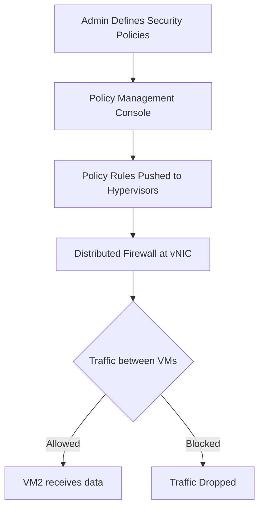

# Logical_Network_Perimeter

## Video Explanation

* [https://www.youtube.com/watch?v=Z9w0z0x7p3Y](https://www.youtube.com/watch?v=Z9w0z0x7p3Y)

## Visual Aids

## 1. Definition
A logical network perimeter is a software-defined security boundary that isolates and protects groups of virtual machines, containers, or workloads without depending on physical network devices. It uses policies and virtual firewalls to control traffic based on identity and labels rather than physical location.

## 2. Concept Explanation
In traditional networks, the perimeter is a physical firewall at the network edge that separates the trusted inside from the untrusted outside. In virtualized and cloud environments, workloads can move across servers and data centres. A physical perimeter alone cannot protect east-west traffic (server-to-server communication) inside the data centre. A logical network perimeter solves this by creating software-enforced boundaries directly inside the hypervisor or virtual network.

The basic idea is to treat network security as a set of rules attached to virtual machines, not to physical ports or IP addresses. Using network virtualization and distributed firewalls, administrators define which groups can talk to each other. These rules are enforced at each virtual network interface card (vNIC). When a virtual machine tries to communicate, the local firewall checks the policy and allows or blocks the traffic immediately. This approach is important because it provides micro-segmentation, works even when VMs move, and aligns with the zero-trust security model.

## 3. Key Characteristics / Features
- **Software-defined enforcement:** Security rules are applied through software in the hypervisor or virtual switch, not through separate physical hardware. This makes the perimeter flexible and programmable.
- **Micro-segmentation:** Individual workloads or groups of workloads can be isolated from each other within the same physical network. This limits the spread of threats inside the data centre.
- **Location independence:** A virtual machine can be moved to another physical host, and all its firewall rules and perimeter policies move with it automatically.
- **Policy-driven control:** Access is based on logical attributes like application name, environment type, or user role rather than static IP addresses. Changes are easy and instant.
- **East-west traffic protection:** Traffic that stays within the data centre is inspected and filtered, which is a major gap in traditional perimeter-only security.
- **Integration with virtual platforms:** The logical perimeter works closely with hypervisors, SDN controllers, and cloud management platforms to provide a unified security view.

## 4. Types / Classification
Logical network perimeters can be classified based on where the enforcement point resides and how policies are applied.

- **Network-based logical perimeter:** This uses network virtualization overlays like VXLAN or NVGRE along with a software-defined networking (SDN) controller. The perimeter is created by virtual switches and distributed logical routers that separate tenant networks. Example: VMware NSX logical switching.
- **Host-based logical perimeter:** This type embeds enforcement directly inside the hypervisor kernel using a distributed firewall. Every virtual machine has a firewall rule set at its vNIC. No external network device is needed. Example: NSX Distributed Firewall or hypervisor-integrated firewalls.
- **Agent-based logical perimeter:** A lightweight security agent is installed inside each workload (virtual machine or container) to enforce rules. This works in any environment but requires operating system support. Example: cloud workload protection platforms.

## 5. Working / Mechanism
The mechanism of a logical network perimeter can be explained step by step.

1. An administrator defines security policies using a central management console. Policies are written using logical grouping labels such as "web-server", "database", or "PCI-DSS".
2. The policy engine translates these high-level rules into specific firewall rules, including allowed ports, protocols, and source-destination pairs.
3. The management platform pushes these rules to a distributed firewall module running inside each hypervisor on every physical host.
4. When a virtual machine generates a packet, the virtual switch captures it before it reaches the physical network.
5. The distributed firewall inspects the packet against the rule table associated with the source and destination virtual machines.
6. If a matching rule is found and the action is "allow", the packet is forwarded. If it is "block", the packet is dropped immediately.
7. All enforcement happens locally on the same host, so there is no hairpinning or traffic backhaul to a central appliance.
8. If a virtual machine is migrated to another host, its policies are synchronised automatically, so the perimeter remains intact without manual changes.
9. Logs of allowed and blocked traffic are sent to a central monitoring and analytics service for audit and threat detection.

## 6. Diagram

## 7. Mathematical Formulation
Not applicable for this topic.

## 8. Example
A company runs a three-tier web application in a virtualized data centre. They create a logical network perimeter using VMware NSX. They define three groups: `web-servers`, `app-servers`, and `db-servers`. A policy allows `web-servers` to talk to `app-servers` on port 8080, and `app-servers` to `db-servers` on port 3306. All other traffic between groups is blocked by default. These rules are enforced at each virtual machine’s network interface. When a web developer accidentally misconfigures a script that tries to connect directly from a web server to the database, the local distributed firewall drops the packet instantly, preventing a possible data breach. The security team later sees the block event in the log.

## 9. Analogy
Imagine a large indoor stadium converted into a co-working space. Instead of building brick walls around each team’s area, you give every person an electronic badge and set invisible rules. A badge from the “finance” zone cannot enter the “engineering” zone unless a specific rule allows it. Guards at each desk block or permit entry based on badge rules. Here, the stadium is the physical data centre, badges are logical identities, guards are the distributed firewalls, and the rule book is the central policy. The logical network perimeter creates invisible, flexible walls without any physical construction.

## 10. Comparison
| Feature | Physical Network Perimeter | Logical Network Perimeter |
|--------|---------------------------|---------------------------|
| Enforcement point | Physical firewall appliance at network edge | Software firewall inside hypervisor or virtual switch |
| Protection scope | Mostly north-south traffic (outside to inside) | Both north-south and east-west traffic |
| Dependency on location | Strongly tied to physical network topology | Independent of physical location; rules move with VM |
| Granularity | Broad subnet and port-based rules | Micro-segmentation at individual workload level |
| Scalability | Adding capacity often requires new hardware | Scales through software and orchestration |

## 11. Advantages
- Fine-grained security inside the data centre reduces the attack surface and limits lateral movement of threats.
- Policies are portable, so virtual machine migration does not break security.
- Centralised management simplifies auditing and compliance reporting.
- No hardware bottlenecks because traffic inspection is distributed across all hosts.
- Enables zero-trust architectures where no traffic is trusted by default.
- Quick policy changes can be implemented without rewiring or reconfiguring physical devices.

## 12. Disadvantages / Limitations
- Implementation complexity requires skilled staff who understand both virtualization and security.
- A small performance overhead is introduced on each host because the hypervisor must inspect every packet.
- Misconfiguration of logical rules can accidentally isolate critical systems or leave backdoors open.
- It requires hypervisor-level support; older or non-virtualized workloads cannot use host-based enforcement.
- Troubleshooting connectivity issues can be more challenging because the filtering point is distributed.

## 13. Important Points / Exam Notes
- A logical network perimeter uses software rules to isolate workloads, replacing or complementing physical firewalls.
- It enables micro-segmentation, where each virtual machine can have its own set of firewall rules.
- Distributed firewalls enforce policies at the virtual network interface, eliminating the need to hairpin traffic to a central appliance.
- Policies are based on logical labels (application, role, environment) rather than IP addresses.
- When a VM moves, its security policies move with it automatically.
- This approach is fundamental to the zero-trust security model in modern data centres.
- Common implementations include VMware NSX, Cisco ACI, and Microsoft Hyper-V Network Virtualization.

## 14. Applications / Use Cases
- **Multi-tenant cloud environments:** Service providers isolate different customers on the same physical infrastructure using logical perimeters.
- **PCI-DSS compliance:** A company can isolate its payment card systems into a tightly controlled logical segment to meet audit requirements.
- **Virtual Desktop Infrastructure (VDI):** Each user’s virtual desktop is placed in its own logical boundary to prevent cross-user attacks.
- **DevOps and testing environments:** Developers can create isolated sandboxes with identical production rules without affecting the live network.
- **Zero-trust networks:** Every application component is ring-fenced with a logical perimeter, and no communication is allowed unless explicitly permitted.

## 15. MCQs
**Q1. What is a logical network perimeter?**
A. A physical wall built around servers  
B. A software-defined security boundary that isolates workloads  
C. A hardware router with access control lists  
D. A type of network cable  
**Answer:** B

**Q2. Which type of traffic does a logical perimeter primarily protect in data centers?**
A. Only north-south traffic  
B. Only internet-bound traffic  
C. East-west traffic between servers  
D. Wireless network traffic  
**Answer:** C

**Q3. Where does a distributed firewall enforce rules in a virtualized environment?**
A. On the main internet gateway  
B. At each virtual machine’s network interface  
C. On the physical switch  
D. Inside the storage array  
**Answer:** B

**Q4. What happens to security policies when a VM is migrated to another host?**
A. They are deleted and must be recreated  
B. They are automatically moved with the VM  
C. They remain on the old host only  
D. They become physical firewall rules  
**Answer:** B

**Q5. Which technology is commonly used to implement logical network perimeters in VMware environments?**
A. Microsoft DirectAccess  
B. Cisco ASA  
C. VMware NSX  
D. Linux iptables on bare metal  
**Answer:** C

**Q6. Micro-segmentation refers to:**
A. Connecting all VMs to a large switch  
B. Creating extremely small hard disk partitions  
C. Isolating individual workloads or small groups from each other  
D. Increasing the MTU size on a network  
**Answer:** C

**Q7. In a logical perimeter, policies are typically based on:**
A. Fixed IP addresses only  
B. Logical labels like application name or role  
C. Physical cable length  
D. MAC address of the monitor  
**Answer:** B

**Q8. One major advantage of a distributed firewall approach is:**
A. All traffic must travel to a central physical appliance  
B. No performance impact on the hypervisor  
C. Traffic inspection is spread across hosts, avoiding bottlenecks  
D. It works only with public cloud providers  
**Answer:** C

**Q9. Without a logical perimeter, east-west traffic in a data center is:**
A. Always encrypted  
B. Often not inspected by traditional edge firewalls  
C. Automatically blocked  
D. Routed through the internet  
**Answer:** B

**Q10. Which statement is true about host-based logical perimeters?**
A. They require a separate hardware firewall for each VM  
B. They embed enforcement in the hypervisor kernel  
C. They cannot be used in virtualized systems  
D. They replace the need for any authentication  
**Answer:** B