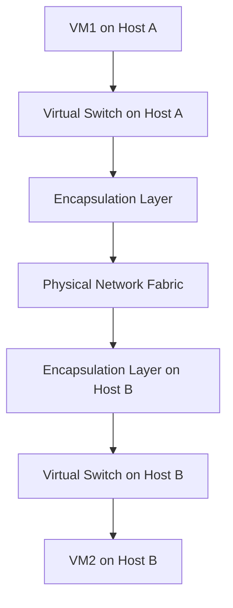

# Network_Virtualization

## Video Explanation

* [https://www.youtube.com/watch?v=8b8z8Fj1K5E](https://www.youtube.com/watch?v=8b8z8Fj1K5E)

## Visual Aids

## 1. Definition

Network virtualization is the process of separating the logical network functions from the underlying physical network hardware. It combines hardware and software network resources into a single virtual network that can be managed and configured independently.

## 2. Concept Explanation

In a traditional network, each physical switch, router, and firewall performs a fixed function tied to its hardware. Network virtualization abstracts these physical devices and creates software-based virtual switches, virtual routers, and virtual firewalls. This abstraction allows multiple independent virtual networks to share the same physical cables and switches.

Network virtualization works by adding a software layer that redirects network traffic inside or between host machines. This layer often uses encapsulation protocols to build tunnels across the physical network. It is important because it enables entire networks to be provisioned, moved, and changed in minutes without touching physical devices. It also provides the strong isolation needed for cloud computing where many customers share the same infrastructure.

## 3. Key Characteristics / Features

- **Abstraction:** The logical network is separated from the physical infrastructure, hiding hardware details.
- **Isolation:** Each virtual network operates independently, so traffic from one cannot reach another without permission.
- **Centralized management:** The entire virtual network topology can be configured from a single management console.
- **Programmability:** Network services and policies can be created and changed through software, not manual cable changes.
- **Resource pooling:** Physical network bandwidth and ports are logically divided and shared among multiple virtual networks.
- **Elasticity:** Virtual network resources can be scaled up or down on demand without buying new hardware.
- **Multi-tenancy:** Multiple tenants in a cloud center can have their own private virtual networks on the same physical fabric.

## 4. Types / Classification

Network virtualization can be classified based on the scope of the virtual network:

**A. Internal Network Virtualization**  
This type creates a virtual network inside a single physical server. Multiple virtual machines on the same host are connected through a virtual switch (like Open vSwitch) running inside the hypervisor. The external network sees only the traffic from the host, not from each individual VM.

**B. External Network Virtualization**  
This type combines multiple physical switches and routers (possibly across different locations) into one or more logical virtual networks. It uses tunneling protocols such as VXLAN or NVGRE to extend virtual networks across a data center. This is the model used for large-scale cloud networking.

Sometimes network virtualization is also classified by the underlying technology:
- **Overlay-based virtualization:** A virtual network is built as an overlay on top of the physical network using encapsulation (VXLAN, NVGRE, GRE).
- **Underlay and SDN-based:** The physical network itself becomes programmable via SDN controllers, enabling dynamic slicing of the network.

## 5. Working / Mechanism

1. A network hypervisor or a software layer (e.g., VMware NSX, Open vSwitch) is installed on the physical host machines and interacts with the physical network adapters.
2. When a virtual machine sends a packet, it goes to a virtual network interface card (vNIC) that is attached to a virtual switch inside the host.
3. The virtual switch examines the destination address. If the destination VM is on the same host, the packet is forwarded directly without leaving the host.
4. If the destination VM is on a different physical host, the virtual switch encapsulates the original packet inside a new packet (e.g., VXLAN encapsulation) and sends it over the physical network.
5. The physical network only sees the outer packet header and routes it like normal IP traffic. The contents of the inner virtual network are hidden.
6. At the destination host, the virtual switch receives the encapsulated packet, removes the outer header, and delivers the original packet to the target virtual machine.
7. A central controller or management plane keeps track of the virtual network topology, MAC addresses, and policies, pushing rules to the virtual switches as needed.

## 6. Diagram

## 7. Mathematical Formulation

The total virtual bandwidth available in a virtualized network can be described as:

$$
B_{virtual} \approx B_{physical} \times E
$$

Where:
- `B_virtual` = total usable bandwidth of all virtual network links combined
- `B_physical` = total physical bandwidth of the underlying network interfaces
- `E` = network virtualization efficiency factor (always ≤ 1), which accounts for encapsulation overhead and control traffic

For example, a 10 Gbps physical link with a 5% encapsulation overhead (E = 0.95) provides about 9.5 Gbps of virtual bandwidth that can be partitioned among virtual networks.

## 8. Example

Amazon Web Services uses network virtualization to provide Virtual Private Cloud (VPC) service. Each customer creates their own VPC with private IP addresses, subnets, route tables, and network gateways. Thousands of such isolated virtual networks run on the same physical Amazon data center network. Customers configure their VPC entirely through a web console, while Amazon’s infrastructure automatically enforces isolation using encapsulation.

## 9. Analogy

Think of a large apartment building with a shared physical mailbox room. Each apartment has its own locked mailbox. The mailman (network packet) delivers all letters to the shared room, but the sorting process inside the room ensures that each letter is put only into the correct mailbox. Apartment residents see only their own mail. The shared room and sorting system represent network virtualization, providing a private mailbox (virtual network) for each apartment (tenant) from a common physical space.

## 10. Comparison

| Feature | Network Virtualization | Traditional Physical Network |
|--------|------------------------|------------------------------|
| Provisioning time | A virtual network can be created in seconds via software | Setting up a new physical network requires cabling and device configuration |
| Hardware dependency | Uses existing physical hardware, shared among virtual networks | Needs dedicated switches, routers, and cables per network segment |
| Management | Centralized software control for policies and topology | Device-by-device management, often manual |
| Mobility | Virtual machines can move between hosts while keeping the same virtual network policies | Moving devices means re-cabling and reconfiguring network ports |
| Isolation | Strong logical isolation using encapsulation and virtual switches | Physical isolation by separate hardware but harder to scale |

## 11. Advantages

- Faster deployment of networks without physical reconfiguration.
- Better utilization of network hardware, reducing unused ports and bandwidth.
- Strong multi-tenant isolation, essential for cloud computing security.
- Simplified disaster recovery because entire virtual network configurations can be saved and restored.
- Easier testing of new network topologies without affecting production traffic.
- Network policies follow virtual machines when they migrate from one host to another.

## 12. Disadvantages / Limitations

- Encapsulation adds extra header overhead, slightly reducing the effective payload size.
- Virtual switches and overlay tunnels consume some host CPU and memory.
- Debugging virtual network problems can be challenging due to the hidden inner packet headers.
- The physical network must support higher-than-normal MTU sizes to accommodate encapsulation headers.
- Performance can be unpredictable if the physical network is not designed with virtualization in mind.

## 13. Important Points / Exam Notes

- Network virtualization abstracts physical switches and routers into software-based logical devices.
- The key enabling technology in modern data centers is the overlay network (VXLAN, NVGRE, or Geneve).
- A virtual switch, such as Open vSwitch, runs inside the hypervisor to connect VMs on a host.
- The Virtual Extensible LAN (VXLAN) protocol uses a 24-bit Virtual Network Identifier (VNI) to support up to 16 million isolated networks.
- External network virtualization allows virtual networks to span across the entire data center, not just a single server.
- Network virtualization is the foundation of Infrastructure-as-a-Service (IaaS) networking and multi-tenant cloud.

## 14. Applications / Use Cases

- **Cloud data centers:** Providers like AWS, Azure, and Google Cloud offer isolated virtual networks to customers.
- **Disaster recovery:** Network configurations are replicated along with VMs, allowing quick failover.
- **Network Function Virtualization (NFV):** Firewalls, load balancers, and routers are virtualized instead of using dedicated hardware appliances.
- **Software-Defined WAN (SD-WAN):** Branch office connectivity is delivered over virtualized overlay networks optimising cheap internet links.
- **Test and development environments:** Developers create entire virtual networks instantly to test distributed applications.

## 15. MCQs

**Q1. What is the main goal of network virtualization?**

A. To remove all physical network cables  
B. To separate logical network functions from the physical hardware  
C. To increase the speed of physical switches  
D. To replace Wi-Fi with wired networks  
**Answer:** B  
**Explanation:** Network virtualization abstracts logical services from physical devices, allowing multiple virtual networks to run on shared hardware.

**Q2. Which protocol is commonly used to create overlay networks in network virtualization?**

A. HTTP  
B. VXLAN  
C. DNS  
D. DHCP  
**Answer:** B  
**Explanation:** VXLAN (Virtual Extensible LAN) encapsulates layer-2 frames inside UDP packets, enabling overlay virtual networks across a physical fabric.

**Q3. What is a virtual switch in a network virtualization setup?**

A. A physical switch with a VGA port  
B. A software-based switch running inside a hypervisor that connects VMs  
C. A cloud management tool  
D. A type of firewall  
**Answer:** B  
**Explanation:** A virtual switch is a software component that forwards traffic between virtual machines on a host and the external network.

**Q4. Network virtualization provides isolation between tenants by using:**

A. Separate physical routers for each tenant  
B. Encapsulation and virtual network identifiers  
C. Different electric power phases  
D. Blockchain  
**Answer:** B  
**Explanation:** Overlay techniques such as VXLAN assign unique identifiers to each virtual network, ensuring traffic separation.

**Q5. Which of the following is a disadvantage of network virtualization?**

A. Faster provisioning  
B. Encapsulation overhead reducing maximum payload size  
C. Better hardware utilization  
D. Centralized management  
**Answer:** B  
**Explanation:** Adding encapsulation headers consumes a small amount of bandwidth and increases packet size, which can affect payload.

**Q6. Internal network virtualization operates:**

A. Across many data centers  
B. Inside a single physical host  
C. Only on optical fiber  
D. Without any virtual machines  
**Answer:** B  
**Explanation:** Internal network virtualization creates a virtual network within a single host, connecting VMs through a virtual switch.

**Q7. What is the role of the central controller in network virtualization?**

A. To physically connect cables  
B. To store user passwords  
C. To push forwarding rules to virtual switches and manage the logical topology  
D. To replace the physical NIC  
**Answer:** C  
**Explanation:** The controller provides a centralized brain that distributes policies and keeps virtual switch rules up to date.

**Q8. In the analogy of an apartment mailbox room, what does the sorting mechanism represent?**

A. The physical post office building  
B. Network virtualization software that directs packets to the right virtual network  
C. The letters themselves  
D. The mailman’s bag  
**Answer:** B  
**Explanation:** The sorting ensures each tenant gets only their own mail, just as network virtualization isolates traffic per tenant.

**Q9. How many virtual networks can a VXLAN-based system support with its 24-bit VNI field?**

A. 256  
B. 65,536  
C. 16 million  
D. Unlimited  
**Answer:** C  
**Explanation:** A 24-bit identifier can represent 2^24 unique values, which is about 16.7 million, providing massive scalability.

**Q10. Which layer does network virtualization typically add to achieve overlay connectivity?**

A. Physical layer  
B. Data link layer overlay via encapsulation  
C. Application layer  
D. Presentation layer  
**Answer:** B  
**Explanation:** Encapsulation wraps layer-2 frames inside new layer-2 or layer-3 packets, creating a virtual data link layer on top of the physical network.