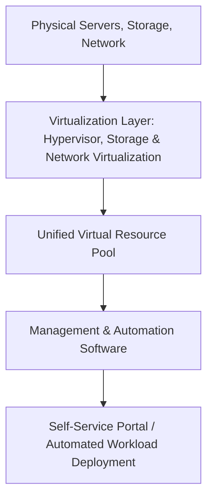

# Data_Center_virtualization

## Video Explanation

* [https://www.youtube.com/watch?v=3hLmDS179YE](https://www.youtube.com/watch?v=3hLmDS179YE)

## Visual Aids

## 1. Definition
Data center virtualization is the process of abstracting all physical resources in a data center — including servers, storage devices, and network hardware — into a software-defined, unified pool of virtual resources. This enables faster provisioning, better utilization, and centralized management of the entire data center infrastructure.

## 2. Concept Explanation
A traditional data center contains many separate physical devices, each dedicated to a single task or application. With data center virtualization, a hypervisor and management software break down the walls between these physical boxes. All computing, storage, and networking are transformed into virtual resources that can be allocated, moved, and reshaped instantly according to demand. The whole data center becomes a flexible, automated environment. This is important because it dramatically reduces hardware costs, simplifies operations, and allows IT teams to deliver services as quickly as a public cloud — but within their own secure facility.

## 3. Key Characteristics / Features
- **Pooling of Resources:** Physical servers, storage arrays, and network switches are consolidated into large logical pools that can be shared by any application.
- **Software-Defined Control:** Management and configuration are done through software interfaces, not by manually plugging and unplugging hardware.
- **Automated Provisioning:** New virtual machines, storage volumes, and network links can be created in minutes without physical intervention.
- **Elastic Scalability:** Resources can be assigned or taken away from workloads dynamically to match changing demand.
- **Unified Management:** Administrators can monitor and control the entire data center from a single console, rather than managing each device individually.

## 4. Types / Classification
Data center virtualization is often divided based on the infrastructure layer being virtualized.

- **Server Virtualization:** Partitioning physical servers into multiple virtual servers, as done by hypervisors like VMware ESXi, Hyper-V, or KVM.
- **Storage Virtualization:** Combining multiple physical storage devices from different vendors into a single logical storage pool, managed centrally.
- **Network Virtualization:** Creating logical networks, switches, and routers in software that operate independently of the physical network hardware.
- **Desktop Virtualization:** Hosting user desktops as virtual machines inside the data center and delivering them remotely to endpoints.

When all these layers are virtualized together, we speak of a fully virtualized or **software-defined data center (SDDC)** .

## 5. Working / Mechanism
1. Physical servers are installed with a hypervisor that converts each server into many virtual server slots.
2. Physical storage (SAN, NAS, or direct-attached disks) is aggregated through storage virtualization into a single flexible storage pool.
3. Network virtualization software creates logical switches and routers that run on top of the physical network fabric.
4. A central management layer (often called a cloud management platform or virtualization management suite) sits above all these virtual resources.
5. When an administrator or a user requests a service, the management layer picks the necessary virtual CPU, memory, storage, and network resources from the pools.
6. The required virtual machine or application workload is assembled and launched automatically.
7. Monitoring tools continuously check resource usage and can trigger automatic scaling or migration to maintain performance.

## 6. Diagram

## 7. Mathematical Formulation
*(Not applicable for this topic)*

## 8. Example
A government department runs a traditional data center with 100 physical servers, each running one application and rarely using more than 20% of its capacity. After implementing data center virtualization, they consolidate to 20 physical servers with a hypervisor. All storage is pooled into a virtual SAN, and software-defined networking replaces many old switches. Now, new applications can be deployed in minutes, hardware costs are cut by 60%, and energy consumption drops significantly. The department essentially builds a private cloud within its own virtualized data center.

## 9. Analogy
Imagine a traditional kitchen where every appliance has its own separate power source and you must manually carry ingredients between them. Data center virtualization is like converting that kitchen into a modern smart kitchen. All appliances draw power from a single intelligent panel, ingredients are stored in a shared inventory system, and a central touchscreen lets you cook any recipe by simply selecting it. You no longer worry about which device is plugged in where — the system handles everything flexibly behind the scenes.

## 10. Comparison

| Feature | Traditional Data Center | Virtualized Data Center |
|--------|----------|----------|
| Hardware dependency | Each service tied to a specific physical box | Services run on pooled virtual resources, independent of specific hardware |
| Provisioning speed | Days to weeks for new server setup | Minutes using templates and automated workflows |
| Resource utilization | Often 15-30% due to one-app-per-server | Can reach 80% or more through sharing |
| Management | Individual consoles for servers, storage, network | Single unified management interface for all infrastructure |

## 11. Advantages
- Hardware costs and floor space are significantly reduced through consolidation.
- IT services can be delivered faster and adapt quickly to changing business needs.
- Disaster recovery becomes easier because entire workloads are portable and can be replicated in software.
- Energy consumption and cooling requirements drop as fewer physical machines are needed.
- Maintenance tasks like patching or hardware replacement can often be performed without downtime using live migration.

## 12. Disadvantages / Limitations
- The initial setup requires a high level of expertise and careful planning.
- Virtualizing all layers introduces complexity; managing a software-defined environment demands new skills.
- Overcommitting resources can lead to performance contention if not properly monitored.
- Security risks may arise if the management layer itself is compromised, as it controls all resources.
- Licensing costs for virtualization software and management suites can be substantial.

## 13. Important Points / Exam Notes
- Data center virtualization goes beyond server virtualization by also pooling storage and networking.
- A fully virtualized data center is often called a Software-Defined Data Center (SDDC).
- Virtualization breaks the one-to-one relation between applications and physical hardware.
- Automated provisioning and centralized management are key differentiators from traditional data centers.
- Live migration of VMs allows hardware maintenance without stopping services.
- This technology forms the foundation for building private and hybrid clouds inside an organization.

## 14. Applications / Use Cases
- Building company-private cloud environments where departments request and receive IT resources on-demand.
- Facilitating disaster recovery sites that can be activated instantly because all servers are just files.
- Running large-scale test and development labs where many isolated environments are created and destroyed daily.
- Hosting virtual desktop infrastructure (VDI) so employees can access their work desktops from anywhere.
- Consolidating multiple branch-office data centers into one centrally managed virtualized facility.

## 15. MCQs

**Q1. What is the main goal of data center virtualization?**
A. To increase the number of physical servers  
B. To abstract physical resources into a flexible, software-defined pool  
C. To replace all software with hardware  
D. To remove storage completely  
**Answer:** B  
**Explanation:** Data center virtualization aims to decouple applications and services from physical hardware by turning all resources into a shared, software-managed pool.

**Q2. Which three infrastructure layers are typically virtualized in a fully virtualized data center?**
A. Servers, buildings, power outlets  
B. Servers, storage, and network  
C. Cooling, cabling, and racks  
D. Only servers  
**Answer:** B  
**Explanation:** A software-defined data center virtualizes compute (servers), storage, and networking, delivering them as services.

**Q3. What term is commonly used for a data center where all infrastructure is virtualized and controlled by software?**
A. Mainframe center  
B. Software-Defined Data Center (SDDC)  
C. Public cloud  
D. WAN accelerator  
**Answer:** B  
**Explanation:** SDDC describes a data center where all elements are virtualized and managed entirely through software policy and automation.

**Q4. Which of the following is a direct benefit of data center virtualization?**
A. Increased physical hardware requirements  
B. Slower application deployment  
C. Higher resource utilization and reduced hardware costs  
D. More complex physical cabling  
**Answer:** C  
**Explanation:** By sharing physical resources among many virtual workloads, utilization rises and fewer physical machines are needed, cutting costs.

**Q5. Live migration is a feature associated with virtualized data centers. What does it allow?**
A. Moving a running virtual machine from one physical host to another without downtime  
B. Copying files to a public cloud  
C. Permanently deleting data  
D. Installing a hypervisor remotely  
**Answer:** A  
**Explanation:** Live migration moves a running VM between physical servers, enabling maintenance and load balancing without interrupting services.

**Q6. In server virtualization, what is the function of a hypervisor?**
A. It acts as a firewall for the network  
B. It creates and runs multiple virtual servers on a single physical machine  
C. It manages only storage arrays  
D. It monitors room temperature  
**Answer:** B  
**Explanation:** The hypervisor partitions a physical server's CPU, memory, and I/O to create isolated virtual machines.

**Q7. Which of the following is a valid limitation of a virtualized data center?**
A. It always eliminates the need for any IT staff  
B. Overcommitting virtual resources can degrade performance  
C. It requires no planning or skills  
D. Hardware automatically becomes free  
**Answer:** B  
**Explanation:** If too many VMs share the same underlying physical resources, contention can slow down all of them.

**Q8. Storage virtualization in a data center means:**
A. Removing all hard drives  
B. Combining physical storage from multiple devices into a single manageable pool  
C. Storing all data on paper  
D. Using only USB drives  
**Answer:** B  
**Explanation:** Storage virtualization abstracts heterogeneous storage arrays into one logical unit that can be allocated as needed.

**Q9. How does a virtualized data center improve disaster recovery?**
A. By making it impossible to back up data  
B. By keeping all data on a single disk  
C. Because virtual machines are simply files that can be replicated and restarted anywhere  
D. By eliminating the need for network connections  
**Answer:** C  
**Explanation:** VMs are encapsulated as portable files, allowing quick recovery by restarting them on another host or site from replicas.

**Q10. Which of the following best describes an analogy for a virtualized data center?**
A. A library where each book is locked to one shelf  
B. A smart kitchen that dynamically allocates power and ingredients to cook any recipe on demand  
C. A bulky power generator that only runs one appliance  
D. A filing cabinet that cannot be moved  
**Answer:** B  
**Explanation:** Just as a smart kitchen pools resources and flexibly supports any task, a virtualized data center pools compute, storage, and network to serve any workload on demand.