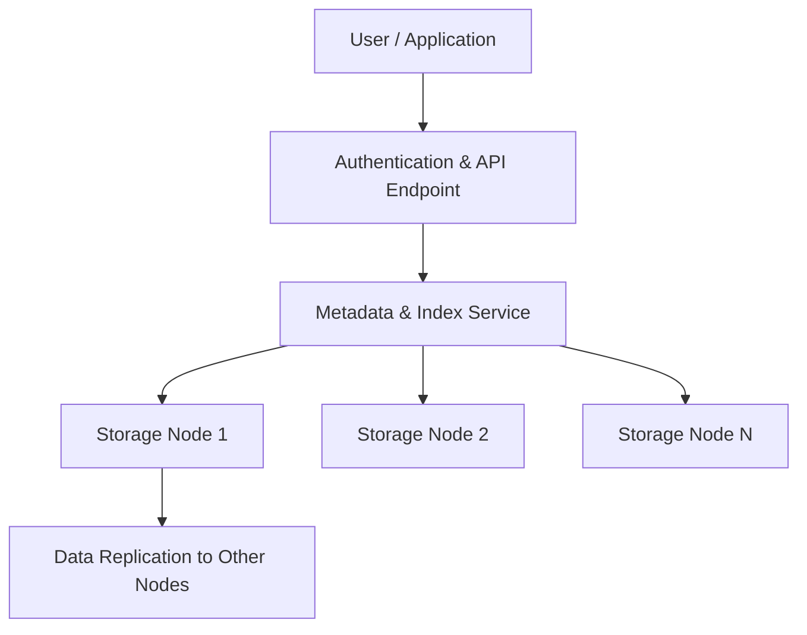

# Cloud_Storage_Device

## Video Explanation

* [https://www.youtube.com/watch?v=2LaAJq1lB1Q](https://www.youtube.com/watch?v=2LaAJq1lB1Q)

## Visual Aids

## 1. Definition
A cloud storage device is a logical, software-defined storage resource provided by a cloud service. It allows users to store, manage, and access data over the internet instead of keeping it on a local hard disk or a physical server in their own building.

## 2. Concept Explanation
In traditional computing, storage is directly attached to a computer or available inside a local network. Cloud storage devices move this storage to the provider’s data centre. The storage appears to the user as a virtual disk, a file share, or an object container, but the actual data may be spread across many physical drives and locations.

The basic idea is simple. A cloud provider builds a massive pool of storage from thousands of hard disks and SSDs. This pool is then divided and presented as separate, isolated storage devices to different customers through web interfaces, APIs, or standard protocols. When a user uploads a file or writes data, the provider’s software automatically distributes copies for safety and performance. The user pays only for the storage they actually consume.

This concept is important because it removes the need to buy, install, and maintain physical storage hardware. Companies can start small and grow to petabytes without any forklift upgrades. It also makes data available from anywhere with an internet connection, which supports remote work, disaster recovery, and collaboration.

## 3. Key Characteristics / Features
- **Scalability:** A cloud storage device can grow or shrink in capacity almost instantly. You never need to worry about running out of physical disk slots.
- **Pay-per-use billing:** You are charged only for the gigabytes or terabytes you actually store. There are no upfront hardware costs.
- **Global accessibility:** Data stored on a cloud storage device is reachable from any device with internet access and proper permissions.
- **High durability:** The provider automatically replicates your data across multiple servers, racks, and even data centres. This protects against hardware failure.
- **Multi-protocol support:** The same storage device can often be accessed as block storage, file storage, or object storage using standard protocols.
- **Automatic maintenance:** Tasks like backups, snapshots, and hardware replacement are handled by the provider without user intervention.

## 4. Types / Classification
Cloud storage devices are commonly classified based on the method of access and the format of the stored data.

- **Object storage devices:** Data is stored as objects without a folder hierarchy. Each object has a unique ID, data, and metadata. Access is through a REST API. Example: Amazon S3 buckets.
- **Block storage devices:** These provide raw storage volumes that behave like virtual hard drives. They can be formatted with a file system and attached to a virtual machine. Example: AWS Elastic Block Store (EBS).
- **File storage devices:** These offer a shared file system accessible through protocols like NFS or SMB. Multiple virtual machines can mount the same file store. Example: Azure Files.
- **Cloud storage gateways (hybrid devices):** These are physical or virtual appliances installed on-premises that cache frequently used data locally and extend storage to the cloud. Example: AWS Storage Gateway.

## 5. Working / Mechanism
The mechanism of a cloud storage device can be explained step by step.

1. A user creates a storage resource using the cloud provider’s management console or API. For example, they create a new S3 bucket or an EBS volume.
2. The cloud platform’s control plane allocates logical capacity and sets access permissions for the resource.
3. The user connects to the storage device over the internet using a client application, SDK, or a standard file-sharing protocol.
4. When a write request arrives, the storage device front-end (a load balancer or API server) first authenticates the request.
5. The authenticated data is broken into smaller chunks. Metadata about the chunks is stored in a fast database, while the chunks are sent to storage nodes.
6. The storage nodes write the chunks to physical drives and immediately create replicas on different nodes or across separate failure zones.
7. For a read request, the metadata server identifies the location of the requested chunks and directs the client to fetch them from the nearest storage node.
8. The cloud device continuously monitors hardware health. If a disk fails, the system automatically rebuilds lost copies using existing replicas.
9. Capacity usage is metered, and the user’s bill is updated accordingly.

## 6. Diagram

## 7. Mathematical Formulation
Not applicable for this topic.

## 8. Example
A media production team uses a cloud object storage device to keep all raw video footage. They upload hundreds of gigabytes of data directly from their editing workstations. The cloud device stores each file as an object with tags like ‘project-name’ and ‘date’. Editors from three different cities mount a cloud file storage device mapped to the same bucket and work on the same project simultaneously. When a hard disk fails inside the cloud provider’s rack, the object storage device automatically uses a replica to serve the file, and the team never notices the failure.

## 9. Analogy
Imagine keeping your money in a bank instead of under your mattress at home. The vault of the bank is the cloud storage device. You can deposit or withdraw cash from any branch or ATM without carrying the physical safe. The bank has security guards, fire protection, and keeps duplicate records. You pay a small fee, and the bank takes care of everything. Similarly, a cloud storage device holds your data safely, gives you access from anywhere, and replicates it so that a single disaster cannot destroy it.

## 10. Comparison
| Feature | Cloud Storage Device | Traditional Local Storage |
|--------|----------------------|---------------------------|
| Location of physical drives | Inside cloud provider’s data centre | Inside your own server or PC |
| Cost model | Pay only for what you use each month | Large upfront purchase of disks |
| Scalability | Limitless, instant expansion | Limited by physical slots and budget |
| Maintenance | Handled entirely by the provider | Your IT team must replace failed disks |
| Access from outside | Works over the internet with authentication | Requires VPN or direct network setup |

## 11. Advantages
- No capital expenditure on storage hardware reduces initial investment.
- Data is automatically replicated and backed up, which improves disaster recovery capability.
- The storage can expand or shrink within minutes, matching business needs.
- Access from anywhere supports remote work and global collaboration.
- The provider handles hardware failures, updates, and security patches.
- Storage can be integrated easily with other cloud services like compute and AI.

## 12. Disadvantages / Limitations
- A reliable and fast internet connection is mandatory. Slow or interrupted connectivity makes data access difficult.
- The monthly recurring cost can become high if large amounts of data are stored for years without deletion.
- Data stored outside the organisation’s physical control may raise security and compliance concerns in certain industries.
- Latency-sensitive applications like real-time trading may see delays because data travels over the internet.
- Restoring a very large amount of data from the cloud can take a long time and may incur egress charges.

## 13. Important Points / Exam Notes
- A cloud storage device is not a physical disk you buy; it is a logical, software-defined storage resource in a cloud provider’s infrastructure.
- The three fundamental types are block, file, and object storage.
- Object storage uses a flat namespace with unique identifiers and rich metadata, making it ideal for massive scale.
- Block storage volumes are attached to virtual machines and behave exactly like a hard drive.
- File storage provides a shared folder experience across multiple servers using NFS or SMB.
- Data durability is achieved through automatic replication across multiple failure domains.
- Cloud storage gateways bridge on-premises environments and cloud storage for hybrid architectures.

## 14. Applications / Use Cases
- **Backup and archiving:** Organisations send backup copies of their databases and file servers to a cloud storage device for long-term retention.
- **Content delivery:** Websites and mobile apps store images, videos, and static files on cloud object storage and serve them globally via a CDN.
- **Big data analytics:** Data lakes built on cloud object storage hold petabytes of structured and unstructured data for analytics engines like Spark.
- **Disaster recovery:** Entire virtual machine snapshots are replicated to a cloud storage device and can be restored in a different region.
- **Home and business file sync:** Services like Google Drive and OneDrive use cloud storage devices to synchronise files across multiple devices.

## 15. MCQs
**Q1. What is a cloud storage device?**
A. A physical hard drive you install in your laptop.  
B. A logical storage resource provided by a cloud service over the internet.  
C. A USB flash drive used for backup.  
D. A dedicated network switch for storage.  
**Answer:** B  
**Explanation:** A cloud storage device is a virtual, software-defined storage resource hosted in a cloud data centre, not a piece of local hardware.

**Q2. Which type of cloud storage device stores data as objects with unique IDs and metadata?**
A. Block storage  
B. File storage  
C. Object storage  
D. Optical storage  
**Answer:** C  
**Explanation:** Object storage uses a flat namespace and manages data as objects, each with an identifier and metadata.

**Q3. Which cloud storage type would you attach directly to a virtual machine as a boot disk?**
A. Object storage  
B. Block storage  
C. File storage  
D. Tape storage  
**Answer:** B  
**Explanation:** Block storage provides raw volumes that appear as local hard drives to virtual machines.

**Q4. What is the primary billing model for cloud storage devices?**
A. One-time purchase of the device  
B. Pay-per-use based on capacity and data transfer  
C. Fixed monthly rental for a physical rack  
D. Free with limited speed  
**Answer:** B  
**Explanation:** Cloud storage follows an operational expense model where you pay for the gigabytes stored and the data transferred.

**Q5. How is high durability typically achieved in a cloud storage device?**
A. By using a single very reliable disk  
B. By automatically replicating data across multiple nodes and locations  
C. By asking users to make manual copies  
D. By storing data only in RAM  
**Answer:** B  
**Explanation:** Providers replicate data behind the scenes so that a disk or server failure does not cause data loss.

**Q6. What is a cloud storage gateway?**
A. A virtual machine that only calculates bills  
B. An appliance that bridges on-premises applications to cloud storage  
C. The physical cable connecting your laptop to the router  
D. A firewall for cloud networks  
**Answer:** B  
**Explanation:** A cloud storage gateway provides local caching and protocol translation, making cloud storage appear like a local storage device.

**Q7. Which of the following is a disadvantage of using a cloud storage device?**
A. Instant scalability  
B. Pay-per-use billing  
C. Dependency on internet connectivity  
D. Automatic maintenance by the provider  
**Answer:** C  
**Explanation:** Without a stable internet connection, accessing data stored on a cloud device becomes slow or impossible.

**Q8. For which purpose is a file storage device most suitable?**
A. Running an operating system for a single VM  
B. Storing millions of unstructured photos via API  
C. Sharing a common folder across multiple servers  
D. Backup of raw device blocks  
**Answer:** C  
**Explanation:** File storage offers shared access via protocols like NFS, making it ideal for multiple systems to read and write a common set of files.

**Q9. What happens when a physical drive fails inside a cloud storage system?**
A. All data on that drive is permanently lost  
B. The user receives an email to replace the drive  
C. The system uses replicas to rebuild the data on a healthy drive automatically  
D. The entire cloud storage device shuts down  
**Answer:** C  
**Explanation:** The replication mechanism ensures that lost copies are silently rebuilt without user involvement.

**Q10. Amazon S3 is a popular example of which type of cloud storage device?**
A. File storage  
B. Object storage  
C. Block storage  
D. Archive tape storage  
**Answer:** B  
**Explanation:** Amazon Simple Storage Service (S3) is a highly scalable object storage service.

**Q11. Why would a business choose a cloud storage device over buying new hard disks?**
A. To have complete physical control over the storage hardware  
B. To avoid paying any monthly fees  
C. To eliminate upfront hardware costs and gain on-demand scalability  
D. To reduce internet bandwidth usage to zero  
**Answer:** C  
**Explanation:** Cloud storage converts capital expense into operational expense and allows elastic scaling without hardware purchases.

**Q12. Which protocol is commonly used to access a cloud file storage device?**
A. HTTP REST API  
B. iSCSI  
C. NFS  
D. PCIe  
**Answer:** C  
**Explanation:** Network File System (NFS) is a standard protocol for mounting remote file shares, commonly used by cloud file storage offerings.