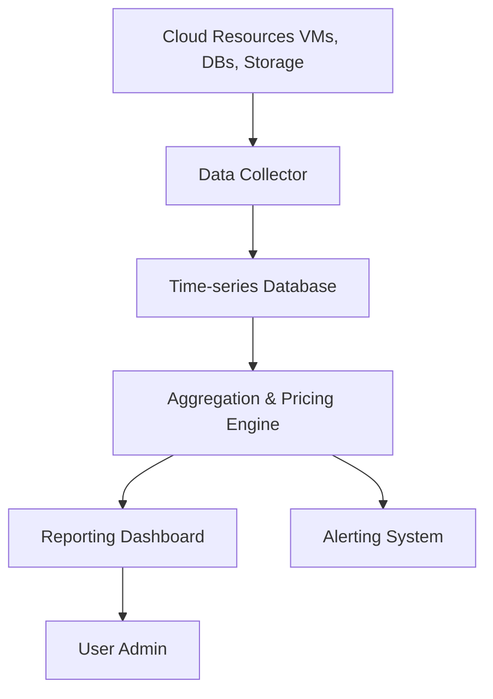

# 10 Cloud Usage Monitor

## 1. Definition

A cloud usage monitor is a software tool or service that continuously collects, records, and reports how much cloud resource is consumed by users or applications. It tracks metrics like CPU time, memory usage, storage space, network traffic, and API calls.

## 2. Concept Explanation

Cloud computing follows a pay-per-use model. To bill correctly and optimise resource usage, providers and customers need accurate measurement of what is being used. A cloud usage monitor works by frequently polling cloud APIs and hypervisors to collect raw consumption numbers, then storing these metrics in a time-series database.

The monitor's job is to convert raw data into usable information. It generates usage reports, visual dashboards, and automated alerts. This information is essential for billing, cost control, capacity planning, and meeting service-level agreements. Without usage monitors, cloud costs would be unpredictable and resources could easily be wasted.

## 3. Key Characteristics / Features

- **Real-time data collection:** The monitor gathers usage data every minute or even every few seconds for critical metrics.
- **Automated reporting:** Regular reports are generated and sent to administrators without manual effort.
- **Multi-tenant visibility:** One monitor can track usage across many different customers or departments separately.
- **Granular measurement:** Usage can be tracked down to individual virtual machines, databases, or even single functions.
- **Integration with billing:** Usage data is directly fed into the billing system for accurate invoicing.
- **Scalability:** The monitor itself is designed to handle millions of data points from large-scale cloud environments.
- **Alerting and threshold detection:** It can send warnings when usage exceeds predefined limits to control cost.

## 4. Types / Classification

**A. Based on Scope**

- **Infrastructure usage monitor:** Measures low-level resources like virtual CPU seconds, RAM megabytes per hour, and volume storage used. Examples: AWS CloudWatch, Azure Monitor.
- **Platform usage monitor:** Tracks consumption of managed platform services such as database transactions, message queue operations, or function invocations.
- **Application-level usage monitor:** Records business-level metrics such as number of user logins, API calls processed, or transactions completed.

**B. Based on Deployment**

- **Agent-based monitor:** A small piece of software runs inside each virtual machine to capture OS-level metrics in detail.
- **Agentless monitor:** Data is collected entirely through hypervisor APIs and cloud provider APIs without touching the guest OS.

## 5. Working / Mechanism

1. A data collector component continuously pulls metrics from cloud provider APIs, hypervisors, and service endpoints at defined intervals.
2. The collected raw data is timestamped and pushed into a scalable time-series database or data lake.
3. An aggregation engine groups and summarises the data into meaningful blocks (hourly, daily, monthly usage).
4. A rules engine compares the aggregated values against the customer’s pricing plan to compute the cost.
5. The reporting module generates dashboards, charts, and downloadable reports for users.
6. An alerting component sends notifications via email or SMS if any monitored resource crosses a set threshold.
7. The data is also exposed via APIs so that auto-scaling and orchestration tools can act on it.

## 6. Diagram

## 7. Mathematical Formulation

The total cost calculated by a cloud usage monitor is given by:

$$
C = \sum_{i=1}^{n} \left( U_i \times R_i \right)
$$

Where:
- `C` = total cost for the billing period
- `U_i` = consumed amount of resource `i` (e.g., CPU hours, GB of storage)
- `R_i` = unit rate of resource `i` (e.g., cost per CPU hour, cost per GB)
- `n` = total number of different resource types

## 8. Example

A company uses AWS CloudWatch to monitor its fleet of EC2 virtual servers. CloudWatch records the number of CPU seconds each instance runs each hour. At the end of the month, AWS sends a bill that matches exactly the CPU usage tracked by CloudWatch. The admin can view a graph showing peak usage and idle periods, helping right-size instances for the next month.

## 9. Analogy

A cloud usage monitor works like a prepaid electricity meter in a home. The meter continuously measures how many units of electricity are consumed. At the end of the month, the consumer pays only for the units used. Similarly, a cloud monitor counts every unit of CPU, memory, and network, then the user pays for exactly that amount.

## 10. Comparison

| Feature | Cloud Usage Monitor | Traditional Server Monitoring |
|--------|---------------------|-------------------------------|
| Main purpose | Tracks consumption for billing and cost allocation | Tracks health and uptime of physical servers |
| Data granularity | Per minute/hour usage of each virtual resource | Often per device or application |
| Billing integration | Directly connected to the pricing and billing system | Not linked to billing; manual cost calculations required |
| Scalability | Built to handle millions of resource data points across clouds | Typically monitors a fixed set of on-premise hosts |
| Elastic resource support | Automatically accounts for resources that appear and disappear | Assumes static infrastructure |

## 11. Advantages

- Ensures accurate pay-per-use billing with no manual meter reading.
- Helps identify idle or under-used resources so they can be turned off to save money.
- Provides transparent usage reports that increase customer trust.
- Enables automatic scaling decisions by showing real-time demand patterns.
- Simplifies departmental cost allocation in multi-team organisations.
- Supports SLA compliance by proving resource delivery with timestamped usage logs.

## 12. Disadvantages / Limitations

- Collecting, storing, and processing high-frequency metrics adds a small operational cost.
- Integration with custom pricing plans can be complex and needs careful configuration.
- Agent-based monitoring inside the VM may consume a small amount of the guest’s own CPU and memory.
- Monitoring delays or metric gaps can cause billing disputes.
- Privacy concerns may arise when detailed usage patterns reveal business activity.

## 13. Important Points / Exam Notes

- A cloud usage monitor is a key enabler of the pay-per-use cloud pricing model.
- It tracks resource consumption continuously and provides time-series data.
- The collected data feeds both billing systems and cloud optimisation dashboards.
- AWS CloudWatch, Azure Monitor, and Google Cloud Monitoring are common real-world examples.
- Monitors can be agent-based (inside VM) or agentless (via cloud APIs).
- Alerts help enforce budget limits and prevent cost overruns.

## 14. Applications / Use Cases

- **Pay-per-use billing:** Cloud providers use it to generate accurate invoices based on actual consumption.
- **Cost management:** Enterprise customers track team-level usage to control spending.
- **Auto-scaling:** The usage monitor feeds data to scaling policies that start or stop instances automatically.
- **Compliance auditing:** Timestamped logs prove that resources delivered match contractual agreements.
- **Chargeback and show-back:** IT departments show internal business units exactly how much cloud they consumed.

## 15. MCQs

**Q1. What is the primary purpose of a cloud usage monitor?**

A. To enhance graphics performance in the cloud  
B. To track resource consumption for billing and analysis  
C. To manage user passwords  
D. To replace physical servers  
**Answer:** B  
**Explanation:** A cloud usage monitor continuously collects data on how much cloud resources are being used, primarily for billing and optimisation.

**Q2. Which of the following is a real-world cloud usage monitoring service?**

A. Docker  
B. Amazon EC2  
C. AWS CloudWatch  
D. GitHub  
**Answer:** C  
**Explanation:** AWS CloudWatch collects and tracks metrics, logs, and events from AWS resources, serving as a usage monitor.

**Q3. Agentless monitoring collects data from:**

A. A software agent running inside the virtual machine  
B. Cloud provider APIs and hypervisors  
C. Physical network taps only  
D. Manual user inputs  
**Answer:** B  
**Explanation:** Agentless monitors do not require installing software inside the VM; they pull data from the virtualisation layer and cloud APIs.

**Q4. In the mathematical expression C = Σ (U_i × R_i), what does R_i represent?**

A. The running time of the monitor  
B. The total bill for the month  
C. The unit rate or price of resource i  
D. The number of users  
**Answer:** C  
**Explanation:** R_i is the cost per unit of resource i (e.g., price per GB or per CPU-hour).

**Q5. Which characteristic allows a usage monitor to track separate usage for different departments?**

A. Real-time collection  
B. Multi-tenant visibility  
C. Alerting  
D. Encryption  
**Answer:** B  
**Explanation:** Multi-tenant visibility means the monitor can isolate and report usage for each customer or department individually.

**Q6. What type of monitor would track the number of API calls made to a cloud function?**

A. Infrastructure usage monitor  
B. Platform usage monitor  
C. Hardware sensor monitor  
D. Network firewall  
**Answer:** B  
**Explanation:** A platform usage monitor tracks consumption of managed services like functions, databases, or queues at the platform layer.

**Q7. A cloud usage monitor sends a notification when monthly spending exceeds a set budget. This is an example of:**

A. Data collection  
B. Reporting only  
C. Alerting and threshold detection  
D. Billing modification  
**Answer:** C  
**Explanation:** Monitors can compare current usage with thresholds and send alerts, helping prevent unexpected high costs.

**Q8. Which of these is a limitation of cloud usage monitoring?**

A. It completely eliminates all cloud costs  
B. Detailed usage data may raise privacy concerns  
C. It cannot work with virtual machines  
D. It requires no storage to save data  
**Answer:** B  
**Explanation:** Highly detailed usage metrics can reveal business activity patterns, posing privacy and security concerns.

**Q9. In the analogy of a prepaid electricity meter, what does the meter correspond to?**

A. The cloud server itself  
B. The cloud usage monitor  
C. The internet connection  
D. The web browser  
**Answer:** B  
**Explanation:** The electricity meter measures electricity consumption just as the cloud usage monitor measures resource usage.

**Q10. Which application relies directly on data from a cloud usage monitor?**

A. Image editing  
B. Auto-scaling of cloud instances  
C. Data encryption  
D. File compression  
**Answer:** B  
**Explanation:** Auto-scaling policies use real-time usage metrics from the monitor to decide when to add or remove cloud instances.