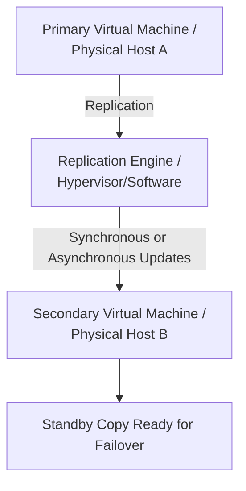

# Resource Replication

## 1. Definition
Resource replication in a virtualized environment is the process of creating and maintaining identical copies of virtual resources — such as virtual machines, storage volumes, or data sets — on separate physical hosts or storage systems. This ensures that a duplicate is always ready if the primary resource fails.

## 2. Concept Explanation
Virtualization makes resources independent of physical hardware. Replication takes advantage of this by copying the state of a running virtual machine or its data to another location. The replication can happen continuously or at scheduled intervals. If the primary site or server fails, the secondary copy can take over quickly with minimal or no data loss. This is important because it protects organizations from hardware failures, site disasters, and data corruption. It also helps balance workloads by placing copies closer to users.

## 3. Key Characteristics / Features
- **Redundancy:** Identical copies of a resource exist, so failure of one copy does not cause a complete service outage.
- **Consistency Modes:** Administrators can choose between synchronous replication, which guarantees no data loss, and asynchronous replication, which prioritizes performance.
- **Automated Failover:** The virtualization platform can automatically switch to the replicated copy without manual intervention.
- **Incremental Updates:** After the first full copy, only the changed blocks of data are sent, which saves network bandwidth.
- **Application Awareness:** Modern replication tools understand the state of applications like databases to ensure clean and recoverable copies.

## 4. Types / Classification
- **Based on Timing:**
  - *Synchronous Replication:* A write operation is not confirmed to the application until it is saved on both the primary and the secondary copy. This ensures zero data loss but may cause higher latency.
  - *Asynchronous Replication:* The write is confirmed to the application immediately, and the copy is updated shortly afterwards. This gives better performance but carries a small risk of losing the most recent data if a failure occurs before replication completes.
- **Based on Scope:**
  - *Full VM Replication:* The entire virtual machine, including its operating system, application, and configuration, is replicated.
  - *Storage-Level Replication:* Only the storage volumes associated with a VM are replicated, often done by the storage array itself.
  - *Database Replication:* Specific database instances are replicated for high availability and read load balancing.

## 5. Working / Mechanism
1. An administrator selects a virtual machine or data volume and defines a replication policy, including the destination host or storage.
2. The virtualization platform creates a complete initial copy of the resource in the target location.
3. After the initial copy, the hypervisor or replication agent tracks every write operation made by the running VM.
4. In synchronous mode, a write is held until the target acknowledges the data has been stored safely on the secondary copy.
5. In asynchronous mode, writes are collected and sent to the target after short intervals or when the burst of writes subsides.
6. A continuous monitoring process verifies that the primary and secondary copies stay synchronized. If a failure is detected, a failover process activates the secondary copy to take over the workload.

## 6. Diagram

## 7. Mathematical Formulation
*(Not applicable for this topic)*

## 8. Example
A bank runs its online transaction server on a virtual machine in a main data center. They set up synchronous replication to a secondary virtual machine in a disaster recovery site 50 kilometers away. Every transaction is written to disk in both locations before the customer gets a confirmation. If a power failure brings down the main data center, the secondary VM takes over within seconds, and no transaction records are lost.

## 9. Analogy
Think of a very cautious writer who types on two identical computers at the same time. Every letter typed on the primary computer is also immediately sent to the second one. If the first computer crashes, the writer can carry on exactly where they left off on the second machine without losing a single word. Asynchronous replication would be like the writer saving a copy to a flash drive every few minutes — faster but with a risk of losing the most recent sentences.

## 10. Comparison

| Feature | Resource Replication | Traditional Backup |
|--------|----------|----------|
| Purpose | Provides a live, up-to-date copy for immediate failover | Creates a point-in-time copy for later restoration |
| Data Currency | Near real-time, often seconds or less behind the primary | Hours or days old, depending on schedule |
| Recovery Time | Very fast, often automated failover in seconds to minutes | Slower, requires restoring data from backup media |
| Primary Use | High availability, disaster recovery, load balancing | Long-term archival, recovery from logical errors or ransomware |

## 11. Advantages
- Ensures business continuity by enabling quick recovery from hardware and site failures.
- Protects against data loss with the option of synchronous replication for zero-data-loss setups.
- Enables planned maintenance with zero downtime by temporarily switching workloads to the replica.
- Distributes read-only workloads across multiple replicas to improve performance for global users.
- Simplifies disaster recovery testing because replicas can be activated in an isolated environment without affecting production.

## 12. Disadvantages / Limitations
- It doubles or more the storage and network bandwidth requirements, which increases cost.
- Synchronous replication can cause noticeable performance slowdown because writes wait for distant acknowledgments.
- Complex configurations need experienced administrators to manage and troubleshoot split-brain scenarios.
- If the primary resource is corrupted logically, the replica may also become corrupted before the issue is noticed, as it mirrors changes in real time.

## 13. Important Points / Exam Notes
- Resource replication is a key mechanism for high availability and disaster recovery in virtualized and cloud environments.
- Synchronous replication guarantees Recovery Point Objective (RPO) of zero but may affect application response time.
- Asynchronous replication has minimal performance impact but a non-zero RPO (possible data loss of a few seconds to minutes).
- Replication is different from plain backups because it maintains a continuously updated, ready-to-run copy.
- Full VM replication captures the entire machine state, including RAM and CPU state, for instant failover in some solutions.

## 14. Applications / Use Cases
- Setting up active-passive disaster recovery sites where a remote replica takes over instantly after a primary site failure.
- Building stretched clusters across two data centers to tolerate site-level failures.
- Creating local read-only copies of a database to run reports and analytics without slowing down the primary transaction system.
- Migrating virtual machines between hosts or data centers with minimal downtime by replicating the state before the final cutover.
- Distributing virtual desktop images to branch offices so users access desktops from their nearest location.

## 15. MCQs

**Q1. What is the primary goal of resource replication in virtualization?**
A. To compress virtual hard disks  
B. To create identical, continuously updated copies of virtual resources for availability and protection  
C. To permanently delete unused data  
D. To install guest operating systems  
**Answer:** B  
**Explanation:** Replication maintains a ready-to-use copy of a VM or data, allowing quick failover and protecting against hardware or site failures.

**Q2. Which type of replication guarantees zero data loss at the expense of higher latency?**
A. Asynchronous replication  
B. Periodic backup  
C. Synchronous replication  
D. Snapshot-only replication  
**Answer:** C  
**Explanation:** Synchronous replication does not confirm a write until both the primary and the secondary have stored it, ensuring no data is lost if the primary fails immediately after.

**Q3. In asynchronous replication, when does the primary receive a write confirmation?**
A. Only after the secondary copy is updated  
B. Immediately after writing locally, without waiting for the secondary  
C. After both copies are verified by a third party  
D. Never  
**Answer:** B  
**Explanation:** Asynchronous mode acknowledges the write as soon as it is stored on the primary, then sends the update to the secondary later, reducing latency but creating a small risk.

**Q4. Which of the following is a valid advantage of using VM replication?**
A. It eliminates the need for any network connectivity  
B. It enables fast automated failover during a host or site failure  
C. It reduces storage capacity requirements by 90%  
D. It does not require any hypervisor support  
**Answer:** B  
**Explanation:** Replication keeps a standby VM ready; automated failover can then switch the workload to the replica almost instantly.

**Q5. What does “incremental update” mean in the context of replication?**
A. Always sending the entire virtual machine image  
B. Sending only the disk blocks that have changed since the last update  
C. Replacing the hypervisor during replication  
D. Deleting old copies before creating new ones  
**Answer:** B  
**Explanation:** After the initial full sync, only modified data blocks are transferred, saving network bandwidth and speeding up the replication process.

**Q6. Which of these is a major disadvantage of synchronous replication over long distances?**
A. It consumes no storage  
B. Application performance may degrade because of waiting for distant acknowledgments  
C. It automatically compresses all data  
D. It works only with physical servers  
**Answer:** B  
**Explanation:** The farther apart the sites are, the longer it takes for the secondary to acknowledge writes, which can significantly slow down the primary application.

**Q7. What is a common use case for resource replication?**
A. Printing documents in a shared printer  
B. Building a disaster recovery site with minimal data loss  
C. Configuring keyboard drivers  
D. Installing a new operating system without a hypervisor  
**Answer:** B  
**Explanation:** Replication is widely used to maintain a continuously updated copy of critical systems at a remote recovery site.

**Q8. In a virtualized environment, what tracks the changes that need to be replicated to the secondary site?**
A. The virtual network card  
B. The replication agent or hypervisor module  
C. The physical power supply  
D. The monitor screen  
**Answer:** B  
**Explanation:** The hypervisor’s replication engine or a dedicated agent intercepts write operations and ensures they are forwarded to the target replica.

**Q9. Which statement is true about full VM replication?**
A. It copies only the operating system logs  
B. It replicates the entire virtual machine, including OS, applications, and even running state in some cases  
C. It requires deleting the original VM  
D. It can only be used for Linux virtual machines  
**Answer:** B  
**Explanation:** Full VM replication copies the complete machine, allowing the replica to start immediately with the same state and data as the primary.

**Q10. In the writer analogy, synchronous replication is like:**
A. Saving a backup file once at the end of the day  
B. Typing on two computers simultaneously, with each letter appearing on both before continuing  
C. Printing a document after writing it  
D. Asking someone else to rewrite the document the next day  
**Answer:** B  
**Explanation:** Synchronous replication ensures that each change is written to both the primary and secondary before the writer proceeds, just like typing on two synced machines at once.