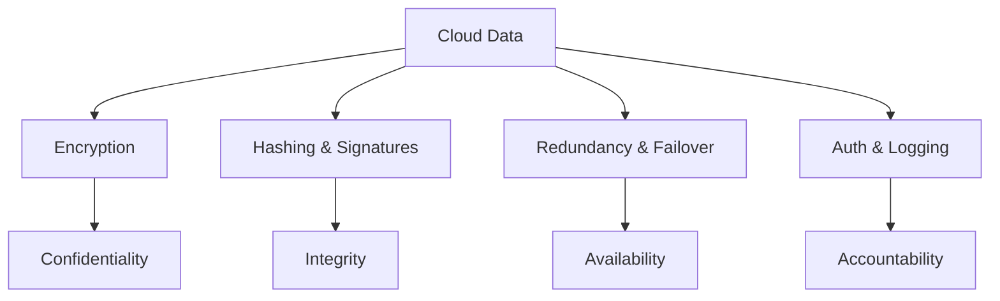

# 01 Cloud Information Security Objectives

## 1. Definition
Cloud information security objectives are the fundamental goals that guide the protection of data, applications, and services in a cloud environment. They define what security must achieve, such as keeping information secret, accurate, and available only to authorized users.

## 2. Concept Explanation
The basic idea behind cloud information security objectives is to set clear targets for protecting cloud-based resources. In cloud computing, data is stored on remote servers and accessed over the internet, which increases risk. Security objectives act like a checklist: they help organizations know what to protect and why.

These objectives work by guiding the selection and implementation of security controls. For example, if confidentiality is an objective, encryption is applied. If availability is an objective, redundant systems are built. Without defined objectives, security efforts become scattered and ineffective.

They are important because cloud environments are shared among many users. Weak security can lead to data breaches, financial loss, and legal problems. Clear objectives help maintain trust, meet regulations, and ensure that cloud services remain reliable and safe for everyone.

## 3. Key Characteristics / Features
- **Confidentiality:** Ensures that sensitive information is accessed only by authorized individuals or systems. It prevents data leakage to unauthorized parties.
- **Integrity:** Guarantees that data remains accurate, complete, and unaltered during storage or transmission. Any unauthorized modification can be detected.
- **Availability:** Ensures that cloud services and data are accessible to authorized users whenever needed. It involves preventing downtime and denial-of-service attacks.
- **Authenticity:** Verifies the identity of users, devices, or systems before granting access. This ensures that the communication or transaction is genuine.
- **Accountability:** Tracks and records user activities so that every action can be traced to a responsible individual. This supports auditing and non-repudiation.
- **Privacy:** Protects personal and sensitive data in accordance with laws and user consent. It goes beyond confidentiality by controlling how data is collected, used, and shared.

## 4. Types / Classification
Security objectives in the cloud are often grouped into two main categories:

**Core Objectives (CIA Triad)**
- **Confidentiality:** Keeping data secret from unauthorized eyes.
- **Integrity:** Keeping data unchanged and trustworthy.
- **Availability:** Keeping services and data reachable at all times.

**Supporting Objectives**
- **Authenticity:** Proving that users or systems are who they claim to be.
- **Accountability:** Linking actions to identities for responsibility.
- **Privacy:** Respecting individual rights over personal data.
- **Non-repudiation:** Preventing a person from denying their actions, often achieved through digital signatures.

## 5. Working / Mechanism
The objectives are achieved through a series of coordinated steps and controls. Below is a step-by-step logical flow of how these goals are realized in a cloud system.

1. A user or system first proves its identity through authentication methods like passwords, biometrics, or digital certificates.
2. Once authenticated, access control policies check what resources the user is allowed to view or modify, enforcing confidentiality and privacy.
3. Data is encrypted when stored and during network transmission. This ensures that even if intercepted, the information remains confidential.
4. Hashing algorithms and digital signatures are applied to data blocks. Any unauthorized change breaks the hash, thus ensuring integrity.
5. The cloud provider deploys redundant servers, load balancers, and backup power supplies. This maintains availability even if one component fails.
6. All user activities, file accesses, and system events are continuously recorded in secure logs. This builds accountability and supports audits.
7. Digital signatures and timestamping are used for critical transactions. This provides non-repudiation, ensuring that a sender cannot later deny sending a message.

## 6. Diagram
Below is a simple Mermaid diagram showing the main security objectives and how they relate to cloud data protection.

## 7. Mathematical Formulation
Cloud security objectives are often qualitative, but they can be represented as a tuple that describes the protection state:

$$
Security\_State = (C, I, A, Au, Ac, P)
$$

Where:
- C = Confidentiality (level of secrecy maintained)
- I = Integrity (degree of data accuracy and trustworthiness)
- A = Availability (uptime and accessibility percentage)
- Au = Authenticity (verification strength of identities)
- Ac = Accountability (completeness of audit trails)
- P = Privacy (compliance with personal data controls)

A highly secure cloud system strives to maximize all elements, though real-world trade-offs often occur.

## 8. Example
Consider a cloud-based online banking application. Confidentiality is achieved by encrypting all customer financial data so that even cloud administrators cannot view details without proper authorization. Integrity is maintained by using hash checks on transaction records; if someone tries to alter an amount, the system detects the mismatch. Availability is ensured through multiple data centers in different locations, so the banking service stays online even during a power outage in one region. Accountability is enforced by logging every login attempt and transaction with a timestamp and user ID, enabling full traceability.

## 9. Analogy
Think of a hospital’s medical records room. Confidentiality is like keeping patient files locked and only giving keys to doctors and nurses. Integrity means ensuring that no one can slip in and change a patient’s allergy information without detection. Availability is making sure the records room is open 24/7 for emergency staff and that lights and file cabinets are always accessible. Accountability is like having a sign-in sheet and security cameras, so you know exactly who accessed which file and when. Just as a hospital cannot function without these safeguards, a cloud service fails without its security objectives.

## 10. Comparison
A common comparison is between Confidentiality and Privacy, as they are related but distinct.

| Feature | Confidentiality | Privacy |
|--------|----------|----------|
| Meaning | Ensuring data is not disclosed to unauthorized parties. | Ensuring data about individuals is handled according to their rights and consent. |
| Focus | Data secrecy and access control. | Individual control over personal information. |
| Example | Encrypting a file so only the recipient can read it. | Letting a user decide if their location data can be collected by an app. |
| Breach Impact | Unauthorized person reads sensitive data. | Personal data is used in ways the user did not agree to. |

## 11. Advantages
- Clearly defined security objectives provide a structured way to protect cloud assets.
- They help organizations comply with legal and regulatory standards (e.g., GDPR, HIPAA).
- Achieving these goals builds customer trust and protects brand reputation.
- They reduce the risk of data breaches, financial fraud, and service outages.
- Objectives act as measurable targets for security teams and auditors.

## 12. Disadvantages / Limitations
- Implementing all objectives simultaneously can be expensive and complex.
- Strong confidentiality measures, like heavy encryption, may slow down system performance.
- Absolute security is impossible; determined attackers may still find vulnerabilities.
- Human error, such as weak passwords or misconfiguration, can undermine all objectives.
- In a shared cloud model, the customer has limited control over physical infrastructure, making certain availability goals harder to guarantee.

## 13. Important Points / Exam Notes
- The CIA triad (Confidentiality, Integrity, Availability) is the foundation of all cloud security objectives.
- Accountability is achieved through logging, monitoring, and audit trails; it answers “who did what and when”.
- Non-repudiation prevents denial of actions and is often implemented using digital signatures.
- In the cloud shared responsibility model, the provider secures the infrastructure, but the customer must secure their data and access, meeting objectives accordingly.
- Privacy is becoming a legal requirement, not just a best practice, in many cloud deployments.

## 14. Applications / Use Cases
- **E-commerce platforms:** Protect customer payment details (confidentiality), ensure order information is not tampered (integrity), and keep the store online 24/7 (availability).
- **Healthcare cloud systems:** Safeguard patient records, ensure lab results remain accurate, and allow doctors to access data during emergencies.
- **Government portals:** Maintain citizen data privacy, prevent unauthorized changes to records, and provide uninterrupted public services.
- **Software as a Service (SaaS):** Business apps like Google Workspace apply all objectives to protect corporate emails and documents.

## 15. MCQs

**Q1. Which of the following is NOT part of the CIA triad?**
A. Confidentiality  
B. Integrity  
C. Authentication  
D. Availability  
**Answer:** C  
**Explanation:** The CIA triad consists of Confidentiality, Integrity, and Availability. Authentication is a supporting security objective.

**Q2. What is the main goal of integrity in cloud security?**
A. Keeping data secret  
B. Ensuring data is accurate and unaltered  
C. Making services always available  
D. Identifying users  
**Answer:** B  
**Explanation:** Integrity ensures that data remains correct, consistent, and free from unauthorized modification.

**Q3. Which technique primarily supports confidentiality in the cloud?**
A. Load balancing  
B. Encryption  
C. Logging  
D. Hashing  
**Answer:** B  
**Explanation:** Encryption scrambles data so only authorized parties with the key can read it, thus maintaining confidentiality.

**Q4. Availability is best described as:**
A. Data being hidden from unauthorized users  
B. Services being accessible when needed  
C. Tracking user actions  
D. Proving the sender of a message  
**Answer:** B  
**Explanation:** Availability means that cloud services and data are reachable and usable by authorized users at any required time.

**Q5. Accountability in cloud security relies heavily on:**
A. Encryption keys  
B. Redundant hardware  
C. Audit logs and monitoring  
D. Fingerprint scanners  
**Answer:** C  
**Explanation:** Audit logs record who accessed what and when, enabling accountability and forensic analysis.

**Q6. Non-repudiation ensures that:**
A. Data is encrypted at rest  
B. A user cannot deny performing an action  
C. Systems never fail  
D. Access is granted to all users  
**Answer:** B  
**Explanation:** Non-repudiation provides proof of the origin and integrity of data, preventing the sender from denying their involvement.

**Q7. Which objective is specifically concerned with personal data handling and consent?**
A. Confidentiality  
B. Integrity  
C. Privacy  
D. Availability  
**Answer:** C  
**Explanation:** Privacy focuses on respecting individual rights over personal data, including how it is collected, used, and shared.

**Q8. In a cloud shared responsibility model, the customer is primarily responsible for:**
A. Physical security of data centers  
B. Securing their data and access controls  
C. Power and cooling of servers  
D. Network hardware maintenance  
**Answer:** B  
**Explanation:** The cloud provider secures the infrastructure, but the customer must protect their own data, identities, and applications.

**Q9. Hashing is a technique used to achieve which security objective?**
A. Availability  
B. Accountability  
C. Integrity  
D. Privacy  
**Answer:** C  
**Explanation:** Hashing creates a unique digital fingerprint of data; any change alters the hash, helping to verify integrity.

**Q10. A bank’s failure to process transactions due to a server crash is a failure of which objective?**
A. Confidentiality  
B. Integrity  
C. Availability  
D. Non-repudiation  
**Answer:** C  
**Explanation:** When a system or service is not accessible to users, the availability objective is compromised.