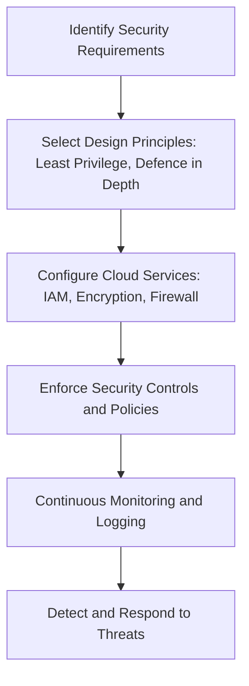

# Cloud Security Services Relevant Cloud Security Design Principles

## 1. Definition

Cloud Security Services are the tools and managed services offered by a cloud provider to protect data, applications, and infrastructure.
Relevant Cloud Security Design Principles are the fundamental rules and best practices that guide how these security services should be used and configured to build a secure cloud environment.

## 2. Concept Explanation

Cloud computing introduces shared responsibility between the provider and the customer. Cloud security services, such as firewalls, identity management, and encryption, provide technical controls. However, using these services correctly requires a set of secure design principles. These principles act as a blueprint for making decisions that reduce risk.  

The basic idea is to first understand available cloud security services. Then, you apply time-tested design principles—like granting minimal access or creating multiple layers of defence—when configuring them. This combination ensures that the cloud setup is not just functional but also resilient against threats.  

It is important because misconfigurations and weak security designs are a leading cause of cloud data breaches. When security services are guided by sound principles, the overall protection becomes stronger, consistent, and easier to audit. This approach helps organisations meet compliance requirements and protect sensitive information without slowing down innovation.

## 3. Key Characteristics / Features

- **Shared Responsibility Model:** Cloud providers secure the underlying infrastructure while the customer secures their data, applications, and access using the available security services.  
- **Managed and Automated:** Cloud security services are fully managed by the provider and can be automated using policies, reducing manual effort and human errors.  
- **Principle-Driven Configuration:** Design principles ensure that security controls are applied consistently across all cloud resources.  
- **Scalability:** Security services can scale automatically with the workload, applying the same design principles to thousands of resources instantly.  
- **Centralised Visibility:** Monitoring and logging services collect security data in one place, making it easier to detect threats.  
- **Integration with DevOps:** Security services and principles can be embedded into CI/CD pipelines, enabling “security as code”.

## 4. Types / Classification

Cloud security services and their relevant design principles are often categorised as follows.

**Types of Cloud Security Services**

- **Identity and Access Management (IAM):** Services that manage user identities, roles, and permissions to control who can access resources.  
- **Data Protection Services:** Encryption and key management services that protect data at rest and in transit.  
- **Network Security Services:** Virtual firewalls, web application firewalls (WAF), and DDoS protection that secure network boundaries.  
- **Threat Detection and Monitoring:** Services that continuously monitor logs, detect anomalies, and send alerts for potential security incidents.  
- **Compliance and Governance Services:** Tools that automatically check configurations against industry standards and regulations.

**Relevant Cloud Security Design Principles**

- **Least Privilege:** Grant users, applications, and services only the permissions they need to perform their function, nothing more.  
- **Defence in Depth:** Apply multiple independent layers of security so that if one layer fails, others still provide protection.  
- **Secure by Default:** Systems should default to a secure state, requiring explicit action to reduce security.  
- **Separation of Duties:** Divide critical functions among different users or services to prevent a single person from compromising the entire system.  
- **Fail Securely:** In case of an error or failure, the system should deny access by default instead of granting it.  
- **Economy of Mechanism:** Keep the design of security mechanisms as simple as possible; complexity introduces vulnerabilities.

## 5. Working / Mechanism

The following steps explain how cloud security services work together with design principles to create a secure cloud environment.

1. The organisation identifies its security requirements based on data sensitivity, compliance needs, and threat model.  
2. Security architects select relevant design principles, such as Least Privilege and Defence in Depth, to address those requirements.  
3. Cloud security services like IAM, encryption, and virtual firewalls are configured strictly according to the chosen principles.  
4. For example, IAM policies grant only the exact permissions needed for each role, following Least Privilege.  
5. Multiple security layers are activated—network firewalls, application-level WAF, and encryption—implementing Defence in Depth.  
6. Automated monitoring and logging services collect security events continuously.  
7. Alert rules based on predefined principles trigger notifications or automatic remediation actions when anomalies occur.  
8. Regular audits and compliance checks verify that the configuration still matches the original design principles.

## 6. Diagram

## 7. Mathematical Formulation

Not directly applicable for this topic.

## 8. Example

A financial company moves its customer portal to the cloud. They use the cloud security service **IAM** and apply the principle of **Least Privilege**. Developers get read-only access to logs, while only the operations team can modify production servers. Next, they enable **encryption at rest** for the database and use a **Web Application Firewall (WAF)** to block common web attacks. All these services follow the **Defence in Depth** principle: even if an attacker bypasses the firewall, they still cannot read the database without decryption keys and lack administrative rights. Additionally, **cloud monitoring** services track all login attempts, and alerts fire on any suspicious activity, enabling a quick response.

## 9. Analogy

Imagine a high-security office building.  
- **Cloud Security Services** are like the physical locks on doors, the security cameras, and the guard at the entrance.  
- **Design Principles** are the rules that say, “every employee gets access only to their own floor” (Least Privilege) and “visitors must be escorted, and inner doors require a separate card” (Defence in Depth).  
Even if someone manages to trick the guard, they still face multiple locked doors and camera surveillance, making the whole building far safer than relying on just one lock.

## 10. Comparison

| Feature | Cloud Security Services | Cloud Security Design Principles |
|--------|--------------------------|----------------------------------|
| Meaning | Tools and managed offerings provided by the cloud vendor to implement security controls. | Fundamental rules and best practices that guide how security should be designed and applied. |
| Purpose | Provide the actual technical controls (e.g., encrypt data, allow/block traffic). | Ensure those controls are used effectively and consistently, reducing the chance of misconfiguration. |
| Example | IAM, AWS KMS, Azure Firewall, Google Cloud Armor. | Least Privilege, Defence in Depth, Secure by Default. |

## 11. Advantages

- **Stronger overall security posture** because multiple principles reinforce each other when configuring services.  
- **Reduced risk of data breaches** by minimising access and adding protective layers.  
- **Easier compliance** with standards like ISO 27001, PCI DSS, and GDPR, as many principles are part of these frameworks.  
- **Consistent security across large environments** because services are configured using the same principle-based templates.  
- **Lower operational cost of security incidents** as early detection and automation prevent small issues from becoming large problems.  
- **Simpler audits and reviews** since the security design is documented and based on well-known principles.

## 12. Disadvantages / Limitations

- **Initial complexity** can be high as architects must understand both the cloud services and the design principles thoroughly.  
- **Misconfiguration is still possible** if principles are not strictly followed, leading to false sense of security.  
- **Cost of multiple security services** may increase the monthly cloud bill, especially in smaller projects.  
- **Over-reliance on default settings** can inadvertently violate the “Secure by Default” principle if the provider’s defaults are not aligned with organisational needs.  
- **Requires skilled personnel** who can map principles to the correct service configurations; lack of training often leads to gaps.

## 13. Important Points / Exam Notes

- Cloud security relies on the **shared responsibility model**: the provider secures the cloud, the customer secures *in* the cloud.  
- **Least Privilege** is the most fundamental design principle; always start by granting zero permissions and add only what is needed.  
- **Defence in Depth** means never relying on a single security control; combine firewalls, encryption, IAM, and monitoring.  
- **Secure by Default** demands that any new resource or service should be in a secure state until it is deliberately configured otherwise.  
- **Encryption** must be used for data at rest (stored) and data in transit (moving across networks).  
- Design principles are **implementation-independent**; they apply to any cloud provider.  
- Automating security checks using **cloud-native monitoring and policy tools** helps maintain principle-based configurations continuously.

## 14. Applications / Use Cases

- **E‑commerce platforms** use cloud WAF, IAM, and encryption to protect customer payment data while ensuring the website stays fast and available.  
- **Healthcare organisations** map privacy principles like Least Privilege to cloud IAM roles, so only authorised medical staff can view patient records.  
- **Software-as-a-Service (SaaS) products** embed cloud security principles into their development pipelines, scanning every code change for misconfigurations before deployment.  
- **Government agencies** apply Defence in Depth with multiple cloud network layers and strict identity checks to safeguard classified citizen databases.  
- **Startups** use pre-defined principle-based templates (landing zones) to get a secure foundation on day one without a dedicated security team.

## 15. MCQs

**Q1. Which design principle states that a user should be given only the permissions necessary to perform their job?**  
A. Defence in Depth  
B. Secure by Default  
C. Least Privilege  
D. Separation of Duties  
**Answer:** C  
**Explanation:** Least Privilege minimises access rights, reducing the potential damage from errors or attacks.

**Q2. Which of the following is an example of a cloud security service?**  
A. Least Privilege  
B. Defence in Depth  
C. Identity and Access Management (IAM)  
D. Secure by Default  
**Answer:** C  
**Explanation:** IAM is a cloud service that manages identities and permissions; the others are design principles.

**Q3. The concept of multiple layers of security controls is called:**  
A. Economy of Mechanism  
B. Fail Securely  
C. Defence in Depth  
D. Open Design  
**Answer:** C  
**Explanation:** Defence in Depth ensures that if one security layer is breached, others still provide protection.

**Q4. In the shared responsibility model, who is responsible for securing data in the cloud?**  
A. Only the cloud provider  
B. Only the customer  
C. The customer and the cloud provider share responsibility  
D. Neither, data is automatically secured  
**Answer:** C  
**Explanation:** The provider secures the infrastructure, while the customer is responsible for data, access management, and application security.

**Q5. A system that denies access by default when an error occurs follows which principle?**  
A. Secure by Default  
B. Fail Securely  
C. Least Privilege  
D. Economy of Mechanism  
**Answer:** B  
**Explanation:** Failing securely means that a failure does not grant unauthorised access; it defaults to a safe state.

**Q6. Which cloud security service helps protect web applications from common attacks like SQL injection?**  
A. IAM  
B. Key Management Service  
C. Web Application Firewall (WAF)  
D. Cloud Monitoring  
**Answer:** C  
**Explanation:** A WAF filters and monitors HTTP traffic to and from a web application to block malicious requests.

**Q7. What is the primary purpose of encryption in cloud security?**  
A. To reduce network latency  
B. To ensure data confidentiality  
C. To manage user identities  
D. To detect malware  
**Answer:** B  
**Explanation:** Encryption scrambles data so that only authorised parties with the decryption key can read it, ensuring confidentiality.

**Q8. “Keep the security design as simple as possible” refers to which principle?**  
A. Separation of Duties  
B. Defence in Depth  
C. Economy of Mechanism  
D. Complete Mediation  
**Answer:** C  
**Explanation:** Economy of Mechanism means that simpler designs are easier to verify and less prone to implementation bugs.

**Q9. Which of the following is an advantage of applying security design principles to cloud services?**  
A. Eliminates all security risks  
B. Removes the need for encryption  
C. Ensures consistent and robust security posture  
D. Makes the cloud free of cost  
**Answer:** C  
**Explanation:** Principles provide a consistent framework, leading to a more reliable and secure configuration across services.

**Q10. A company uses cloud monitoring and logging services. What is a key benefit of these services?**  
A. They automatically delete all malicious files.  
B. They eliminate the need for firewalls.  
C. They provide visibility and detect suspicious activity.  
D. They manage user passwords.  
**Answer:** C  
**Explanation:** Monitoring and logging collect security events, helping teams identify and respond to threats in real time.
