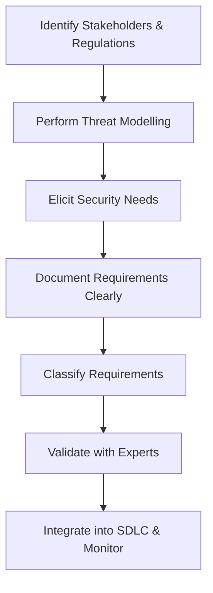

# Secure_Cloud_Software_Requirements

## Video Explanation

* [https://www.youtube.com/watch?v=9IGmwk2t0oQ](https://www.youtube.com/watch?v=9IGmwk2t0oQ)

## Visual Aids

## 1. Definition
Secure cloud software requirements are the specific security needs and constraints that a cloud application must meet to protect data, ensure privacy, maintain compliance, and resist cyber threats throughout its lifecycle.

## 2. Concept Explanation
When building cloud software, security must be planned from the very beginning. Secure software requirements define what the application should do to stay safe and how it should behave under attack.  
They are gathered from legal regulations, business risks, user expectations, and known threats. These requirements are then written clearly so that developers, testers, and architects all understand exactly what protection measures to implement.  
Without clear security requirements, a cloud application may have weak points that attackers can exploit. This can lead to data leaks, financial loss, legal penalties, and damage to the organisation’s reputation. Therefore, defining security requirements early is a fundamental step in building trustworthy cloud software.

## 3. Key Characteristics / Features
- Each security requirement is specific, measurable, and testable.
- They cover the three pillars of security: confidentiality, integrity, and availability.
- They are mapped to compliance standards such as GDPR, HIPAA, or PCI DSS.
- They address security for data both in transit and at rest.
- They include identity and access management controls.
- They are continuously reviewed and updated as threats evolve.
- They can be verified through testing and auditing.

## 4. Types / Classification
Secure cloud software requirements can be classified into three main types:

- **Functional security requirements**  
  These describe a specific security action the system must perform. Example: “The system must lock an account after five consecutive failed login attempts.”

- **Non-functional security requirements**  
  These define how the system should behave or the quality constraints for security. Example: “All data at rest must be encrypted using AES-256.”

- **Compliance and regulatory requirements**  
  These are driven by laws, regulations, or industry standards that the software must follow. Example: “The application must allow users to request deletion of their personal data as per GDPR.”

## 5. Working / Mechanism
Defining secure cloud software requirements follows a step-by-step process:

1. Identify all stakeholders, legal obligations, and industry standards that apply to the cloud application.
2. Perform threat modelling to understand how an attacker might target the system.
3. Elicit security needs from the business goals, risk appetite, and threat analysis.
4. Write the requirements in clear, unambiguous language that developers can understand.
5. Classify each requirement as functional, non-functional, or compliance-related.
6. Validate the requirements with security experts and key stakeholders to ensure they are complete and correct.
7. Integrate the requirements into the software development lifecycle so they guide design, coding, testing, and deployment.
8. Continuously monitor and update the requirements as new threats or regulations emerge.

## 6. Diagram

## 7. Mathematical Formulation
No direct mathematical formula is used to write secure software requirements. However, risk-based prioritisation can be applied using a simple risk score to decide which requirements are most critical:

$$
\text{Risk Score} = \text{Likelihood of Threat} \times \text{Impact of Breach}
$$

Where:  
- **Likelihood of Threat** is the chance that a particular attack will occur.  
- **Impact of Breach** is the severity of damage if the security control fails.

## 8. Example
An online banking cloud application must protect customer transactions. One secure software requirement states:  
“All communication between the mobile app and the cloud server must use TLS 1.3 encryption. Additionally, customer passwords must be hashed using bcrypt before storing them in the database.”  
This requirement is specific, testable, and ensures both data-in-transit and data-at-rest are protected.

## 9. Analogy
Imagine you are designing a new car. The safety requirements—like seatbelts, airbags, and anti-lock brakes—must be decided before the car is built, not added after an accident happens. Similarly, secure cloud software requirements are the safety specifications you define early so that the finished application is resilient against cyber attacks from day one.

## 10. Comparison (if needed)

| Feature | Functional Security Requirement | Non-functional Security Requirement |
|--------|----------------------------------|--------------------------------------|
| Meaning | Defines a specific security action the system must take. | Defines a quality or constraint on how security is implemented. |
| Nature | Action-oriented (what the system does). | Quality-oriented (how well or under what conditions it operates). |
| Example | “The system must enforce two-factor authentication for all admin logins.” | “The authentication process must not take more than 2 seconds.” |

## 11. Advantages
- Helps integrate security from the very start of development, reducing late-stage fixes.
- Minimises the number of vulnerabilities in the final cloud application.
- Ensures the software meets legal and regulatory obligations.
- Provides clear and unambiguous guidance for developers and testers.
- Builds customer trust by demonstrating a strong commitment to data protection.
- Makes security measurable and auditable during testing and reviews.

## 12. Disadvantages / Limitations
- It can be difficult to capture every possible security need before development begins.
- May increase the initial planning time and project cost.
- Overly strict security requirements can sometimes harm user experience or performance.
- Requirements must be continuously maintained as new threats and technologies appear.
- Conflicting business and security requirements can require difficult trade-offs.

## 13. Important Points / Exam Notes
- Secure cloud software requirements must support the CIA triad: Confidentiality, Integrity, and Availability.
- They are derived from threat modelling, risk assessment, and compliance obligations.
- Functional requirements state what protections the software must perform; non-functional requirements state how well those protections must work.
- Good security requirements are SMART: Specific, Measurable, Achievable, Relevant, and Time-bound where possible.
- Writing security requirements early is a “shift-left” practice that reduces long-term cost and risk.
- Requirements form the foundation of a secure Software Development Lifecycle (SDLC) in cloud computing.

## 14. Applications / Use Cases
- **Online payment systems** use secure requirements to enforce PCI DSS rules for handling cardholder data.
- **Healthcare cloud platforms** define requirements that meet HIPAA rules for patient data privacy.
- **Banking applications** require strong authentication, audit trails, and encryption through formal security requirements.
- **Government cloud services** set requirements for data residency and strict access controls.
- **IoT cloud backends** require secure device authentication and encrypted firmware update mechanisms.

## 15. MCQs

**Q1. What is the primary purpose of a secure cloud software requirement?**
A. To design the user interface  
B. To specify the security needs and constraints of a cloud application  
C. To define the marketing plan  
D. To select the cloud provider  

**Answer:** B  
**Explanation:** Secure software requirements outline exactly what security measures the cloud application must have.

---

**Q2. Which of the following is an example of a functional security requirement?**
A. The system should have high availability.  
B. The system must lock the account after five failed logins.  
C. Encryption should use strong algorithms.  
D. Logging must not slow down the system.  

**Answer:** B  
**Explanation:** Locking an account after failed attempts is a specific action, making it a functional requirement.

---

**Q3. When should secure cloud software requirements be defined?**
A. After the software is deployed  
B. During testing only  
C. At the beginning of the development lifecycle  
D. Only after a security breach  

**Answer:** C  
**Explanation:** Security must be integrated from the start (shift-left) to be effective and cost-efficient.

---

**Q4. What does the “CIA” in CIA triad stand for?**
A. Cloud, Internet, Application  
B. Confidentiality, Integrity, Availability  
C. Control, Inspection, Audit  
D. Cost, Impact, Action  

**Answer:** B  
**Explanation:** Confidentiality, Integrity, and Availability are the three fundamental principles of information security.

---

**Q5. Which type of requirement is “All data at rest must be encrypted with AES-256”?**
A. Functional security requirement  
B. Business requirement  
C. Non-functional security requirement  
D. User interface requirement  

**Answer:** C  
**Explanation:** It describes a quality constraint (how encryption must be performed), making it non-functional.

---

**Q6. Why is threat modelling an important step in defining security requirements?**
A. It reduces the cost of servers.  
B. It helps find potential attack paths and specify protections.  
C. It designs the database schema.  
D. It chooses programming languages.  

**Answer:** B  
**Explanation:** Threat modelling uncovers how an attacker might compromise the system, so requirements can block those paths.

---

**Q7. Which of the following is NOT an advantage of defining security requirements early?**
A. Fewer vulnerabilities after release  
B. Lower cost of fixing security bugs  
C. Guaranteed zero attacks  
D. Better compliance with regulations  

**Answer:** C  
**Explanation:** Even strong requirements cannot guarantee zero attacks; they only reduce risk.

---

**Q8. A security requirement derived from a law is called a:**
A. Functional requirement  
B. Compliance requirement  
C. Design requirement  
D. Performance requirement  

**Answer:** B  
**Explanation:** Requirements that come from legal or regulatory standards are classified as compliance requirements.

---

**Q9. Which risk formula helps prioritise security requirements?**
A. Risk = Profit – Loss  
B. Risk = Likelihood × Impact  
C. Risk = Data Size ÷ Bandwidth  
D. Risk = Users × Passwords  

**Answer:** B  
**Explanation:** The combination of how likely a threat is and how much impact it would have gives a risk score for prioritisation.

---

**Q10. Which standard is most relevant for security requirements involving credit card data in the cloud?**
A. GDPR  
B. HIPAA  
C. PCI DSS  
D. ISO 9001  

**Answer:** C  
**Explanation:** PCI DSS specifically governs security requirements for handling payment card information.