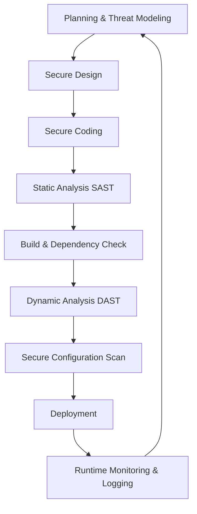

# Secure_Development_practices

## Video Explanation

* [https://www.youtube.com/watch?v=1O6YQn7k3nI](https://www.youtube.com/watch?v=1O6YQn7k3nI)

## Visual Aids

## 1. Definition
Secure development practices are a set of guidelines, techniques, and tools used to build software that is resistant to attacks and protects data from the very beginning of its creation. In cloud computing, these practices ensure that applications and services are designed, coded, and deployed with security as a core requirement, not an afterthought.

## 2. Concept Explanation
The basic idea is to "shift security left," meaning security is considered from the earliest planning and design stages of software development. Instead of testing for vulnerabilities only after the software is built, developers anticipate threats and write secure code during construction.

How it works: Teams follow a secure software development life cycle (SSDLC). They identify potential threats, apply secure coding rules, use automated scanning tools, and continuously test for weaknesses. Every step includes security checks. When the application moves to the cloud, deployment configurations are hardened, and monitoring is set up to catch attacks in real time.

Why it is important: Cloud applications face constant threats like data breaches, injection attacks, and unauthorized access. Fixing security flaws after software is live is much costlier and riskier than preventing them during development. Secure development practices reduce vulnerabilities, protect user data, and help meet legal and compliance requirements. For diploma students entering the cloud field, understanding these methods is essential to building trustworthy systems.

## 3. Key Characteristics / Features
- **Proactive approach:** Security is built into every stage of development, from design to release, rather than being added after the fact.
- **Threat modeling:** Potential attacks and weaknesses are identified early so they can be addressed before any code is written.
- **Secure coding standards:** Developers follow specific rules to avoid common vulnerabilities like SQL injection, cross-site scripting, and buffer overflows.
- **Automated security testing:** Tools automatically scan code, dependencies, and running applications for flaws throughout the development pipeline.
- **Continuous monitoring and feedback:** Security telemetry from live cloud environments informs the development team about new risks and helps improve future builds.
- **Least privilege principle:** Applications and services are given only the minimum permissions they need to function, reducing the impact of a breach.

## 4. Types / Classification
Secure development practices can be grouped by the phase in which they are applied or by their security function.

**By development phase:**
- **Design practices:** Threat modeling, security requirement analysis, and architecture risk assessment.
- **Implementation practices:** Secure coding guidelines, peer code reviews, and static application security testing (SAST).
- **Testing practices:** Dynamic application security testing (DAST), penetration testing, and software composition analysis (SCA).
- **Deployment practices:** Hardening configurations, infrastructure as code security scanning, and secure secret management.
- **Operational practices:** Runtime application self-protection (RASP), continuous monitoring, and incident response drills.

**By security function:**
- **Preventive:** Techniques that stop vulnerabilities from being introduced, such as input validation and encryption.
- **Detective:** Techniques that find weaknesses after code is written, such as code analysis and fuzz testing.
- **Corrective:** Processes that fix identified issues and update libraries, including patch management and software updates.

## 5. Working / Mechanism
Below is a step-by-step flow of how secure development practices are integrated into a cloud application lifecycle.

1. During the planning phase, the team identifies security requirements and conducts threat modeling to understand what could go wrong.
2. Architects design the system with security controls such as network segmentation, authentication, and encryption built into the blueprint.
3. Developers write code following secure coding standards, for example, using parameterized queries to prevent SQL injection and escaping outputs to stop cross-site scripting.
4. Every code change triggers automated static analysis (SAST) that scans the source code for vulnerabilities without running the program.
5. The application is built, and software composition analysis checks all third-party libraries and dependencies for known security flaws.
6. Dynamic analysis (DAST) tests the running application in a staging environment by simulating attacks to find runtime weaknesses.
7. Before deployment, the cloud infrastructure configuration is scanned to ensure it follows security best practices, such as encrypted storage and properly configured firewalls.
8. After deployment, runtime monitoring and logging track abnormal behaviors. Alerts notify the team of potential breaches, and the feedback loops back to improve future designs and code.

## 6. Diagram
The following Mermaid diagram shows a simplified secure development pipeline for cloud applications, with security checks integrated at every major stage.

## 7. Mathematical Formulation
One useful measurement in secure development is the vulnerability density, which indicates the number of security defects relative to the size of the codebase.

$$
\text{Vulnerability Density} = \frac{\text{Number of Security Vulnerabilities}}{\text{KLOC}}
$$

Where:
- **Number of Security Vulnerabilities** = total verified security flaws found during testing.
- **KLOC** = thousands of lines of code (a size metric).

A lower vulnerability density is a sign of more secure coding practices. It helps teams measure improvement over time.

## 8. Example
A development team is building a cloud-based patient portal for a hospital. During the design phase, they perform threat modeling and realize an attacker might try to view another patient’s medical records by changing a URL parameter. To prevent this, they implement strict access controls and validate user permissions on every request. While coding, they use prepared statements for all database queries to block SQL injection. They configure their CI/CD pipeline to run a static code scanner, which detects a hardcoded API key in the source code. The key is immediately removed and stored in a secure vault. Before going live, penetration testers attempt to break in and confirm the fixes are effective. The application launches without known vulnerabilities.

## 9. Analogy
Think of secure development like building a car with safety features integrated from the start. Airbags, anti-lock brakes, and crumple zones are designed into the car’s structure. You do not wait until after a crash test to add seatbelts. Similarly, secure development installs security controls like input validation and encryption during coding, rather than trying to bolt them on after a data breach occurs. A car with built-in safety protects passengers; secure development protects data and users.

## 10. Comparison
Below is a comparison between traditional software development and secure development (often called DevSecOps when automated).

| Feature | Traditional Development | Secure Development (DevSecOps) |
|--------|----------|----------|
| Security timing | Security tested at the end, just before release | Security integrated from the start, in every phase |
| Responsibility | Mainly the security team’s job before launch | Shared responsibility of developers, operations, and security engineers |
| Tools | Manual penetration testing, late-stage review | Automated SAST, DAST, dependency scanning in the pipeline |
| Fix cost | High, because flaws are found late and may require large rework | Lower, because issues are caught early and fixed incrementally |
| Mindset | "Build first, secure later" | "Security as code, continuous security" |

## 11. Advantages
- Security vulnerabilities are identified and fixed early, reducing the cost and effort of repairs.
- The final cloud application is more resilient to common attacks like injection, cross-site scripting, and misconfiguration.
- Compliance with regulations such as GDPR, HIPAA, or PCI DSS is easier to achieve and demonstrate.
- Automated security checks speed up development without sacrificing safety, enabling faster releases.
- The shared responsibility model is supported because the team builds secure software, complementing cloud provider infrastructure security.
- Customer trust increases because data breaches and service disruptions are less likely.

## 12. Disadvantages / Limitations
- Secure development requires training and a cultural shift; developers may initially resist learning new secure coding rules.
- Integrating multiple security tools into the pipeline can slow down builds if not optimized.
- No matter how thorough, testing cannot guarantee zero vulnerabilities; zero-day flaws still pose a risk.
- Smaller teams may lack the budget or expertise to implement comprehensive secure practices.
- Over-reliance on automated tools can lead to a false sense of security if human review and business logic checks are skipped.

## 13. Important Points / Exam Notes
- Secure development is often summarized as “shifting security left” – starting protection from the earliest planning stage.
- The SSDLC (Secure Software Development Life Cycle) adds security activities like threat modeling, secure coding, and security testing to every phase of development.
- SAST (Static Application Security Testing) scans source code without running it; DAST (Dynamic Application Security Testing) attacks a running application to find flaws.
- Input validation, output encoding, and parameterized queries are the most effective ways to prevent common web vulnerabilities.
- In the cloud, secure development also includes infrastructure as code (IaC) scanning and managing secrets properly.
- The principle of least privilege must be applied to cloud service roles and application functions to minimize blast radius.
- DevSecOps is the practice of automating security checks within the DevOps pipeline, making security a continuous process.

## 14. Applications / Use Cases
- **Cloud-native microservices:** Each service is developed with secure APIs, mutual TLS, and strict authentication, all verified in the CI/CD pipeline.
- **SaaS products:** Companies like Salesforce or ServiceNow integrate secure development to protect customer data and meet enterprise compliance.
- **E-commerce platforms:** Payment processing modules undergo threat modeling and PCI DSS-mandated secure coding to prevent fraud.
- **Banking applications:** Secure development practices prevent transaction manipulation, account takeover, and data leakage.
- **Healthcare cloud systems:** Patient data encryption, audit logging, and secure APIs are baked in from design to comply with HIPAA.

## 15. MCQs

**Q1. What does “shifting security left” mean?**
A. Moving security responsibilities to the end user  
B. Introducing security only during deployment  
C. Integrating security early in the development process  
D. Using left-hand navigation for security settings  
**Answer:** C  
**Explanation:** Shifting left means considering security from the earliest stages of planning and coding rather than waiting until testing or release.

**Q2. Which tool analyzes source code for vulnerabilities without executing it?**
A. DAST  
B. SAST  
C. Firewall  
D. Load balancer  
**Answer:** B  
**Explanation:** Static Application Security Testing (SAST) examines source code, bytecode, or binary code for security flaws without running the program.

**Q3. Which secure coding practice helps prevent SQL injection?**
A. Disabling error messages  
B. Using parameterized queries  
C. Increasing connection timeouts  
D. Encrypting the database file  
**Answer:** B  
**Explanation:** Parameterized queries separate SQL logic from data, so user input cannot alter the query structure and cause injection.

**Q4. What is the primary goal of threat modeling?**
A. To create backups of the source code  
B. To test the application after it is deployed  
C. To identify potential threats and design flaws early  
D. To measure network latency  
**Answer:** C  
**Explanation:** Threat modeling is a structured approach to identify, quantify, and address security risks during the design phase.

**Q5. In a DevSecOps pipeline, when does dynamic application security testing (DAST) typically occur?**
A. While writing source code  
B. After the application is running in a test environment  
C. Only when a security incident is reported  
D. During the initial idea brainstorm  
**Answer:** B  
**Explanation:** DAST tests a running application, usually in a staging or testing environment, by simulating external attacks.

**Q6. What is the principle of least privilege in secure cloud development?**
A. Giving all users administrator access  
B. Providing access based on job title only  
C. Granting only the minimum permissions needed to perform a task  
D. Allowing full access until an audit occurs  
**Answer:** C  
**Explanation:** Least privilege reduces risk by ensuring that if an account or service is compromised, the damage is limited.

**Q7. Software composition analysis (SCA) is used to:**
A. Measure team productivity  
B. Check open-source libraries and dependencies for known vulnerabilities  
C. Optimize cloud costs  
D. Encrypt network traffic  
**Answer:** B  
**Explanation:** SCA scans third-party components for security issues, licensing problems, and outdated versions.

**Q8. Which of the following is an example of a secure deployment practice?**
A. Hardcoding API keys in source code for easy access  
B. Scanning infrastructure as code templates for misconfigurations  
C. Disabling logging to improve performance  
D. Using default passwords for all services  
**Answer:** B  
**Explanation:** Scanning IaC (like Terraform or CloudFormation) for security misconfigurations ensures safe cloud deployment.

**Q9. Why are automated security checks in the CI/CD pipeline valuable?**
A. They replace the need for developers  
B. They eliminate all possible vulnerabilities  
C. They find issues quickly and consistently with every code change  
D. They slow down development so managers can review manually  
**Answer:** C  
**Explanation:** Automation provides fast, repeatable security feedback, helping teams catch flaws early without manual effort.

**Q10. Secure development practices help with compliance because:**
A. They automatically guarantee zero vulnerabilities  
B. They provide evidence of security controls throughout the software lifecycle  
C. They remove the need for encryption  
D. They reduce the number of developers needed  
**Answer:** B  
**Explanation:** By documenting threat models, code reviews, and test results, secure development provides auditable proof of due diligence.