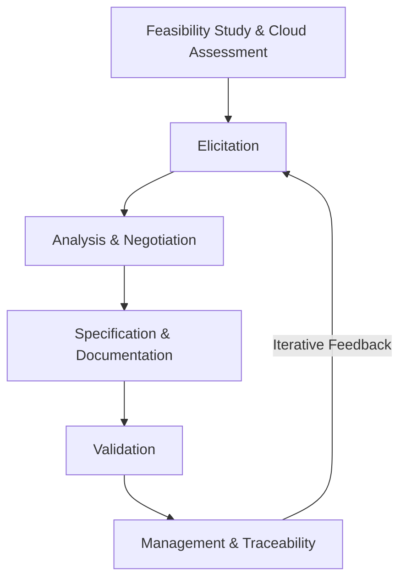

# 05 Approaches to Cloud Software Requirement Engineering

```

---

### ## 1. Definition

Cloud Software Requirement Engineering is the process of identifying, documenting, and managing the needs and constraints of a software system that will run in a cloud environment. It applies traditional requirement engineering practices with special attention to cloud‑specific aspects such as multi‑tenancy, scalability, elasticity, and security.

---

### ## 2. Concept Explanation

**Basic Idea**  
Requirement engineering decides what a software system must do. For cloud‑based software, the requirements must also consider how the application will use cloud resources, handle variable loads, and keep data secure in a shared environment. The basic idea is to gather both functional needs (features) and non‑functional needs (performance, security, availability) while keeping the cloud deployment model in mind.

**How It Works**  
The process begins by talking to stakeholders to understand their goals. Cloud‑specific questions are asked early: What service model (SaaS, PaaS, IaaS) will be used? Will the application be public, private, or hybrid? Then the team writes clear requirement statements, models them, checks for consistency, and validates them with users. Throughout this, the requirements are continuously refined to match the dynamic nature of cloud platforms.

**Why It Is Important**  
Poor requirements lead to failed projects. In the cloud, mistakes can be costlier because resources are paid for as they are used and security gaps may expose data widely. Proper cloud requirement engineering makes sure the final system is reliable, safe, and cost‑effective, and that it truly meets user needs.

---

### ## 3. Key Characteristics / Features

- **Cloud‑Centric Focus**  
  Requirements explicitly address cloud attributes like on‑demand self‑service, rapid elasticity, and measured service.

- **Early Consideration of Security and Privacy**  
  Security requirements, data residency laws, and access control rules are defined from the very beginning, not added later.

- **Emphasis on Non‑Functional Requirements**  
  High importance is given to availability, scalability, latency, and disaster recovery needs that are critical in cloud environments.

- **Stakeholder Collaboration Across Boundaries**  
  Customers, cloud providers, and development teams work together because the cloud provider’s capabilities affect what is possible.

- **Iterative and Incremental Refinement**  
  Requirements evolve over time to adapt to new cloud services, cost changes, and user feedback.

- **Traceability and Change Management**  
  Every requirement is linked to its source and can be tracked when cloud‑based services or business goals change.

---

### ## 4. Types / Classification

**1. Traditional Requirement Engineering Adapted for Cloud**  
Uses classical stages (elicitation, analysis, specification, validation) but adds cloud‑specific questions at each stage. It is structured and plan‑driven, suitable for large, stable cloud projects.

**2. Agile Requirement Engineering for Cloud**  
Requirements are captured as user stories and refined in each iteration. This approach works well with the fast‑changing nature of cloud services. User stories often include cloud‑related acceptance criteria, like “the service must auto‑scale within 2 minutes when load increases.”

**3. Service‑Oriented Requirement Engineering**  
The cloud application is viewed as a composition of cloud services. Requirements focus on service contracts, APIs, service levels, and integration points. This approach fits microservice and API‑first cloud architectures.

**4. Goal‑Oriented Requirement Engineering**  
High‑level business goals are decomposed into cloud‑specific technical requirements. For example, a goal “ensure high availability” is refined into “deploy across at least two availability zones with automatic failover.”

---

### ## 5. Working / Mechanism

Cloud software requirement engineering follows a structured set of steps. The process can be explained in the following stages:

1. **Feasibility Study and Cloud Assessment**  
   The team checks whether the project is technically and economically feasible in the cloud. They decide on the service and deployment model that best suits the business needs.

2. **Elicitation of Requirements**  
   Requirements are gathered from all stakeholders using interviews, surveys, and workshops. Special cloud‑related questions explore expectations about performance, cost, data location, and provider lock‑in.

3. **Analysis and Negotiation**  
   The collected requirements are checked for conflicts, overlaps, and cloud‑related risks. Trade‑offs are discussed; for example, higher availability may increase cost.

4. **Specification and Documentation**  
   Clear and testable requirement statements are written. Cloud‑specific specifications include metrics like maximum acceptable latency, required uptime percentage, and data encryption standards.

5. **Validation**  
   Users and stakeholders review the documented requirements to confirm they correctly capture the intended cloud system. Prototypes or simulations of cloud behaviour may be used.

6. **Management and Traceability**  
   Requirements are stored in a tool, linked to design and test cases, and updated as the cloud platform, business rules, or user feedback change. Changes are carefully controlled to avoid scope creep.

---

### ## 6. Diagram (MANDATORY)



---

### ## 7. Mathematical Formulation (if applicable)

Not applicable for this topic in the conventional sense. Some requirement prioritization techniques use simple formulas, but they are not mandatory for understanding the approaches.

---

### ## 8. Example

A company wants to build a cloud‑based hospital appointment system. The requirement engineering team first talks to doctors, patients, and administrators. They identify the need for the system to be available 99.9% of the time, handle a sudden surge of appointments during flu season, and store patient data only within the country due to legal rules. Using an agile cloud approach, they write user stories like: “As a patient, I want to book an appointment online so that I can avoid long phone calls,” along with cloud acceptance criteria: “The page must load within 2 seconds even when 5000 users book at the same time.” This clear cloud‑focused requirement guides the design and choice of cloud services.

---

### ## 9. Analogy

Think of building a house on a shared piece of land with many other houses. Traditional requirement engineering is like planning your dream home without knowing the land’s rules. Cloud software requirement engineering is like planning the same house but first asking:  
- How much electricity and water can I draw from the common supply? (cloud resource limits)  
- What are the safety codes for shared walls? (security, multi‑tenancy)  
- Can I expand my house later if my family grows? (scalability)  
Just as a good architect considers the shared infrastructure early, cloud requirement engineers include platform constraints from the start.

---

### ## 10. Comparison (if needed)

| Feature | Traditional Requirement Engineering | Cloud Software Requirement Engineering |
|--------|--------------------------------------|----------------------------------------|
| Focus | Functional and local non‑functional needs | Cloud‑specific attributes like elasticity, pay‑per‑use, multi‑tenancy |
| Security Planning | Often addressed later in design | Security, privacy, and compliance are core early requirements |
| Stakeholders | End users, business owners | End users, business owners, cloud provider teams |
| Change Handling | Formal change control, slower | Iterative, quick adaptation to cloud service changes |
| Elasticity Requirement | Rarely considered | Explicitly defined (auto‑scaling rules, load limits) |

---

### ## 11. Advantages

- **Better System Fit**  
  Requirements capture real cloud capabilities and constraints, leading to a system that uses the cloud efficiently.

- **Early Risk Identification**  
  Cloud‑specific risks like provider lock‑in, data sovereignty issues, and cost overruns are discovered and reduced early.

- **Clear Non‑Functional Metrics**  
  Performance, availability, and disaster recovery targets are defined precisely, making testing and monitoring easier.

- **Improved Stakeholder Confidence**  
  Users see that their concerns about security and reliability are addressed from the beginning.

- **Cost‑Aware Planning**  
  Requirements include cost limits and scaling budgets, helping avoid unexpected cloud bills.

---

### ## 12. Disadvantages / Limitations

- **High Initial Effort**  
  Deep cloud‑related analysis takes more time and expert involvement at the start.

- **Dependence on Cloud Provider Details**  
  Requirements may become too tied to one provider’s features, making migration harder later.

- **Complexity for Simple Applications**  
  For very small cloud apps, the full approach may be too heavy; a minimal set of requirements may be enough.

- **Rapidly Changing Cloud Landscape**  
  New cloud services can make some requirements obsolete, requiring frequent updates.

- **Requires Cloud Knowledge**  
  The team must understand cloud computing deeply; otherwise, important requirements can be missed.

---

### ## 13. Important Points / Exam Notes

- Cloud requirement engineering must start with a clear decision on the cloud service model (SaaS, PaaS, IaaS) and deployment model (public, private, hybrid).
- Security, compliance, and data location requirements are considered as first‑class requirements, not afterthoughts.
- Elasticity needs are expressed with precise scaling rules, like “increase instances by 2 when CPU exceeds 70% for 5 minutes.”
- The process is iterative; requirements evolve along with cloud service offerings and user feedback.
- Traceability helps manage the impact of change in a multi‑tenant, service‑rich environment.

---

### ## 14. Applications / Use Cases

- **E‑commerce Platforms**  
  Requirement engineering defines auto‑scaling rules for flash sales, data encryption for payment details, and CDN usage for fast global delivery.

- **Healthcare Cloud Systems**  
  Strict privacy requirements (HIPAA, GDPR) and high availability for life‑critical data are captured from day one.

- **Online Learning Portals**  
  Requirements include handling simultaneous video streams for thousands of students and storing lecture recordings in durable cloud storage.

- **IoT Data Processing**  
  Requirements for ingesting large sensor data streams, real‑time analytics, and cost limits on stream processing services are specified early.

---

### ## 15. MCQs (MANDATORY)

**Q1. What is the main purpose of cloud software requirement engineering?**  
A. To write code faster  
B. To identify and document needs of a system that will run in the cloud  
C. To design the user interface  
D. To manage cloud billing only  
**Answer:** B  
**Explanation:** Cloud software requirement engineering focuses on capturing what the cloud‑based system must do, including cloud‑specific needs.

---

**Q2. Which of the following is a cloud‑specific requirement that would rarely appear in traditional software?**  
A. The system must have a login page  
B. The system shall auto‑scale when user load increases beyond a threshold  
C. The system should generate monthly reports  
D. The system must support multiple languages  
**Answer:** B  
**Explanation:** Auto‑scaling is a cloud‑native capability; traditional on‑premises systems do not usually have this dynamic scaling requirement.

---

**Q3. In cloud requirement engineering, why is it important to consider security from the beginning?**  
A. Because cloud providers force it later  
B. Because adding security later is easier  
C. Because cloud environments are shared and data risks are higher, so security must be built into requirements early  
D. Because developers enjoy security tasks  
**Answer:** C  
**Explanation:** Multi‑tenancy and distributed storage increase exposure; early security requirements prevent costly rework.

---

**Q4. Which step comes immediately after elicitation in the cloud requirement engineering process?**  
A. Validation  
B. Specification  
C. Analysis and negotiation  
D. Management and traceability  
**Answer:** C  
**Explanation:** After gathering requirements, they are analyzed and negotiated for conflicts and cloud‑related risks before being formally specified.

---

**Q5. What is a key advantage of agile requirement engineering for cloud projects?**  
A. It avoids all documentation  
B. It allows requirements to evolve as cloud services and user needs change  
C. It works only for small projects  
D. It eliminates the need for cloud experts  
**Answer:** B  
**Explanation:** Agile iterations support continuous refinement, which fits the dynamic cloud ecosystem.

---

**Q6. Which non‑functional requirement is especially critical for a cloud‑based e‑commerce site during a sale?**  
A. The color of the “Buy” button  
B. The ability to scale rapidly and maintain low response time under high traffic  
C. The number of product categories  
D. The font size on product pages  
**Answer:** B  
**Explanation:** Elasticity and performance under load are essential cloud non‑functional requirements for such scenarios.

---

**Q7. Requirement traceability in cloud projects is important because:**  
A. It helps keep the project timeline fixed  
B. It allows tracking of requirement changes when cloud service offerings or business goals shift  
C. It reduces the need for testing  
D. It automatically generates code  
**Answer:** B  
**Explanation:** Traceability links requirements to design and tests, making it easier to manage changes in a fast‑changing cloud environment.

---

**Q8. Which type of cloud requirement engineering treats the application as a composition of services with defined APIs and SLAs?**  
A. Traditional adaptation  
B. Service‑oriented requirement engineering  
C. Goal‑oriented requirement engineering  
D. No‑requirement approach  
**Answer:** B  
**Explanation:** Service‑oriented requirement engineering focuses on service contracts, APIs, and integration, fitting cloud microservice architectures.

---

**Q9. A requirement “The application must store all customer data in data centers located within the European Union” addresses which cloud concern?**  
A. Cost optimization  
B. Elasticity  
C. Data sovereignty and compliance  
D. User interface design  
**Answer:** C  
**Explanation:** This requirement ensures legal compliance with data residency laws, a critical cloud‑specific concern.

---

**Q10. Which of the following is a limitation of cloud‑specific requirement engineering?**  
A. It can increase initial effort and require deep cloud expertise  
B. It makes applications completely free from any security issues  
C. It guarantees zero cloud costs  
D. It removes the need for testing  
**Answer:** A  
**Explanation:** Early cloud‑focused analysis demands more time and skilled professionals, which can be a drawback for simple projects.
