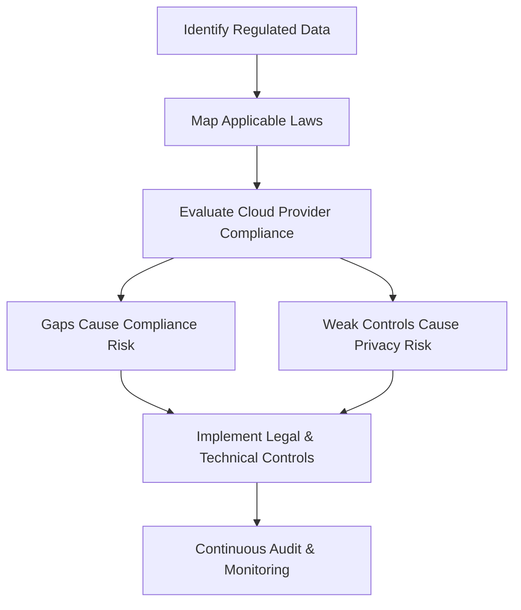

# Privacy and Compliance Risks

## 1. Definition
Privacy and compliance risks in cloud computing are the dangers of failing to protect personal or sensitive data and not meeting legal, regulatory, and contractual obligations when data is stored, processed, or transmitted in the cloud.

## 2. Concept Explanation
When an organisation moves data to the cloud, it often shares control of that data with the cloud service provider. Privacy risk arises if personal information is accessed without authorisation, shared improperly, or stored in ways that violate individuals’ rights.  
Compliance risk occurs when the use of cloud services breaks laws, industry standards, or agreements. This can happen because the organisation does not fully understand its legal duties or the provider’s data handling practices.  
These risks are important because they can lead to heavy fines, lawsuits, loss of customer trust, and serious harm to the data subjects themselves. Managing these risks is an essential part of cloud security and shows that the organisation respects both the law and its users.

## 3. Key Characteristics / Features
- Privacy risks concern the misuse or exposure of personal data belonging to customers, employees, or partners.
- Compliance risks relate to violations of regulations, such as GDPR, HIPAA, or PCI DSS, and industry contracts.
- These risks are shaped by the shared responsibility model, where both the cloud provider and the customer have specific security duties.
- Data location is a major factor; storing data in different countries may break data residency laws.
- Failing to manage these risks can result in large financial penalties and long-term reputational damage.
- Both privacy and compliance risks require continuous monitoring because laws and cloud services change over time.

## 4. Types / Classification
Privacy and compliance risks can be grouped into two main types:

- **Privacy risks**  
  These involve threats to the confidentiality, consent, and control of personal information. Examples include unauthorised data access, insufficient anonymisation, and illegal cross-border data transfers.

- **Compliance risks**  
  These involve failure to follow legal, regulatory, or contractual rules. Examples include not meeting audit requirements, missing data retention deadlines, or using cloud services that are not certified for a specific industry.

## 5. Working / Mechanism
The process through which privacy and compliance risks arise and are managed follows these steps:

1. The organisation identifies all personal and regulated data it plans to put in the cloud.
2. It maps which privacy laws and industry regulations apply to that data.
3. The organisation evaluates the cloud provider’s compliance certifications, security controls, and data handling policies.
4. If the provider’s practices do not fully meet the requirements, a gap is created, producing a compliance risk.
5. Privacy risks emerge if data is stored without proper encryption, access controls, or consent mechanisms.
6. To manage these risks, clear controls such as encryption, access logs, and data residency restrictions are put in place.
7. Continuous auditing and monitoring are performed to catch any new risks from changing laws or cloud service updates.

## 6. Diagram

## 7. Mathematical Formulation
While there is no single formula, the level of risk can be roughly estimated using a simple equation:

$$
\text{Risk Level} = \text{Likelihood of a Breach} \times \text{Impact of Non-Compliance}
$$

Where:  
- **Likelihood of a Breach** is the chance that personal data will be exposed or a regulation will be violated.  
- **Impact of Non-Compliance** is the severity of the resulting fine, lawsuit, or reputation loss.

## 8. Example
A healthcare company uses a cloud-based system to store patient health records. The cloud provider stores the data in a foreign country, which violates a strict data residency clause in the Health Insurance Portability and Accountability Act (HIPAA). As a result, the company faces a serious compliance risk and could be fined millions of dollars. At the same time, if the provider does not properly encrypt the records, there is a privacy risk that patient data could be viewed by unauthorised staff, breaching patient confidentiality.

## 9. Analogy
Think of a person renting a safety deposit box at a bank. The person places valuable private documents inside. The bank promises to keep the box safe and follow strict rules about who can access it. If the bank opens the box without permission, that is a privacy risk. If the bank does not follow government banking regulations while managing the box, that is a compliance risk. In both cases, the owner’s valuable assets are in danger.

## 10. Comparison

| Feature | Privacy Risk | Compliance Risk |
|--------|--------------|------------------|
| Meaning | Risk of unauthorised exposure or misuse of personal information. | Risk of breaking legal, regulatory, or contractual obligations. |
| Focus | Protecting individuals’ data rights and consent. | Meeting external rules, standards, and audit requirements. |
| Example | Cloud provider accesses customer emails without permission. | Storing financial data in a region not approved by PCI DSS. |

## 11. Advantages
- Proactively managing these risks builds strong customer trust and brand loyalty.
- It helps the organisation avoid large fines and legal penalties.
- Proper management ensures smooth audits and regulatory approvals.
- It reduces the chance of data breaches and the associated cleanup costs.
- Complying with privacy laws shows respect for user rights and ethical responsibility.

## 12. Disadvantages / Limitations
- Tracking every applicable regulation across multiple countries is very complex.
- Ensuring compliance can be expensive and require specialised legal and security staff.
- Cloud providers may not always be fully transparent about their data handling procedures.
- Laws and regulations change frequently, making it hard to stay constantly compliant.
- Some privacy and compliance requirements may limit how data can be used, slowing innovation.

## 13. Important Points / Exam Notes
- Privacy risk is about protecting personal data; compliance risk is about obeying laws and standards.
- The cloud’s shared responsibility model means the customer is always responsible for data and regulatory compliance.
- Data residency and cross-border data flow are two of the biggest privacy and compliance challenges in cloud computing.
- Failing a compliance audit can lead to immediate contract termination and business loss.
- Major regulations include GDPR (Europe), HIPAA (US healthcare), and PCI DSS (payment cards).
- Organisations must perform a Data Protection Impact Assessment (DPIA) before putting high-risk data in the cloud.

## 14. Applications / Use Cases
- **Healthcare providers** must control privacy and compliance risks when hosting patient data under HIPAA.
- **Online retailers** manage compliance with PCI DSS when processing payments in the cloud.
- **Multinational companies** use cloud services and must follow GDPR for European customers’ data.
- **Financial services firms** require strict compliance with local banking regulations when using cloud storage.
- **Educational institutions** ensure student data privacy is maintained when moving to cloud learning platforms.

## 15. MCQs

**Q1. What is the primary focus of a privacy risk in cloud computing?**  
A. Slow network performance  
B. Unauthorised exposure of personal data  
C. High storage costs  
D. Server maintenance failure  
**Answer:** B  
**Explanation:** Privacy risks centre on the misuse or unauthorised access to personal or sensitive information.

---

**Q2. A compliance risk in the cloud is most directly related to:**
A. Poor user interface design  
B. Violation of laws and regulations  
C. Lack of backup power  
D. Slow internet connection  
**Answer:** B  
**Explanation:** Compliance risk means the organisation may break legal, regulatory, or contractual rules.

---

**Q3. Which regulation is specifically designed to protect personal data of individuals in the European Union?**
A. HIPAA  
B. PCI DSS  
C. GDPR  
D. ISO 27001  
**Answer:** C  
**Explanation:** The General Data Protection Regulation (GDPR) governs data privacy for EU residents.

---

**Q4. Why is data residency a major concern for privacy and compliance?**
A. It affects the colour of the cloud interface  
B. Different countries have different data protection laws  
C. It only changes the price of storage  
D. It has no legal impact  
**Answer:** B  
**Explanation:** Moving data across borders can violate laws that require data to remain in a specific country.

---

**Q5. In the shared responsibility model, who is ultimately accountable for compliance with data protection laws?**
A. Only the cloud provider  
B. Only the internet service provider  
C. The cloud customer (data owner)  
D. The hardware manufacturer  
**Answer:** C  
**Explanation:** The customer remains legally accountable for the data, even when it is in the cloud.

---

**Q6. Which of the following is an example of a privacy risk?**
A. Missing a payment deadline to the cloud provider  
B. Cloud provider’s administrator viewing personal customer photos without permission  
C. Running out of disk space  
D. Using an outdated web browser  
**Answer:** B  
**Explanation:** Unauthorised viewing of personal content directly threatens data privacy.

---

**Q7. What does the term “impact” refer to in the risk level formula?**
A. The number of users on the system  
B. The speed of the internet connection  
C. The severity of consequences if a breach or violation happens  
D. The amount of free storage available  
**Answer:** C  
**Explanation:** Impact measures how badly the organisation and individuals would be harmed.

---

**Q8. Which standard must an e-commerce company follow to protect credit card data in the cloud?**
A. GDPR  
B. HIPAA  
C. PCI DSS  
D. FERPA  
**Answer:** C  
**Explanation:** PCI DSS sets the security requirements for handling payment card data.

---

**Q9. One major limitation of managing compliance risks is that:**
A. Regulations never change  
B. Laws and regulations change frequently, making continuous monitoring necessary  
C. Cloud providers handle all compliance for free  
D. There are no fines for non-compliance  
**Answer:** B  
**Explanation:** Keeping up with evolving regulations across many regions is a constant challenge.

---

**Q10. A healthcare organisation moving patient records to the cloud must primarily manage which type of risk?**
A. Colour scheme risk  
B. Both privacy and compliance risks under HIPAA  
C. Only hardware risks  
D. No risks if the cloud provider is large  
**Answer:** B  
**Explanation:** Patient data is highly sensitive, so both privacy and HIPAA compliance risks must be carefully controlled.