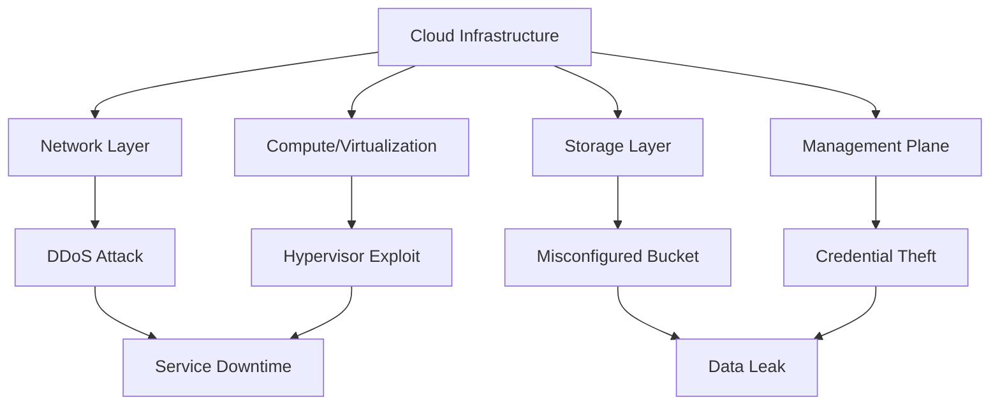

# Threats_to_Infrastructure

## Video Explanation

* [https://www.youtube.com/watch?v=3Kq1MIfTWCE](https://www.youtube.com/watch?v=3Kq1MIfTWCE)

## Visual Aids

## 1. Definition
Threats to infrastructure in cloud computing are any potential events, actions, or weaknesses that can harm the underlying physical and virtual resources that support cloud services. These threats target the hardware, network, storage, and virtualization layers that make the cloud run.

## 2. Concept Explanation
The basic idea is that cloud infrastructure is not invisible; it runs on real servers, networks, and data centers that can be attacked. While cloud providers secure most of the physical layer, shared responsibility gaps and misconfigurations create risk.

A threat works when an attacker finds a weak point in the infrastructure layer. This could be an unpatched hypervisor, an open storage bucket, a network port that is exposed, or a poorly configured identity service. Once the attacker exploits that weakness, they can disrupt services, steal data, or move deeper into the system.

It is important to understand these threats because cloud infrastructure supports everything else. If the infrastructure is compromised, all the applications and data sitting on it are at risk. For diploma students, knowing these threats helps in designing secure architectures and responding to incidents. Modern businesses depend on cloud availability; a single infrastructure attack can cause huge financial and reputational damage.

## 3. Key Characteristics / Features
- **Target physical and virtual layers:** Infrastructure threats aim at servers, storage arrays, hypervisors, and the physical network fabric, not just the software running on top.
- **High impact potential:** A successful infrastructure compromise can affect thousands of customer workloads simultaneously because of the multi-tenant nature of the cloud.
- **Often invisible to end users:** The attack may occur deep inside the provider’s data center, making detection difficult for cloud customers.
- **Exploit misconfigurations heavily:** Many infrastructure breaches happen because storage buckets, databases, or network groups are set up with permissions that are too open.
- **Can be external or internal:** Threats come from outside attackers via the internet and also from malicious insiders or accidental errors by employees.
- **Automation and scale:** Attackers use automated tools to scan the entire internet for exposed cloud infrastructure components within minutes.

## 4. Types / Classification
Threats to cloud infrastructure can be grouped into several major categories.

**1. Distributed Denial of Service (DDoS) Attacks**
These flood network links, DNS servers, or load balancers with junk traffic, making cloud services unreachable for legitimate users.

**2. Malware and Ransomware**
Malicious software can infect virtual machines, hypervisors, or orchestrator nodes, encrypting or destroying infrastructure-level configurations.

**3. Misconfiguration Exploitation**
Attackers scan for publicly exposed cloud storage buckets, databases, or management interfaces that have default or weak settings.

**4. Virtualization / Hypervisor Attacks**
Flaws in the hypervisor software can allow a guest virtual machine to escape its isolation and access the host system or other guests.

**5. Insider Threats**
Cloud provider employees or customer administrators with excessive privileges may misuse their access to damage, steal, or expose infrastructure components.

**6. Supply Chain Attacks**
Compromised hardware, firmware, or third-party cloud management tools can inject backdoors into the infrastructure before it is even deployed.

**7. Physical Threats**
Direct damage to a data center, such as power failure, natural disaster, theft of servers, or intentional sabotage, still poses a risk to cloud infrastructure.

## 5. Working / Mechanism
The steps below illustrate how an infrastructure threat typically materializes in a cloud environment, using a misconfiguration attack as an example.

1. An attacker performs automated scanning of IP ranges to discover cloud storage endpoints or database services that are publicly accessible.
2. The scanner detects an Amazon S3 bucket (or similar object store) that has been configured with “public read” permissions by mistake.
3. The attacker sends a simple HTTP request to list the contents of the bucket, and the cloud service returns a list of file names.
4. The attacker browses the exposed files and finds sensitive data such as database backups, credentials, or customer information.
5. Using the leaked credentials found in the backup, the attacker logs into a cloud management interface with the victim’s identity.
6. From the management interface, the attacker creates new virtual machines in the victim’s account to mine cryptocurrency, causing massive billing.
7. The attacker deletes or encrypts original data stores using administrative privileges, turning the incident into a ransomware scenario.
8. Throughout this process, the legitimate cloud customer is unaware until they receive an abnormal usage bill or lose access to their infrastructure.

## 6. Diagram
The following Mermaid diagram shows how different categories of infrastructure threats can lead to a compromised cloud platform.

## 7. Mathematical Formulation
A simple risk model helps quantify the danger from infrastructure threats:

$$
\text{Risk} = \text{Threat Likelihood} \times \text{Vulnerability Severity} \times \text{Asset Value}
$$

Where:
- **Threat Likelihood** = probability that a specific threat (e.g., DDoS) will occur in a given time frame.
- **Vulnerability Severity** = how weak an infrastructure component is against that threat (e.g., no rate limiting).
- **Asset Value** = importance of the infrastructure, measured by cost of downtime or data loss.

A higher product indicates a more critical risk that needs faster action.

## 8. Example
In 2017, a major cloud storage misconfiguration event affected a large company using Amazon S3. An internal team set up a storage bucket without proper access restrictions. Attackers scanned the internet, discovered the bucket, and downloaded sensitive customer records. The company had to notify millions of users, face legal penalties, and spend months rebuilding trust. This real-world incident shows how a simple infrastructure mistake can become a massive threat.

## 9. Analogy
Think of cloud infrastructure threats like safety risks to a large apartment building. The building’s physical structure, electricity, and plumbing are infrastructure. A threat could be a burst water main (DDoS), a thief breaking into the basement storage lockers (misconfigured storage), or a dishonest janitor with master keys (insider threat). Just as a building collapse affects all residents, an infrastructure attack can harm all tenants of a cloud environment.

## 10. Comparison
The following table compares external infrastructure threats with insider threats.

| Feature | External Threats | Insider Threats |
|--------|----------|----------|
| Source | Criminals, hacktivists, or nation-states over the internet | Employees, contractors, or partners with legitimate access |
| Common method | Scanning for open ports, misconfigurations, DDoS | Misusing privileges, accidental data exposure, sabotage |
| Detection difficulty | Moderate; traffic patterns and logs may reveal anomalies | High; actions can look like normal administrative tasks |
| Motivation | Financial gain, disruption, espionage | Revenge, personal gain, negligence |

## 11. Advantages
- Cataloguing infrastructure threats helps organizations create better defense strategies and allocate security budget where it matters most.
- Awareness of these threats drives adoption of secure architecture patterns like network segmentation and least privilege.
- Threat intelligence sharing among cloud providers improves overall internet safety and speeds up detection of new attack methods.
- Threat modeling for infrastructure helps cloud architects anticipate weaknesses before deploying solutions.
- Understanding threats is the first step toward compliance with standards such as ISO 27001 and SOC 2.

## 12. Disadvantages / Limitations
- New threats emerge constantly, so defense planning can quickly become outdated.
- The shared responsibility model creates confusion: customers may assume the cloud provider protects against all infrastructure threats, which is not true.
- Some advanced threats like hypervisor zero-day exploits are extremely difficult to detect and defend against without vendor patches.
- Small businesses often lack the skills and tools to continuously monitor their cloud infrastructure for threats.
- Over-focusing on known threats can lead to neglecting novel attack vectors that combine several small weaknesses.

## 13. Important Points / Exam Notes
- Infrastructure threats target the cloud foundation: compute, network, storage, and virtualization.
- Misconfiguration remains the number one cause of cloud infrastructure breaches.
- DDoS attacks threaten availability; hypervisor attacks threaten isolation and confidentiality.
- In the shared responsibility model, customers are responsible for securing their own configurations in IaaS and PaaS.
- Cloud Access Security Brokers (CASBs) and Cloud Workload Protection Platforms (CWPP) help detect and mitigate infrastructure threats.
- Regular vulnerability scanning, penetration testing, and Infrastructure as Code (IaC) static analysis reduce misconfiguration risks.
- Insider threats are especially dangerous because they bypass external security controls.

## 14. Applications / Use Cases
- **Financial services:** Banks monitor infrastructure threats to protect real-time payment systems and prevent data theft via exposed databases.
- **Healthcare:** Hospitals secure their cloud infrastructure hosting electronic health records against ransomware attacks that target backup storage.
- **E-commerce:** Retailers deploy DDoS mitigation services to ensure their websites remain available during seasonal sales.
- **Government:** Public sector agencies run continuous configuration checks on cloud storage to avoid leaking citizen data.
- **Education:** Universities using cloud for learning management systems implement strict network segmentation to isolate student data from researcher environments.

## 15. MCQs

**Q1. Which of the following is an infrastructure threat in cloud computing?**
A. Phishing email  
B. DDoS attack on cloud load balancers  
C. Weak application password  
D. Cross-site scripting  
**Answer:** B  
**Explanation:** A DDoS attack targets network and server infrastructure, making services unavailable.

**Q2. What is the most common cause of cloud storage data leaks?**
A. Hypervisor escape  
B. Physical server theft  
C. Misconfigured access permissions  
D. Firmware vulnerabilities  
**Answer:** C  
**Explanation:** Publicly exposed storage buckets due to poor configuration settings are behind many headline cloud breaches.

**Q3. A hypervisor attack allows an attacker to:**
A. Send phishing messages  
B. Escape from one virtual machine to compromise the host or other VMs  
C. Increase website traffic  
D. Predict weather patterns  
**Answer:** B  
**Explanation:** Exploiting a hypervisor flaw can break VM isolation, giving access to the host or neighboring virtual machines.

**Q4. Which type of threat is most difficult to detect using only network monitoring?**
A. DDoS flood  
B. Port scanning  
C. Insider misuse of valid credentials  
D. DNS amplification attack  
**Answer:** C  
**Explanation:** Insider threats often appear as normal, authorized activity, so they blend into routine operations.

**Q5. In the shared responsibility model, who is responsible for securing an IaaS virtual machine configuration?**
A. Cloud provider alone  
B. Internet service provider  
C. Customer  
D. Software vendor  
**Answer:** C  
**Explanation:** The customer must secure operating systems, applications, and configurations while the provider secures physical infrastructure.

**Q6. What is a supply chain attack on cloud infrastructure?**
A. Tampering with hardware or software before it reaches the data center  
B. Stealing packages from delivery trucks  
C. Shipping goods with drones  
D. Ordering too many cloud resources  
**Answer:** A  
**Explanation:** Compromised components inserted during manufacturing or distribution can introduce backdoors into cloud infrastructure.

**Q7. How can a company best reduce misconfiguration threats in its cloud storage?**
A. Disable all encryption  
B. Use automated policy-as-code tools to enforce correct settings  
C. Share administrator passwords with all developers  
D. Turn off logging  
**Answer:** B  
**Explanation:** Policy-as-code and automated scanning prevent unintended public exposure by checking configurations continuously.

**Q8. A ransomware attack on cloud infrastructure often targets:**
A. Only user keyboards  
B. Backup systems and database files  
C. Monitor screen brightness  
D. Mouse drivers  
**Answer:** B  
**Explanation:** By encrypting backups and databases, attackers make restoration difficult and demand payment.

**Q9. Which formula best represents how risk from infrastructure threats is calculated?**
A. Risk = Threat + Asset – Vulnerability  
B. Risk = Threat Likelihood × Vulnerability Severity × Asset Value  
C. Risk = Availability / Integrity  
D. Risk = Password length × Encryption key size  
**Answer:** B  
**Explanation:** This classic risk model combines likelihood, severity, and asset criticality to prioritize threats.

**Q10. Why do automated scanning tools pose a significant infrastructure threat?**
A. They consume no bandwidth  
B. They can find and exploit misconfigured services within minutes  
C. They require physical access to the data center  
D. They only work on weekends  
**Answer:** B  
**Explanation:** Attackers use mass scanning to quickly discover exposed services across the entire IPv4 space, leaving little reaction time.