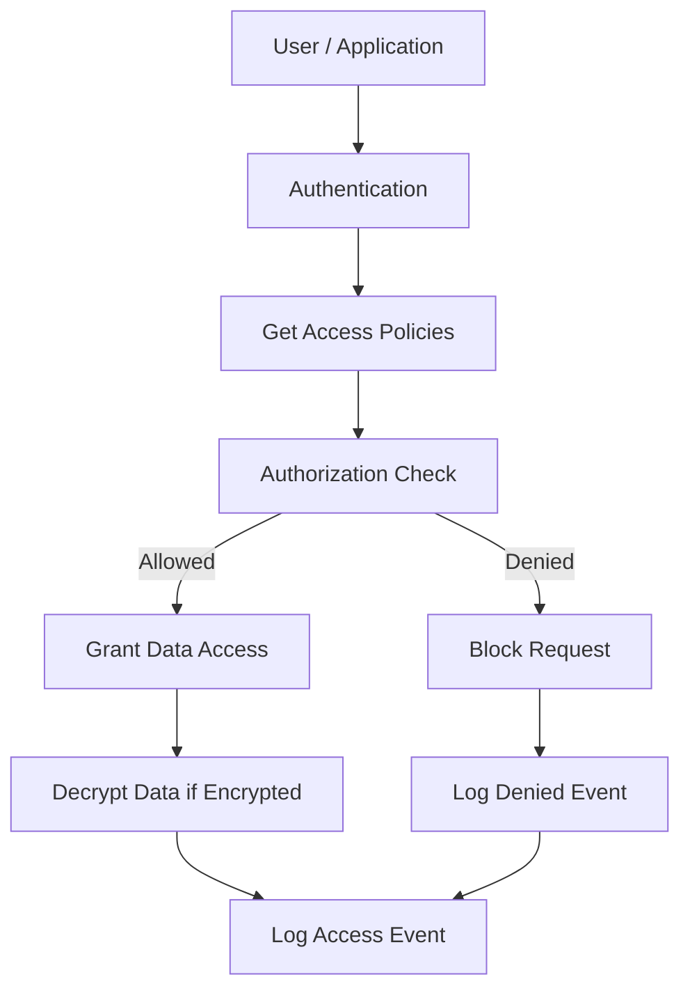

# Data_and_Access_Control

## Video Explanation

* [https://www.youtube.com/watch?v=9e7kzZK6tG0](https://www.youtube.com/watch?v=9e7kzZK6tG0)

## Visual Aids

---

### ## 1. Definition

Data and access control in cloud computing is the set of policies, tools, and technologies that govern who can view, use, or modify cloud‑stored data and cloud resources. It ensures that only authenticated and authorized individuals or services can perform actions on data while keeping it confidential and intact.

---

### ## 2. Concept Explanation

**Basic Idea**  
When you move data to the cloud, it no longer sits inside your own building. Safeguarding it requires strong rules about who can access which file, database, or service. The basic idea is to combine identity checks with fine‑grained permissions so that the right people get the right access at the right time.

**How It Works**  
First, a user or application proves its identity (authentication). Then the system looks at the permissions assigned to that identity and decides whether the requested action, like reading a file or deleting a virtual machine, is allowed (authorization). At the same time, data is scrambled using encryption so that even if someone bypasses the controls, the data remains unreadable. Every access attempt is recorded for later audit.

**Why It Is Important**  
Cloud environments are shared by many customers. Without strong data and access controls, sensitive information could leak to other tenants or to attackers. These controls also help meet legal and regulatory requirements, such as data protection laws, and build trust with users.

---

### ## 3. Key Characteristics / Features

- **Authentication and Authorization**  
  The system first verifies who you are (login, multi‑factor) and then checks what you are allowed to do.

- **Granular Permissions**  
  Access can be set at a very detailed level, for example, allowing a user to only read specific files in a storage bucket but not delete them.

- **Encryption at Rest and in Transit**  
  Data is protected both when it is stored on cloud disks and when it travels over the network using strong encryption methods.

- **Centralized Policy Management**  
  Access rules are defined in one place and automatically enforced across all cloud services, reducing human error.

- **Audit Logging and Monitoring**  
  Every access attempt is logged, helping to detect suspicious behavior and prove compliance.

- **Identity Federation**  
  Users can log in with their existing company credentials (Single Sign‑On) instead of creating new cloud‑only accounts.

---

### ## 4. Types / Classification

**1. Role‑Based Access Control (RBAC)**  
Permissions are grouped into roles (e.g., “Viewer”, “Editor”, “Administrator”). Users are assigned a role, and the role defines what they can do. This is the most common cloud access model.

**2. Attribute‑Based Access Control (ABAC)**  
Access decisions are made using attributes such as user department, time of day, device type, or data sensitivity. It offers more dynamic and context‑aware control than RBAC.

**3. Discretionary Access Control (DAC)**  
The data owner decides who gets access. Every object has an owner, and the owner can grant rights to others. It is simple but harder to manage at large scale.

**4. Mandatory Access Control (MAC)**  
Access is based on security labels and strict system‑wide policies. Even data owners cannot override the rules. This is used in highly secure cloud environments.

---

### ## 5. Working / Mechanism

The process of enforcing data and access control in the cloud follows these steps:

1. **User or Service Authentication**  
   The entity trying to access data proves its identity using credentials like a password, access key, or certificate.

2. **Policy Retrieval**  
   The cloud platform fetches the access policies attached to the user, the resource, and the session.

3. **Authorization Evaluation**  
   The system checks if the requested action (read, write, delete) matches an allowed permission in the policy. Overlapping rules are resolved, with explicit denials taking priority.

4. **Access Decision Enforcement**  
   If authorized, the action is permitted. If not, the request is denied immediately and an error is returned.

5. **Data Encryption/Decryption**  
   Authorized access triggers automatic decryption of data at rest or in transit so the user sees plain data. Unauthorized attempts see only encrypted gibberish.

6. **Audit Log Generation**  
   A detailed record of the request, decision, time, and user is written to an immutable audit trail.

---

### ## 6. Diagram (MANDATORY)

---

### ## 7. Mathematical Formulation (if applicable)

Not applicable for this topic.

---

### ## 8. Example

A company stores employee payroll files in a cloud object storage bucket. The cloud administrator creates a “PayrollViewer” role that allows only reading files inside that bucket. An HR manager is assigned the “PayrollViewer” role. When the HR manager logs in with her company credentials and tries to download a salary report, the cloud IAM service checks her role, confirms she has read permission, decrypts the file, and delivers it. If a developer from the IT team without that role tries the same action, the request is blocked. Every access, whether successful or denied, is logged.

---

### ## 9. Analogy

Think of a high‑security office building.  
- **Authentication** is showing your identity card at the entrance.  
- **Authorization** is the building system checking which floors and rooms your card can unlock.  
- **Encryption** is like keeping all documents inside locked cabinets even if someone sneaks into a room.  
- **Audit logs** are the security cameras and access logs that record who entered which room and when.

Just as the building combines physical checks, lock permissions, and surveillance, cloud data and access control combines identity, permissions, encryption, and logging.

---

### ## 10. Comparison (if needed)

| Feature | RBAC (Role‑Based Access Control) | ABAC (Attribute‑Based Access Control) |
|--------|----------------------------------|--------------------------------------|
| Basis of access | Predefined roles attached to users | User, resource, and environment attributes |
| Flexibility | Limited to the roles created | Highly dynamic and context‑aware |
| Management overhead | Low; easy to assign roles to many users | Higher; many attribute policies to define |
| Use case example | Assigning “Storage Admin” role to storage team | Allowing access only if user is “full‑time” AND connecting from “office IP” |

---

### ## 11. Advantages

- **Strong Data Protection**  
  Unauthorized access is blocked, and encryption keeps data safe even if physical drives are stolen.

- **Simplified User Management**  
  Centralized roles and policies avoid managing permissions on each server individually.

- **Regulatory Compliance**  
  Detailed logs and restricted access help meet standards like GDPR, HIPAA, and PCI DSS.

- **Least Privilege Enforcement**  
  Users and services can be given only the minimum permissions they need, reducing risk.

- **Seamless Scalability**  
  New resources automatically inherit security policies without manual configuration.

---

### ## 12. Disadvantages / Limitations

- **Initial Setup Complexity**  
  Designing fine‑grained roles and policies for a large organization requires careful planning.

- **Misconfiguration Risk**  
  A wrongly set public access policy can expose sensitive data instantly.

- **Performance Overhead**  
  Encryption and decryption add a small processing delay, though usually negligible.

- **Key Management Burden**  
  Organizations must securely store and rotate encryption keys; losing keys means losing data.

- **Dependency on Cloud Provider**  
  Access control models and features differ between providers, which can cause vendor lock‑in.

---

### ## 13. Important Points / Exam Notes

- Data and access control relies on two pillars: **authentication** (who you are) and **authorization** (what you can do).
- **RBAC** is the most widely used cloud access control method; it groups permissions into roles.
- Encryption must be applied both **at rest** (stored data) and **in transit** (data moving across networks).
- The principle of **least privilege** means giving each user or service only the permissions absolutely necessary.
- Audit logs are essential for detecting security incidents and proving compliance.
- A “deny” policy always overrides an “allow” policy in most cloud platforms.

---

### ## 14. Applications / Use Cases

- **Cloud Storage Services**  
  Controlling which users or applications can read, write, or delete files in object and block storage.

- **Healthcare Systems**  
  Ensuring only doctors treating a patient can access that patient’s medical records, with full audit trails.

- **Online Banking Applications**  
  Separating access for customers (view own accounts) and bank employees (process loans) using strong RBAC and encryption.

- **Multi‑Tenant SaaS Platforms**  
  Isolating customer data so that one company’s users cannot see another company’s information.

---

### ## 15. MCQs (MANDATORY)

**Q1. What is the main purpose of access control in the cloud?**  
A. To make the application run faster  
B. To ensure only authorized users can access data and resources  
C. To increase data storage size  
D. To create user passwords automatically  
**Answer:** B  
**Explanation:** Access control focuses on permitting only authenticated and authorized entities to perform actions on cloud resources.

---

**Q2. Which cloud access control model groups permissions into predefined sets called roles?**  
A. Discretionary Access Control (DAC)  
B. Mandatory Access Control (MAC)  
C. Role‑Based Access Control (RBAC)  
D. Attribute‑Based Access Control (ABAC)  
**Answer:** C  
**Explanation:** RBAC assigns users to roles, and each role contains a set of permissions.

---

**Q3. In cloud security, what does “encryption at rest” protect?**  
A. Data being transmitted over the internet  
B. Data stored on disk or object storage  
C. User passwords in transit  
D. Network firewall rules  
**Answer:** B  
**Explanation:** Encryption at rest scrambles data on physical storage media so it cannot be read if the disks are stolen or accessed without authorization.

---

**Q4. Which principle means a user should have only the permissions needed to perform their job?**  
A. Maximum privilege  
B. Least privilege  
C. Open access  
D. Default allow  
**Answer:** B  
**Explanation:** The least privilege principle minimizes damage by restricting user rights to the bare minimum.

---

**Q5. What happens first when a user tries to access a cloud file according to the access control mechanism?**  
A. The file is immediately opened  
B. The user is authenticated  
C. Audit logs are deleted  
D. The encryption key is sent to the user  
**Answer:** B  
**Explanation:** The initial step is verifying the user’s identity through authentication.

---

**Q6. Which of the following uses attributes like user department, time, and device to decide access?**  
A. RBAC  
B. ABAC  
C. DAC  
D. Password Control  
**Answer:** B  
**Explanation:** Attribute‑Based Access Control (ABAC) evaluates various user and environment attributes to make dynamic access decisions.

---

**Q7. Why are audit logs important in cloud data access control?**  
A. They free up storage space  
B. They record all access attempts for security review and compliance  
C. They replace encryption  
D. They speed up data downloads  
**Answer:** B  
**Explanation:** Audit logs provide a trail of who accessed what and when, essential for detecting breaches and proving regulatory compliance.

---

**Q8. Which statement about a “deny” policy versus an “allow” policy in cloud IAM is generally true?**  
A. Allow always overrides deny  
B. Deny and allow cancel each other  
C. An explicit deny overrides any allow  
D. Deny is only used for network traffic  
**Answer:** C  
**Explanation:** Most cloud policy engines evaluate explicit denies as final; even if an allow exists, a deny will block the action.

---

**Q9. What is a disadvantage of poor access control configuration in the cloud?**  
A. Data may become publicly exposed  
B. The cloud becomes physically larger  
C. Login pages load slower  
D. More storage is automatically provisioned  
**Answer:** A  
**Explanation:** Misconfigurations like setting a storage bucket to public can accidentally expose sensitive data to anyone on the internet.

---

**Q10. Identity federation in cloud access control allows users to:**  
A. Use their fingerprint to unlock local PCs  
B. Log in once and access multiple systems using existing corporate credentials  
C. Encrypt data using their own keys only  
D. Share their passwords with colleagues  
**Answer:** B  
**Explanation:** Federation enables Single Sign‑On (SSO), so users authenticate with their organization’s identity provider to access cloud services.