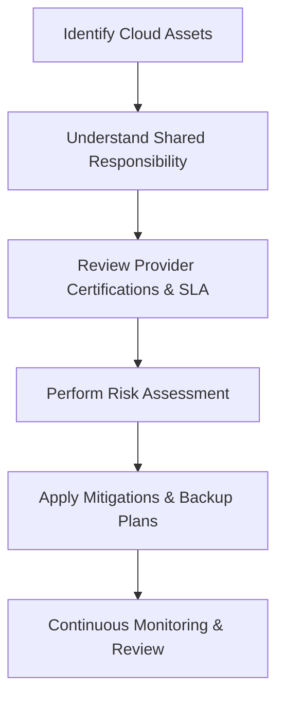

# Cloud_Service_Provider_Risks

## Video Explanation

* [https://www.youtube.com/watch?v=Y2hZ3QxFQbA](https://www.youtube.com/watch?v=Y2hZ3QxFQbA)

## Visual Aids

## 1. Definition
Cloud service provider risks are the potential threats and negative outcomes that arise from relying on a third-party cloud provider for infrastructure, platform, or software services. These risks affect data security, service availability, regulatory compliance, and business continuity.

## 2. Concept Explanation
When an organisation uses cloud services, it transfers a portion of control over its IT environment to the provider. The provider manages the physical hardware, network, and sometimes the application layers. This dependence creates risks if the provider experiences security failures, outages, or business problems.  
The idea works through the shared responsibility model: the provider secures the cloud infrastructure, while the customer secures what they put in the cloud. Any gap or failure on either side can lead to risk.  
Understanding these risks is important because a single provider failure can cause data loss, legal penalties, or long service disruptions. Proper risk assessment helps organisations choose the right provider, negotiate strong contracts, and build resilient cloud architectures.

## 3. Key Characteristics / Features
- Provider-side security gaps can expose customer data to unauthorised access.
- Service outages or slowdowns can disrupt business operations and revenue.
- Vendor lock-in can make it difficult or expensive to move to another provider.
- Inadequate compliance certifications can lead to regulatory fines for the customer.
- Financial instability of the provider may lead to sudden service shutdown.
- Insider threats at the provider can compromise data even if customer-side controls are strong.
- Ambiguity in the shared responsibility model often leaves security gaps.

## 4. Types / Classification
Cloud service provider risks are commonly classified by their origin:

- **Security risks**  
  These involve data breaches, weak access controls, or insecure application programming interfaces (APIs) on the provider side.

- **Operational risks**  
  These include unplanned downtime, performance degradation, and data loss due to provider infrastructure failures.

- **Compliance and legal risks**  
  These arise when the provider cannot meet regulations like GDPR, HIPAA, or PCI DSS that apply to the customer’s data.

- **Financial and business risks**  
  Vendor lock-in, sudden price increases, or provider bankruptcy can threaten business operations.

- **Technical risks**  
  These relate to technology obsolescence, poor integration, or limitations in the provider’s platform.

## 5. Working / Mechanism
The mechanism of assessing and managing cloud service provider risks follows a continuous process:

1. The organisation identifies all assets and workloads it plans to host with the cloud provider.
2. It maps the shared responsibility model clearly to know exactly who secures what.
3. It reviews the provider’s security certifications, audit reports, and past incident history.
4. It examines the Service Level Agreement (SLA) to understand uptime guarantees, support commitments, and liability limits.
5. A formal risk assessment is performed, weighing the likelihood and impact of potential provider failures.
6. Mitigation controls are put in place, such as data encryption, multi-region backup, and a multi-provider strategy.
7. Legal contracts and exit plans are prepared to handle provider lock-in or service termination.
8. The provider’s performance and security posture are monitored continuously, and the risk assessment is updated regularly.

## 6. Diagram

## 7. Mathematical Formulation
The overall risk from a cloud service provider can be expressed as the sum of individual risks:

$$
\text{Total CSP Risk} = \sum_{i=1}^{n} (L_i \times I_i)
$$

Where:  
- **L_i** is the likelihood of a specific provider-related risk occurring.  
- **I_i** is the estimated impact if that risk materialises.  
- The summation covers all identified risk factors.

## 8. Example
A medium-sized e-commerce company moves its entire customer database to a public cloud provider. The provider’s storage service is accidentally misconfigured by a cloud administrator, leaving the bucket open to the internet. Hackers discover the exposure and steal thousands of customer records. The company faces heavy fines under data protection laws, loses customer trust, and must spend months repairing its reputation.

## 9. Analogy
Think of a restaurant that stores its secret recipes in a safety locker provided by a security company. The restaurant relies on the company to keep the locker secure. If the security company has a flawed lock or dishonest staff, the recipes can be stolen. Similarly, a poor cloud provider security posture puts valuable business data at risk.

## 10. Comparison

| Feature | Cloud Service Provider Risks | Traditional On-Premise Risks |
|--------|------------------------------|-------------------------------|
| Meaning | Threats arising from depending on an external cloud vendor. | Threats from managing your own physical servers and software. |
| Control | The customer has limited control over the underlying infrastructure. | The organisation has full control but also full responsibility. |
| Example | Provider data centre outage causes your website to go offline. | A power cut in your own server room takes down internal systems. |

## 11. Advantages
- Identifying provider risks early helps choose a secure and reliable cloud partner.
- Clear risk assessment enables better contractual protections and insurance coverage.
- Understanding these risks drives adoption of strong cloud backup and disaster recovery strategies.
- Proper management avoids sudden service loss and unplanned expenses.
- It ensures that legal and regulatory responsibilities are fully met even when using third-party services.

## 12. Disadvantages / Limitations
- It is difficult to fully verify a cloud provider’s internal security practices and controls.
- The customer often has limited visibility into the provider’s underlying infrastructure.
- Service Level Agreements may not fully compensate for business losses during an outage.
- Changing providers can be complex and expensive due to vendor lock-in.
- Small and medium businesses may lack the expertise to evaluate provider risks thoroughly.

## 13. Important Points / Exam Notes
- Cloud service provider risks are a core part of the shared responsibility model.
- The customer is always ultimately accountable for their own data, even in the cloud.
- Common provider risks include data breaches, outages, lock-in, and compliance failures.
- A strong Service Level Agreement (SLA) does not eliminate risk; it only defines compensation.
- Effective mitigation includes encryption, multi-region deployments, and a well-planned exit strategy.
- Due diligence on the provider’s financial health and security certifications is mandatory.

## 14. Applications / Use Cases
- **Banking and finance** firms evaluate provider risks before moving core banking to the cloud.
- **Healthcare organisations** assess providers for HIPAA compliance and patient data protection.
- **Government agencies** require strict data sovereignty and security before adopting cloud services.
- **Software-as-a-Service startups** depend on reliable cloud infrastructure and must manage provider outages.
- **E-commerce platforms** use multiple cloud regions to reduce risk from single provider failures.

## 15. MCQs

**Q1. What is the main cause of a cloud service provider risk?**
A. Customer buying too much storage  
B. Dependence on a third-party provider for critical IT services  
C. Using only a single programming language  
D. Employing too many developers  
**Answer:** B  
**Explanation:** The risk stems from relying on an external party for infrastructure, platform, or software.

---

**Q2. Which risk type is most directly indicated by “vendor lock-in”?**
A. Security risk  
B. Operational risk  
C. Financial and business risk  
D. Compliance risk  
**Answer:** C  
**Explanation:** Vendor lock-in affects business flexibility and can lead to high switching costs, making it a financial and business risk.

---

**Q3. In the shared responsibility model, who is responsible for securing customer data in the cloud?**
A. Only the cloud provider  
B. Only the government  
C. The customer and the provider share duties; the customer secures their data and access  
D. The internet service provider  
**Answer:** C  
**Explanation:** The provider secures the cloud infrastructure, and the customer secures everything they put in the cloud.

---

**Q4. An SLA (Service Level Agreement) from a cloud provider mainly defines:**
A. The colour scheme of the management dashboard  
B. Uptime guarantees, support, and compensation limits  
C. The brand of servers used  
D. The programming languages allowed  
**Answer:** B  
**Explanation:** The SLA sets measurable metrics like availability percentage and defines remedies if those metrics are not met.

---

**Q5. A healthcare company stores patient data with a cloud provider that has no HIPAA certification. This creates a:**
A. Financial risk only  
B. Compliance and legal risk  
C. Operational risk only  
D. Colour scheme risk  
**Answer:** B  
**Explanation:** Without the required certification, the company may violate healthcare regulations, leading to legal penalties.

---

**Q6. Which of the following is a direct security risk from a cloud provider?**
A. High monthly bills  
B. Slow internet connection at the customer office  
C. Provider employee accessing customer data without permission  
D. Customer changing their own password  
**Answer:** C  
**Explanation:** Insider threats at the provider side are a serious security risk for customer data.

---

**Q7. What is the best way to reduce the risk of data loss from a single cloud provider outage?**
A. Write longer passwords  
B. Rely entirely on the provider’s backup  
C. Keep data in multiple geographical regions or with multiple providers  
D. Close the cloud account  
**Answer:** C  
**Explanation:** Distributing data across regions or providers ensures availability if one fails.

---

**Q8. The formula “Total CSP Risk = Σ (Likelihood × Impact)” helps to:**
A. Calculate monthly cloud bills  
B. Measure and prioritise different provider risks  
C. Decide the colour of the login page  
D. Determine the internet speed required  
**Answer:** B  
**Explanation:** This risk assessment formula quantifies the severity of each identified risk for better management.

---

**Q9. A sudden bankruptcy of a cloud provider is an example of:**
A. Security risk  
B. Technical risk  
C. Financial and business risk  
D. Compliance risk  
**Answer:** C  
**Explanation:** Bankruptcy directly threatens business continuity and data availability, a financial and business risk.

---

**Q10. Why is continuous monitoring of a cloud provider important?**
A. Because cloud providers never change  
B. Because new vulnerabilities, outages, or business changes can appear over time  
C. Because it replaces the need for any contracts  
D. Because it guarantees zero risk  
**Answer:** B  
**Explanation:** The provider’s security posture and financial health can change, so monitoring helps catch new risks early.