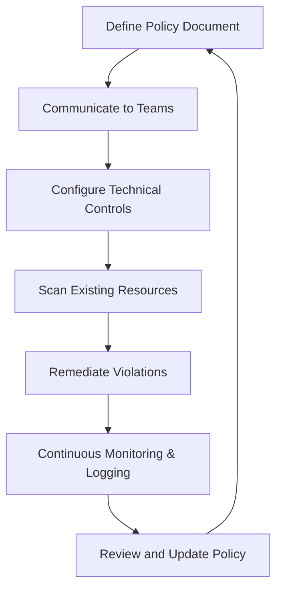

# 10 Cloud Security Policy Implementation

## 1. Definition
Cloud security policy implementation is the process of creating, enforcing, and managing a set of written rules and technical controls that define how an organization protects its cloud resources. It turns security requirements into real actions that govern user behavior, data handling, and system configurations.

## 2. Concept Explanation
The basic idea is that a security policy on paper is useless unless it is put into practice. Cloud security policy implementation bridges the gap between planning and real protection. It takes the organization’s goals, regulations, and risk appetite and translates them into automated guardrails, identity rules, and monitoring checks.

How it works: First, security teams write policies that specify exactly what is allowed and what is forbidden, such as "all storage must be encrypted" or "only multi-factor authentication may be used." Then, they use cloud-native tools like Identity and Access Management, policy enforcement engines, and configuration scanners to enforce these rules automatically. Finally, they continuously monitor for violations and adjust policies as threats change.

Why it is important: Without proper implementation, cloud environments become chaotic and vulnerable. Users might accidentally expose data, non-compliant resources can go unnoticed, and attackers can exploit weak configurations. Implementation ensures that everyone follows the same security standards, that auditing is possible, and that data protection laws are met. It makes security a consistent, measurable, and automated part of cloud operations.

## 3. Key Characteristics / Features
- **Written and approved:** Every policy is formally documented and approved by management, so it carries authority and is clearly understood.
- **Technical enforcement:** Policies are not just advice; they are enforced by cloud tools that block dangerous actions directly, like preventing the creation of unencrypted storage.
- **Automation-oriented:** Cloud services allow policies to be applied automatically to all resources, reducing human error and saving time.
- **Continuous compliance:** The implementation includes ongoing checks and alerts to find and fix policy violations in real time.
- **Role-based application:** Policies can target specific users, groups, or applications, ensuring each part of the cloud is protected appropriately.
- **Auditability:** All policy decisions and enforcement actions are logged, providing evidence for internal reviews and external regulators.

## 4. Types / Classification
Cloud security policies can be grouped by the area they control.

**1. Identity and Access Policies**
They define who can access what. Examples: rules for password strength, multi-factor authentication requirements, and role assignment limits.

**2. Data Protection Policies**
They govern how data must be handled. Examples: requiring encryption at rest and in transit, controlling data location (data residency), and classifying data sensitivity.

**3. Network Security Policies**
They set rules for network traffic. Examples: restricting which ports are open, isolating virtual networks, and using web application firewalls.

**4. Incident Response Policies**
They specify what to do when a security event occurs. Examples: steps for detecting, reporting, containing, and recovering from breaches.

**5. Compliance and Audit Policies**
They ensure that cloud use meets external standards. Examples: requirements to collect logs for years, perform regular vulnerability scans, and enforce regulatory standards like GDPR or HIPAA.

## 5. Working / Mechanism
The following steps show how a cloud security policy moves from a document to active enforcement in a typical cloud environment.

1. The security team identifies a need, for example, "no public access to storage buckets containing sensitive data," and drafts a policy with clear rules.
2. The policy is reviewed and approved by management, then communicated to all cloud users and teams through training and documentation.
3. The team translates the policy into technical controls. They configure a cloud guardrail such as an AWS Service Control Policy (SCP) or Azure Policy that blocks the creation of publicly readable storage.
4. Existing resources are scanned using cloud configuration monitoring tools (like AWS Config or GCP Security Command Center) to detect any bucket that is currently public.
5. Violations are remediated automatically or manually. Automated remediation scripts can modify bucket settings to private, or the team fixes misconfigurations.
6. Logging and alerting are set up so that any future attempt to make a bucket public triggers an alert and the action is denied at the API level.
7. The team generates regular compliance reports showing how many resources follow the policy, and the policy is reviewed quarterly to adapt to new cloud features or threats.

## 6. Diagram
The following Mermaid diagram illustrates the cloud security policy implementation lifecycle.

## 7. Mathematical Formulation
A simple measure of policy compliance can be calculated as:

$$
\text{Compliance Rate (\%)} = \left( \frac{\text{Number of Compliant Resources}}{\text{Total Resources in Scope}} \right) \times 100
$$

Where:
- **Number of Compliant Resources** = resources that meet all policy rules at a given check time.
- **Total Resources in Scope** = all resources that the policy applies to.

A high compliance rate shows that the policy implementation is effective. A drop signals that enforcement or awareness needs improvement.

## 8. Example
A medium-sized company moves its customer database to the cloud. They implement a data encryption policy: all database instances and backups must use AES-256 encryption, and unencrypted databases cannot be launched. They use cloud policy enforcement to deny the creation of any database that does not have encryption enabled. The security team schedules a weekly scan to check all existing databases. When the scan finds an old test database created before the policy, the team receives an alert and encrypts it immediately. Monthly reports are sent to the compliance officer to prove the policy is followed.

## 9. Analogy
Think of a school with a written rule: "All students must wear a uniform." The rule on paper means nothing unless a teacher checks at the gate and sends non-uniformed students home. Cloud security policy implementation is like placing that teacher at the gate and giving them a tool that automatically enforces the uniform rule every single morning. The written policy is the rule; the gate check and automated tool are the implementation. No student (resource) can enter class unless the rule is satisfied.

## 10. Comparison
Comparing traditional on-premises security policy implementation with cloud security policy implementation highlights why the cloud approach is different.

| Feature | On-Premises Policy Implementation | Cloud Policy Implementation |
|--------|----------|----------|
| Enforcement tools | Manual configuration of firewalls, servers | Automated cloud-native guardrails, SCPs, Azure Policy |
| Scalability | Hard to enforce across many servers quickly | Instantly applies to thousands of resources globally |
| Visibility | Relies on separate scanning tools | Built-in dashboards and compliance checks continuously |
| Updates | Slow rollout of new policies | Policy changes are propagated in minutes via APIs |
| Responsibility | All hardware and software managed internally | Shared; provider secures infrastructure, customer implements policies |

## 11. Advantages
- Policies are enforced consistently across all cloud accounts and regions, leaving no blind spots.
- Human error is reduced because automated checks stop misconfigurations before they happen.
- Compliance audits become easier because logs and reports are automatically generated by cloud services.
- Security posture improves continuously because monitoring detects and fixes deviations rapidly.
- New employees and applications follow security standards from day one without needing manual checks.
- The organization gains clear proof of due diligence, which helps when dealing with legal or regulatory bodies.

## 12. Disadvantages / Limitations
- Writing overly strict policies can slow down development teams if legitimate work is blocked.
- Policy tools from different cloud providers vary, making multi-cloud implementation complex.
- Automated enforcement might break legacy applications that cannot meet strict rules immediately.
- False positives in monitoring can overwhelm security teams with alerts and cause alert fatigue.
- Implementation requires skilled staff who understand both security principles and cloud platforms.
- Policy engines cannot guarantee zero risk; determined attackers may find ways to bypass controls.

## 13. Important Points / Exam Notes
- Cloud security policy implementation makes written rules actionable through technical controls and automation.
- Policy as code is a modern practice where policies are defined in machine-readable files and applied via cloud infrastructure management tools.
- Service Control Policies (SCPs) in AWS, Azure Policy, and GCP Organization Policies are common enforcement mechanisms.
- Implementation follows a lifecycle: define, communicate, enforce, monitor, and review.
- Good implementation records all actions in logs, which supports auditing and incident investigation.
- The Shared Responsibility Model requires customers to implement their own security policies for the cloud layers they control.

## 14. Applications / Use Cases
- **Financial services:** Banks enforce policies that block data storage in regions that do not meet data residency laws.
- **Healthcare:** Hospitals implement policies that require all patient data to be encrypted and access to be logged for HIPAA compliance.
- **Software-as-a-Service (SaaS):** SaaS companies enforce access policies that require multi-factor authentication for all administrative accounts.
- **E-commerce:** Retailers set network policies that only allow HTTPS traffic to their web servers, automatically blocking all plain HTTP attempts.
- **Government:** Public sector agencies implement policies that prevent the deployment of any service without a security clearance tag attached.

## 15. MCQs

**Q1. What is the main purpose of cloud security policy implementation?**
A. To write security papers and store them in a cloud folder  
B. To turn written security rules into enforced actions and controls  
C. To increase cloud service costs  
D. To reduce the number of cloud services used  
**Answer:** B  
**Explanation:** Implementation makes policies real by applying technical controls and automation so rules are consistently followed.

**Q2. Which cloud tool is used to enforce policies at the account or organization level in AWS?**
A. Amazon S3  
B. AWS Lambda  
C. Service Control Policy (SCP)  
D. Amazon CloudFront  
**Answer:** C  
**Explanation:** SCPs define guardrails for AWS accounts, restricting which actions users and roles can perform.

**Q3. Which phase of the implementation lifecycle follows after technical controls are configured?**
A. Policy review  
B. Scan existing resources and remediate violations  
C. Write the policy document  
D. Fire the security team  
**Answer:** B  
**Explanation:** After setting up controls, existing resources are scanned to find violations that occurred before the policy was in place.

**Q4. What is “policy as code”?**
A. Writing policies in a programming language and managing them like software  
B. Scanning code for security bugs  
C. Hiding policies inside software code  
D. Deleting policies after coding  
**Answer:** A  
**Explanation:** Policy as code means defining security rules in machine-readable files that can be version-controlled, tested, and deployed automatically.

**Q5. A data protection policy typically includes a requirement for:**
A. Using default passwords  
B. Encryption of data at rest and in transit  
C. Opening all network ports  
D. Sharing admin credentials with everyone  
**Answer:** B  
**Explanation:** Encryption protects data from unauthorized access, a core requirement in data protection policies.

**Q6. Why is continuous monitoring an essential part of policy implementation?**
A. To increase cloud bills  
B. To detect and fix new policy violations in real time  
C. To slow down application performance  
D. To remove all users  
**Answer:** B  
**Explanation:** Without monitoring, new misconfigurations or violations can go unnoticed, undermining the policy.

**Q7. Which of the following is an example of an identity and access policy?**
A. Requiring multi-factor authentication for all privileged users  
B. Encrypting all backup files  
C. Blocking inbound UDP traffic  
D. Backing up databases daily  
**Answer:** A  
**Explanation:** Identity and access policies control how users prove their identity and what they can access.

**Q8. What is a common limitation of automated policy enforcement?**
A. It always guarantees zero vulnerabilities  
B. It may block legitimate development work if rules are too strict  
C. It replaces the need for any staff  
D. It works only in one cloud region  
**Answer:** B  
**Explanation:** Overly restrictive policies can slow innovation, requiring a balance between security and usability.

**Q9. How does cloud policy implementation help with regulatory compliance?**
A. By hiding all logs  
B. By providing automated reports and audit trails that prove rules were enforced  
C. By ignoring data residency rules  
D. By allowing anonymous access  
**Answer:** B  
**Explanation:** Automated logging and reporting give evidence that policies are consistently applied, satisfying auditors.

**Q10. In the shared responsibility model, who is responsible for implementing cloud security policies for customer data?**
A. The cloud provider exclusively  
B. The internet service provider  
C. The customer  
D. The hardware manufacturer  
**Answer:** C  
**Explanation:** The provider secures the cloud infrastructure, but customers must implement their own policies to protect their data and access.