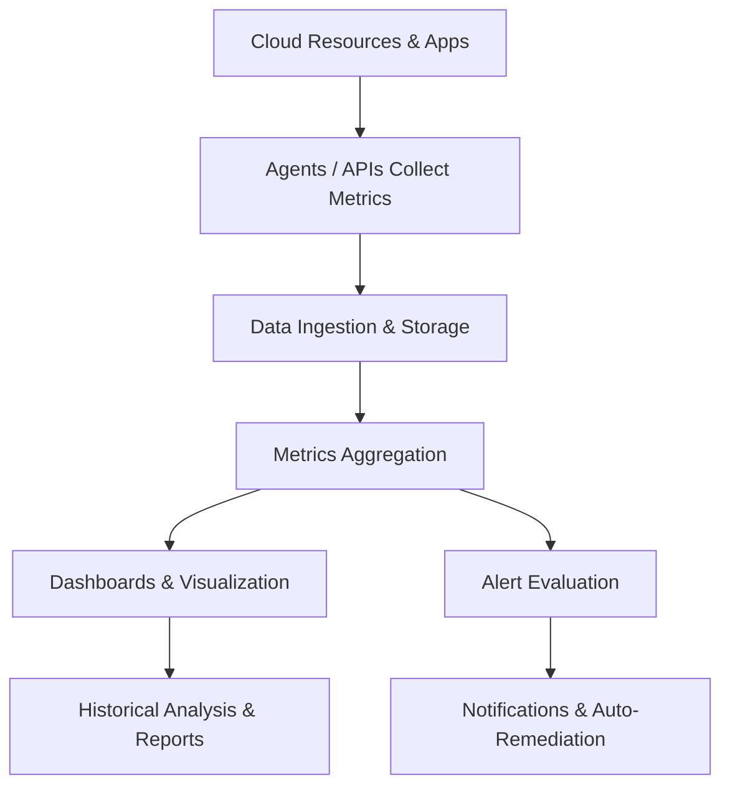

# Cloud Performance Monitoring Tools

## Video Explanation

* [https://www.youtube.com/watch?v=3hLmDS179YE](https://www.youtube.com/watch?v=3hLmDS179YE)

## Visual Aids

## 1. Definition
Cloud performance monitoring tools are software applications that continuously track, measure, and analyze how cloud resources and applications are behaving. They provide real-time metrics and alerts to ensure that services run fast, reliably, and at the expected level of performance.

## 2. Concept Explanation
The basic idea is that cloud environments are dynamic and complex. A server can become slow, a database query can take too long, or a network connection can drop. Performance monitoring tools act like a health check-up machine that watches everything round the clock.

How they work: The tools connect to cloud services through APIs or lightweight agents. They collect numeric data (called metrics) such as CPU usage, memory consumption, disk I/O, and request latency. They store this data, create visual dashboards, and compare current readings against set thresholds. When a metric goes outside the safe range, the tool sends an alert to the team.

Why they are important: Without monitoring, teams operate blindly. Slowdowns frustrate customers, and outages can go undetected until users complain. Performance monitoring helps find and fix problems early, plan capacity, save costs by shutting down underused resources, and meet service level agreements (SLAs). It turns raw infrastructure into a well-managed, predictable cloud system.

## 3. Key Characteristics / Features
- **Real-time data collection:** Tools capture metrics every few seconds or minutes, showing exactly what is happening at the current moment.
- **Customizable dashboards:** Users can build visual panels with charts, graphs, and gauges to view the health of their systems at a glance.
- **Alerting and notifications:** When a metric crosses a danger threshold, the tool can send an email, text message, or trigger an automated response.
- **Log aggregation:** Many tools combine performance metrics with log data, giving both the “vital signs” and detailed event records in one place.
- **Scalability:** The tools themselves can handle millions of data points from thousands of cloud resources without slowing down.
- **Historical data analysis:** Metrics are stored for days or months, allowing teams to compare performance over time and identify trends.

## 4. Types / Classification
Cloud performance monitoring tools can be grouped in several ways. A common classification is by their scope and data source.

**1. Infrastructure Monitoring Tools**
These focus on the underlying cloud resources: virtual machines, containers, storage volumes, and network links. Examples: AWS CloudWatch, Google Cloud Monitoring, Azure Monitor.

**2. Application Performance Monitoring (APM) Tools**
These look deeper into the application code, measuring transaction traces, code-level bottlenecks, and user experience. Examples: Datadog APM, New Relic, Dynatrace.

**3. Network Performance Monitoring Tools**
These specialize in tracking network traffic, latency, packet loss, and bandwidth usage between cloud components. Examples: SolarWinds, Cisco ThousandEyes.

**4. End-User Experience Monitoring**
These simulate or measure the performance from the point of view of real users, such as page load times in a browser. Examples: Pingdom, Google Lighthouse.

**5. Cloud-Native vs. Third-Party Tools**
Cloud providers offer built-in monitoring (native), while third-party vendors provide cross-cloud and hybrid monitoring with additional features.

## 5. Working / Mechanism
The monitoring process follows a consistent pipeline from data to action. The steps below describe a typical flow.

1. A monitoring agent or cloud API collects raw metrics from a resource, such as CPU utilization percentage or average response time in milliseconds.
2. The data points are sent over a secure connection to the monitoring service’s ingestion endpoint.
3. The monitoring platform stores time-series data in a high-performance database and organizes it under account and resource tags.
4. Aggregation functions like average, sum, minimum, and maximum are applied for user-defined time windows, such as 5-minute intervals.
5. The processed metrics are displayed on a real-time dashboard, with line charts, bar graphs, and heat maps to visualize performance.
6. Alert rules continuously evaluate incoming data. If a metric remains above a threshold for a certain duration, an alarm state is activated.
7. The tool triggers notifications to the operations team and, if configured, starts an automated action like scaling out a server group.
8. Long-term data is retained for reporting and capacity planning, allowing teams to spot gradual performance degradation.

## 6. Diagram
The following Mermaid diagram illustrates the core flow of a cloud performance monitoring system.

## 7. Mathematical Formulation
A simple measure of application performance is the average response time:

$$
\text{Avg Response Time} = \frac{\sum_{i=1}^{n} RT_i}{n}
$$

Where:
- **RT_i** = response time of the i-th request.
- **n** = total number of requests in the measurement period.

Lower average response time indicates better performance. Monitoring tools track this value and alert if it exceeds a defined threshold.

## 8. Example
A company runs an e-commerce website on AWS with multiple EC2 instances behind a load balancer. They use Amazon CloudWatch to monitor metrics such as CPU utilization and request count. They set an alarm: if the average CPU across instances goes above 80% for five minutes, CloudWatch sends a notification and triggers an Auto Scaling action to add a new server. Simultaneously, the Application Performance Monitoring tool Datadog shows that the checkout API is slow. Developers examine the traces and find a slow database query. They optimize the query, and site performance returns to normal.

## 9. Analogy
Cloud performance monitoring tools are like a car’s dashboard. The speedometer, fuel gauge, and engine temperature lights give the driver real-time information about how the car is performing. If the fuel runs low or the engine overheats, a warning light appears so the driver can act before the car breaks down. Similarly, cloud monitoring tools show CPU usage, memory, and response time, and send alerts before a cloud service crash affects customers.

## 10. Comparison
Here is a comparison between native cloud monitoring tools and third-party monitoring tools.

| Feature | Native Cloud Monitoring Tools | Third-Party Monitoring Tools |
|--------|----------|----------|
| Provider | Built into cloud platform (e.g., AWS CloudWatch) | Independent companies (e.g., Datadog, New Relic) |
| Setup complexity | Easy to enable; tightly integrated with cloud services | Requires additional configuration but offers more flexibility |
| Multi-cloud support | Usually limited to one cloud provider | Provides a single view across AWS, Azure, GCP, and on-premises |
| Advanced features | Basic metrics, logs, simple alarms | Advanced APM, AI-based anomaly detection, synthetic monitoring |
| Cost | Often included at a basic level; charges for higher resolution | Subscription-based; can be expensive for large environments |

## 11. Advantages
- Teams gain visibility into cloud health and can detect problems before users are impacted.
- Automated alerts reduce the time between a failure and its resolution, improving uptime.
- Capacity planning is easier because historical data shows usage trends, helping avoid overspending.
- Performance bottlenecks in application code can be identified quickly using APM tools.
- Monitoring data serves as evidence for meeting service level agreements with customers.
- Cloud automation can use monitoring metrics to scale infrastructure up or down without human intervention.

## 12. Disadvantages / Limitations
- Monitoring tools themselves can introduce a slight performance overhead on the applications they track.
- The volume of data generated can be overwhelming and may incur high storage and data transfer costs.
- Setting meaningful alert thresholds requires skill; too low creates noise, too high misses real problems.
- Native tools may not provide deep enough insights for complex applications without third-party integration.
- Over-reliance on monitoring can create alert fatigue, causing important warnings to be ignored.
- Short-term or transient issues can be missed if the monitoring interval is too coarse.

## 13. Important Points / Exam Notes
- Cloud performance monitoring tools track metrics such as CPU, memory, disk I/O, network throughput, and response time.
- The three pillars of observability that monitoring builds upon are metrics, logs, and traces.
- AWS CloudWatch, Azure Monitor, and Google Cloud Operations Suite are examples of native monitoring tools.
- Datadog, New Relic, Dynatrace, and Splunk are popular third-party monitoring platforms.
- Alerting rules typically include a threshold, a period (“for X minutes”), and a notification channel.
- Auto-scaling and self-healing actions can be triggered based on monitoring metrics, making infrastructure reactive.
- Monitoring supports both real-time operations and long-term capacity planning analysis.
- Cloud monitoring follows the shared responsibility model: the provider monitors the cloud infrastructure, customers monitor what they put in the cloud.

## 14. Applications / Use Cases
- **Online retail:** Monitor web server latency and checkout service error rates to prevent revenue loss during flash sales.
- **Banking and finance:** Continuously track transaction processing time to meet strict performance SLAs.
- **Media streaming:** Watch network throughput and buffering metrics to deliver smooth video playback globally.
- **SaaS companies:** Use APM to trace user requests across microservices and find slow service dependencies.
- **Healthcare systems:** Monitor cloud-hosted electronic health record applications to ensure that doctors always have fast and reliable access.

## 15. MCQs

**Q1. What is the primary purpose of cloud performance monitoring tools?**
A. To design cloud architecture diagrams  
B. To track and analyze the behavior of cloud resources and applications  
C. To replace cloud administrators  
D. To encrypt network traffic  
**Answer:** B  
**Explanation:** These tools measure metrics like CPU, memory, and response time to ensure optimal performance.

**Q2. Which metric is most directly related to the speed felt by an end user of a web application?**
A. Disk I/O  
B. CPU utilization  
C. Response time  
D. Network bytes in  
**Answer:** C  
**Explanation:** Response time measures how quickly a system reacts to a user request, directly influencing user experience.

**Q3. What do we call a pre-set limit that, when crossed, triggers an alarm in a monitoring tool?**
A. A dashboard  
B. An agent  
C. A threshold  
D. A log stream  
**Answer:** C  
**Explanation:** Thresholds define acceptable ranges; alarms fire when metrics go above or below these limits.

**Q4. Which of the following is an example of a native cloud monitoring tool?**
A. Datadog  
B. New Relic  
C. AWS CloudWatch  
D. Splunk  
**Answer:** C  
**Explanation:** AWS CloudWatch is built into the Amazon Web Services platform.

**Q5. Application Performance Monitoring (APM) tools are specially designed to:**
A. Manage cloud storage only  
B. Analyze code-level performance and transaction traces  
C. Monitor physical server room temperature  
D. Assign user passwords  
**Answer:** B  
**Explanation:** APM tools go beyond infrastructure to measure application code efficiency and user journey performance.

**Q6. What is the main benefit of historical data analysis in cloud monitoring?**
A. It deletes old metrics to save space  
B. It allows teams to identify performance trends and plan capacity  
C. It immediately fixes all system faults  
D. It replaces the need for live monitoring  
**Answer:** B  
**Explanation:** Stored historical data reveals usage patterns and helps predict future resource needs.

**Q7. Alert fatigue is a common problem where:**
A. Monitoring tools never send any alerts  
B. Too many unimportant alerts cause important ones to be ignored  
C. Performance metrics are always in the safe range  
D. Alerts are only sent to the cloud provider  
**Answer:** B  
**Explanation:** When thresholds are too sensitive, the resulting flood of alerts numbs the operations team.

**Q8. What enabling action can cloud monitoring tools trigger automatically?**
A. Automatic code rewriting  
B. Auto-scaling of server groups when load increases  
C. Changing user passwords every minute  
D. Deleting all log files  
**Answer:** B  
**Explanation:** Monitoring metrics can invoke auto-scaling policies to add or remove resources dynamically.

**Q9. In the observability context, which three data types form the pillars that monitoring relies on?**
A. Emails, calls, and meetings  
B. Metrics, logs, and traces  
C. Passwords, usernames, and IPs  
D. HTML, CSS, and JavaScript  
**Answer:** B  
**Explanation:** Metrics show what is happening, logs provide event details, and traces follow a request through the system.

**Q10. A company uses both AWS and Azure and wants a single view of performance across both clouds. Which type of tool is most suitable?**
A. A native tool like AWS CloudWatch  
B. A third-party multi-cloud monitoring tool like Datadog  
C. Only Azure Monitor  
D. A simple spreadsheet  
**Answer:** B  
**Explanation:** Third-party tools are designed to aggregate data from multiple cloud providers into one dashboard.