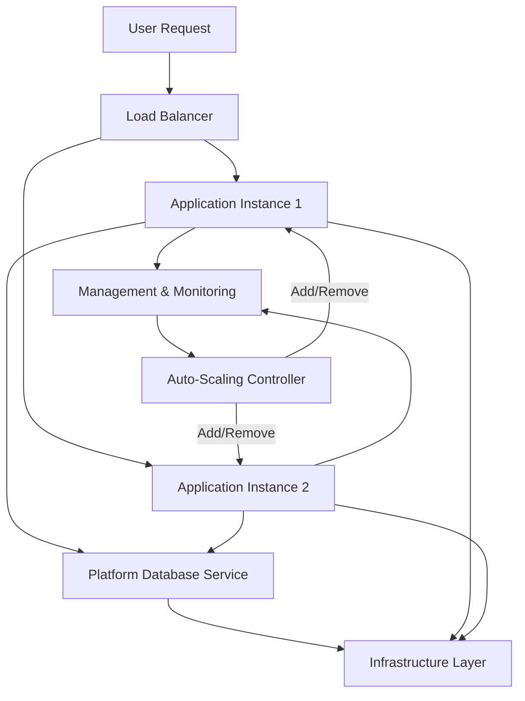

# General Model for Application Platform

## Video Explanation

* [https://www.youtube.com/watch?v=ae_DKNwK_ms](https://www.youtube.com/watch?v=ae_DKNwK_ms)

## Visual Aids

---

### ## 1. Definition

A general model for an application platform is a structured reference architecture that shows how different cloud components and services come together to build, deploy, run, and manage applications. It organizes the required infrastructure, middleware, runtime environments, and management tools into clear, interconnected layers.

---

### ## 2. Concept Explanation

**Basic Idea**  
The basic idea is to provide a blueprint that hides the complexity of underlying hardware and system software. Developers can focus on writing application code while the platform automatically handles operating systems, scaling, networking, and service integration.

**How It Works**  
The model divides the cloud environment into layers. The bottom layer offers basic computing, storage, and networking resources. Above it, platform services provide ready‑to‑use databases, messaging queues, and identity management. The top layer holds the actual applications and their business logic. Management and security tools run across all layers to monitor, secure, and govern the entire stack.

**Why It Is Important**  
Without a clear model, cloud deployments become messy and hard to manage. A general platform model brings consistency, reduces development time, and ensures that applications can scale easily and remain secure. It also helps organizations choose the right cloud services and design portable applications.

---

### ## 3. Key Characteristics / Features

- **Layered Architecture**  
  The platform is divided into separate layers like infrastructure, platform services, and applications. Each layer has a clear role and hides complexity from the layers above.

- **Abstraction and Automation**  
  Infrastructure details are abstracted away. Provisioning, scaling, and patching happen automatically without manual intervention from developers.

- **Service-Oriented and Modular**  
  The platform provides discrete services (databases, caching, messaging) that applications can use as building blocks. Services can be swapped or upgraded independently.

- **Scalability and Elasticity**  
  The model supports automatic scaling of resources based on demand. Applications can grow or shrink without redesigning the platform.

- **Multi-Tenancy**  
  The platform serves multiple users, teams, or organizations from a shared infrastructure while keeping their data and configurations isolated.

- **Unified Management and Security**  
  A centralized layer manages logging, monitoring, access control, and compliance across all application instances.

---

### ## 4. Types / Classification

The general model can be understood through its major layers. Each layer represents a type of service that forms the complete application platform.

**1. Infrastructure Layer**  
This layer contains the physical or virtual computing resources such as servers, storage, networks, and virtual machines. It provides the raw capacity that everything else runs on.

**2. Platform Services Layer**  
This layer offers middleware and runtime services. It includes application servers, databases, messaging queues, caching, and identity management. Developers use these ready‑made services instead of installing and configuring their own.

**3. Application Services Layer**  
This is where the actual business logic lives. It includes microservices, APIs, web applications, and serverless functions. This layer consumes the platform services below it.

**4. Management and Security Layer**  
This cross‑cutting layer provides monitoring, logging, billing, identity and access management, and compliance tools. It works across all other layers to ensure smooth and secure operations.

---

### ## 5. Working / Mechanism

The general model works through a series of coordinated steps when an application is deployed and run.

1. **Developer Packages the Application**  
   The developer writes code and bundles it along with a configuration file that declares the required platform services (e.g., a database).

2. **Application Is Pushed to the Platform**  
   Using a command‑line tool or a web interface, the package is uploaded to the platform’s deployment manager.

3. **Automatic Provisioning and Staging**  
   The platform layer reads the configuration, provisions the necessary infrastructure (compute instances, storage), and attaches the requested services (database, cache).

4. **Application Deployment and Startup**  
   The runtime environment is set up, dependencies are installed, and the application code is placed on the provisioned instances. The application starts and registers itself with the load balancer.

5. **Traffic Handling and Execution**  
   User requests arrive at the platform’s entry point. The load balancer directs traffic to healthy application instances. The application uses platform services via APIs to read data, send messages, etc.

6. **Continuous Monitoring and Auto‑Scaling**  
   The management layer monitors metrics like CPU usage and request count. When thresholds are crossed, it automatically adds or removes application instances to match demand.

7. **Updates and Rollbacks**  
   New versions of the application are deployed using rolling updates. If errors occur, the platform can roll back to a previous stable version without manual server reconfiguration.

---

### ## 6. Diagram (MANDATORY)

---

### ## 7. Mathematical Formulation (if applicable)

Not applicable for this topic.

---

### ## 8. Example

A student project team builds an online quiz application. Instead of buying servers, they use a cloud application platform that follows the general model. They write the quiz logic in Node.js and specify that they need a PostgreSQL database. When they deploy, the platform automatically creates a virtual server, installs the Node.js runtime, provisions the database, and connects it. The platform’s load balancer distributes incoming quiz attempts across two running instances. The monitoring dashboard shows real‑time activity, and the auto‑scaling rule adds a third instance when 200 users play simultaneously. The team does not manage any server or database installation; they only maintain their quiz code.

---

### ## 9. Analogy

Think of the general model for an application platform like a modern high‑rise office building.  
- The **infrastructure layer** is the building’s foundation, electricity, and plumbing.  
- The **platform services layer** is the shared facilities like meeting rooms, cafeteria, and internet connection.  
- The **application services layer** represents the individual company offices that use those shared facilities.  
- The **management and security layer** is the building’s reception, security guards, and maintenance crew that serve the entire building.

Tenants (applications) simply move into a ready office, use the shared amenities, and let the building management handle lifts, power backups, and security.

---

### ## 10. Comparison (if needed)

| Feature | Traditional On‑Premises Platform | Cloud General Application Platform |
|--------|----------------------------------|-------------------------------------|
| Infrastructure ownership | Organization owns and manages all hardware | Cloud provider owns and manages physical resources |
| Provisioning speed | Weeks to order and set up servers | Minutes to provision via self‑service |
| Scaling model | Manual, with fixed capacity | Auto‑scaling based on real‑time demand |
| Service integration | Manually install and configure middleware | Pre‑built, ready‑to‑use services (database, cache) |
| Management | Separate tools for servers, network, storage | Unified dashboard for all layers |

---

### ## 11. Advantages

- **Faster Time to Market**  
  Developers can deploy applications in minutes without waiting for hardware or software setup.

- **Reduced Operational Burden**  
  No need to patch operating systems, manage databases, or configure network firewalls manually.

- **Built‑In Scalability and Reliability**  
  The platform automatically adjusts capacity and provides high availability across failure zones.

- **Cost Efficiency**  
  Pay only for the resources consumed; no upfront investment in idle infrastructure.

- **Standardized and Consistent Environment**  
  All applications run on a uniform platform, which simplifies troubleshooting and compliance.

---

### ## 12. Disadvantages / Limitations

- **Vendor Lock‑In**  
  Applications may become deeply tied to a specific cloud provider’s proprietary services, making migration difficult.

- **Less Fine‑Grained Control**  
  Organizations cannot tweak low‑level infrastructure settings, which may be required for some specialized workloads.

- **Shared Responsibility Confusion**  
  Users sometimes misunderstand which security aspects the provider handles and which remain their task.

- **Data Locality Constraints**  
  Data may be stored in regions that do not meet certain legal or regulatory requirements.

- **Platform Upgrades May Break Applications**  
  Automatic updates to runtime versions or services can sometimes introduce incompatibilities.

---

### ## 13. Important Points / Exam Notes

- The general model organizes an application platform into **layers**: infrastructure, platform services, application services, and management.
- It promotes **abstraction**, allowing developers to focus on code instead of infrastructure.
- **Auto‑scaling** and **self‑service provisioning** are core features that reduce manual effort.
- Platform services (database, messaging, identity) are consumed as **managed services** without installation.
- The model supports **multi‑tenancy** and provides unified **monitoring and security**.
- Understanding this model helps in making decisions about **cloud migration** and **application design**.

---

### ## 14. Applications / Use Cases

- **E‑commerce Websites**  
  Use the platform model to launch online stores that can scale during sales events without server crashes.

- **Mobile Backend Applications**  
  Build scalable APIs, user authentication, and push notification services on a ready‑made platform.

- **Enterprise Web Portals**  
  Deploy internal dashboards and reporting tools that integrate with cloud‑based databases and identity systems.

- **Startup Prototyping**  
  Quickly test ideas by deploying application code to a platform that automatically handles from deployment to scaling.

---

### ## 15. MCQs (MANDATORY)

**Q1. What is the primary purpose of a general model for an application platform in the cloud?**  
A. To design user interfaces  
B. To provide a structured blueprint for building, deploying, and managing cloud applications  
C. To write application code  
D. To market cloud services  
**Answer:** B  
**Explanation:** The general model serves as a reference architecture that organizes cloud components for efficient application delivery.

---

**Q2. Which layer in the general model provides databases, messaging, and caching services?**  
A. Infrastructure layer  
B. Platform services layer  
C. Application services layer  
D. Management and security layer  
**Answer:** B  
**Explanation:** The platform services layer offers middleware and ready‑to‑use services that applications consume.

---

**Q3. How does the general model help developers?**  
A. By forcing them to manage physical servers  
B. By abstracting infrastructure so they can focus on business logic  
C. By removing the need for any code  
D. By increasing the cost of deployment  
**Answer:** B  
**Explanation:** Abstraction hides infrastructure complexity, allowing developers to concentrate on writing the application.

---

**Q4. Which feature automatically adjusts the number of application instances based on traffic?**  
A. Load balancing  
B. Auto‑scaling  
C. Multi‑tenancy  
D. Logging  
**Answer:** B  
**Explanation:** Auto‑scaling adds or removes instances dynamically to match current demand.

---

**Q5. In the general model, what role does the management and security layer play?**  
A. It stores user data  
B. It runs application code  
C. It provides monitoring, logging, and access control across all layers  
D. It replaces the need for databases  
**Answer:** C  
**Explanation:** This cross‑cutting layer handles operational and security aspects that affect the entire platform.

---

**Q6. What is a typical disadvantage of using a cloud application platform model?**  
A. Complete freedom to change any infrastructure detail  
B. Zero vendor lock‑in  
C. Potential vendor lock‑in due to proprietary services  
D. Unlimited control over the physical data center  
**Answer:** C  
**Explanation:** Deep integration with platform‑specific services can make it hard to move applications to another provider.

---

**Q7. In the working mechanism, what happens immediately after a developer pushes the application code to the platform?**  
A. The application instantly goes live globally  
B. The platform provisions the required infrastructure and services automatically  
C. The developer must manually install the operating system  
D. The application is deleted and rewritten  
**Answer:** B  
**Explanation:** The platform reads the configuration and automatically sets up compute, storage, and attached services.

---

**Q8. Which of the following best describes the infrastructure layer in the general model?**  
A. It contains application business logic  
B. It provides computing, storage, and networking resources  
C. It only handles user authentication  
D. It generates billing invoices  
**Answer:** B  
**Explanation:** The infrastructure layer includes the foundational hardware and virtualized resources like servers, storage, and networks.

---

**Q9. A company uses the same platform to host several different customer applications with data isolation. Which characteristic enables this?**  
A. Multi‑tenancy  
B. Auto‑scaling  
C. Load balancing  
D. Self‑service portal  
**Answer:** A  
**Explanation:** Multi‑tenancy allows multiple tenants to share the same infrastructure while keeping their data and configurations separate.

---

**Q10. Why is the general model considered important for exam preparation in cloud computing?**  
A. It is never used in real‑world cloud systems  
B. It helps understand how different cloud services fit together to support applications  
C. It only applies to private data centers  
D. It eliminates the need for security  
**Answer:** B  
**Explanation:** The model gives a clear mental picture of cloud platform architecture, which is essential for understanding cloud operations and design.