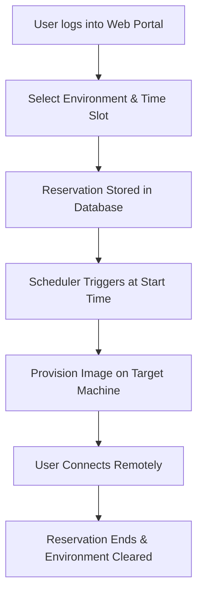

# Apache Virtual Computing Lab

## 1. Definition
Apache Virtual Computing Lab (VCL) is an open-source cloud platform that manages and delivers remote access to virtual machines, applications, and bare-metal servers. It allows users to reserve and use computing environments on demand through a web portal.

## 2. Concept Explanation
Apache VCL was originally created to give students and faculty easy access to specialised software without installing it on their personal devices. The platform runs on a central server and manages a pool of physical computers or virtualisation hosts.  
When a user needs a computing environment, they log into the VCL web portal, select the desired software image, and choose a time slot for reservation. VCL then automatically provisions the environment on available hardware. Once the reservation starts, the user connects remotely to the machine and uses it as if sitting in front of it.  
This approach is important because it maximises the use of expensive hardware, simplifies software distribution, and allows institutions to offer consistent computing resources to many users, regardless of their location or personal device capabilities.

## 3. Key Characteristics / Features
- Users interact with the system through a simple web-based interface, so no special client software is needed.
- It supports multiple environments, including virtual machines, physical servers, and application-only images.
- A strong reservation and scheduling engine allows users to book resources for specific future time slots.
- It integrates with various authentication systems, such as LDAP, Shibboleth, and local database credentials.
- Administrative tools provide image management, usage reports, and access control by user roles.
- The platform can manage multiple hypervisor technologies like VMware, KVM, and Citrix Xen.
- Its modular architecture allows plugging in different storage, networking, and provisioning modules.

## 4. Types / Classification
Apache VCL can manage and deliver three primary types of computing resources:

- **Virtual machine environments**  
  These are complete operating system instances running on a hypervisor. Users get full administrative access inside the VM for tasks like software development or testing.

- **Bare-metal machine environments**  
  The system loads an operating system image directly onto a physical computer. This is useful when applications require direct hardware access or high performance.

- **Application-only environments**  
  Instead of a full desktop, only a specific application is delivered, often through remote desktop or browser-based access. This simplifies usage when only one software package is needed.

## 5. Working / Mechanism
The overall working of Apache VCL follows a clear step-by-step process for each reservation:

1. The user opens the VCL web portal and logs in using their institutional credentials.
2. After authentication, the user browses a catalogue of available environments, such as “Windows 10 with MATLAB” or “Ubuntu with Apache Hadoop”.
3. The user chooses a desired environment and selects an available time slot from the scheduling calendar.
4. The reservation request is stored in the VCL database, and the system checks resource availability.
5. At the scheduled start time, the VCL management node triggers the provisioning process.
6. The system loads the requested image onto a free physical machine or a virtual machine host.
7. Once the environment is ready, the user receives connection instructions, usually a Remote Desktop address or SSH details.
8. The user connects to the environment and works for the duration of the reservation.
9. When the reservation expires, VCL automatically stops the environment and reloads the machine with a clean image, removing all user changes.

## 6. Diagram

## 7. Mathematical Formulation
While no complex mathematics govern the system, the utilisation of computing resources can be measured with a simple formula:

$$
\text{Utilisation Rate} = \frac{\text{Total Reserved Hours}}{\text{Total Available Machine Hours}} \times 100\%
$$

Where:  
- **Total Reserved Hours** is the sum of all reservation durations across all machines in a given period.  
- **Total Available Machine Hours** is the number of managed machines multiplied by the total operational hours in that period.

## 8. Example
A university computer science department uses Apache VCL to give 500 students access to a high-performance CUDA programming environment. Instead of purchasing 500 high-end graphics workstations, the department maintains only 40 powerful servers managed by VCL. Students reserve slots around the clock through the web portal. When a student’s reservation begins, VCL provisions a dedicated environment with the CUDA tools. The student connects from a basic laptop and completes assignments without any local installation. After the reservation, the environment is wiped clean for the next user.

## 9. Analogy
Imagine a public library that lends laptops instead of books. You visit the library website, browse the available laptop models, and book one for a specific two-hour slot. When you arrive, the laptop is ready with your requested software. You use it, and when time is up, the laptop resets itself for the next person. Apache VCL works exactly like that library system, but for computing environments delivered over the internet.

## 10. Comparison

| Feature | Apache VCL | Traditional Computer Lab |
|--------|------------|---------------------------|
| Meaning | A cloud platform that provides remote, reserved computing environments. | A physical room with fixed computers and software. |
| Access | Anywhere via internet, 24/7 reservation-based. | Limited to lab opening hours and physical presence. |
| Hardware utilisation | High, because machines can serve many users in a day. | Lower, because machines sit idle when the lab is empty. |

## 11. Advantages
- It significantly reduces hardware costs by sharing the same physical machines among many users.
- Students and staff can work from any device and any location with internet access.
- Complex software installations are managed once on an image, saving IT support effort.
- Reservation-based access ensures fair resource sharing and predictable availability.
- Environments are automatically cleaned after each session, preventing security and configuration issues.
- Administrators get detailed logs and reports for auditing and capacity planning.

## 12. Disadvantages / Limitations
- The initial setup and configuration of VCL can be technically challenging for small IT teams.
- A stable and fast network connection is required for a smooth remote desktop experience.
- Users cannot keep permanent changes between sessions unless a dedicated persistent image is created for them.
- Managing multiple hypervisors and hardware profiles adds administrative complexity.
- Sudden hardware failures in the VCL cluster can disrupt active user sessions if redundancy is insufficient.

## 13. Important Points / Exam Notes
- Apache VCL is an open-source project under the Apache Software Foundation, originally from North Carolina State University.
- It works on a reservation model, meaning users must book a time slot before accessing resources.
- The platform supports three environment types: virtual machines, bare-metal machines, and application-only images.
- Its modular design allows integration with many authentication systems and hypervisors.
- After a reservation ends, the environment is automatically reverted to a clean base state.
- VCL is widely used in educational and research institutions to provide remote labs.

## 14. Applications / Use Cases
- **University computer labs** deliver course-specific software (like SPSS, AutoCAD, or MATLAB) to students for assignments.
- **Cybersecurity training** provides isolated virtual environments where students can safely practice ethical hacking.
- **Research groups** share high-performance computing environments without purchasing individual workstations.
- **Distance learning programmes** give remote students the same lab experience as on-campus peers.
- **Corporate training** uses VCL to provision temporary desktops with pre-configured training software for new employees.

## 15. MCQs

**Q1. What is the Apache Virtual Computing Lab (VCL)?**  
A. A physical library of computers  
B. An open-source platform that manages and provisions remote computing environments  
C. A type of hardware server  
D. A programming language  
**Answer:** B  
**Explanation:** Apache VCL is a software platform used to deliver virtual and physical computing environments to users on demand.

---

**Q2. How does a user typically gain access to a resource in Apache VCL?**  
A. By sending an email to the admin  
B. By making a reservation through a web portal  
C. By walking into a lab  
D. By restarting their personal laptop  
**Answer:** B  
**Explanation:** Users log into a web portal, select an environment, and book a time slot for their reservation.

---

**Q3. Which of the following is NOT an environment type supported by VCL?**  
A. Virtual machine  
B. Bare-metal machine  
C. Application image  
D. Mobile operating system  
**Answer:** D  
**Explanation:** VCL supports VMs, bare-metal installs, and application-only environments, but it is not designed for mobile OS labs.

---

**Q4. What happens to a VCL environment after the reservation time expires?**  
A. It stays on indefinitely  
B. The user gets a warning to save work and the machine is reloaded to a clean state  
C. It is moved to another user without resetting  
D. The server shuts down completely  
**Answer:** B  
**Explanation:** VCL automatically cleans the environment and resets it to its base image so that it is ready for the next user.

---

**Q5. Which formula can be used to measure how well VCL resources are utilised?**  
A. CPU speed × number of cores  
B. Total Reserved Hours / Total Available Machine Hours × 100%  
C. Number of users / Total RAM  
D. Hard disk size ÷ 1000  
**Answer:** B  
**Explanation:** Utilisation rate is calculated by dividing total reserved hours by total available machine hours.

---

**Q6. What is one major advantage of using VCL in a university?**  
A. It eliminates the need for the internet  
B. It lets students use powerful software from their own devices without installation  
C. It provides free physical laptops to every student  
D. It does not require any servers  
**Answer:** B  
**Explanation:** Students can access lab software remotely through a browser or remote desktop, without local installation.

---

**Q7. Which hypervisor is commonly integrated with Apache VCL?**  
A. Microsoft Word  
B. Oracle VirtualBox only  
C. VMware, KVM, or Citrix Xen  
D. None, it only works on paper  
**Answer:** C  
**Explanation:** VCL’s modular provisioning engine supports multiple hypervisors, including VMware, KVM, and Xen.

---

**Q8. In the context of VCL, what does “bare-metal” provisioning mean?**  
A. Installing software on a virtual machine  
B. Loading an operating system directly onto a physical computer’s hardware  
C. Running applications without any OS  
D. Using a cloud service like AWS  
**Answer:** B  
**Explanation:** Bare-metal provisioning installs the OS image directly on a physical machine, not on a hypervisor.

---

**Q9. Why is Apache VCL described as an open-source tool?**  
A. It can be used only by paying a license fee  
B. Its source code is freely available, and the community can modify it under the Apache licence  
C. It requires a closed cloud provider  
D. It cannot be installed on-premises  
**Answer:** B  
**Explanation:** Open-source means the code is publicly available, and users can customise and deploy it freely.

---

**Q10. Which of the following is a limitation of Apache VCL?**  
A. It reduces hardware utilisation  
B. It requires no network connection  
C. Initial setup can be technically challenging for small teams  
D. It permanently stores all user session changes  
**Answer:** C  
**Explanation:** Setting up VCL involves configuring servers, hypervisors, and images, which can be complex for smaller IT departments.