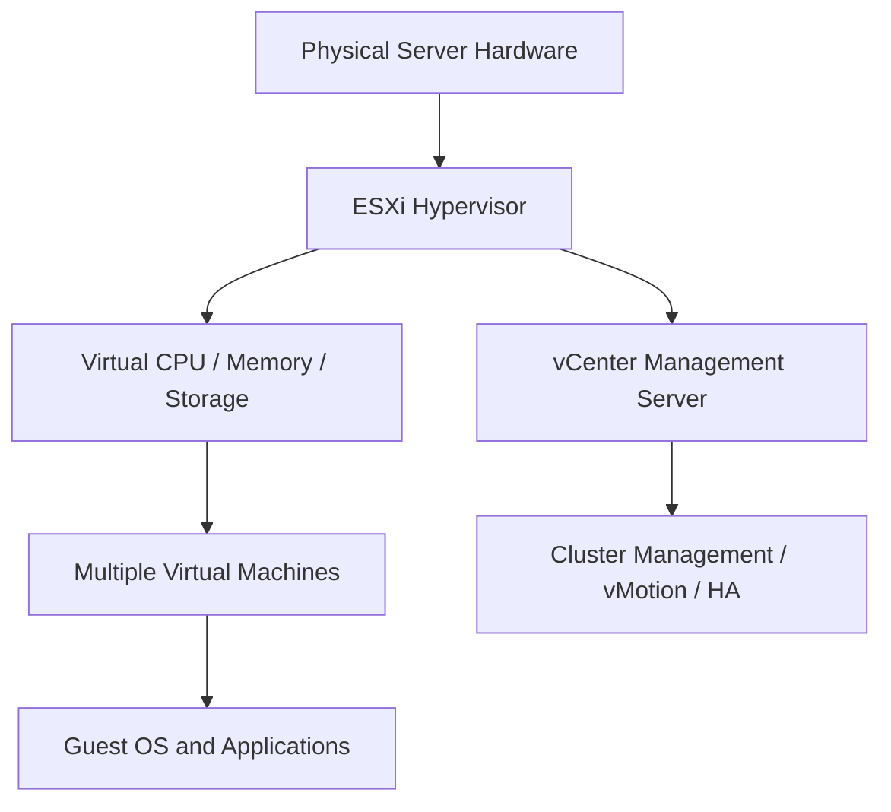

# 04 VMware

## 1. Definition
VMware is a leading software company that provides virtualization and cloud computing technologies. Its core product, a hypervisor, allows a single physical server to run multiple isolated virtual machines (VMs), each with its own operating system and applications.

## 2. Concept Explanation
The basic idea behind VMware is virtualization, which separates software from hardware. A thin software layer called a hypervisor sits directly on the physical hardware or on a host operating system. It divides the physical resources like CPU, memory, storage, and network into multiple virtual environments.

How it works: The hypervisor creates virtual hardware for each VM, and the guest operating systems run on this virtual hardware, unaware of other VMs. A central management platform, vCenter Server, administers many hypervisors and VMs together, enabling easy provisioning, monitoring, and migration.

Why it is important: VMware’s technology changed data centers by reducing hardware costs, simplifying management, and making disaster recovery faster. It is the foundation for many private and hybrid clouds. For diploma students, VMware represents the industry standard for understanding virtualized infrastructure, a core concept in cloud computing.

## 3. Key Characteristics / Features
- **Hypervisor-based virtualization:** VMware uses ESXi, a bare-metal hypervisor, installed directly on server hardware without needing a host OS, which improves performance.
- **Resource pooling:** Physical resources like CPU cycles, RAM, and storage are pooled across multiple servers and allocated dynamically to VMs as needed.
- **Live migration (vMotion):** Running virtual machines can be moved from one physical host to another without any downtime or service interruption.
- **Snapshots and clones:** The state of a VM can be captured instantly (snapshot) and rolled back later, or entire VMs can be cloned for testing.
- **High availability and fault tolerance:** VMware can automatically restart failed VMs on a healthy host or provide continuous availability with a secondary shadow VM.
- **Software-defined networking and storage:** Integrated solutions like NSX (networking) and vSAN (storage) virtualize entire data center operations.

## 4. Types / Classification
VMware products are classified by the infrastructure layer they virtualize:

**Server Virtualization**
- VMware vSphere with ESXi hypervisor and vCenter Server. It consolidates many physical servers into virtual machines on fewer hosts.

**Desktop Virtualization**
- VMware Workstation (Windows/Linux) and VMware Fusion (macOS) allow a personal computer to run multiple operating systems locally.
- VMware Horizon provides virtual desktops and applications delivered from a central server to end-user devices.

**Network Virtualization**
- VMware NSX reproduces entire network services (switching, routing, firewalls) in software, independent of physical network hardware.

**Storage Virtualization**
- VMware vSAN aggregates local disks from multiple hosts into a single shared storage pool managed by software policies.

**Cloud Management**
- VMware vRealize Suite and VMware Cloud Foundation provide automation, monitoring, and lifecycle management for large-scale cloud environments.

## 5. Working / Mechanism
The steps below explain how a typical VMware vSphere environment is set up and operates.

1. A bare-metal hypervisor, VMware ESXi, is installed directly on the physical server hardware, replacing any general-purpose operating system.
2. ESXi discovers the server’s CPU, memory, storage controllers, and network interfaces, then presents them as a pool of virtualizable resources.
3. A central VMware vCenter Server is deployed, which connects to multiple ESXi hosts using the management network.
4. Administrators use vCenter to create a virtual machine definition, specifying virtual CPU cores, RAM size, virtual hard disk capacity, and network connections.
5. vCenter chooses a suitable ESXi host and sends the instruction to power on the VM; the hypervisor carves out the requested resources and starts the guest OS.
6. A thin agent called VMware Tools is installed inside the guest OS, providing better graphics performance, time synchronization, and automated host-to-guest communication.
7. To provide high availability, vSphere HA continuously monitors all VMs; if an ESXi host fails, the affected VMs are automatically restarted on other hosts in the cluster.
8. Live migration (vMotion) is performed when maintenance is needed: the running VM’s memory, storage, and network connections are seamlessly moved to another host with zero downtime.

## 6. Diagram
The following Mermaid diagram shows the basic architecture of a VMware virtualized environment.

## 7. Mathematical Formulation
A common efficiency measure in virtualization is the server consolidation ratio:

$$
Consolidation \ Ratio = \frac{Total \ Number \ of \ Virtual \ Machines}{Number \ of \ Physical \ Servers}
$$

Where:
- **Total Number of Virtual Machines** = sum of all running VMs in the environment.
- **Number of Physical Servers** = count of physical hosts providing the resources.

A higher consolidation ratio means fewer physical servers are needed, reducing hardware, power, and cooling costs.

## 8. Example
A medium-sized IT company has 20 old physical servers running separate applications with low average utilization. Using VMware vSphere, they install ESXi on 3 powerful new servers. They convert the old servers into virtual machines using VMware vCenter Converter and run 20 VMs on the 3 hosts. The consolidation ratio improves from 1:1 to approximately 6.7:1. They now save on electricity, rack space, and hardware replacements, while also gaining the ability to move VMs live during maintenance.

## 9. Analogy
Think of VMware as a large apartment building. The physical server is the whole building with its strong foundation and utilities (electricity, plumbing). The hypervisor is like the building’s framework and internal walls that divide the space into individual apartments. Each apartment (virtual machine) has its own door, layout, and furniture (operating system and applications). Residents (users) live independently and do not disturb each other. The vCenter management is like the property manager who can change apartment locks, move tenants to a different floor (vMotion), or fix problems without demolishing the entire building.

## 10. Comparison
The table compares VMware’s ESXi hypervisor (bare-metal) with VMware Workstation (hosted hypervisor).

| Feature | VMware ESXi (Type 1) | VMware Workstation (Type 2) |
|--------|----------|----------|
| Meaning | Bare-metal hypervisor installed directly on hardware | Hosted hypervisor installed as a program on a host OS (Windows/Linux) |
| Performance | Higher, because it has direct hardware control | Lower, due to overhead of the underlying host OS |
| Target user | Enterprise data centers, cloud providers | Desktop users, developers, testers |
| Management | Managed centrally by vCenter Server | Managed locally through a graphical interface |
| Resource usage | Optimized for many simultaneous VMs | Designed to run a few VMs for personal use |

## 11. Advantages
- VMware allows many VMs to run on one physical machine, drastically reducing hardware and energy costs.
- Live migration (vMotion) reduces planned downtime because servers can be maintained without stopping applications.
- Snapshots and cloning speed up development and testing by providing instant rollback and duplicate environments.
- Centralized management through vCenter gives administrators a single pane of glass to control thousands of VMs.
- High availability and fault tolerance features minimize unplanned downtime and data loss.
- VMware is widely used in enterprise environments, making related skills highly valuable for IT professionals.

## 12. Disadvantages / Limitations
- VMware’s licensing costs can be high, especially for advanced features like vSAN, NSX, and enterprise plus editions.
- The hypervisor itself consumes some physical resources (CPU, RAM overhead), slightly reducing available capacity for VMs.
- Setting up and managing a full vSphere environment requires specialized training and expertise.
- Compatibility requirements are strict; not all hardware is on the VMware Hardware Compatibility List (HCL).
- In resource-constrained environments, too many VMs can compete for resources, causing performance degradation if not managed properly.
- Vendor lock-in: migrating from VMware’s proprietary formats and tools to other hypervisors can be complex.

## 13. Important Points / Exam Notes
- VMware ESXi is a bare-metal (Type 1) hypervisor installed directly on server hardware, while VMware Workstation is a hosted (Type 2) hypervisor.
- vCenter Server is the centralized management platform for multiple ESXi hosts and their VMs.
- vMotion enables live migration of a running VM from one physical host to another with zero downtime.
- VMware DRS (Distributed Resource Scheduler) automatically balances VM workloads across a cluster of hosts.
- VMware HA (High Availability) restarts VMs on a different host if the original host fails.
- Snapshots capture a VM’s state at a point in time but are not backups; they should not be kept for long periods.
- VMware tools is a set of drivers and services installed inside the guest OS to improve performance and integration.
- VMware vSAN is a software-defined storage solution that combines local disks into a single distributed storage pool.

## 14. Applications / Use Cases
- **Server consolidation:** Companies reduce the number of physical servers by running many virtual servers on fewer hosts, saving space and power.
- **Software development and testing:** Developers use VMware Workstation or Fusion to run multiple OS versions on their desktops and test software in isolated sandboxes.
- **Virtual Desktop Infrastructure (VDI):** VMware Horizon delivers secure Windows or Linux desktops to remote employees from central data centers.
- **Disaster recovery:** VMware Site Recovery Manager automates the failover of groups of VMs to a secondary site during an outage.
- **Private and hybrid clouds:** VMware Cloud Foundation integrates compute, storage, and networking to build a complete software-defined data center, often used for private cloud or in VMware Cloud on AWS.

## 15. MCQs

**Q1. What type of hypervisor is VMware ESXi?**
A. Type 2 (hosted)  
B. Type 1 (bare-metal)  
C. Software emulator  
D. Container engine  
**Answer:** B  
**Explanation:** ESXi runs directly on physical hardware without a host OS, classifying it as a Type 1 hypervisor.

**Q2. Which VMware technology moves a running virtual machine from one host to another without downtime?**
A. vSAN  
B. DRS  
C. vMotion  
D. HA  
**Answer:** C  
**Explanation:** vMotion performs live migration, moving VMs seamlessly while they remain powered on and available.

**Q3. What is the role of VMware Tools inside a guest operating system?**
A. It replaces the guest OS  
B. It provides optimized drivers and improves performance integration  
C. It manages the physical server's hardware  
D. It is the main hypervisor agent  
**Answer:** B  
**Explanation:** VMware Tools is a suite of drivers and services that enhance graphics, mouse control, and time synchronization.

**Q4. VMware vCenter Server is primarily used for:**
A. Encrypting virtual disks  
B. Centralized management of multiple ESXi hosts and VMs  
C. Running containers  
D. Monitoring internet traffic  
**Answer:** B  
**Explanation:** vCenter provides a single management platform for provisioning, configuring, and monitoring a virtualized environment.

**Q5. Which VMware product is used for software-defined storage?**
A. NSX  
B. Horizon  
C. vSAN  
D. Fusion  
**Answer:** C  
**Explanation:** vSAN pools local storage from multiple ESXi hosts to create a shared, policy-driven virtual storage area network.

**Q6. A VMware snapshot is best described as:**
A. A complete backup solution  
B. A point-in-time copy of a VM's state used for quick rollbacks  
C. A permanent archiving tool  
D. A network firewall rule  
**Answer:** B  
**Explanation:** Snapshots capture the VM's disk, memory, and settings at a specific moment, allowing easy restoration for testing or recovery.

**Q7. Which feature automatically distributes VMs across a cluster to balance resource usage?**
A. VMware HA  
B. VMware DRS  
C. vMotion  
D. VMware Fault Tolerance  
**Answer:** B  
**Explanation:** Distributed Resource Scheduler (DRS) uses vMotion to move VMs and balance CPU and memory loads across hosts in a cluster.

**Q8. VMware Workstation and Fusion are examples of:**
A. Bare-metal hypervisors  
B. Public cloud services  
C. Hosted (Type 2) hypervisors for desktops  
D. Network switches  
**Answer:** C  
**Explanation:** They run as applications on a host OS, allowing personal computers to create and manage virtual machines locally.

**Q9. What is the main benefit of server virtualization with VMware?**
A. It requires more physical servers  
B. It improves hardware utilization by running many VMs on a single server  
C. It eliminates the need for any operating systems  
D. It makes the internet faster  
**Answer:** B  
**Explanation:** Virtualization increases efficiency by allowing multiple workloads to share the same physical resources safely.

**Q10. Which VMware component provides virtual networking, including logical switching and distributed firewalls?**
A. vSAN  
B. ESXi  
C. NSX  
D. vCenter  
**Answer:** C  
**Explanation:** VMware NSX virtualizes the entire network, delivering advanced networking and security services entirely in software.