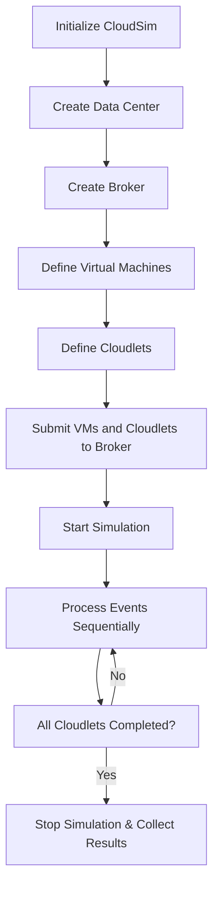

# CloudSim

---

### ## 1. Definition

CloudSim is an open‑source simulation toolkit written in Java. It allows researchers and students to model, simulate, and experiment with cloud computing infrastructures and application services without using any real cloud resources.

---

### ## 2. Concept Explanation

**Basic Idea**  
The basic idea behind CloudSim is to create a virtual environment that behaves like a real cloud. You can define virtual data centers, host machines, virtual machines, and user workloads. Then you run the simulation and observe metrics such as energy consumption, task completion time, and cost.

**How It Works**  
CloudSim uses discrete event simulation. A central clock advances step by step, and actions like starting a virtual machine or finishing a task are represented as events. Users write Java programs that set up the hardware configuration, scheduling policies, and workload. The simulator processes all events in order and collects results without needing actual servers.

**Why It Is Important**  
Testing ideas on a real cloud costs money and time. CloudSim lets students and researchers evaluate new scheduling algorithms, load balancing strategies, or energy‑saving policies instantly and for free. Mistakes do not lead to real‑world failures, and scenarios can be repeated many times with different settings.

---

### ## 3. Key Characteristics / Features

- **Discrete Event‑Based Simulation**  
  The simulation proceeds by processing events in a time‑ordered queue, which accurately mimics resource allocation over time.

- **Modeling of Core Cloud Elements**  
  CloudSim provides built‑in classes to represent data centers, hosts, virtual machines, and cloudlets (application tasks).

- **Support for Virtualization**  
  You can create multiple virtual machines on a single host, each with its own CPU, RAM, and bandwidth shares.

- **Customizable Scheduling Policies**  
  Researchers can plug in their own algorithms for allocating virtual machines to hosts or tasks to virtual machines.

- **Federated Cloud Support**  
  The toolkit can simulate multiple data centers that work together, allowing the study of inter‑cloud scenarios.

- **Energy‑Aware Modeling**  
  It includes power models to measure the energy consumed by hosts based on CPU utilization.

---

### ## 4. Types / Classification (if applicable)

While CloudSim itself is a single toolkit, it can be used to simulate different kinds of cloud environments. The classification is based on the type of cloud infrastructure being modeled.

- **Single Data Center Simulation**  
  Only one data center is created. This is the simplest setup and is used to test internal policies or scheduling for a single provider.

- **Multiple Data Centers Simulation**  
  Several data centers are defined, possibly with different capacities and locations. This helps in studying brokering policies across sites.

- **Federated Cloud Simulation**  
  Multiple data centers owned by different providers cooperate to share resources. CloudSim models the communication and sharing policies needed for cloud federation.

- **Hybrid and Community Cloud Models**  
  Users can mix private and public cloud resources by defining different data center entities with varying sharing and pricing rules.

---

### ## 5. Working / Mechanism

The simulation process in CloudSim follows a sequence of clear steps. You describe the scenario in Java code, and then the simulator engine runs it.

1. **Initialization**  
   The CloudSim package is initialized with the number of users, current date, and a trace flag. This sets up the event queue and the clock.

2. **Create the Data Center**  
   A data center object is created with a list of physical hosts. Each host gets CPU cores, RAM, storage, and bandwidth defined.

3. **Set Up the Data Center Broker**  
   A broker represents the cloud customer. It is responsible for submitting virtual machines and cloudlets to the data center and making scheduling decisions.

4. **Define Virtual Machines**  
   A list of virtual machines is created and submitted to the broker. Each VM has requirements like MIPS, number of CPUs, memory, and a VM image size.

5. **Define Cloudlets**  
   Cloudlets are the applications or tasks that run on VMs. Each cloudlet has a length (in million instructions) and input/output file sizes.

6. **Submit Virtual Machines and Cloudlets**  
   The broker sends the VM list and cloudlet list to the data center. The data center’s scheduler decides where to place each VM and which cloudlet runs when.

7. **Start the Simulation**  
   The simulation is started. The clock advances, and events like VM creation and cloudlet completion are processed one by one.

8. **Collect and Analyze Results**  
   After all cloudlets finish, the simulation stops. The broker retrieves the results, which include execution times, waiting times, cost, and energy consumption.

---

### ## 6. Diagram (MANDATORY)

---

### ## 7. Mathematical Formulation (if applicable)

CloudSim computes the execution time of a cloudlet on a VM using the simple formula:

$$
Time = \frac{CloudletLength \times 10^6}{VM\_MIPS}
$$

Where:  
- `CloudletLength` = number of million instructions (MI) the cloudlet must execute.  
- `VM_MIPS` = millions of instructions per second that the VM can process.

For example, a 200,000 MI cloudlet running on a VM with 1000 MIPS will take 200 seconds. CloudSim also uses similar formulas to calculate bandwidth latency and storage delay.

---

### ## 8. Example

A student wants to test a new algorithm that chooses the least busy VM for each task. Instead of renting cloud servers, the student writes a Java program with CloudSim. They create one data center with two hosts. They define five VMs with different MIPS values and ten cloudlets of varying lengths. The code implements a custom broker that monitors VM loads and assigns each cloudlet to the least busy VM. The simulation runs in a few seconds on a laptop. It outputs the total completion time and the average CPU utilization. The student finds that the custom algorithm reduces total time by 15% compared to the default round‑robin policy. This result guides the student’s final project report.

---

### ## 9. Analogy

Imagine you are designing a new layout for a busy airport. Building the actual terminal and testing passenger flow with real travellers would be expensive and risky. Instead, you use a computer simulation. You create virtual check‑in counters (hosts), security lanes (VMs), and passengers (cloudlets). You run the simulation many times with different queuing rules. CloudSim is like that simulation tool but for cloud data centers. You can test hundreds of workload patterns and resource policies on your laptop before making any change in a real cloud.

---

### ## 10. Comparison (if needed)

| Feature | CloudSim | Real Cloud Environment |
|--------|----------|------------------------|
| Cost | Free, runs on local machine | Pay‑per‑use; requires internet and payment |
| Speed of testing | Simulation can be repeated quickly | Depends on resource provisioning time |
| Risk of failure | None; errors only produce wrong numbers | Misconfiguration may expose data or incur charges |
| Realism | Approximates network delay and VM startup time | Captures all real‑world uncertainty |
| Customizability | Fully custom schedulers and configurations | Limited to what the provider allows |

---

### ## 11. Advantages

- **Zero Cost**  
  No cloud subscription or hardware purchase is needed. All experiments run on a personal computer.

- **Repeatable and Controlled Experiments**  
  The same setup can be run again with identical conditions, which is difficult in a real cloud with shared resources.

- **Fast Prototyping of Algorithms**  
  Researchers can code and test new scheduling, load balancing, or energy‑saving ideas in hours rather than weeks.

- **No Risk to Real Services**  
  A simulated crash or overload costs nothing and reveals weaknesses without affecting real users.

- **Rich Visualization Options**  
  CloudSim can be extended to output graphs, logs, and traces for detailed analysis.

---

### ## 12. Disadvantages / Limitations

- **Limited Network Realism**  
  The built‑in network model is simple and may not capture the complex latency and packet loss of a live cloud.

- **Java‑Based Programming Required**  
  Users must know Java to write simulation programs, which raises the entry barrier for non‑programmers.

- **Simplified Security Simulation**  
  CloudSim does not simulate security attacks, firewalls, or encryption overhead.

- **No Real‑Time Interaction**  
  The simulation runs based on a clock and cannot interact with actual external services like a real‑time database.

- **Hardware Resource Intensive for Large Scenarios**  
  Simulating thousands of hosts and millions of cloudlets can slow down the simulation and consume significant RAM.

---

### ## 13. Important Points / Exam Notes

- CloudSim is a **Java‑based discrete event simulator** for cloud environments.
- Key entities: **DataCenter**, **Host**, **VM**, **Cloudlet**, **Broker**.
- Cloudlets represent user tasks; their length is measured in **Million Instructions (MI)**.
- The simulation is initialized, configured, then started; results are collected after it stops.
- It supports **federated clouds**, **energy modeling**, and **custom scheduling policies**.
- It was developed by the CLOUDS Lab at the University of Melbourne.
- It is widely used for **research in resource allocation, load balancing, and green computing**.

---

### ## 14. Applications / Use Cases

- **Academic Research**  
  Students and professors test new VM placement, load balancing, and energy‑efficient algorithms.

- **Cloud Service Provider Planning**  
  Companies simulate the impact of adding new data centers or changing pricing models before implementation.

- **Algorithm Comparison**  
  Multiple scheduling strategies are run on the same workload to find which one reduces cost or makespan.

- **Teaching Cloud Computing Concepts**  
  Instructors use CloudSim to demonstrate how virtualization and dynamic provisioning work in classrooms.

---

### ## 15. MCQs (MANDATORY)

**Q1. What is CloudSim primarily used for?**  
A. Hosting live web applications  
B. Modelling and simulating cloud computing environments  
C. Encrypting cloud data  
D. Monitoring real‑time server performance  
**Answer:** B  
**Explanation:** CloudSim is a simulation toolkit that lets users model cloud infrastructures and run experiments without using real resources.

---

**Q2. Which programming language is CloudSim written in?**  
A. Python  
B. C++  
C. Java  
D. Ruby  
**Answer:** C  
**Explanation:** CloudSim is an open‑source Java library, so users write their simulation programs in Java.

---

**Q3. In CloudSim, what does a “cloudlet” represent?**  
A. A physical server  
B. A network switch  
C. An application task or user request  
D. A storage volume  
**Answer:** C  
**Explanation:** A cloudlet models a job or a set of instructions that must be executed on a virtual machine.

---

**Q4. Which entity acts as the customer that submits VMs and cloudlets to the data center?**  
A. Host  
B. DatacenterBroker  
C. VmAllocationPolicy  
D. CloudletScheduler  
**Answer:** B  
**Explanation:** The broker represents the cloud user or customer and manages the submission of virtual machines and tasks.

---

**Q5. How is the execution time of a cloudlet on a VM calculated in CloudSim?**  
A. Cloudlet length divided by VM RAM  
B. Cloudlet length divided by VM bandwidth  
C. Cloudlet length in million instructions divided by VM MIPS  
D. VM MIPS multiplied by number of hosts  
**Answer:** C  
**Explanation:** The basic formula is Time = CloudletLength (in MI × 10^6) / VM MIPS.

---

**Q6. Which of the following is a major advantage of using CloudSim over real cloud testing?**  
A. It can run actual customer traffic  
B. It costs money to use  
C. Experiments are repeatable and free  
D. It does not support any customization  
**Answer:** C  
**Explanation:** CloudSim allows unlimited, cost‑free, and repeatable experiments, which is not possible in a paid cloud environment.

---

**Q7. Which simulation type does CloudSim use?**  
A. Continuous simulation  
B. Discrete event simulation  
C. Agent‑based simulation only  
D. Real‑time simulation  
**Answer:** B  
**Explanation:** CloudSim processes a queue of time‑ordered events, which is the hallmark of discrete event simulation.

---

**Q8. What is one limitation of CloudSim?**  
A. It cannot simulate multiple data centers  
B. It can only run on cloud servers  
C. The network model is simplified and not fully realistic  
D. It is closed‑source and expensive  
**Answer:** C  
**Explanation:** CloudSim’s in‑built network model has limited detail and does not capture all real‑world network behaviors.

---

**Q9. In the CloudSim workflow, what should be done immediately after initializing the CloudSim package?**  
A. Collect results  
B. Start the simulation  
C. Create the data center  
D. Shut down all VMs  
**Answer:** C  
**Explanation:** After initialization, the user typically creates the data center with its host machines and configurations.

---

**Q10. Besides task scheduling, what other cloud aspect can CloudSim help simulate?**  
A. Physical fan speed  
B. Energy consumption of hosts  
C. Web browser rendering  
D. Mobile device battery cycles  
**Answer:** B  
**Explanation:** CloudSim includes power models to estimate energy usage based on host CPU utilization, supporting green computing research.