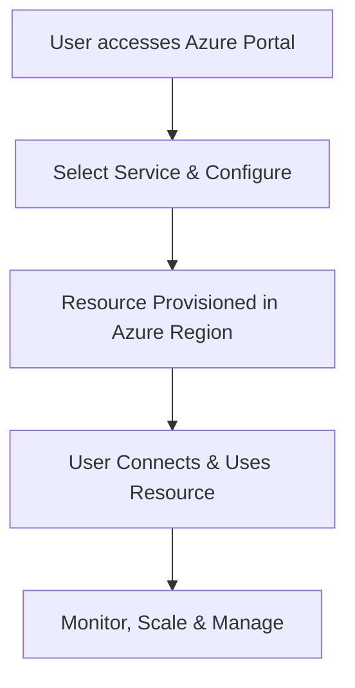

# Microsoft Cloud Services Azure

## 1. Definition
Microsoft Azure is a public cloud computing platform created by Microsoft. It provides a wide range of integrated services—such as virtual machines, databases, artificial intelligence, and networking—over the internet on a pay-as-you-go pricing model.

## 2. Concept Explanation
Microsoft Azure allows individuals and organisations to run applications, store data, and manage IT resources without owning physical servers. Instead of buying hardware, users rent computing power and storage from Microsoft’s global network of data centres.  
To use Azure, a customer creates a subscription and then chooses the needed services through a web portal, command-line tools, or code. Azure immediately provisions the resources in the selected region. Users can scale resources up or down depending on demand and pay only for what they consume.  
This approach is important because it reduces upfront costs, speeds up innovation, and makes enterprise-grade technology available to organisations of any size. It also offers strong integration with existing Microsoft products like Windows Server, Active Directory, and Office 365.

## 3. Key Characteristics / Features
- On-demand self-service allows users to create and manage resources without human intervention from Microsoft.
- Broad network access ensures services are available over the internet through standard browsers and tools.
- Resource pooling means that many customers securely share the same physical infrastructure.
- Rapid elasticity enables resources to scale out during peak usage and scale in when demand drops.
- Measured service provides transparent billing based on actual usage, such as per minute of virtual machine runtime.
- Azure has a massive global footprint with more regions than any other cloud provider.
- It supports hybrid cloud scenarios, letting organisations connect on-premises data centres with the Azure cloud.

## 4. Types / Classification
Azure services are grouped into three main cloud service models:

- **Infrastructure as a Service (IaaS)**  
  Provides virtualised computing resources like virtual machines, storage, and virtual networks. Users manage the operating system and applications while Azure manages the physical hardware.

- **Platform as a Service (PaaS)**  
  Offers a platform for developing, running, and managing applications without handling the underlying infrastructure. Examples include Azure App Service and Azure SQL Database.

- **Software as a Service (SaaS)**  
  Delivers complete software applications over the internet. Microsoft 365, which runs on Azure, is a well-known example, although Azure itself is primarily a platform for deploying custom SaaS solutions.

## 5. Working / Mechanism
The process of using a typical Azure service follows these steps:

1. The user registers for an Azure account and sets up a subscription with billing details.
2. The user accesses the Azure Portal (a web interface), the Azure Command-Line Interface (CLI), or PowerShell.
3. The desired service is chosen from the catalogue, for example, a Windows virtual machine.
4. Configuration details are entered, such as the region, virtual machine size, operating system version, and network settings.
5. The user reviews the configuration and clicks “Create”. Azure validates the request and starts provisioning.
6. After a few minutes, the resource is ready. The user connects to it using tools like Remote Desktop Protocol (RDP) or a web URL.
7. Throughout its lifecycle, the resource is monitored using Azure Monitor and managed for performance and cost.
8. When the resource is no longer needed, it is stopped or deleted to stop billing.

## 6. Diagram

## 7. Mathematical Formulation
The total cost of services on Azure can be estimated using a simple sum formula:

$$
\text{Total Monthly Cost} = \sum_{i=1}^{n} (\text{Service}_i \times \text{Usage}_i \times \text{Rate}_i)
$$

Where:  
- **Service_i** represents each Azure service used, like virtual machines or blob storage.  
- **Usage_i** is the quantity consumed, such as number of hours a VM ran or gigabytes stored.  
- **Rate_i** is the unit price for that service in a given region.

## 8. Example
A small online learning platform uses Azure App Service to host its website. Student data is stored in an Azure SQL Database, and lecture videos are kept in Azure Blob Storage. When new courses launch and traffic spikes, the App Service automatically scales to more instances. The company pays only for the extra compute time during the spike, keeping costs low during quiet periods.

## 9. Analogy
Azure works like a large electricity grid. Instead of installing a generator at home (on-premises servers), you plug into the grid and pay only for the electricity you actually use. You can increase or decrease your consumption instantly, without worrying about maintenance of the power plant.

## 10. Comparison

| Feature | Microsoft Azure | Traditional On-Premises Data Centre |
|--------|-----------------|--------------------------------------|
| Meaning | Cloud platform with services hosted in Microsoft-managed global data centres. | Company-owned servers and networking inside a local facility. |
| Cost | Operational expense; pay only for usage, no large upfront costs. | High capital expenditure for hardware, power, and cooling. |
| Scalability | Instant, near-limitless scaling. | Limited by physical hardware; scaling requires purchase and setup time. |

## 11. Advantages
- It reduces or eliminates upfront infrastructure costs and transforms them into predictable operational expenses.
- Azure offers extreme scalability, letting workloads grow or shrink automatically based on real-time demand.
- A global network of regions helps deploy applications closer to users for lower latency and better performance.
- Built-in disaster recovery, backup, and high-availability features protect business continuity.
- Azure deeply integrates with existing Microsoft tools like Windows Server, Active Directory, and Visual Studio.
- The platform meets extensive compliance certifications, making it suitable for government, healthcare, and financial sectors.

## 12. Disadvantages / Limitations
- Managing Azure effectively requires learning many new tools and concepts, which can be steep for beginners.
- Cloud costs can become unexpectedly high if usage and budgets are not actively monitored.
- A reliable internet connection is essential to access and manage services.
- Data placed in foreign Azure regions may be subject to different privacy laws, raising data sovereignty concerns.
- Heavy reliance on Azure-specific services can lead to vendor lock-in, making it hard to move to another cloud later.

## 13. Important Points / Exam Notes
- Azure is a Microsoft public cloud providing IaaS, PaaS, and SaaS capabilities.
- Azure Virtual Machines offer scalable infrastructure compute; Azure App Service is a managed PaaS for web apps.
- Azure Active Directory is a cloud-based identity and access management service, deeply integrated with the platform.
- Pay-as-you-go pricing means you pay for compute by the minute and storage by the gigabyte.
- Azure regions are sets of data centres located across the globe; choosing the right region affects latency and compliance.
- Azure Resource Manager (ARM) is the unified management layer used to create, update, and delete resources.

## 14. Applications / Use Cases
- Hosting dynamic websites and web applications that handle millions of users automatically.
- Running virtual desktop infrastructure (VDI) so employees can access work desktops from anywhere.
- Storing and processing big data with services like Azure Synapse Analytics and Azure Databricks.
- Building and training machine learning models using Azure Machine Learning.
- Creating backup and disaster recovery solutions for on-premises servers.
- Developing Internet of Things (IoT) applications that connect and analyse data from millions of devices.

## 15. MCQs

**Q1. What is Microsoft Azure?**  
A. A desktop operating system  
B. A public cloud computing platform by Microsoft  
C. A database management system only  
D. A private network appliance  
**Answer:** B  
**Explanation:** Microsoft Azure is a comprehensive cloud platform offering IaaS, PaaS, and SaaS services.

---

**Q2. Which of the following is an example of Platform as a Service (PaaS) in Azure?**  
A. Azure Virtual Machines  
B. Azure App Service  
C. Microsoft 365  
D. Azure Blob Storage (as raw storage)  
**Answer:** B  
**Explanation:** Azure App Service lets you host web apps without managing the underlying operating system, which is a PaaS characteristic.

---

**Q3. How are customers charged for using Azure Virtual Machines?**  
A. A one-time upfront license fee  
B. Only by the amount of RAM installed  
C. On a pay-as-you-go basis, typically per minute of usage  
D. Fixed monthly price regardless of usage  
**Answer:** C  
**Explanation:** Azure follows a consumption-based model; you pay for the minutes a VM runs and the storage used.

---

**Q4. Which tool provides a graphical web interface to manage Azure resources?**  
A. Azure PowerShell  
B. Azure CLI  
C. Azure Portal  
D. Windows Task Manager  
**Answer:** C  
**Explanation:** The Azure Portal is a web-based GUI for creating, configuring, and managing services.

---

**Q5. What is the role of an Azure region?**  
A. A single physical computer  
B. A set of data centres within a defined geographical area  
C. A software licence boundary  
D. An internet speed measurement  
**Answer:** B  
**Explanation:** A region consists of one or more data centres located close together, offering low latency and compliance options.

---

**Q6. Which service would you use to run a custom Windows Server application while retaining full control over the OS?**  
A. Azure SQL Database  
B. Azure App Service  
C. Azure Virtual Machines  
D. Azure Active Directory  
**Answer:** C  
**Explanation:** IaaS with Virtual Machines gives you full control of the operating system and any installed software.

---

**Q7. How does Azure support hybrid cloud environments?**  
A. By only allowing on-premises servers  
B. Through services like Azure Arc and VPN Gateway that connect local data centres to Azure  
C. By requiring all data to stay in the public cloud  
D. It does not support hybrid connections  
**Answer:** B  
**Explanation:** Azure provides dedicated networking and management tools to seamlessly extend on-premises data centres into the cloud.

---

**Q8. What is the primary purpose of Azure Active Directory?**  
A. To host virtual machines  
B. To provide identity and access management for users and applications  
C. To store video files  
D. To act as a firewall  
**Answer:** B  
**Explanation:** Azure AD is a cloud-based identity service that handles authentication and access control.

---

**Q9. Which of the following is a disadvantage of using Azure?**  
A. Reduced electricity bills for a company’s own data centre  
B. Potential for unexpected high costs if usage is not monitored  
C. Guaranteed zero network latency  
D. No need for any internet connection  
**Answer:** B  
**Explanation:** Without proper budgeting and monitoring, cloud expenditures can grow quickly and unexpectedly.

---

**Q10. A company wants to store large amounts of unstructured data like images and videos. Which Azure storage service is best suited?**  
A. Azure SQL Database  
B. Azure Blob Storage  
C. Azure Virtual Network  
D. Azure App Service  
**Answer:** B  
**Explanation:** Azure Blob Storage is optimised for storing massive amounts of unstructured data such as images, videos, and backups.