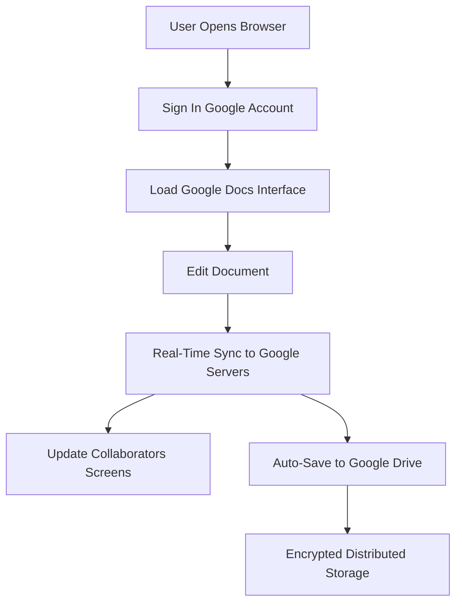

# Google Cloud Applications

## Video Explanation

* [https://www.youtube.com/watch?v=JwKJkU4n1rM](https://www.youtube.com/watch?v=JwKJkU4n1rM)

## Visual Aids

## 1. Definition
Google Cloud Applications are software services and tools provided by Google that run on Google’s global cloud infrastructure. They are accessed over the internet and include both ready-to-use productivity applications (like Gmail and Google Docs) and platforms for building custom applications (like App Engine and Firebase).

## 2. Concept Explanation
The basic idea is that Google delivers applications entirely from the cloud, so there is no need to install or maintain software on local computers. Users access these applications through a web browser or mobile app, and all data is stored securely in Google’s data centers.

How it works: Behind the scenes, Google’s massive network of servers handles all the processing and storage. When you edit a document in Google Docs or deploy an application on Google App Engine, your actions are processed on remote machines, and only the results are shown on your device. Multiple users can work on the same file or application simultaneously because Google’s infrastructure synchronizes everything in real time.

Why it is important: These applications reduce IT headaches because Google manages updates, security, and scalability. Businesses can focus on their core work without worrying about software patches or hardware failures. For developers, Google Cloud platforms provide tools to build, test, and release applications quickly, scaling from zero to millions of users worldwide.

## 3. Key Characteristics / Features
- **Web-based access:** Users work from a browser without installing any software, making applications available on any device with internet.
- **Real-time collaboration:** Multiple people can edit documents, spreadsheets, or code at the same time, with changes visible instantly.
- **Automatic updates and patches:** Google continuously updates the applications behind the scenes, so users always have the latest features and security fixes.
- **Global scalability:** Applications run on Google’s worldwide network of data centers, providing fast performance and high availability globally.
- **Integration by default:** Google Workspace apps (Gmail, Drive, Meet, etc.) are tightly integrated, allowing seamless sharing and communication.
- **Security and compliance:** Google builds strong security controls into every application, including encryption, identity management, and compliance with international standards.

## 4. Types / Classification
Google Cloud Applications fall into two broad categories: ready-to-use productivity suites and platform services for building custom cloud applications.

**1. Productivity and Collaboration Applications (Google Workspace)**
These are SaaS (Software as a Service) applications used by businesses, schools, and individuals for daily tasks.
- Gmail: Cloud-based email.
- Google Drive: Cloud storage and file sharing.
- Google Docs, Sheets, Slides: Online word processor, spreadsheet, and presentation tools.
- Google Meet: Video conferencing.
- Google Calendar: Shared online calendars.
- Google Chat: Team messaging.

**2. Application Development Platforms (Google Cloud Platform services)**
These are PaaS and serverless services that developers use to build, host, and scale custom applications on Google’s infrastructure.
- App Engine: Fully managed platform for running web applications in popular languages.
- Cloud Run: Serverless compute for containerized applications.
- Firebase: Backend platform for building mobile and web apps with real-time databases, authentication, and hosting.
- Google Kubernetes Engine (GKE): Managed environment for deploying containerized applications using Kubernetes.

## 5. Working / Mechanism
The following steps explain how a collaborative document works in Google Docs, a typical Google Cloud application.

1. A user opens a web browser and goes to docs.google.com. The browser loads a light front-end page, not the entire application.
2. After signing in with a Google account, the application’s interface is streamed from Google’s nearest edge server for speed.
3. When the user types text, the keystrokes are sent to Google’s servers, which process the edit and update the master document in the cloud.
4. If another user has the same document open, Google’s real-time collaboration engine pushes the change instantly to their screen using WebSocket or similar technology.
5. The document is saved automatically and continuously to Google Drive, stored redundantly across multiple data centers.
6. All data in transit and at rest is encrypted; access is governed by the sharing permissions set by the document owner.
7. The application backend automatically scales to handle thousands of simultaneous editors without any user noticing a change in performance.

## 6. Diagram
The following Mermaid diagram shows the flow of a user accessing and editing a Google Workspace application.

## 7. Mathematical Formulation
A common metric for any cloud application is availability, which measures how often the service is up and running.

$$
Availability (\%) = \frac{MTBF}{MTBF + MTTR} \times 100
$$

Where:
- **MTBF** = Mean Time Between Failures (average time the service works before a failure).
- **MTTR** = Mean Time To Repair (average time to restore service after a failure).

Google Cloud applications, like Workspace, routinely achieve 99.9% or higher availability due to redundant infrastructure and automatic failover.

## 8. Example
A marketing team at a small company uses Google Workspace. They begin the day checking Gmail for client responses. They open a shared Google Slides presentation to prepare a pitch. Three team members edit different slides at the same time, and the changes appear instantly for everyone. They hold a video meeting with the client using Google Meet directly from the Calendar invite. After the meeting, the final presentation is saved in a shared Drive folder. The company never set up a single server; all tools just work through the browser.

## 9. Analogy
Google Cloud Applications are like a 24/7 office building that you can enter from anywhere in the world. You do not need to build or maintain the building; everything is provided and ready. Gmail is your postal mailbox, Drive is your filing cabinet, Docs is your writing desk, and Meet is your conference room. You simply walk in with a key (your Google account) and start working, while all the security, cleaning, and repairs are handled by the building management (Google).

## 10. Comparison
A useful comparison is between Google Workspace (cloud-native) and traditional desktop office software.

| Feature | Google Workspace (Cloud Apps) | Traditional Desktop Office |
|--------|----------|----------|
| Access | Any device with a browser and internet | Installed on one or a few computers |
| Collaboration | Real-time editing with multiple people simultaneously | Usually one user at a time; sharing via file attachments |
| Updates | Automatic, continuous, and free | Manual installations and paid upgrades |
| Storage | Files saved in the cloud (Drive) | Files saved on local hard drive or network share |
| Backup & recovery | Automatic by Google; files not lost if a computer crashes | User must manually back up to protect from device failure |

## 11. Advantages
- No installation or maintenance is required, saving time and IT staff effort.
- Real-time collaboration improves teamwork and reduces version confusion in documents.
- Data is automatically backed up and accessible from any internet-connected device.
- Google’s security infrastructure provides strong protection and compliance certifications.
- Applications scale effortlessly, handling from a handful to millions of users automatically.
- Costs are predictable with subscription plans, and many basic features are free for personal use.

## 12. Disadvantages / Limitations
- A reliable internet connection is required; offline functionality is limited compared to desktop applications.
- Organizations must trust Google with sensitive data, which can be a concern for highly regulated industries.
- Customization is limited; users cannot modify the source code or deeply alter the application’s behavior.
- Subscription costs for business plans can add up over time compared to one-time desktop purchases.
- Some advanced features found in traditional desktop office suites may be missing or work differently.
- Vendor lock-in can occur; migrating large amounts of data and workflows off Google’s platform takes effort.

## 13. Important Points / Exam Notes
- Google Cloud Applications include both the Google Workspace suite (SaaS) and Google Cloud Platform services for building applications (PaaS/Serverless).
- Google Docs, Sheets, and Slides are web-based and support real-time collaborative editing.
- Google App Engine is a fully managed platform for deploying web applications without managing servers.
- Cloud Run is a serverless compute platform that runs containerized applications and scales automatically.
- Firebase provides a backend for mobile and web apps with services like real-time database, authentication, and analytics.
- All Google Cloud Applications are built on Google’s global infrastructure, using encryption, identity management, and distributed storage.
- Offline access is available for some Workspace apps (e.g., Docs) via browser extensions and mobile apps, but it is limited.
- Google Workspace is often used by educational institutions, startups, and enterprises for cost-effective cloud-based productivity.

## 14. Applications / Use Cases
- **Education:** Schools and universities use Google Workspace for Education to provide email, assignments through Classroom, and collaborative projects.
- **Small and medium businesses:** Companies run entirely on Google Workspace for email, file storage, video calls, and internal documentation.
- **Startup mobile apps:** Entrepreneurs use Firebase to quickly add authentication, data storage, and push notifications to their mobile applications.
- **Web application hosting:** Developers deploy websites and APIs on App Engine or Cloud Run, letting Google handle traffic spikes.
- **Remote work:** Distributed teams use Google Meet, Chat, and shared calendars to stay connected and productive from different locations.

## 15. MCQs

**Q1. Which of the following is a Google Cloud productivity application?**
A. Amazon S3  
B. Google Docs  
C. Microsoft Azure  
D. VMware vSphere  
**Answer:** B  
**Explanation:** Google Docs is part of the Google Workspace suite of cloud-based productivity applications.

**Q2. What kind of service is Google App Engine?**
A. Infrastructure as a Service  
B. Platform as a Service  
C. Desktop application  
D. Email client  
**Answer:** B  
**Explanation:** App Engine is a fully managed PaaS that lets developers run web applications without managing servers.

**Q3. Real-time collaboration in Google Docs means that:**
A. Only one person can edit a document per day  
B. Changes made by one user appear instantly to others editing the same document  
C. Documents are printed every time they are edited  
D. Documents are stored only on the user’s device  
**Answer:** B  
**Explanation:** Google Docs supports simultaneous editing, with updates pushed instantly to all collaborators.

**Q4. Which Google service provides a backend platform for mobile and web apps with a real-time database?**
A. Google Drive  
B. Google Meet  
C. Firebase  
D. Google Photos  
**Answer:** C  
**Explanation:** Firebase offers databases, authentication, and other backend services for app developers.

**Q5. Google Workspace applications are primarily accessed through:**
A. A physical installation DVD  
B. A web browser  
C. A command line only  
D. A dedicated hardware appliance  
**Answer:** B  
**Explanation:** Workspace apps like Gmail, Docs, and Sheets run in a browser, requiring no software installation.

**Q6. What does the MTBF (Mean Time Between Failures) indicate in cloud availability?**
A. The time it takes to fix a problem  
B. The average number of users online  
C. The average time a service runs before a failure occurs  
D. The cost of cloud storage  
**Answer:** C  
**Explanation:** MTBF measures reliability; a higher value means the service runs longer without interruption.

**Q7. Which of the following is a key advantage of using Google Cloud Applications over traditional desktop software?**
A. They never require an internet connection  
B. They are automatically updated and backed up by Google  
C. They always have more advanced features than desktop software  
D. They are free for all corporate users  
**Answer:** B  
**Explanation:** Google manages updates and backups, reducing the burden on users and IT staff.

**Q8. Google Cloud Run is best described as:**
A. A spreadsheet program  
B. A serverless platform for running containerized applications  
C. An email filtering tool  
D. A physical server rack  
**Answer:** B  
**Explanation:** Cloud Run runs containers without requiring users to manage the underlying servers.

**Q9. A limitation of Google Cloud Applications is that:**
A. They require extensive on-site server hardware  
B. Offline capabilities are more limited compared to desktop apps  
C. They cannot encrypt data  
D. They only run on Google Chrome OS  
**Answer:** B  
**Explanation:** While some offline support exists, the full feature set depends on an active internet connection.

**Q10. Google’s infrastructure that powers Google Cloud Applications is known for:**
A. Being located in a single data center  
B. Providing global distributed access and high availability  
C. Using only open-source software  
D. Requiring users to manage security patches  
**Answer:** B  
**Explanation:** Google’s network of data centers around the world ensures fast access and resilience for its applications.