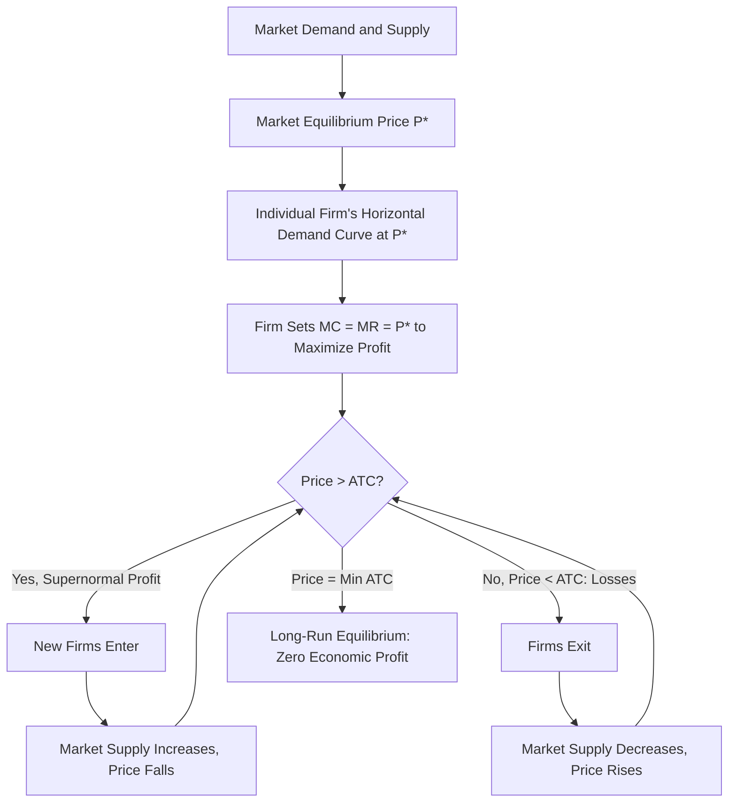

# Perfect Competition Features of Perfectly Competitive Market

## Video Explanation

* [https://www.youtube.com/watch?v=3ez10ADR_gM](https://www.youtube.com/watch?v=3ez10ADR_gM)

## Visual Aids

## 1. Definition

Perfect competition is a market structure where a large number of small buyers and sellers trade a homogeneous product. No single buyer or seller can influence the market price; they are price takers. There is free entry and exit of firms, and all participants have perfect information about the market.

---

## 2. Concept Explanation

The basic idea of perfect competition is an ideal market form that serves as a benchmark for evaluating real-world markets. In such a market, the forces of demand and supply freely determine the price, and every firm accepts that price as given.

How it works: Thousands of small sellers offer an identical product, like a standard food grain. Buyers see no difference between one seller’s product and another’s. If any seller tries to charge a price higher than the going market price, buyers will instantly switch to other sellers, and the higher-price seller will lose all customers. On the other hand, charging a lower price is unnecessary because the seller can already sell any quantity at the current market price. So every firm takes the market price as fixed and decides only how much to produce. In the long run, profits attract new firms, and losses force firms to exit until all remaining firms make just normal profit (zero economic profit).

Why it is important: Though perfect competition rarely exists in pure form, it provides a standard of maximum efficiency. It shows how markets can achieve optimal allocation of resources. The concept is fundamental in understanding price determination, consumer welfare, and the effects of monopoly and other market imperfections.

---

## 3. Key Characteristics / Features

- **Large number of buyers and sellers:** There are so many participants that the actions of any single buyer or seller have a negligible effect on total market supply or demand.
- **Homogeneous product:** The goods offered by different sellers are identical in quality, features, and appearance. Buyers have no reason to prefer one seller over another.
- **Free entry and exit:** New firms can enter the industry without legal, financial, or technological barriers. Existing firms can leave the industry freely. This ensures that long-run profits are normal.
- **Perfect information:** All buyers and sellers have complete knowledge about prices, quality, and availability in every part of the market. No one can exploit ignorance.
- **Price taker firms:** Each firm has to accept the price determined by the market. An individual firm’s demand curve is perfectly elastic (horizontal) at the ruling market price.
- **No government intervention:** The price mechanism operates without price controls, subsidies, or restrictive regulations. The market is self-regulated.
- **Perfect mobility of factors of production:** Resources like labour and capital can move instantly and without cost between different industries or uses in response to economic incentives.
- **Absence of transport costs:** It is assumed that buyers do not incur any transport cost, or transport costs are uniform. This prevents price differences based purely on location.

---

## 4. Types / Classification

*(Not applicable for features of perfect competition. This section describes a pure type; there are no distinct sub-types of perfect competition in standard economic theory. However, economists sometimes distinguish between pure competition and perfect competition: pure competition emphasizes large numbers, homogeneous product, and free entry; perfect competition adds perfect information and perfect factor mobility. But the syllabus uses "Perfect Competition" as one category.)*

If classification is needed, we could mention:

- **Pure competition:** Relaxes some of the perfection assumptions (like perfect knowledge and perfect mobility of factors). It includes only large numbers of firms, homogeneous product, and free entry/exit.
- **Perfect competition:** Adds the remaining assumptions: perfect knowledge, perfect mobility of factors, and absence of transport costs.

---

## 5. Working / Mechanism

1. The market demand and market supply together determine the equilibrium price for the homogeneous good.
2. All firms in the market, being price takers, accept this price. The individual firm’s demand curve is a horizontal straight line at this price level.
3. A firm decides its profit-maximizing output by equating its marginal cost (MC) with marginal revenue (MR), which equals the market price (since MR = Price for a price taker).
4. If the market price is above the firm’s average total cost (ATC) at optimum output, the firm earns supernormal profit.
5. Attracted by profits, new firms enter the market. The market supply curve shifts to the right, causing the equilibrium price to fall.
6. Falling price reduces supernormal profits. Entry continues until the price drops to the minimum point of the long-run average cost (LRAC) curve, where all firms earn only normal profit (zero economic profit, i.e., covering all costs including opportunity cost of capital and entrepreneurship).
7. If the market price were below ATC, firms would incur losses. Some firms exit, reducing market supply, raising price, and restoring normal profit for the remaining firms.
8. In long-run equilibrium, price = marginal cost = minimum average cost. This ensures productive efficiency (firms produce at the lowest possible cost) and allocative efficiency (price reflects the true cost of production).

---

## 6. Diagram

*(Note: In the individual firm graph, the demand curve is a horizontal line at market price. The MC curve cuts the horizontal demand curve from below. In long-run equilibrium, the demand curve touches the lowest point of the ATC curve.)*

---

## 7. Mathematical Formulation

Under perfect competition, the firm is a price taker, so:

Total Revenue:  
$$
TR = P \times Q
$$

Average Revenue and Marginal Revenue:  
$$
AR = \frac{TR}{Q} = P \quad \text{and} \quad MR = \frac{d(TR)}{dQ} = P
$$

Since \( MR = P \), the profit-maximizing condition becomes:

$$
P = MC
$$

and the shut-down point (short run) is when price falls below the minimum average variable cost (AVC):

$$
P < \min AVC \quad \Rightarrow \quad \text{Firm shuts down}
$$

In the long run, free entry and exit force the price to equal the minimum long-run average cost:

$$
P = LRAC_{\min}
$$

and at this point:

$$
P = MC = AR = MR = LRAC_{\min}
$$

---

## 8. Example

Consider the market for unbranded rice grown by thousands of farmers in a region. All farmers produce essentially the same quality of rice. There are many buyers (wholesalers, retailers, consumers). Government does not intervene in pricing. If the prevailing market price is ₹30 per kg, an individual farmer cannot sell at ₹32 because buyers will buy from another farmer at ₹30. If the farmer tries to sell at ₹28, he will sell all his stock but earn less than necessary profit. So he accepts ₹30 and decides how many bags to bring to market by comparing his marginal cost of producing one more bag with ₹30. In the long run, if rice farming is highly profitable, new farmers enter, increasing supply, lowering price until only normal profit remains.

---

## 9. Analogy

Think of a large beach with thousands of identical pebbles. A buyer wants to buy a pebble. All pebbles are exactly the same. If one pebble-seller asks for a higher price, the buyer will simply pick up a pebble from the next seller. No seller has any power to set a price different from the shore-wide rate. Sellers who do not like the rate can leave, and if pebbles are in high demand, more sellers may start selling until the rate covers just the effort. That shore-side pebble market behaves very much like perfect competition.

---

## 10. Comparison (Perfect Competition vs. Monopoly)

| Feature | Perfect Competition | Monopoly |
|--------|---------------------|-----------|
| Number of sellers | Very large | One |
| Nature of product | Homogeneous | Unique, no close substitutes |
| Entry barriers | None | Very high |
| Price control | Price taker | Price maker |
| Demand curve faced by firm | Perfectly elastic (horizontal) | Downward sloping (market demand) |
| Long-run profit | Normal profit only | Can sustain supernormal profit |
| Efficiency | Productively and allocatively efficient | Inefficient; deadweight loss exists |

---

## 11. Advantages

- Leads to productive efficiency as firms produce at the lowest point on the average cost curve.
- Results in allocative efficiency; resources are directed where consumer demand is highest relative to cost.
- Consumers pay the lowest possible price in the long run.
- No wasteful advertising or product differentiation expenses.
- Automatically adjusts through the price mechanism, requiring no central planner.
- Provides maximum consumer surplus.
- Encourages innovation only to reduce costs; inefficient firms are forced out.

---

## 12. Disadvantages / Limitations

- Rarely, if ever, exists in the real world in its pure form.
- No scope for product variety; all goods are identical, which may not satisfy diverse consumer tastes.
- Assumes perfect information, which is unrealistic.
- Profits are driven to normal, leaving little surplus for research and development in some interpretations (though firms must innovate to minimize cost, they may lack funds for major R&D if profits are very low).
- Does not account for transport costs and geographical differences.
- May not be suitable for industries with high fixed costs (natural monopolies) where large-scale production is more efficient.
- Externalities (like pollution) are not considered; market equilibrium may not be socially optimal.

---

## 13. Important Points / Exam Notes

- Perfect competition is a theoretical market structure with many small buyers and sellers, homogeneous product, free entry/exit, perfect knowledge, and no transport costs.
- Firms are price takers; the demand curve for an individual firm is perfectly elastic (horizontal).
- Profit maximization: P = MR = MC.
- In the short run, firms may earn supernormal profits or losses.
- In the long run, free entry and exit drive profits to normal (zero economic profit), and price equals minimum LRAC.
- Long-run equilibrium condition: P = AR = MR = MC = LRACmin.
- The market is productively efficient (producing at minimum cost) and allocatively efficient (P = MC).
- It serves as a benchmark to evaluate other market structures like monopoly, oligopoly, and monopolistic competition.

---

## 14. Applications / Use Cases

- **Agricultural commodities markets:** Markets for staple crops (wheat, rice, corn) often approximate perfect competition due to many small farmers and homogeneous product, though imperfections exist.
- **Foreign exchange market:** High volume of buyers and sellers of standard currencies, high information availability, and minimal barriers approximate perfect competition.
- **Stock exchanges:** Buying and selling shares of a specific company involve many participants, identical shares, and near-instant price information, showing competitive traits.
- **Online marketplaces for standard products:** Some digital goods or standard commodities (e.g., USB cables, generic components) on large platforms exhibit price-taking behaviour.

---

## 15. MCQs

**Q1. Which of the following is a key feature of a perfectly competitive market?**  
A. Single seller  
B. Differentiated product  
C. Many buyers and sellers  
D. Barriers to entry  
**Answer:** C  
**Explanation:** Perfect competition requires a large number of small buyers and sellers, none of whom can influence market price.

**Q2. In perfect competition, an individual firm’s demand curve is:**  
A. Downward sloping  
B. Upward sloping  
C. Perfectly elastic (horizontal)  
D. Perfectly inelastic (vertical)  
**Answer:** C  
**Explanation:** The firm is a price taker; it can sell any quantity at the market price, resulting in a horizontal demand curve.

**Q3. Under perfect competition, profit-maximizing output occurs where:**  
A. TR = TC  
B. MR > MC  
C. MR = MC and MC is rising  
D. ATC is minimum  
**Answer:** C  
**Explanation:** The condition is MR = MC, and for a price taker, MR = P. The MC curve must cut MR from below.

**Q4. In the long run, firms in perfect competition earn:**  
A. Supernormal profits  
B. Only normal profits (zero economic profit)  
C. Heavy losses  
D. Monopoly profits  
**Answer:** B  
**Explanation:** Free entry and exit drive economic profits to zero; firms earn just enough to cover all opportunity costs.

**Q5. Long-run equilibrium under perfect competition requires:**  
A. P > LRACmin  
B. P = LRACmin  
C. P < LRACmin  
D. P > MC  
**Answer:** B  
**Explanation:** In long-run equilibrium, price equals the minimum point of the long-run average cost curve, ensuring both productive and allocative efficiency.

**Q6. A homogeneous product means that:**  
A. Products are heavily advertised  
B. Products are exactly identical across sellers  
C. Each seller has a unique brand  
D. Products are patented  
**Answer:** B  
**Explanation:** Homogeneous products are identical; buyers perceive no difference among sellers.

**Q7. Which of the following is NOT an assumption of perfect competition?**  
A. Perfect mobility of factors  
B. Large number of sellers  
C. Significant economies of scale leading to natural monopoly  
D. Free entry and exit  
**Answer:** C  
**Explanation:** Perfect competition assumes no barriers; natural monopoly arises from large economies of scale relative to market size, which contradicts the many-sellers assumption.

**Q8. In perfect competition, as new firms enter the market attracted by profits, the market price:**  
A. Rises  
B. Falls  
C. Stays constant  
D. Becomes zero  
**Answer:** B  
**Explanation:** Entry increases market supply, which pushes the equilibrium market price down.

**Q9. The shut-down point for a perfectly competitive firm in the short run occurs when:**  
A. Price falls below average total cost  
B. Price falls below average variable cost  
C. Marginal cost is falling  
D. Total revenue equals total cost  
**Answer:** B  
**Explanation:** If price falls below minimum AVC, the firm cannot cover its variable costs and should shut down in the short run.

**Q10. Which market in reality most closely resembles perfect competition?**  
A. Automobile industry  
B. Agricultural commodity market like wheat  
C. Electric utility company  
D. Smartphone operating system market  
**Answer:** B  
**Explanation:** Agricultural markets with many small producers of identical products, free entry, and relatively transparent prices approximate perfect competition, though not perfectly.