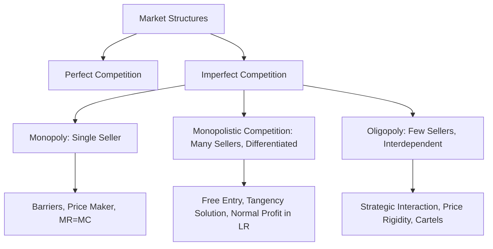

# 02 Imperfect Competition: Monopoly, Monopolistic Competition, Oligopoly

## 1. Definition

Imperfect competition is a market situation where the conditions of perfect competition (many buyers and sellers, identical products, free entry and exit) are not met. In such markets, individual firms have some control over price.

The three main forms of imperfect competition are:
- **Monopoly:** A market with a single seller and many buyers. The firm is the industry and sets price or output.
- **Monopolistic competition:** A market with many sellers offering differentiated products. Each firm competes on quality, brand, and price but has limited market power.
- **Oligopoly:** A market dominated by a few large sellers. Firms are interdependent, and each firm’s actions affect rivals.

## 2. Concept Explanation

In the real world, perfect competition rarely exists. In most markets firms enjoy some degree of market power – they can raise price without losing all customers. Imperfect competition studies how firms behave in such environments.

A **monopolist** is the only producer. There are strong barriers to entry, so no competitors can enter. The monopolist can earn supernormal profits in the long run. **Monopolistic competition** is more common: think of restaurants, salons, or clothing brands. Each offers something unique, so they have a small degree of monopoly power, but free entry in the long run drives economic profit to zero. **Oligopoly** is seen in automobiles, telecom, or cement. A few firms control the market; each considers rivals’ reactions before changing price or output. This interdependence leads to strategic behaviour and price rigidity.

Understanding these structures is crucial because they determine pricing, output, efficiency, and consumer welfare. Project managers and engineers must know the market they operate in to set the right price, forecast revenues, and plan capacity.

## 3. Key Characteristics / Features

- **Few sellers or a single seller:** In all three forms, the number of firms is small compared to perfect competition.
- **Downward sloping demand curve:** Each firm faces a falling demand curve; to sell more, it must lower its price.
- **Barriers to entry:** Monopoly and oligopoly have high entry barriers (legal, technical, capital). Monopolistic competition has free entry, so long‑run profits are normal.
- **Product differentiation:** Monopolistic competition and oligopoly often use branding, quality, and advertising to make products distinct.
- **Interdependence (oligopoly):** Firms watch competitors and react strategically, leading to kinked demand or price leadership models.
- **Price maker:** A monopolist is a price maker; monopolistically competitive firms have some price‑setting ability; oligopolists may collude or act as price leaders.

## 4. Types / Classification

Imperfect competition is divided into three classic market structures:

- **Monopoly:** A single seller. Examples: local water supply utility, patented drug for a rare disease (during patent life). A pure monopoly has no close substitutes and full control over price.
- **Monopolistic Competition:** Many sellers, each with a differentiated product. Differentiation can be real (quality, features) or perceived (brand image, packaging). There is free entry and exit.
- **Oligopoly:** Few sellers (generally 2 to 10 firms). Products may be homogeneous (steel, aluminium) or differentiated (cars, electronics). The key feature is mutual interdependence. A special case is **duopoly:** only two firms.

These types lie on a spectrum from high concentration (monopoly) to lower concentration (monopolistic competition).

## 5. Working / Mechanism

While all imperfectly competitive firms maximise profit where MR = MC, their mechanisms differ.

1.  **Monopoly:** The monopolist faces the market demand curve. It chooses output where MR = MC; the price is then read off the demand curve. Since there is no entry, supernormal profits persist. The monopolist may also practise price discrimination to extract consumer surplus.

2.  **Monopolistic Competition:**
    - In the short run, the firm acts like a mini‑monopoly: it sets MR = MC, makes profit or loss.
    - In the long run, profit attracts new firms with similar but differentiated products. The original firm’s demand shifts left and becomes flatter. Entry continues until profits are zero (P = AC), and equilibrium output is where the demand curve is tangent to the average cost curve.

3.  **Oligopoly:**
    - Behaviour is interdependent. Models include:
      - *Kinked demand curve:* If one firm raises price, others don’t follow – demand is elastic above the kink. If it lowers price, rivals match – demand is inelastic below the kink. This explains price rigidity.
      - *Collusive oligopoly:* Firms agree on price/output (cartel) and act like a joint monopoly (OPEC type).
      - *Price leadership:* The dominant firm sets price, and others follow.
    - Output and price depend on strategic interaction, often analysed with game theory.

## 6. Diagram

## 7. Mathematical Formulation

Profit maximisation condition for any firm:

$$
MR = MC
$$

A widely used measure of monopoly power is the Lerner Index:

$$
L = \frac{P - MC}{P} = -\frac{1}{E_d}
$$

Where:  
\( P \) = Price  
\( MC \) = Marginal cost  
\( E_d \) = Price elasticity of demand (negative for downward sloping demand)

The larger the Lerner Index (closer to 1), the greater the firm’s monopoly power. For perfect competition, \( P = MC \), so \( L = 0 \). For a monopolist, \( P > MC \), so \( L > 0 \).

## 8. Example

- **Monopoly:** Indian Railways (passenger services) is a near monopoly for long‑distance rail travel. It sets fares with little direct competition.
- **Monopolistic competition:** Fast‑food restaurants in a city centre. Many outlets sell burgers, but each differentiates by recipe, ambience, or delivery speed.
- **Oligopoly:** The Indian telecom sector is dominated by a few large players – Reliance Jio, Airtel, Vodafone Idea. Their pricing decisions affect each other immediately; price wars are common.

## 9. Analogy

Think of a school canteen. If there is only one food stall selling all snacks – that is **monopoly**. If many stalls sell different types of food (sandwiches, pizza, vada pav), each trying to attract students by taste and branding – that is **monopolistic competition**. If only two big stalls control the entire supply and closely watch each other’s prices and offers – that is **oligopoly**.

## 10. Comparison

| Feature | Monopoly | Monopolistic Competition | Oligopoly |
|--------|----------|----------|----------|
| **Number of sellers** | One | Many | Few (2–10) |
| **Product type** | Unique, no close substitutes | Differentiated | Homogeneous or differentiated |
| **Entry barriers** | Very high, blocked | Free entry and exit | High barriers (capital, tech, licences) |
| **Firm’s control over price** | Considerable (price maker) | Some, but limited by substitutes | Moderate to high, but mutual interdependence |
| **Long‑run profit** | Supernormal profit possible | Normal profit (P = AC) | Supernormal profit possible due to barriers |
| **Examples** | Local water utility | Salons, restaurants | Automobiles, cement, telecom |

## 11. Advantages

- **Monopoly encourages innovation:** Patents create temporary monopolies, motivating research and development.
- **Economies of scale:** Monopolies and oligopolies can produce at a lower average cost, providing cheaper services.
- **Product variety:** Monopolistic competition gives consumers a wide range of choices and customisation.
- **Strategic stability:** In oligopoly, price rigidity can create a stable market environment for planning.
- **Resource mobilisation:** Large oligopoly firms can invest heavily in infrastructure and technology.

## 12. Disadvantages / Limitations

- **Higher prices and lower output:** Monopoly and collusive oligopoly lead to prices above marginal cost, causing deadweight loss.
- **Inefficiency:** Monopolies may lack the incentive to cut costs (X‑inefficiency) or improve quality.
- **Excess capacity:** In monopolistic competition, firms produce at less than optimum scale; consumers pay higher average costs.
- **Risk of collusion:** Oligopolists may form cartels that exploit consumers and restrict output.
- **Non‑price competition waste:** Excessive advertising in monopolistic competition may waste resources without adding real value.

## 13. Important Points / Exam Notes

- Imperfect competition occurs when at least one condition of perfect competition is violated.
- Monopoly: single seller, strong barriers, price maker, possible supernormal profits in the long run.
- Monopolistic competition: many sellers, product differentiation, free entry; long‑run equilibrium where AR = AC (tangency).
- Oligopoly: few interdependent firms; kinked demand curve explains price stickiness; game theory used for analysis.
- The Lerner Index measures monopoly power: \( L = (P - MC)/P \).
- In monopoly, \( P > MR = MC \); in perfect competition, \( P = MR = MC \).
- The degree of market concentration is measured by the concentration ratio or the Herfindahl‑Hirschman Index.
- Monopolies can arise from legal grants, patents, control of raw materials, or natural cost advantages.
- Oligopoly models include Cournot (quantity competition), Bertrand (price competition), and Stackelberg (leader‑follower).
- Government regulation (competition laws) often targets monopolies and cartels to protect consumers.

## 14. Applications / Use Cases

- **Patented medicines:** A pharmaceutical company holds a monopoly on a life‑saving drug for the patent period, allowing high prices to recover R&D.
- **Retail clothing:** Numerous brands (Zara, H&M, Levi’s) compete via style and quality, typical of monopolistic competition.
- **Mobile network operators:** Oligopoly market; tariff plans are similar, and firms closely monitor each other’s promotional offers.
- **OPEC:** An international cartel of oil‑producing countries acting as an oligopoly to influence global crude prices.
- **Local cable TV/internet:** Often a monopoly or duopoly in a region due to infrastructure cost barriers.

## 15. MCQs

**Q1. A market with a single seller and no close substitutes is called**

A. Oligopoly  
B. Monopolistic competition  
C. Monopoly  
D. Perfect competition  

**Answer:** C  
**Explanation:** Monopoly is characterised by one seller and a unique product.

---

**Q2. Product differentiation is the key feature of**

A. Monopoly  
B. Oligopoly  
C. Monopolistic competition  
D. Perfect competition  

**Answer:** C  
**Explanation:** In monopolistic competition, many firms sell slightly different products.

---

**Q3. In the long run, a monopolistically competitive firm earns**

A. Supernormal profits  
B. Only normal profits  
C. Losses always  
D. Zero revenue  

**Answer:** B  
**Explanation:** Free entry drives economic profit to zero, so only normal profit remains.

---

**Q4. The kinked demand curve model is associated with**

A. Monopoly  
B. Oligopoly  
C. Monopolistic competition  
D. Perfect competition  

**Answer:** B  
**Explanation:** The kinked demand curve explains price rigidity in oligopolistic markets.

---

**Q5. In monopoly, profit‑maximising output occurs where**

A. Price equals marginal cost  
B. Marginal revenue equals marginal cost  
C. Average cost equals marginal cost  
D. Total revenue is maximum  

**Answer:** B  
**Explanation:** Like all firms, a monopolist maximises profit at MR = MC.

---

**Q6. Which of the following is a barrier to entry in a monopoly market?**

A. Large number of firms  
B. Free entry and exit  
C. Patent protection  
D. Product differentiation  

**Answer:** C  
**Explanation:** Patents legally prevent other firms from entering and selling the same product.

---

**Q7. In an oligopoly, if one firm lowers its price, other firms are likely to**

A. Ignore the price cut  
B. Increase their prices  
C. Match the price cut  
D. Exit the market  

**Answer:** C  
**Explanation:** Due to interdependence, rivals match price cuts to avoid losing market share.

---

**Q8. The Lerner Index is zero when**

A. A firm is a monopoly  
B. Price equals marginal cost  
C. There is product differentiation  
D. There are few firms  

**Answer:** B  
**Explanation:** Lerner Index = (P‑MC)/P. When P = MC, it is zero, as in perfect competition.

---

**Q9. An example of a monopolistically competitive market is**

A. A local electricity distribution company  
B. The automobile industry  
C. Hair salons in a city  
D. The steel industry  

**Answer:** C  
**Explanation:** Salons are many, offer differentiated services, and face few entry barriers.

---

**Q10. Cartels are most commonly found in**

A. Monopolistic competition  
B. Oligopoly  
C. Perfect competition  
D. Monopoly  

**Answer:** B  
**Explanation:** A cartel is a group of oligopolistic firms acting together as a monopoly.