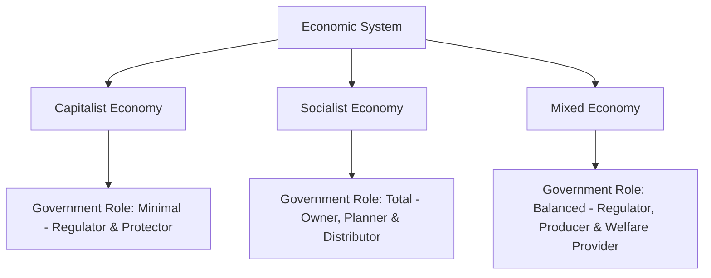

# Role of Government in Socialist, Capitalist and Mixed Economy Structure with Example

## 1. Definition

The role of government in an economy refers to the extent and manner of state intervention in economic activities. In a capitalist economy, the government plays a minimal role, mainly as a regulator. In a socialist economy, it plays a dominant and controlling role. In a mixed economy, the government balances state intervention with private enterprise, acting as a regulator, producer, and welfare provider.

## 2. Concept Explanation

Every nation must decide how much the government should control the economy. The answer depends on the economic system adopted. A capitalist system trusts private individuals and markets to drive production and distribution. The government's role is to protect property rights, enforce contracts, and provide a stable environment. A socialist system believes the state must own resources and plan the entire economy to ensure equality. The government directs what, how, and for whom to produce. A mixed economy combines elements of both. Here, the government intervenes to correct market failures, redistribute income, and provide essential services, while private firms operate freely in many sectors.

How it works: In capitalism, the government sets rules but does not produce goods. In socialism, the government owns factories, land, and banks, and allocates resources through central planning. In a mixed economy, the government runs strategic sectors like defence and railways, regulates monopolies, and offers social security, while markets determine prices and production in other areas.

Why it is important: Understanding these roles helps citizens and policymakers evaluate the trade-offs between economic freedom and social equality. It explains why some countries have free healthcare (socialist/mixed) and others rely on private insurance (capitalist), and how a nation tackles poverty, unemployment, and development.

## 3. Key Characteristics / Features

- **Capitalist Economy (Limited Government):** The government enforces laws, protects private property, and promotes competition. It does not own businesses or plan production.
- **Socialist Economy (Dominant Government):** The government owns all major means of production. It decides what to produce, sets prices, and distributes goods to achieve social equality.
- **Mixed Economy (Dual Role):** The government both works alongside and regulates the private sector. It runs public sector enterprises for essential services and welfare, while allowing private initiative in consumer goods and services.
- **Income Redistribution:** In socialist and mixed systems, the government actively redistributes wealth through taxes and welfare schemes, unlike pure capitalism where redistribution is minimal.
- **Control of Natural Resources:** In socialist and many mixed economies, the government retains ownership of critical natural resources like minerals, oil, and forests.

## 4. Types / Classification (Economic Structures)

The three main economic structures each define a distinct government role:

- **Capitalist Economy (Free Market Economy):** Private individuals own and control resources. Government acts as a referee, ensuring fair play. Example: United States of America.
- **Socialist Economy (Command Economy):** The state owns all factors of production. Government acts as the sole planner and controller. Example: North Korea and Cuba.
- **Mixed Economy:** Both private and public sectors coexist. Government acts as a regulator, producer, and protector of the poor. Example: India and United Kingdom.

## 5. Working / Mechanism

### In a Capitalist Economy
1.  Individuals and firms own land, capital, and businesses.
2.  Market forces of demand and supply determine prices and production.
3.  The government maintains law and order, enforces contracts, and protects property rights.
4.  It provides only essential public goods like national defence, roads, and police.
5.  It refrains from direct interference in business decisions or setting prices.

### In a Socialist Economy
1.  The government owns all resources, including factories, banks, and farmland.
2.  A central planning authority prepares a comprehensive plan for the whole country.
3.  The plan sets production targets for every industry and allocates raw materials and labour.
4.  The government fixes prices of all essential goods and services.
5.  Distribution of output is based on needs rather than purchasing power.

### In a Mixed Economy
1.  The private sector operates freely in consumer goods, agriculture, and most services.
2.  The government runs key industries like railways, power generation, and defence.
3.  It regulates private monopolies to prevent exploitation of consumers.
4.  It uses taxes and subsidies to redistribute income and reduce inequality.
5.  It provides public services like education and health to ensure minimum welfare for all citizens.

## 6. Diagram

## 7. Mathematical Formulation

Not applicable for this topic.

## 8. Example

- **Capitalist Economy (USA):** The US government does not own automobile companies or software firms. It sets safety and emission standards, enforces antitrust laws, and provides national defence. Private companies like Ford and Microsoft operate with minimal state interference.
- **Socialist Economy (North Korea):** The state owns all farms, factories, and media. The government decides what crops are grown, what products are made, and at what price they are sold. There is virtually no private business.
- **Mixed Economy (India):** The Indian government runs Indian Railways, Coal India, and public schools. At the same time, private companies like Reliance, Tata, and Infosys operate in telecom, steel, and IT. The government also runs massive welfare schemes like PDS and MNREGA to support the poor.

## 9. Analogy

Consider managing a school event. In a capitalist model, a teacher only sets the rules and lets students plan and execute the entire function. They run food stalls, decorations, and tickets on their own. In a socialist model, the school administration plans everything centrally: assigns tasks, decides menus, and distributes profits equally. In a mixed model, the school organises the main stage and security (public goods), but lets students run food and game stalls independently, while monitoring prices and quality.

## 10. Comparison

| Feature | Capitalist Economy | Socialist Economy | Mixed Economy |
|--------|-------------------|-------------------|---------------|
| Ownership of resources | Private individuals and firms | Entirely by the state | Both private and public sectors |
| Government's role | Minimal, acts as a regulator | Total, acts as owner and planner | Balanced, acts as regulator, producer, and welfare agent |
| Price determination | Market forces of demand and supply | Government planning authority | Markets for most goods, government intervention for essentials |
| Primary objective | Economic efficiency and profit | Social equality and welfare | Growth with justice and stability |
| Example countries | United States, Singapore | North Korea, Cuba | India, United Kingdom |

## 11. Advantages

- **Capitalist model:** A limited government role fosters innovation, competition, and high efficiency in resource use.
- **Capitalist model:** Consumers enjoy a wide variety of goods, and industries respond quickly to market demands.
- **Socialist model:** A dominant government role ensures that basic needs like food, housing, and healthcare are met for all citizens, reducing poverty and inequality.
- **Socialist model:** Economic output is directed toward national goals, avoiding wasteful competition.
- **Mixed model:** The government can correct market failures like pollution, provide public goods, and prevent exploitation of labour and consumers.
- **Mixed model:** A balanced approach promotes both economic growth through private enterprise and social welfare through government programmes.

## 12. Disadvantages / Limitations

- **Capitalist model:** Minimal government can lead to high income inequality, monopolies, and neglect of public goods like clean air.
- **Capitalist model:** Economic cycles and recessions may cause severe unemployment with little state support.
- **Socialist model:** Total government control often results in inefficiency, lack of innovation, and goods shortages due to poor planning.
- **Socialist model:** Limited personal freedom and no entrepreneurial incentive can slow down economic growth.
- **Mixed model:** A heavy-handed government can create bureaucratic delays, corruption, and red tape that stifle private business.
- **Mixed model:** Striking the right balance is difficult; too much intervention leads to socialism-like inefficiency, too little leads to capitalism-like inequality.

## 13. Important Points / Exam Notes

- In a capitalist economy, the government is a **facilitator**, not a player.
- In a socialist economy, the government is the **sole player**, eliminating the private sector.
- In a mixed economy, the government is a **co-player** with the private sector.
- India adopted a mixed economy model after independence, with a strong public sector, but liberalised in 1991 to allow greater private participation.
- The government's role in a mixed economy includes pricing essential commodities, running PSUs, providing subsidies, and framing laws like the Competition Act.
- The success of any economic system depends on how well the government performs its designated role without overreach or neglect.

## 14. Applications / Use Cases

- **Disaster Management:** In a mixed economy like India, the government is the primary responder during floods and pandemics, while private companies contribute through CSR and logistics support.
- **Space Exploration:** In the USA (capitalist), private companies like SpaceX now play a huge role; in India (mixed), ISRO is a government body that collaborates with private vendors.
- **Health Sector:** In the UK (mixed), the National Health Service provides free care; in the USA (capitalist), healthcare is mostly private, though programs like Medicare exist.
- **Essential Commodities:** The Indian government’s buffer stock operations for wheat and rice are classic examples of a mixed economy intervention to stabilise prices.
- **Public Transport:** State-run bus corporations in a mixed economy compete with private operators, ensuring services even on unprofitable routes.

## 15. MCQs

**Q1. In which economic system does the government play the role of a total owner and planner?**

A. Capitalist economy  
B. Mixed economy  
C. Socialist economy  
D. Laissez-faire economy  
**Answer:** C  
**Explanation:** In a socialist system, the state owns all means of production and centrally plans the entire economy.

**Q2. India is an example of which type of economic structure?**

A. Pure capitalist  
B. Pure socialist  
C. Mixed economy  
D. Complete laissez-faire  
**Answer:** C  
**Explanation:** India has both a strong public sector and a thriving private sector, making it a mixed economy.

**Q3. The government's main function in a capitalist economy is to:**

A. Run all factories  
B. Provide free goods to all  
C. Set wages for every industry  
D. Protect property rights and enforce contracts  
**Answer:** D  
**Explanation:** In capitalism, the government acts as a regulator and protector, not as an owner of businesses.

**Q4. Which of the following is a characteristic of a socialist economy?**

A. Private ownership of capital  
B. Complete price freedom  
C. Central planning by the government  
D. Minimal role of the state  
**Answer:** C  
**Explanation:** A socialist economy relies on central planning where the state decides what to produce, how, and for whom.

**Q5. In a mixed economy, the government intervenes primarily to:**

A. Eliminate all private enterprises  
B. Achieve a balance between growth and social welfare  
C. Maximise the wealth of individual capitalists  
D. Allow markets to function without any rules  
**Answer:** B  
**Explanation:** The mixed economy aims to combine the efficiency of markets with the equity goals of state intervention.

**Q6. The United States is often cited as a leading example of a:**

A. Socialist economy  
B. Capitalist economy  
C. Command economy  
D. Centrally planned economy  
**Answer:** B  
**Explanation:** The US relies heavily on private enterprise and market forces, with a relatively limited government role in business.

**Q7. Which of the following roles is typical of the government in a mixed economy?**

A. Complete nationalisation of all industries  
B. No involvement in economic activities  
C. Running strategic sectors like defence and railways  
D. Forcing all citizens into government jobs  
**Answer:** C  
**Explanation:** In a mixed economy, the government keeps control of essential and strategic sectors while allowing other industries to the private sector.

**Q8. The government's role of redistributing income through taxes and subsidies is most prominent in:**

A. Pure capitalist economies  
B. Socialist and mixed economies  
C. Only in socialist economies  
D. No economic system  
**Answer:** B  
**Explanation:** Both socialist and mixed states actively redistribute wealth to reduce inequality, unlike pure capitalism.

**Q9. A major disadvantage of a socialist government's role is:**

A. Too much innovation  
B. Extreme inequality  
C. Inefficiency due to lack of profit motive  
D. Over-reliance on market forces  
**Answer:** C  
**Explanation:** Without competition and the profit motive, state-run enterprises often become slow and inefficient.

**Q10. The "referee" analogy best describes the government's role in which system?**

A. Socialist economy  
B. Mixed economy  
C. Capitalist economy  
D. Traditional economy  
**Answer:** C  
**Explanation:** In a capitalist system, the government acts like a referee by setting and enforcing rules but not playing the game itself.