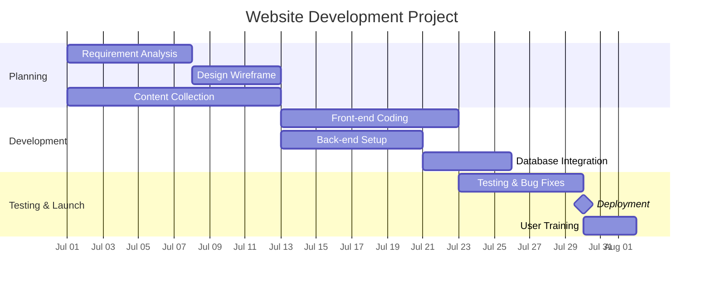

# 01 Gantt Chart system of bar charts for scheduling and reporting project progress
# Gantt Chart System of Bar Charts for Scheduling and Reporting Project Progress

## 1. Definition

A Gantt chart is a horizontal bar chart that visually displays a project schedule. It shows project tasks or activities listed on the vertical axis, time on the horizontal axis, and the duration of each task represented by a horizontal bar. The chart is used for planning, scheduling, and tracking project progress.

---

## 2. Concept Explanation

The basic idea is to turn a list of tasks and dates into a simple picture that anyone can understand. Instead of reading a table of start and end dates, team members and managers can see at a glance when each activity starts, how long it takes, and whether it is on schedule.

How it works: All tasks of a project are identified and written one below the other. A timeline is drawn at the top, showing days, weeks, or months. For each task, a horizontal bar is drawn from its start date to its end date. The length of the bar represents the task duration. As work progresses, the bar is shaded or coloured to show how much of the task is complete. A vertical line marking "today" shows exactly which tasks should have started or finished by now, making delays or early finishes instantly visible.

Why it is important: The Gantt chart is one of the most widely used project management tools. It helps in creating realistic schedules, communicating the plan to the team, monitoring actual progress against the plan, and identifying problems early. It reduces confusion and helps keep projects on time.

---

## 3. Key Characteristics / Features

- **Visual representation of time:** A timeline along the top makes the project duration and each task’s timing clear.
- **Horizontal bars:** Each task is shown as a bar; the bar’s length is proportional to the task duration.
- **Task list on the left:** Activities are arranged vertically, often in the order they are performed.
- **Progress tracking:** Bars can be partially shaded to indicate percentage of work completed.
- **Milestones:** Important events or deadlines can be marked with symbols (like a diamond) at specific dates.
- **Dependencies:** Arrows or links can be added to show that one task cannot start until another finishes.
- **Current date marker:** A vertical line marks today’s date to compare planned progress with actual progress.
- **Easy to read:** Without any specialised training, a team member can understand what needs to be done and when.

---

## 4. Types / Classification

Gantt charts can be classified based on their purpose and level of detail:

- **Planning Gantt chart (Baseline Gantt):** Created before the project begins. It shows the planned start and finish dates of all tasks. It serves as a reference to measure actual performance.
- **Tracking Gantt chart (Progress Gantt):** Updated regularly during the project. It displays the actual start, actual finish, and the percentage of completion of each task, often superimposed on the baseline bars.
- **Milestone Gantt chart:** A simplified chart that shows only key milestones and their dates, not all detailed tasks. It is useful for high-level management reporting.
- **Software-supported dynamic Gantt chart:** Created and updated using project management software (like Microsoft Project or Primavera). Dependencies are linked, and changes to one task automatically adjust the schedule of dependent tasks.

---

## 5. Working / Mechanism

The process of using a Gantt chart for scheduling and reporting follows these steps:

1. Identify and list all the tasks or activities required to complete the project.
2. Estimate the time duration needed for each task (in days, weeks, or months).
3. Determine the logical order of tasks and identify dependencies (which task must finish before another can start).
4. Decide on a project start date and calculate the start and finish dates for each task based on durations and dependencies.
5. Draw the horizontal time scale and list the tasks in order on the sheet or software.
6. Draw bars for each task from its planned start date to its planned finish date. This is the baseline schedule.
7. Mark milestones on the chart for important events or deadlines.
8. As the project progresses, fill in bars to indicate actual progress. A second bar or a shaded portion shows completed work.
9. Place a vertical "current date" line. Compare completed bars against the baseline to see if tasks are ahead, on time, or behind schedule.
10. Regularly update and report progress to the team and stakeholders. Re‑plan remaining work if delays occur.

---

## 6. Diagram

A Gantt chart for a simple website development project:

*Note: The diagram uses Mermaid's Gantt chart syntax. Sections group related tasks. The bars show durations and dependencies (e.g., "after a1"). The final launch is a milestone.*

---

## 7. Mathematical Formulation

While Gantt charts are primarily visual, basic progress calculations are often used for reporting:

**Percentage completion of a task:**

$$
\% \text{ Complete} = \frac{\text{Actual duration worked}}{\text{Planned total duration}} \times 100
$$

**Planned % complete by a given date (for the overall project):**

$$
\text{Planned \%} = \frac{\text{Sum of planned durations up to current date}}{\text{Total planned duration of all tasks}} \times 100
$$

**Schedule variance** can be monitored as:

$$
\text{Schedule Variance (days)} = \text{Actual finish date} - \text{Planned finish date}
$$

Where negative values indicate early completion and positive values indicate a delay.

These simple ratios help transform the visual chart into numerical progress reports.

---

## 8. Example

Consider the construction of a small boundary wall. The tasks and durations are:

- Site clearing: 2 days (Day 1–2)
- Excavation for foundation: 3 days (Day 3–5)
- Concrete pouring: 2 days (Day 6–7)
- Brickwork and plastering: 5 days (Day 8–12)
- Curing and finishing: 2 days (Day 13–14)

The project manager draws a Gantt chart with these tasks listed vertically and dates 1 to 14 on the horizontal axis. Bars are drawn accordingly. On Day 8, the manager shades the first three bars completely (they are done) and checks that brickwork is starting on time. If excavation had taken an extra day due to hard soil, the bar would be extended by one day and all downstream bars would need to shift to the right. The chart immediately shows the new completion date and helps in taking corrective action.

---

## 9. Analogy

Imagine a long classroom whiteboard set up during an exam preparation. On the left, the list of subjects. Across the top, the days of the week. For each subject, a magnetic strip is placed from the day you start revising to the day you plan to finish. As you complete chapters, you colour the strip. A red magnet marks "today". You can quickly see which subjects are behind and which are ahead. The Gantt chart works exactly like that whiteboard, but for project tasks instead of subjects.

---

## 10. Comparison (Gantt Chart vs. Network Diagram)

| Feature | Gantt Chart | Network Diagram (PERT/CPM) |
|--------|-------------|----------------------------|
| Meaning | Bar chart showing tasks against time | Flowchart showing task dependencies and logical sequence |
| Visual emphasis | Time and duration | Logical relationships and critical path |
| Ease of understanding | Very easy, intuitive | Requires training to read |
| Display of dependencies | Shown with arrows, but not the main focus | Clearly highlighted; the core purpose |
| Critical path identification | Not directly visible | Explicitly identified |
| Progress tracking | Excellent; visual shading of bars | Less direct; needs data updates |
| Best use | Scheduling, communication, tracking | Complex project analysis and control |

---

## 11. Advantages

- Provides a quick and clear visual overview of the entire project plan.
- All team members, including non-technical stakeholders, can understand the schedule.
- Helps in identifying which tasks should be running in parallel and which must follow others.
- Real-time progress tracking against the plan is possible by shading completed portions.
- Delays are immediately visible when the “today” line passes an unshaded bar.
- Acts as an effective communication tool in project review meetings.
- Can be created with simple tools like spreadsheets or specialised software.
- Helps in resource allocation by showing when each task is active.

---

## 12. Disadvantages / Limitations

- For very large projects, the chart can become too long and complex to read on a single page.
- Does not directly show the interdependence of tasks as clearly as a network diagram.
- The logic behind the schedule (why tasks are sequenced that way) is not immediately apparent from bars alone.
- Updating a hand-drawn or static chart manually is time-consuming and error-prone.
- The critical path and float (flexibility) are not displayed unless specifically calculated and overlaid.
- It can give a false sense of precision; small delays may accumulate without visible panic if not properly updated.
- Without software, managing hundreds of activities and their frequent changes is extremely difficult.

---

## 13. Important Points / Exam Notes

- A Gantt chart is a horizontal bar chart used for scheduling and tracking project tasks over time.
- Henry Gantt developed this chart around 1910–1915.
- Tasks are listed on the vertical axis; time runs on the horizontal axis.
- Bar length represents task duration; shading represents progress.
- A vertical “current date” line shows where the project stands.
- It can show milestones (important events) using special symbols.
- Dependencies can be shown with connecting arrows.
- Gantt charts are excellent for visual tracking but do not inherently show the critical path.
- Percent complete = (Actual work done / Total planned work) × 100.
- Useful for planning, communicating, monitoring, and reporting project status.

---

## 14. Applications / Use Cases

- **Construction projects:** Plotting tasks like earthwork, foundation, structure, and finishing to track site progress.
- **Software development:** Scheduling sprints, coding phases, testing cycles, and deployment dates.
- **Event management:** Planning tasks for venue booking, catering, promotion, and rehearsals leading up to the event day.
- **Manufacturing:** Production scheduling of machine operations and assembly line stages.
- **Research projects:** Timelines for literature survey, experiments, analysis, and report writing.
- **Administrative projects:** Office relocation, employee onboarding plans, and audit preparation.

---

## 15. MCQs

**Q1. A Gantt chart is primarily used for:**  
A. Cost estimation  
B. Risk analysis  
C. Project scheduling and progress tracking  
D. Quality control  
**Answer:** C  
**Explanation:** A Gantt chart is a bar chart that displays tasks against a timeline, making it ideal for scheduling and tracking.

**Q2. In a Gantt chart, the length of a bar represents:**  
A. Task importance  
B. Task duration  
C. Number of workers  
D. Task cost  
**Answer:** B  
**Explanation:** The horizontal bar extends from the task's start date to its finish date, so its length shows the duration.

**Q3. A vertical line drawn through a tracking Gantt chart usually indicates:**  
A. Project completion date  
B. A milestone  
C. Today’s date or the current reporting date  
D. The project budget  
**Answer:** C  
**Explanation:** The vertical line marks the current date, helping to compare planned versus actual progress.

**Q4. Which of the following is NOT directly shown in a basic Gantt chart?**  
A. Task names  
B. Task durations  
C. The project's critical path  
D. Planned start and finish dates  
**Answer:** C  
**Explanation:** A basic Gantt chart does not explicitly calculate or display the critical path; a network diagram is needed for that.

**Q5. Partial shading of a bar in a Gantt chart indicates:**  
A. The task is delayed  
B. The task is high priority  
C. The percentage of work completed on that task  
D. The budget spent so far  
**Answer:** C  
**Explanation:** The shaded part of a bar represents the proportion of work that is finished.

**Q6. Which type of Gantt chart is used primarily for reporting to top management?**  
A. Detailed task Gantt chart  
B. Milestone Gantt chart  
C. Resource Gantt chart  
D. Dependency Gantt chart  
**Answer:** B  
**Explanation:** A milestone Gantt chart highlights only key events and deadlines, making it suitable for high‑level reporting.

**Q7. What happens to a tracking Gantt chart when a task finishes earlier than planned?**  
A. The bar is erased  
B. The actual finish is marked, and the next task may start early if it depends on it  
C. The project end date automatically extends  
D. No change is made; the plan remains fixed  
**Answer:** B  
**Explanation:** Early completion is recorded; dependent tasks may take advantage of the early finish, potentially pulling in the project schedule.

**Q8. One limitation of a manual Gantt chart is:**  
A. It can easily show thousands of tasks  
B. Updating it is quick and error‑free  
C. It is difficult to update and maintain when many changes occur  
D. It automatically calculates the critical path  
**Answer:** C  
**Explanation:** Manually redrawing or updating many bars with frequent changes is time‑consuming and error‑prone.

**Q9. The formula `% Complete = (Actual Duration Worked / Planned Duration) × 100` is used to:**  
A. Calculate project cost overrun  
B. Determine the percentage completion of a task  
C. Estimate the total project budget  
D. Measure team productivity  
**Answer:** B  
**Explanation:** This simple ratio shows how much of a task’s planned duration has been accomplished, often reflected by bar shading.

**Q10. Which of the following statements is true regarding software‑based Gantt charts?**  
A. They cannot show dependencies  
B. They automatically adjust linked task dates when a change is made to one task  
C. They are always simpler than hand‑drawn charts  
D. They cannot track progress  
**Answer:** B  
**Explanation:** Project management software like MS Project automatically reschedules dependent tasks if a predecessor’s date changes.