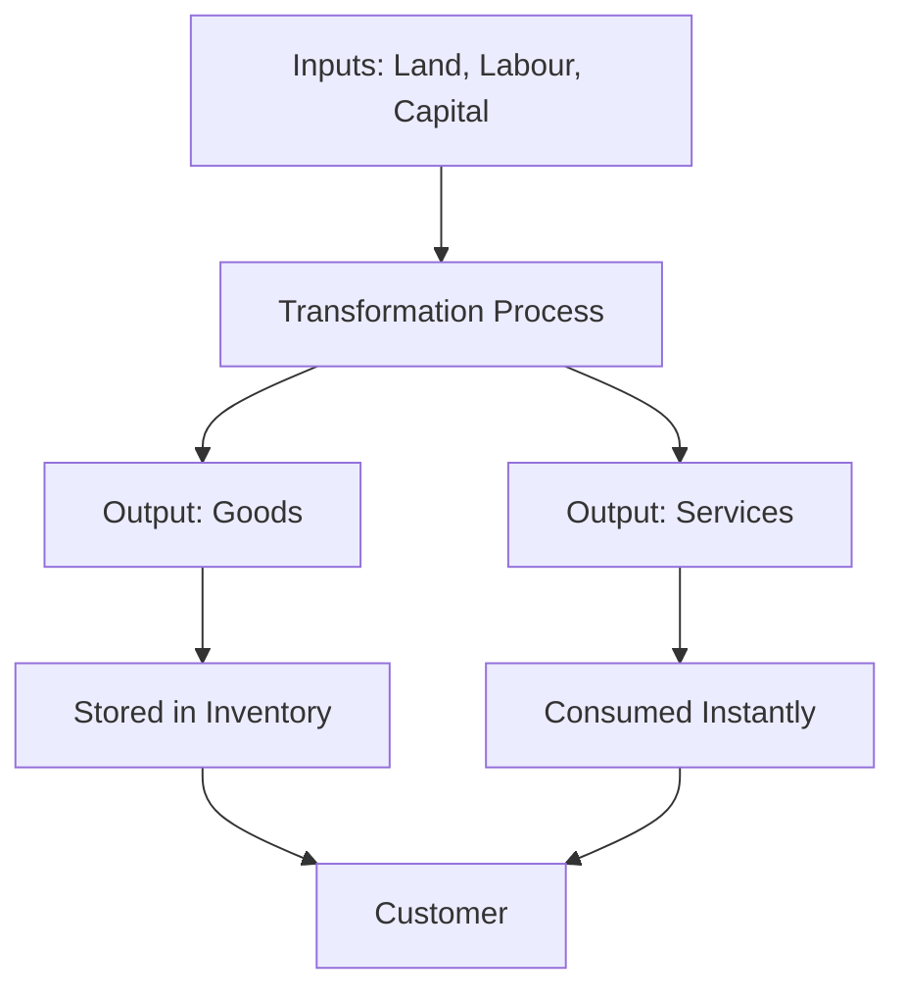

# Concept of production goods and services

## Video Explanation

* [https://www.youtube.com/watch?v=8hKqvTz0Q1M](https://www.youtube.com/watch?v=8hKqvTz0Q1M)

## Visual Aids

## 1. Definition

**Production** is the process of transforming inputs (like raw materials, labour, and machines) into outputs that can be used or consumed by people. The outputs of production are generally called **goods** and **services**.

**Goods** are tangible, physical items that can be seen, touched, and stored. **Services** are intangible activities or benefits that one party provides to another and cannot be stored.

## 2. Concept Explanation

The basic idea of production is to create value. No economy can survive without producing food, shelter, clothing, and other necessities. Every time a factory makes a bicycle, a farmer grows wheat, or a doctor treats a patient, production is taking place.

Production works by combining factors of production – land, labour, capital, and entrepreneurship. The output can be a good, like a mobile phone, or a service, like a haircut. Sometimes, the same process produces both; for example, a restaurant provides the good (food) and the service (serving and ambiance).

Why it is important: In engineering economics, understanding production helps us measure efficiency, estimate costs, and plan projects. Knowing whether the final output is a good or a service also changes how we manage quality, inventory, and customer satisfaction. Services cannot be stockpiled, so demand management becomes critical. Engineering decisions about machinery, layout, and capacity depend heavily on the nature of the output.

## 3. Key Characteristics / Features

- **Value addition:** Production is all about converting lower-value inputs into higher-value outputs.
- **Use of resources:** All production needs inputs – natural resources, human effort, tools, and knowledge.
- **Measurable output:** Production can be measured in physical units (number of cars, tons of steel) for goods, or in time and outcome for services (number of patients treated).
- **Tangible goods are storable:** Physical goods can be produced now and sold later.
- **Services are perishable:** A service exists at the moment it is delivered and cannot be kept in stock.
- **Customer involvement:** In services, the customer is often directly involved in the production process (e.g., a student in a classroom).

## 4. Types / Classification

Production outputs can be broadly classified into goods and services.

- **Goods:** These are tangible items. They can be further classified as:
  - *Consumer goods:* Used directly by people (bread, clothes, TV).
  - *Capital goods:* Used to produce other goods (machines, factory buildings, tools).
  - *Durable goods:* Have a long life (furniture, car).
  - *Non-durable goods:* Get consumed quickly (food, fuel).

- **Services:** These are intangible outputs. Types of services include:
  - *Personal services:* Haircut, education, healthcare.
  - *Business services:* Transportation, banking, advertising, consulting.
  - *Social services:* Public defence, law and order, public parks.

In engineering, a factory produces goods while a design consultancy provides services. Both are forms of production.

## 5. Working / Mechanism

A simple production process, whether for goods or services, follows these steps.

1.  **Identify the required output:** Decide what good or service is needed (e.g., 1000 bricks or a software training program).
2.  **Select inputs:** Choose the right raw materials, labour, machines, and technology.
3.  **Design the process:** Plan the sequence of operations; for goods, this might be a production line; for services, it is a service blueprint.
4.  **Transform inputs:** Apply labour and machines to convert inputs. In a restaurant, cooking is the transformation; in a hospital, diagnosis is the transformation.
5.  **Quality check:** Ensure the good meets specifications or the service meets standards.
6.  **Deliver to customer:** The good is packed and shipped; the service is delivered at a place and time convenient for the user.
7.  **Feedback and improvement:** Customer feedback helps improve the next production cycle.

## 6. Diagram

## 7. Mathematical Formulation

A basic production function shows the relationship between inputs and output.

$$
Q = f(L, K, M)
$$

Where:
- \( Q \) = Quantity of output (goods or services)
- \( L \) = Labour input
- \( K \) = Capital input (machines, tools)
- \( M \) = Materials or intermediate inputs

For a simple linear representation:

$$
Q = aL + bK + cM
$$

Where \( a, b, c \) are coefficients showing the contribution of each input. This helps engineers determine how many units can be made with given resources.

## 8. Example

A bakery produces **goods** (bread, cakes, pastries) using flour, ovens, and bakers. It can store the bread for a day before selling. The same bakery also offers a **service** – custom cake decoration for birthdays. This service is provided when a customer asks for it and cannot be stored. The production manager must schedule raw material purchase for goods and allocate skilled decorators’ time for the service.

## 9. Analogy

Think of a mobile phone (goods) and a mobile network connection (service). The phone is a physical object you can hold, keep for years, and resell. The network signal is a service; you use it instantly during a call and cannot store it. You need both for a complete experience. Similarly, an engineering economy requires both goods production (making steel) and service production (designing a structure).

## 10. Comparison

| Feature | Goods | Services |
|--------|----------|----------|
| **Tangibility** | Tangible – can be seen and touched | Intangible – cannot be seen or touched |
| **Storability** | Can be stored in stock | Cannot be stored; perishable |
| **Ownership** | Ownership transfers from seller to buyer | No transfer of ownership; only access or benefit |
| **Production and consumption** | Usually produced before consumption | Produced and consumed simultaneously |
| **Quality measurement** | Measured by physical specifications | Measured by customer satisfaction and experience |
| **Example** | Cement, laptop, water bottle | Medical check-up, transport, consulting |

## 11. Advantages

- **Goods provide economic stability:** They can be stored to meet unexpected demand spikes.
- **Services create direct employment:** Many services (teaching, repair) require personal interaction, generating jobs.
- **Combination boosts value:** Integrated goods and services (product plus warranty) enhance customer satisfaction.
- **Production determines standard of living:** More efficient production of goods and services increases a country’s wealth.
- **Scalability opportunity:** Some services, like software, can be scaled easily with technology once created.

## 12. Disadvantages / Limitations

- **Goods involve inventory costs:** Storing physical products requires warehouse space and ties up capital.
- **Services are hard to standardize:** The same service may vary from one provider to another, making quality control difficult.
- **Perishability of services creates idle capacity:** An empty seat in a bus or an unsold appointment is a lost opportunity forever.
- **Capital-intensive goods production:** Setting up a factory needs huge investment and has long break-even time.
- **Dependence on simultaneous demand:** Service providers like electricians must be available exactly when the customer needs them.

## 13. Important Points / Exam Notes

- Production is any activity that creates value, regardless of whether the output is a physical good or an intangible service.
- Goods are tangible, can be stored, and transfer ownership.
- Services are intangible, perishable, and produced and consumed at the same time.
- Consumer goods satisfy final wants; capital goods help in further production.
- Durable goods last long; non-durable goods perish or are consumed in one use.
- The same organization can produce both goods and services (e.g., a restaurant).
- The production function \( Q = f(L, K, M) \) applies to both goods and services.
- In engineering projects, the end product might be a physical structure (good) and the design work behind it is a service.
- Quality measurement is objective for goods (size, strength) and subjective for services (comfort, speed).
- Understanding the nature of output helps managers select the right production system and project structure.

## 14. Applications / Use Cases

- **Manufacturing industry:** Car plants plan assembly lines to produce tangible goods; inventory management is key.
- **Software development:** Coding a mobile app is a service-based production; once developed, the app is sold as a good (digital product).
- **Construction projects:** The final building is a good, but the architectural design and project management are services.
- **Healthcare:** Hospitals produce health services (treatment) using medical equipment (capital goods).
- **Telecom sector:** The tower equipment is a capital good; the connection service delivered is an intangible service.

## 15. MCQs

**Q1. Production in economics means**

A. Only manufacturing physical items  
B. Creation of any value, whether goods or services  
C. Buying and selling in the market  
D. Only farming activities  

**Answer:** B  
**Explanation:** Production includes all value-adding activities, not just manufacturing.

---

**Q2. Which of the following is a characteristic of services?**

A. Tangibility  
B. Storability  
C. Perishability  
D. Transfer of ownership  

**Answer:** C  
**Explanation:** Services cannot be stored; they are consumed at the moment of production.

---

**Q3. A machine used to produce other goods is called a**

A. Consumer good  
B. Durable service  
C. Capital good  
D. Non-durable good  

**Answer:** C  
**Explanation:** Capital goods are used in further production processes.

---

**Q4. Which of the following is an example of a service?**

A. A packet of biscuits  
B. A mobile phone handset  
C. A doctor’s consultation  
D. A pair of shoes  

**Answer:** C  
**Explanation:** Medical consultation is intangible and consumed immediately; it is a service.

---

**Q5. The main difference between goods and services is that goods are**

A. Perishable, services are not  
B. Tangible, services are intangible  
C. Always cheap, services are expensive  
D. Non-durable, services are durable  

**Answer:** B  
**Explanation:** Tangibility is the fundamental distinction; goods can be touched, services cannot.

---

**Q6. Non-durable goods are those which**

A. Last more than 10 years  
B. Are used up quickly in one or a few uses  
C. Are used to produce other products  
D. Are always intangible  

**Answer:** B  
**Explanation:** Food, fuel, and similar items are consumed quickly and are non-durable.

---

**Q7. A hotel provides accommodation (room) and food. This is an example of**

A. Only goods production  
B. Only service production  
C. Mix of goods and services  
D. Neither goods nor services  

**Answer:** C  
**Explanation:** The room and food are tangible goods; housekeeping and reception are services.

---

**Q8. The production function \( Q = f(L, K, M) \) indicates that output depends on**

A. Price and profit only  
B. Labour, capital, and materials  
C. Only machines  
D. Only demand  

**Answer:** B  
**Explanation:** The function shows how inputs combine to produce output.

---

**Q9. Which type of good is a factory building?**

A. Consumer durable  
B. Consumer non-durable  
C. Capital good  
D. Service  

**Answer:** C  
**Explanation:** A factory building provides space for production and is a capital good.

---

**Q10. Why is a bus ride considered a service and not a good?**

A. Because it uses fuel  
B. Because the benefit is intangible and consumed instantly  
C. Because it has an engine  
D. Because it can be resold  

**Answer:** B  
**Explanation:** You cannot store or resell the ride; you get the benefit as it is produced.