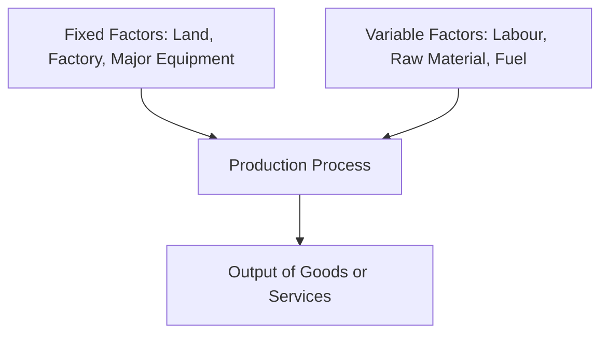

# Factors of Production: Fixed and Variable Factors

## 1. Definition

Fixed factors are inputs whose quantity cannot be changed in the short run, regardless of the level of output. Variable factors are inputs whose quantity can be increased or decreased quickly as output changes. The classification of factors into fixed and variable depends on the time horizon considered by the firm.

## 2. Concept Explanation

Production requires various inputs, known as factors of production. The basic idea is that not all inputs can be adjusted instantly. In the short run, some inputs like factory buildings, heavy machinery, and land remain constant. These are called fixed factors. Even if the firm produces zero output, it still has to pay for these fixed inputs.

Variable factors, like raw materials, daily labour, and power, can be changed quickly to meet production needs. If the firm wants to produce more, it hires more labour and buys more materials. If it wants to produce less, it reduces these inputs. This distinction is the foundation of short-run production analysis.

Understanding fixed and variable factors is important because it explains why costs behave differently. Fixed factors cause fixed costs, while variable factors cause variable costs. It helps managers make correct decisions about expanding output, controlling costs, and planning for the long run when all factors become variable.

## 3. Key Characteristics / Features

- **Time-Based Distinction:** A factor is fixed in the short run but becomes variable in the long run. The classification depends entirely on the time horizon.
- **Cost Behaviour:** Fixed factors lead to fixed costs that do not change with output. Variable factors lead to variable costs that rise and fall with production volume.
- **Indivisibility of Fixed Factors:** Many fixed factors, like a machine or a building, cannot be divided; they come in large, lumpy units.
- **Flexibility of Variable Factors:** Variable factors can be adjusted in small increments, allowing the firm to fine-tune output levels.
- **Short-Run Production Constraint:** The presence of fixed factors limits a firm's ability to increase output beyond a certain point, leading to the law of diminishing returns.

## 4. Types / Classification

Factors of production are traditionally classified into four broad categories, each of which can be fixed or variable depending on the time period.

- **Land:** Typically a fixed factor because the area of land or site cannot be changed in the short run. In agriculture, it is almost always fixed.
- **Labour:** Usually a variable factor. The number of workers or hours of work can be increased or decreased at short notice.
- **Capital:** Capital goods like factory buildings and heavy machinery are fixed in the short run, as new buildings take time to construct. Small tools or rented equipment can be variable.
- **Entrepreneurship:** This factor is generally considered fixed in the short run. The entrepreneur’s decision-making and organisation cannot be instantly replicated.

## 5. Working / Mechanism

1.  A firm decides to start production with a fixed factory space and a set of machines (fixed factors).
2.  It hires a certain number of workers and buys a specific amount of raw material (variable factors).
3.  To increase output in the short run, the firm adds more variable factors, like extra labour shifts or more raw materials, while the factory size remains unchanged.
4.  The contribution of each additional worker initially increases efficiency but eventually falls because the fixed factors get overcrowded.
5.  The firm continues to add variable factors until the extra cost of an additional unit equals the extra revenue it brings.
6.  In the long run, the firm can change its fixed factors by expanding the factory or purchasing new land, altering the scale of operations.

## 6. Diagram

## 7. Mathematical Formulation

A short-run production function separates fixed and variable factors.

$$
Q = f(L, \bar{K})
$$

Where:
- $Q$ = Total output produced
- $L$ = Variable factor (labour)
- $\bar{K}$ = Fixed factor (capital), with the bar indicating it is constant

This function shows that output changes only when the variable factor $L$ is adjusted.

## 8. Example

Consider a small bakery. The shop space, oven, and kneading machine are fixed factors because the baker cannot install a new oven overnight. Flour, sugar, eggs, and hourly assistants are variable factors. If the bakery gets a large birthday cake order, it immediately purchases more ingredients and calls an extra helper. It cannot, however, install a second baking oven instantly. That requires long-term planning.

## 9. Analogy

Think of the kitchen in your home. The gas stove, platform, and refrigerator are like fixed factors. You cannot magically add a second stove when many guests arrive. However, vegetables, spices, oil, and even a temporary helping hand from a neighbour are variable factors. You can buy more ingredients and invite help to cook a larger meal using the same fixed kitchen. In the long run, if you frequently host large gatherings, you might renovate and install a bigger stove, turning a fixed factor into a variable one.

## 10. Comparison

| Feature | Fixed Factors | Variable Factors |
|--------|---------------|------------------|
| Adjustability in Short Run | Cannot be changed | Can be increased or decreased easily |
| Time Period | Remain constant in the short run; become variable in the long run | Adjusted instantly with output changes |
| Examples | Land, factory building, heavy machinery | Labour, raw material, fuel, packaging |
| Cost Implication | Create fixed costs (rent, depreciation) | Create variable costs (wages, material cost) |
| Production Impact | Limit maximum short-run output | Determine the actual level of output within fixed capacity |

## 11. Advantages

- Helps managers distinguish between costs they cannot avoid in the short run and costs they can control daily.
- Allows firms to focus on optimising variable factors when capacity is fixed, improving operational efficiency.
- Forms the basis for break-even analysis and shutdown decisions.
- Provides clarity for long-term investment planning: firms know which factors need time and capital to expand.
- Simplifies the study of short-run production laws like the law of variable proportions.

## 12. Disadvantages / Limitations

- The distinction is time-bound and may confuse beginners if the concept of short run and long run is not clear.
- Some inputs are semi-variable; for example, electricity has a fixed line rental but usage varies, blurring the boundary.
- In modern automated industries, labour is becoming less variable due to strict hiring contracts and retrenchment laws.
- The classification ignores qualitative improvements; labour may become more efficient with training even if numbers are fixed.
- Overemphasis on fixed factors in the short run might make management hesitant to experiment with innovative capacity changes.

## 13. Important Points / Exam Notes

- The short run is a period where at least one factor is fixed; the long run is a period where all factors are variable.
- Fixed factors give rise to fixed costs; variable factors give rise to variable costs.
- Typical fixed factors: land, buildings, salaried permanent staff, heavy plant and machinery.
- Typical variable factors: raw materials, piece-rate labour, power and fuel, packaging materials.
- The short-run production function is written as $Q = f(L, \bar{K})$, highlighting the fixed capital input.
- Understanding this classification is essential for studying the law of diminishing returns and cost curves.

## 14. Applications / Use Cases

- **Manufacturing:** A car plant uses its assembly line and robots (fixed) and varies sheet metal, workers’ shifts, and tyres (variable) to meet monthly demand.
- **Agriculture:** A farmer has a fixed land size and tractor, but can vary seeds, fertiliser, and seasonal labour.
- **Software Development:** In a short-term project, the office space and core servers are fixed; the number of freelance coders and cloud computing hours are variable.
- **Restaurant Industry:** The kitchen and dining area are fixed factors; the chefs, waitstaff, and food supplies can be adjusted for peak hours.
- **Construction:** A builder owns cranes and a site office (fixed) but hires daily-wage masons and orders cement bags based on the pace of work (variable).

## 15. MCQs

**Q1. Which of the following is the best example of a fixed factor in the short run for a textile mill?**

A. Cotton bales  
B. Factory building  
C. Hourly paid weavers  
D. Dye chemicals  
**Answer:** B  
**Explanation:** The factory building cannot be changed immediately; it remains constant regardless of cloth output.

**Q2. In the short run, a firm can increase output only by increasing the use of:**

A. Fixed factors  
B. Variable factors  
C. Both fixed and variable factors equally  
D. Land only  
**Answer:** B  
**Explanation:** Fixed factors are constant, so output can only be raised by adding more variable factors.

**Q3. The short-run production function $Q = f(L, \bar{K})$ indicates that capital is a:**

A. Variable factor  
B. Output unit  
C. Fixed factor  
D. Revenue driver  
**Answer:** C  
**Explanation:** The bar over K indicates capital remains constant, i.e., a fixed factor.

**Q4. In the long run, which statement is true about factors of production?**

A. All factors are fixed  
B. Some factors remain fixed  
C. All factors become variable  
D. No factors exist  
**Answer:** C  
**Explanation:** The long run is defined as a period long enough for all inputs to be adjusted; there are no fixed factors.

**Q5. The cost incurred on a fixed factor does not vary with output and is called:**

A. Variable cost  
B. Marginal cost  
C. Total cost  
D. Fixed cost  
**Answer:** D  
**Explanation:** Rent on a building is a fixed cost because the factor is fixed and the expense remains constant.

**Q6. Which of the following is typically a variable factor in a pizza outlet?**

A. Pizza oven  
B. Shop rental deposit  
C. Mozzarella cheese and flour  
D. Signage board  
**Answer:** C  
**Explanation:** Raw materials like cheese and flour can be ordered daily depending on how many pizzas are needed.

**Q7. The law of diminishing returns operates in the short run because of the presence of:**

A. Only variable factors  
B. Perfect competition  
C. At least one fixed factor  
D. No costs  
**Answer:** C  
**Explanation:** The fixed factor creates a constraint, and adding more variable factors eventually yields lower additional output.

**Q8. A tractor in an agricultural farm is usually a fixed factor in the short run because:**

A. It can be sold instantly  
B. It is a perishable input  
C. Its quantity cannot be changed mid-season  
D. It is free of cost  
**Answer:** C  
**Explanation:** Once purchased, the number of tractors available for a crop cycle cannot be increased immediately.

**Q9. Which pair correctly represents fixed and variable factors for a construction company building a bridge?**

A. Cement trucks (fixed), bridge design (variable)  
B. Project manager’s salary (variable), steel bars (fixed)  
C. Heavy crane (fixed), daily-wage labourers (variable)  
D. Site security (variable), office stationery (fixed)  
**Answer:** C  
**Explanation:** A heavy crane is expensive and fixed for the project duration; labourers can be hired or released daily.

**Q10. The classification of a factor as fixed or variable depends primarily on:**

A. The type of industry  
B. The technology used  
C. The time horizon under consideration  
D. The government regulations  
**Answer:** C  
**Explanation:** What is fixed in the short run becomes variable if the firm plans for a sufficiently long period.