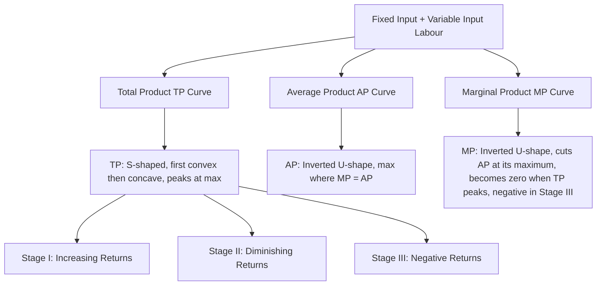

# Short-run Production Function: Graphical Illustration

## 1. Definition

A short-run production function shows the maximum output obtainable from a set of inputs when at least one input is fixed in quantity and others can be varied. Graphically, it is illustrated by the shapes and relationships of the Total Product, Average Product, and Marginal Product curves as the variable input increases.

---

## 2. Concept Explanation

The basic idea arises from the fact that in the short run, a firm cannot change all its resources. For example, a factory building (capital) is fixed, but the number of workers (labour) can be increased or decreased. The short-run production function captures how output responds when more and more units of the variable input are applied to the fixed input.

How it works: Initially, adding workers to a fixed machine setup leads to a rapid increase in total output because workers can specialise and the fixed input is better utilised. This phase shows increasing returns. After a point, adding more workers causes crowding and the fixed input becomes a bottleneck; total output grows, but at a decreasing rate. This is the phase of diminishing returns. If even more workers are added, they get in each other’s way, and total output may eventually decline—this is the phase of negative returns.

Why it is important: The Law of Diminishing Marginal Returns is the cornerstone of short-run production analysis. Understanding the shapes of these curves helps managers decide the optimum level of the variable input to use. It also explains the shape of a firm’s cost curves, as productivity directly affects cost. Graphical illustration makes the behaviour of output, average productivity, and marginal productivity immediately clear.

---

## 3. Key Characteristics / Features

- **One fixed input:** The analysis assumes at least one factor (usually capital or land) cannot be changed in the short run.
- **One variable input:** Usually labour is treated as the variable input, and changes in output are studied by varying labour.
- **Law of diminishing returns:** Beyond a certain employment level, the marginal product of the variable input begins to fall.
- **Three distinct phases:** The production process typically passes through increasing returns, diminishing returns, and negative returns stages.
- **Relationship between curves:** MP curve cuts the AP curve at AP’s maximum point. TP is at its peak when MP becomes zero.
- **Curvature:** The TP curve is S-shaped (first convex, then concave, then falling). AP and MP are inverted-U shaped.
- **Measurability:** All curves are drawn assuming perfectly divisible inputs and continuous functions.

---

## 4. Types / Classification (Phases of Production)

Based on the graphical illustration, the short-run production function is divided into three stages of production:

- **Stage I (Increasing Returns):** From zero variable input up to the point where Average Product (AP) is maximum (which is also where MP equals AP). In this stage, TP increases at an increasing rate initially, then at a decreasing rate. MP rises, reaches a maximum, and starts falling but remains above AP. This stage is irrational for a profit-maximising firm because the fixed input is under-utilised; adding more variable input increases average productivity.
- **Stage II (Diminishing Returns):** From the end of Stage I until the point where Marginal Product (MP) becomes zero (TP maximum). Here, MP is declining, is positive, and lies below AP. AP is falling. TP increases at a decreasing rate. This is the rational and economically efficient stage of production, where the firm will normally operate. The exact point depends on input and output prices.
- **Stage III (Negative Returns):** Beyond Stage II, where MP becomes negative and TP starts declining. AP continues to fall. Even a price of zero for the variable input would not justify employing more of it, as total output falls. Operation in this stage is irrational.

---

## 5. Working / Mechanism

1. Begin with a fixed amount of capital (say, one machine) and zero labour. Total product (TP) is zero.
2. Add the first unit of variable input (labour). TP rises. Due to specialisation and better use of the machine, MP is high and may increase for the next few units.
3. Continue adding labour. Initially, TP rises at an increasing rate because labour works efficiently with the under-utilised machine.
4. After a certain labour quantity, the machine becomes a constraint. Adding more labour causes crowding, and TP begins to rise at a decreasing rate. MP starts to fall (diminishing returns).
5. Calculate AP by dividing TP by the total units of labour. AP rises as long as MP is above AP, reaches a maximum when MP = AP, and then falls when MP falls below AP.
6. TP continues to increase as long as MP is positive, even if MP is declining. Eventually, TP reaches its maximum peak where MP becomes exactly zero.
7. If further labour is added, the workers interfere with each other so much that total output actually falls. MP becomes negative, and TP declines.
8. Graphically, the three-stage classification is clear: Stage I (from 0 to peak AP), Stage II (from peak AP to zero MP), Stage III (negative MP, declining TP).

---

## 6. Diagram

*Note: The diagram above links the shapes of the curves to the production stages. In a typical textbook graph, the TP curve is drawn in the upper panel, and AP and MP curves in the lower panel, both with labour on the horizontal axis. TP increases at an increasing rate (Stage I), then at a decreasing rate (Stage II), reaches a maximum at the end of Stage II, and falls in Stage III. MP rises first, reaches a peak early, then falls. AP follows a similar but lagged pattern, reaching its maximum later.*

---

## 7. Mathematical Formulation

The short-run production function with one variable input (labour L) and one fixed input (capital K̄) is written as:

$$
Q = f(L, \bar{K})
$$

Where:  
- \( Q \) = Total physical product (output)  
- \( L \) = Quantity of variable input (labour)  
- \( \bar{K} \) = Fixed amount of capital  

From this, we derive:

**Average Product of Labour:**
$$
AP_L = \frac{TP}{L} = \frac{Q}{L}
$$

**Marginal Product of Labour:**
$$
MP_L = \frac{\Delta TP}{\Delta L} \quad \text{or} \quad MP_L = \frac{dQ}{dL}
$$

Graphical illustration shows these relationships:  
- When \( MP_L > AP_L \), \( AP_L \) is rising.  
- When \( MP_L < AP_L \), \( AP_L \) is falling.  
- When \( MP_L = AP_L \), \( AP_L \) is at its maximum.  
- \( MP_L = 0 \) at the maximum of TP.  
- \( MP_L < 0 \) when TP declines.

---

## 8. Example

Consider a small workshop with one lathe machine (fixed capital). The shop employs workers one by one.

- With 1 worker, output = 10 parts/day.
- 2 workers: output = 30 parts/day (MP of 2nd worker = 20).
- 3 workers: output = 60 parts/day (MP of 3rd worker = 30, rising MP due to specialisation).
- 4 workers: output = 84 parts/day (MP = 24, MP starts falling).
- 5 workers: output = 100 parts/day (MP = 16).
- 6 workers: output = 108 parts/day (MP = 8).
- 7 workers: output = 108 parts/day (MP = 0, TP max).
- 8 workers: output = 100 parts/day (MP = -8, too many workers).

AP at 5 workers = 100/5 = 20; MP=16. AP is falling. The rational stage is between the peak of AP (somewhere around 3-4 workers) and 7 workers. This simple numerical example, when plotted, produces the classic TP, AP, MP curves.

---

## 9. Analogy

Imagine a small kitchen (fixed capital) with a cook alone. One cook manages all tasks slowly. Adding a second cook greatly speeds up cooking (increasing returns) as they share tasks. Adding a third cook increases output further but less dramatically; they start bumping into each other near the stove (diminishing returns). If ten cooks are squeezed into the kitchen, they collide, drop utensils, and total meals prepared actually fall (negative returns). The graphical curves trace this exact story: the kitchen is the fixed input, cooks are variable labour, and meals are total product.

---

## 10. Comparison (Short Run vs. Long Run Production Function)

| Feature | Short-run Production Function | Long-run Production Function |
|--------|-------------------------------|------------------------------|
| Input variability | At least one input fixed | All inputs variable |
| Law applicable | Law of diminishing marginal returns | Returns to scale |
| Curve shape | TP: S-shaped, MP/AP: inverted-U | Isoquants, expansion path |
| Graphical focus | TP, AP, MP curves | Isoquant map, isocost lines |
| Managerial decision | Optimal use of variable input | Optimal scale of operation |

---

## 11. Advantages

- Provides a simple visual understanding of input-output relationships.
- Helps identify the most efficient stage of production (Stage II) for the firm.
- Explains why firms cannot keep adding workers to a fixed plant without eventually seeing falling marginal productivity.
- Forms the basis for deriving short-run cost curves (MC, AVC, ATC).
- Allows quick estimation of optimal labour employment using MP and input/output prices.
- Useful for capacity planning and identifying overstaffing or underutilisation.

---

## 12. Disadvantages / Limitations

- Assumes technology is constant, which is often not true in dynamic industries.
- The law of diminishing returns is an empirical observation, not a mathematical certainty for all production processes.
- Dividing production into three neat stages may not be perfectly visible in some real-world data.
- Inputs are assumed to be homogeneous; in reality, quality of labour and capital varies.
- Graphical illustration simplifies complex interactions; in practice, multiple variable inputs may exist in the short run.
- The model may not hold where increasing returns continue for a very long range.

---

## 13. Important Points / Exam Notes

- Short-run production function: Q = f(L, K̄). At least one fixed input.
- TP curve: S-shaped → first rises at increasing rate, then decreasing rate, reaches peak, may fall.
- MP curve: rises quickly, peaks early, then falls; cuts AP at AP’s maximum.
- AP curve: rises as long as MP > AP, falls after MP < AP.
- Three stages: Stage I (increasing returns, up to max AP), Stage II (diminishing returns, from max AP to MP=0), Stage III (negative returns, MP<0).
- Rational production stage is Stage II.
- The law of diminishing marginal returns is the foundation: as more units of variable input are added to a fixed input, MP eventually declines.
- Relationship: MP = 0 at TP maximum; MP negative → TP declines.

---

## 14. Applications / Use Cases

- **Manufacturing:** A plant manager determines how many machine operators to assign per shift based on the TP/MP/AP curves derived from production data.
- **Agriculture:** Farmers apply the law by deciding optimal fertilizer quantity per fixed land area, knowing beyond some point more fertilizer reduces marginal crop yield.
- **Service industries:** Call centres analyze how adding more agents to a fixed telephone system affects call resolution (productivity) and identify overstaffing.
- **Construction:** A project site with a fixed number of cranes (fixed capital) plans the optimum gang of workers to avoid congestion and falling labour productivity.
- **Education:** A classroom (fixed capital) shows the concept: teacher’s effectiveness per student falls if class size becomes too large (diminishing returns to scale in the short run).

---

## 15. MCQs

**Q1. In the short-run production function, which input is usually kept fixed?**  
A. Labour  
B. Raw material  
C. Capital  
D. Energy  
**Answer:** C  
**Explanation:** Capital (plant, machinery, land) is typically the fixed input in short-run analysis.

**Q2. The marginal product curve intersects the average product curve at:**  
A. The lowest point of AP  
B. The highest point of MP  
C. The highest point of AP  
D. The point where TP is maximum  
**Answer:** C  
**Explanation:** MP = AP at the maximum point of the AP curve. If MP > AP, AP rises; if MP < AP, AP falls.

**Q3. Total Product is maximum when Marginal Product is:**  
A. Maximum  
B. Zero  
C. Negative  
D. Equal to Average Product  
**Answer:** B  
**Explanation:** When MP = 0, TP stops increasing and is at its peak. After that, MP becomes negative and TP falls.

**Q4. Stage II of production is considered rational because:**  
A. MP is negative  
B. AP is increasing  
C. Both AP and MP are falling but MP is positive  
D. TP is decreasing  
**Answer:** C  
**Explanation:** In Stage II, the fixed input is efficiently utilised; adding more variable input still adds to total output (MP > 0) even though productivity per unit is declining.

**Q5. The law of diminishing marginal returns states that:**  
A. Adding more variable input always reduces total output  
B. Eventually, MP of the variable input decreases as more of it is used with a fixed input  
C. AP always falls  
D. TP increases at a constant rate  
**Answer:** B  
**Explanation:** The law says that beyond some point, successive equal additions of a variable input to a fixed input yield progressively smaller additions to output.

**Q6. Which stage of production is characterized by negative marginal product?**  
A. Stage I  
B. Stage II  
C. Stage III  
D. None of the above  
**Answer:** C  
**Explanation:** In Stage III, MP becomes negative, causing total output to fall.

**Q7. In the short run, if AP_L = 15 and MP_L = 10 for the next worker, AP_L will:**  
A. Increase  
B. Decrease  
C. Remain constant  
D. Become zero  
**Answer:** B  
**Explanation:** When MP (10) is less than AP (15), the average product will be pulled down.

**Q8. The “S” shape of the Total Product curve indicates:**  
A. Constant returns only  
B. First increasing returns, then diminishing returns, then negative returns  
C. Only increasing returns  
D. Only diminishing returns  
**Answer:** B  
**Explanation:** The TP curve initially rises at an increasing rate (convex), then at a decreasing rate (concave), reaches a maximum, and may fall—giving an S-shape.

**Q9. Which of the following curves is NOT generally inverted U-shaped?**  
A. Marginal Product  
B. Average Product  
C. Total Product  
D. Both A and B are inverted U-shaped, C is S-shaped  
**Answer:** C  
**Explanation:** TP is S-shaped or increases and then decreases, but it is not an inverted U like MP and AP.

**Q10. If a firm is operating in Stage I of production, it should:**  
A. Reduce the amount of variable input to increase efficiency  
B. Increase the use of variable input to better utilise the fixed input  
C. Keep input constant as it is the most efficient stage  
D. Immediately shut down  
**Answer:** B  
**Explanation:** In Stage I, the fixed input is under-utilised; adding more variable input increases both total and average product, so it is beneficial to employ more.