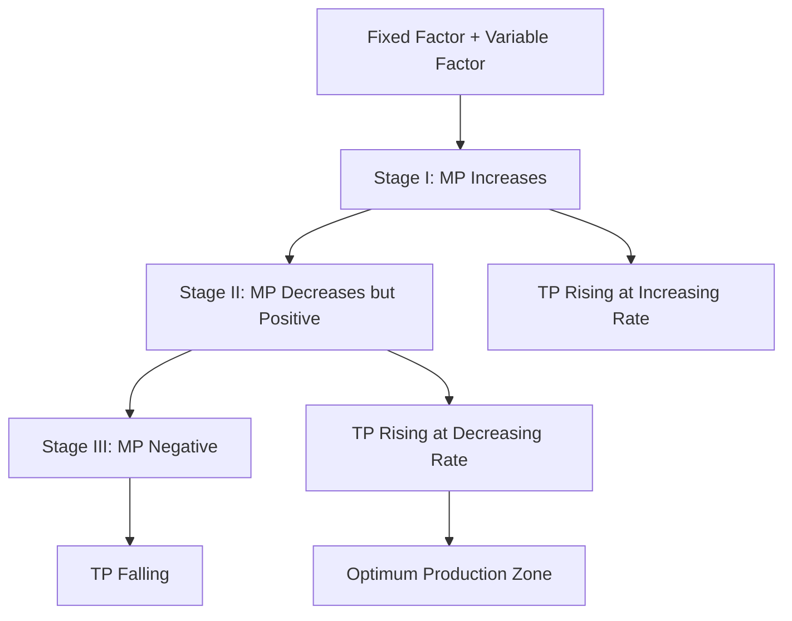

# 04 Law of return graphical and mathematical derivation

## 1. Definition

The **Law of Returns** (also known as the Law of Variable Proportions) states that when more and more units of a variable factor are applied to a fixed quantity of other factors, the marginal product of the variable factor first increases, then reaches a maximum, and finally decreases. In the later stage, it may even become negative.

## 2. Concept Explanation

In production, some factors like machinery or factory land are fixed in the short run, while others like labour or raw materials can be varied. The Law of Returns explains how output changes when we keep adding more of a variable factor to the fixed one.

The basic idea is simple. Imagine a small workshop with one machine. If you hire one worker, production is low. Add a second worker: they cooperate and output rises sharply. Add a third: still more output, but the machine gets crowded; each additional worker adds a little less than the previous one. Hire too many workers, and they start getting in each other’s way; total output might even fall.

How it works graphically: we draw total product (TP) and marginal product (MP) curves. Mathematically, we use a production function to see the same behaviour. This law is important because it tells a manager the most efficient range to operate in. Engineers use it to decide optimum crew size on a site or the right mix of inputs to avoid waste.

## 3. Key Characteristics / Features

- **Short-run law:** It operates when at least one factor of production is fixed.
- **Three distinct stages:** The law shows a pattern of increasing, then diminishing, and finally negative returns to the variable input.
- **Variable proportions:** The ratio between the fixed and variable factor keeps changing.
- **Universal application:** It applies to manufacturing, construction, agriculture, and almost any production process.
- **Directly observable in marginal product:** The MP curve first rises, then falls, eventually becoming zero or negative.
- **Optimum point:** The law helps locate the range where marginal product is positive but diminishing – the most efficient zone.

## 4. Types / Classification

The Law of Variable Proportions operates in three stages:

- **Stage I: Increasing Returns**  
  Marginal product of the variable factor increases. Total product rises at an increasing rate. The fixed factor is under-utilised and the variable input is too little for efficient operation.

- **Stage II: Diminishing Returns**  
  Marginal product decreases but remains positive. Total product continues to increase but at a decreasing rate. This is the economically meaningful range where a rational producer operates.

- **Stage III: Negative Returns**  
  Marginal product becomes negative. Total product starts declining. The fixed factor is overcrowded and too much variable input reduces efficiency.

These stages are derived directly from the shape of the TP and MP curves.

## 5. Working / Mechanism

The process unfolds step-by-step as more variable input is added.

1.  **Start with a fixed input:** A factory has a fixed number of machines or a farm has a fixed area of land.
2.  **Add small initial units of variable input:** One or two workers on a large machine. They are productive and can specialise. MP rises – this is the increasing returns phase.
3.  **Continue adding more variable input:** The fixed factor gets fully utilised. Each additional worker now finds less idle capacity, leading to crowding. MP starts falling but remains positive – diminishing returns.
4.  **Add excessive variable input:** Too many workers on one machine cause chaos. They interfere with each other. Total output may fall and MP turns negative – negative returns.
5.  **Managerial decision:** The producer should stop adding input before Stage III and will typically operate in Stage II where MP is positive but falling.

## 6. Diagram

## 7. Mathematical Formulation

The law can be represented with a cubic production function.

$$
TP = a + bL + cL^2 - dL^3
$$

Where:  
- \( TP \) = Total product  
- \( L \) = Variable input (e.g., labour)  
- \( a, b, c, d \) = Positive constants

Marginal product is the derivative of TP with respect to L.

$$
MP = \frac{d(TP)}{dL} = b + 2cL - 3dL^2
$$

From this MP equation:
- For small \( L \), \( 2cL \) dominates, MP may rise (if \( c \) is positive and large enough).
- As \( L \) increases, the negative term \( -3dL^2 \) becomes stronger, causing MP to fall and eventually become negative.

The three stages of returns emerge directly from the values of MP at different levels of \( L \).

## 8. Example

Consider a construction site with one concrete mixer (fixed input). One labourer alone is inefficient (low output). With two labourers, they share tasks and output jumps. Adding a third increases output further but less than before. When six labourers crowd around the same mixer, they wait and bump into each other, so the total concrete output actually drops. This demonstrates increasing returns, then diminishing returns, and finally negative returns in a real engineering scenario.

## 9. Analogy

Imagine studying for an exam alone with one textbook (fixed input). In the first hour, you grasp concepts quickly – the return is increasing. In the second hour, you still learn but at a slower pace – returns are diminishing. If you keep studying for ten hours without a break, you become mentally exhausted, make mistakes, and may even forget earlier material – that is the negative returns stage. A good student stops at the optimum study time.

## 10. Comparison

| Feature | Law of Variable Proportions (Returns to a Factor) | Law of Returns to Scale |
|--------|----------|----------|
| **Time period** | Short run (some factors fixed) | Long run (all factors variable) |
| **Change in inputs** | Only one variable factor changed | All factors changed in the same proportion |
| **Phases** | Increasing, diminishing, negative returns | Increasing, constant, decreasing returns to scale |
| **Graph focus** | TP and MP curves as labour changes | Output when all inputs double, triple, etc. |

## 11. Advantages

- **Identifies optimum input level:** The law helps find how many workers or how much raw material to use with fixed machinery.
- **Prevents overcrowding and waste:** Knowing when returns turn negative alerts managers to stop adding inputs.
- **Guides short-run production decisions:** Useful for day-to-day planning in construction or factory floor management.
- **Basis of cost curves:** The shape of marginal cost curve is derived from the law of diminishing returns.
- **Universal principle:** It applies across industries, so engineers and economists use a common framework.

## 12. Disadvantages / Limitations

- **Assumptions not always valid:** It assumes technology is constant, which may not hold in fast-changing engineering projects.
- **Only for short run:** The law does not apply when all factors can be varied freely.
- **Difficult to measure in complex processes:** In multi-machine, multi-skilled environments, isolating the effect of a single variable factor is hard.
- **Ignored by some advanced technologies:** Fully automated plants may show constant returns over a wide range.
- **Does not consider quality of inputs:** The law assumes all units of the variable factor are identical, which is rarely true for human labour.

## 13. Important Points / Exam Notes

- The Law of Variable Proportions is also called the Law of Diminishing Returns.
- It is a short-run production law; at least one factor is fixed.
- Stage I: MP increases, TP increases at an increasing rate.
- Stage II: MP decreases but is positive, TP increases at a decreasing rate. This is the rational stage.
- Stage III: MP is negative, TP falls.
- Graphically, TP is an S-shaped curve; MP is an inverted U-shaped curve.
- Mathematically, a cubic production function like \( TP = a + bL + cL^2 - dL^3 \) generates the three stages.
- Economically, a rational producer will never operate in Stage III and will always try to reach Stage II.
- The law explains the upward-sloping part of the marginal cost curve.
- In engineering economics, this law helps determine crew size, machine utilisation, and material mix.

## 14. Applications / Use Cases

- **Site labour planning:** A civil engineer decides the optimum number of masons for a given stretch of brickwork to avoid crowding.
- **Machine shop scheduling:** Determining how many operators should run a set of CNC machines to get maximum parts per shift.
- **Agricultural production:** A farmer finds the optimum amount of fertiliser for a fixed area beyond which crop yield actually falls.
- **Software debugging teams:** Adding too many junior coders to a small project causes communication overload and bug count may rise (negative returns).
- **Kitchen operations:** A restaurant manager assigns chefs per stove; after a point, extra chefs produce no extra dishes and may spoil quality.

## 15. MCQs

**Q1. The Law of Variable Proportions is also known as**

A. Law of returns to scale  
B. Law of constant returns  
C. Law of diminishing returns  
D. Law of supply  

**Answer:** C  
**Explanation:** It is the short-run law where marginal product eventually diminishes.

---

**Q2. The law operates when**

A. All inputs are variable  
B. At least one input is fixed  
C. Only capital is variable  
D. Technology is changing rapidly  

**Answer:** B  
**Explanation:** It is a short-run law with a fixed factor.

---

**Q3. Stage I of the law is characterised by**

A. Negative marginal product  
B. Increasing marginal product  
C. Constant total product  
D. Zero marginal product  

**Answer:** B  
**Explanation:** In Stage I, MP rises as the fixed factor gets better utilised.

---

**Q4. In which stage would a rational producer operate?**

A. Stage I  
B. Stage III  
C. Stage II  
D. Any stage is fine  

**Answer:** C  
**Explanation:** In Stage II MP is positive but diminishing, total product still grows; it’s most efficient.

---

**Q5. When marginal product becomes negative, total product**

A. Stops growing  
B. Increases at a faster rate  
C. Starts declining  
D. Remains constant  

**Answer:** C  
**Explanation:** Negative MP means additional input reduces total output.

---

**Q6. A cubic total product function \( TP = a + bL + cL^2 - dL^3 \) can show**

A. Only diminishing returns  
B. Only constant returns  
C. All three stages of returns  
D. No returns  

**Answer:** C  
**Explanation:** The positive quadratic term allows increasing returns, the negative cubic term causes decline.

---

**Q7. The marginal product curve in the law of variable proportions is shaped like**

A. A straight upward line  
B. An inverted U  
C. A U  
D. A horizontal line  

**Answer:** B  
**Explanation:** MP first rises, reaches a maximum, then falls, forming an inverted U.

---

**Q8. The point where MP is zero indicates**

A. Maximum total product  
B. Minimum total product  
C. Beginning of Stage I  
D. End of Stage II  

**Answer:** A and D can be argued, but typically MP=0 indicates the boundary between Stage II and III and total product maximum. From exam perspective, they might ask: "MP=0 occurs at the end of Stage II and beginning of Stage III, and TP is at its maximum." I'll pick the best option. A: Maximum total product is correct. So answer: A.

---

**Q9. An example of a fixed factor in a building project could be**

A. Bricks  
B. Labour hours  
C. One tower crane  
D. Diesel fuel  

**Answer:** C  
**Explanation:** A tower crane is a piece of capital that remains fixed in the short run; labour and materials can be varied.

---

**Q10. Adding too many workers to a small construction site eventually lowers total output. This illustrates**

A. Stage I  
B. Stage II  
C. Stage III  
D. Stage of constant returns  

**Answer:** C  
**Explanation:** Negative returns stage where too much variable input causes total output to fall.