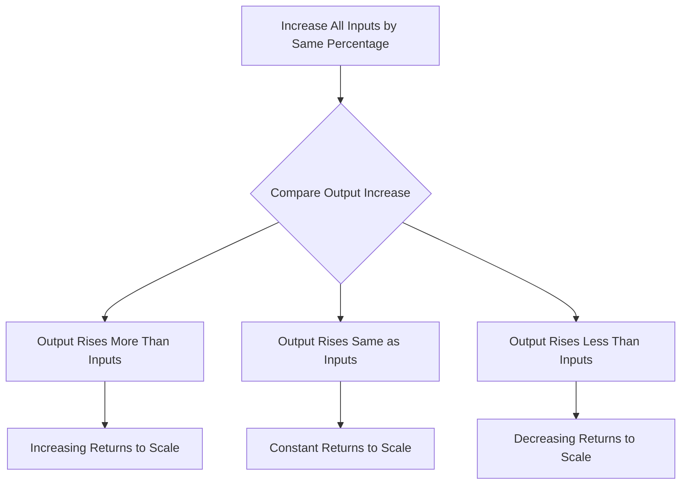

# Long-run Production Function: Returns to Scale

## 1. Definition

Returns to scale refer to the rate at which total output changes when all factors of production are increased in the same proportion. Since all inputs are variable in the long run, returns to scale explain how output responds to a proportional scaling of the entire operation.

## 2. Concept Explanation

In the long run, a firm can expand its scale of operations by increasing all inputs together. This could mean doubling the factory size, machinery, labour, and raw materials. The basic idea is to see what happens to output when inputs are multiplied by a factor.

How it works: Suppose a firm doubles every input. If output more than doubles, the firm enjoys increasing returns to scale. If output exactly doubles, it experiences constant returns to scale. If output less than doubles, it faces decreasing returns to scale. This analysis helps managers decide on expanding the plant size.

Why it is important: Understanding returns to scale guides optimal plant size decisions. A firm with increasing returns can lower its average cost by growing larger, while a firm with decreasing returns should avoid over-expansion. It also explains the natural size of firms in different industries, from huge automobile plants to custom tailoring shops.

## 3. Key Characteristics / Features

- **Long-Run Concept:** Returns to scale apply only when all factors are variable. There are no fixed inputs.
- **Proportional Change in All Inputs:** The analysis requires that every input, like labour, capital, and materials, is increased by the same percentage.
- **Output Behavior:** The focus is on the resulting percentage change in output relative to the percentage change in all inputs.
- **Determination of Efficient Scale:** Returns to scale help find the most efficient plant size where long-run average cost is minimised.
- **Technological Basis:** The type of returns to scale largely depends on the production technology and indivisibilities of machinery.

## 4. Types / Classification

Returns to scale are classified into three distinct types based on the production function's response:

- **Increasing Returns to Scale (IRS):** Output increases by a greater proportion than the increase in all inputs. For example, a 10% rise in all inputs leads to more than a 10% rise in output. Causes include specialisation, division of labour, and use of large, efficient machines.
- **Constant Returns to Scale (CRS):** Output increases exactly in the same proportion as all inputs. A doubling of all inputs exactly doubles the output. This often occurs when the firm can replicate its existing production setup.
- **Decreasing Returns to Scale (DRS):** Output increases by a smaller proportion than the increase in all inputs. A 10% increase in inputs yields less than a 10% increase in output. Causes include management difficulties, coordination problems, and communication inefficiency in very large organisations.

## 5. Working / Mechanism

1.  A firm starts with an initial set of all inputs (labour $L$, capital $K$) and produces output $Q$.
2.  The firm decides to increase all inputs by the same factor $\lambda$ (where $\lambda$ > 1). New inputs become $\lambda L$ and $\lambda K$.
3.  The firm observes the new output level $Q_{new}$.
4.  It compares the proportional increase in output to the proportional increase in inputs:
    - If $Q_{new} > \lambda \times Q$, it is increasing returns to scale.
    - If $Q_{new} = \lambda \times Q$, it is constant returns to scale.
    - If $Q_{new} < \lambda \times Q$, it is decreasing returns to scale.
5.  Based on this result, the firm decides whether to expand further, maintain scale, or downsize.
6.  The long-run average cost curve is U-shaped, with the flat bottom corresponding to constant returns, the falling part to increasing returns, and the rising part to decreasing returns.

## 6. Diagram

## 7. Mathematical Formulation

A production function is said to exhibit returns to scale based on the degree of homogeneity. For a production function $Q = f(L, K)$, and a factor $\lambda > 0$:

- If $f(\lambda L, \lambda K) > \lambda f(L, K)$, it is **Increasing Returns to Scale**.
- If $f(\lambda L, \lambda K) = \lambda f(L, K)$, it is **Constant Returns to Scale**.
- If $f(\lambda L, \lambda K) < \lambda f(L, K)$, it is **Decreasing Returns to Scale**.

A commonly used example is the **Cobb-Douglas production function**:

$$
Q = A L^\alpha K^\beta
$$

Where:
- $Q$ = Output
- $L$ = Labour input
- $K$ = Capital input
- $A$ = Technology constant
- $\alpha, \beta$ = Output elasticities with respect to labour and capital

Returns to scale are determined by the sum $(\alpha + \beta)$:
- $(\alpha + \beta) > 1$ indicates Increasing Returns.
- $(\alpha + \beta) = 1$ indicates Constant Returns.
- $(\alpha + \beta) < 1$ indicates Decreasing Returns.

## 8. Example

A car manufacturing plant that uses an assembly line technology often shows increasing returns to scale initially. Doubling the number of robots, workers, and parts more than doubles the output because workers specialise and robots run continuously. As the plant becomes very large, management layers multiply, and communication breakdowns may cause decreasing returns. Ideal size is where constant returns prevail.

## 9. Analogy

Imagine baking cupcakes in a kitchen. If you are a single baker with a small oven, making 10 cupcakes takes some time. If you bring in an identical second baker, a second oven, and double all ingredients, you might more than double the output because both ovens run simultaneously and one person can focus on mixing while the other handles baking. That’s increasing returns. Eventually, if you try to cram ten bakers and ten ovens into the same small house, people trip over each other and output per baker drops—that’s decreasing returns.

## 10. Comparison

| Feature | Increasing Returns to Scale | Constant Returns to Scale | Decreasing Returns to Scale |
|--------|----------------------------|--------------------------|----------------------------|
| Output vs. Input Change | %Δ Output > %Δ Input | %Δ Output = %Δ Input | %Δ Output < %Δ Input |
| Effect on Long-Run Average Cost | Average cost falls as scale rises | Average cost stays constant | Average cost rises as scale rises |
| Typical Causes | Specialisation, large efficient machinery, indivisibilities | Replication of existing setup | Managerial complexity, coordination problems |
| Firm Size Example | Startups scaling up, automobile assembly | Mature firms at optimum scale | Overly large bureaucracies |

## 11. Advantages

- Helps firms identify the most cost-efficient scale of production for long-run planning.
- Provides a framework for understanding industry structure; industries with increasing returns tend to have a few large firms.
- Guides investment decisions on plant expansion or new facility construction.
- Forms the theoretical basis for understanding the shape of the long-run average cost curve.
- Assists policymakers in promoting industries where scale economies can lead to lower consumer prices.

## 12. Disadvantages / Limitations

- The assumption of a proportional change in all inputs is idealistic; in practice, firms may change input mix.
- It may be difficult to measure returns to scale empirically due to technological changes over time.
- Decreasing returns to scale are sometimes confused with short-run diminishing returns, which occur when one factor is fixed.
- The analysis does not account for learning-by-doing effects that can shift the whole production function.
- External economies of scale, like better infrastructure, are not captured by the firm-level production function.

## 13. Important Points / Exam Notes

- Returns to scale are a purely long-run concept when all factors are variable.
- The three types are increasing, constant, and decreasing returns to scale.
- For a Cobb-Douglas production function $Q = A L^\alpha K^\beta$, the sum of the exponents $(\alpha + \beta)$ determines returns to scale.
- The minimum point of the long-run average cost curve usually corresponds to the point of constant returns to scale.
- Do not confuse returns to scale with returns to a factor (law of variable proportions), which is a short-run concept.
- Increasing returns lead to falling long-run average cost, which is a key driver of natural monopolies.

## 14. Applications / Use Cases

- **Automobile Manufacturing:** Car companies invest in massive plants to exploit increasing returns through automation and assembly lines.
- **Software Services:** Cloud computing companies exhibit increasing returns because adding one more server scales to serve thousands of users at a very low extra cost.
- **Agriculture:** Very large agribusiness farms may experience decreasing returns due to difficulty in managing vast land areas effectively.
- **Public Policy:** Governments often regulate natural monopolies (like electricity distribution) that have significant increasing returns, to prevent exploitation.
- **Strategic Management:** A firm evaluating an acquisition will use returns to scale analysis to see if combining operations will lower average costs.

## 15. MCQs

**Q1. Returns to scale examine the change in output when:**

A. Only one input is changed  
B. All inputs are changed in the same proportion  
C. The price of inputs changes  
D. Technology remains unchanged  
**Answer:** B  
**Explanation:** Returns to scale require a proportional increase in all inputs in the long run.

**Q2. If a firm doubles all its inputs and output also exactly doubles, the firm is experiencing:**

A. Increasing returns to scale  
B. Constant returns to scale  
C. Decreasing returns to scale  
D. Diminishing marginal returns  
**Answer:** B  
**Explanation:** An exact doubling of output for doubled inputs indicates constant returns to scale.

**Q3. For the Cobb-Douglas function $Q = L^{0.6} K^{0.5}$, returns to scale are:**

A. Constant ($\alpha + \beta = 1$)  
B. Increasing ($\alpha + \beta > 1$)  
C. Decreasing ($\alpha + \beta < 1$)  
D. Cannot be determined  
**Answer:** B  
**Explanation:** 0.6 + 0.5 = 1.1 > 1, indicating increasing returns.

**Q4. Which type of returns to scale is most likely caused by management coordination problems?**

A. Increasing returns  
B. Constant returns  
C. Decreasing returns  
D. Law of variable proportions  
**Answer:** C  
**Explanation:** Decreasing returns to scale often arise due to inefficiencies in managing a very large organisation.

**Q5. The long-run average cost curve falls due to:**

A. Constant returns to scale  
B. Decreasing returns to scale  
C. Increasing returns to scale  
D. Fixed factors of production  
**Answer:** C  
**Explanation:** When increasing returns to scale exist, output rises faster than costs, so average cost falls.

**Q6. Returns to scale are classified into how many types?**

A. Two  
B. Three  
C. Four  
D. Five  
**Answer:** B  
**Explanation:** The three types are increasing, constant, and decreasing returns to scale.

**Q7. Which statement is correct about returns to scale?**

A. They are a short-run concept  
B. They apply only when all factors are variable  
C. They assume one factor is fixed  
D. They are the same as the law of diminishing returns  
**Answer:** B  
**Explanation:** Returns to scale are a long-run phenomenon with no fixed factors.

**Q8. An industry where large-scale production leads to falling average cost is called a:**

A. Perfectly competitive industry  
B. Natural monopoly  
C. Oligopoly without scale economies  
D. Constant cost industry  
**Answer:** B  
**Explanation:** Significant increasing returns to scale can create a natural monopoly because one large firm can supply the whole market at lower cost.

**Q9. The point where the long-run average cost curve stops falling and becomes flat indicates:**

A. Maximum returns to scale  
B. The end of increasing returns, possibly constant returns  
C. The start of decreasing returns  
D. The shutdown point  
**Answer:** B  
**Explanation:** The flat region corresponds to constant returns to scale; the falling portion is increasing returns.

**Q10. If $f(\lambda L, \lambda K) = \lambda f(L, K)$, the production function exhibits:**

A. Increasing returns to scale  
B. Constant returns to scale  
C. Decreasing returns to scale  
D. Linear homogeneity of degree 1  
**Answer:** B and D are both correct; however the question expects "Constant returns to scale" as the primary label.  
**Explanation:** The equality shows that output scales exactly by the factor λ, which is the definition of constant returns to scale (and the function is homogeneous of degree 1).